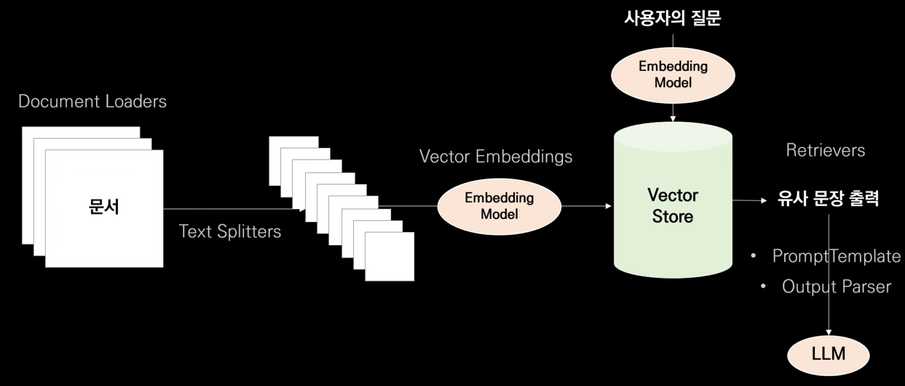
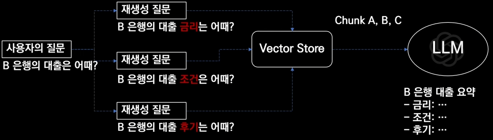
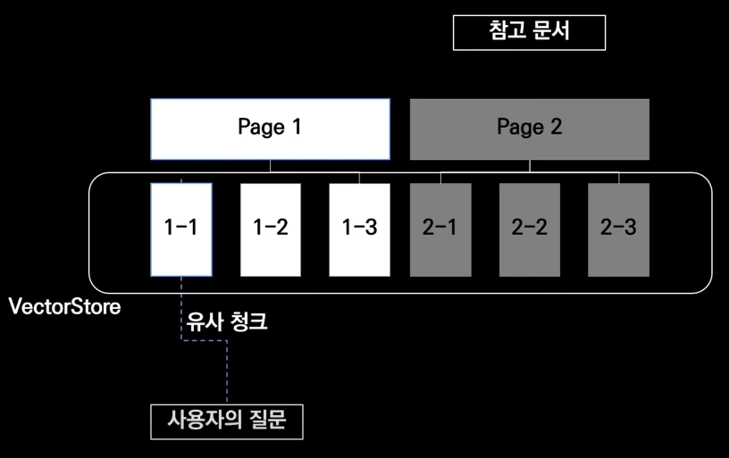
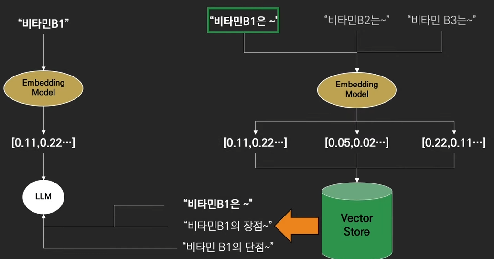
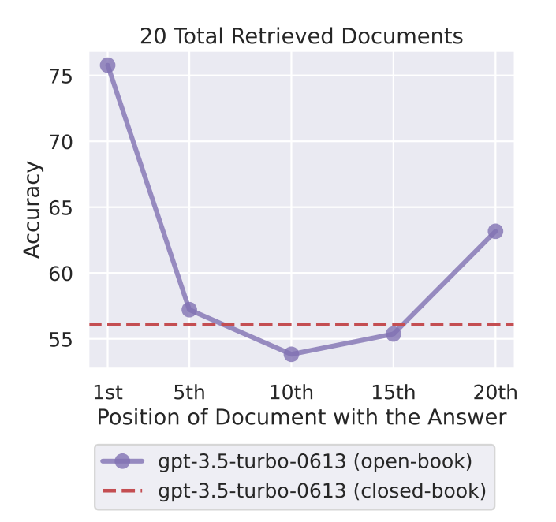

우리는 조금 더 구체적이고 정확한 답변을 생성하기 위해 LLM에 기존의 요청뿐 아니라 관련된 내용을 함께 넣어줍니다.
이러한 방식을 `RAG(Retrieval Augmented Generation)`이라고 하는데요.
실제적으로 조금 더 정확하게 관련된 내용을 가져오는 방법들에 대해 알아보려고 합니다.

# Multi Query

> 개떡같이 질문해도 찰떡같이 알아듣도록!

사람은 질문을 할 때 굉장히 추상적으로 질문을 할 수 있습니다.
예를 들어 "B 은행의 대출은 어때?" 라는 물음에는 여러가지 의미가 담길 수 있죠.
하지만 입력받은 질문으로 검색하면 이에 대한 구체적인 답변을 생성할 수 없습니다.
따라서 추상적인 질문에 대해 구체적인 답변을 내놓기 위해 입력받은 질문을 여러 질문으로 나누어 검색하는 방식이죠.

먼저 사용자의 질문을 이용해서 다양한 질문을 재생성하여 이를 활용하여 검색을 진행합니다.
검색된 내용을 모두 활용하여 답변을 생성하는 방식이죠.

# Parent Document

> 중요한 정보를 모두 포함해야해!

기존에는 사용자의 질문에 대한 Chunk를 검색해서 응답을 생성하는데 넘겨주었습니다.
하지만 만약 1-1의 내용과 밀접하게 관련된 내용이 1-2에도 존재하였다면, 생성된 응답은 정확하지 않을 수 있죠.
따라서 1-1을 가지고 있는 페이지 전부를 넘겨 전체적인 맥락을 볼 수 있도록 하는 방법입니다.

# Self Querying

> 문서의 메타데이터를 기반으로 필터링

예를 들어 평점이 9점 이상인 영화 중에서 SF 영화를 추천해달라는 질문이 들어오면 기존 RAG는 Semantic 검색을 합니다.
하지만 문서 내용 중 평점이 정해지지 않은 정보들은 검색이 되지 않죠.
우리가 원하는 동작은 메타데이터를 통해 평점이 9점 이상인 영화를 필터링하고, SF 영화를 또 필터링 하는 동작을 원하죠.
따라서 문장에서 Query 문을 생성하여 필터링을 진행한 후 검색을 하는 방법으로 사용하는 것이죠.
이 방법은 PDF와 같은 일반적인 문서보다 Excel, CSV와 같은 문서를 다룰 때 조금 더 유용할 수 있습니다.

# Time Weighted

가장 최근에 이용된 문서를 기준으로 먼저 참고하도록 하여 답변의 참신성을 유지하도록 합니다.
즉, 시간이 지난 만큼 패널티를 주어 최신의 정보를 더 가져오도록 만드는 방법이죠.
$$
semantic_similiarity + (1.0 - decay_rate) ^ {decay_time}
$$

# Ensemble Retriever 

Retriever 에는 크게 두 가지 종류가 있습니다.

### Sparse Retriever

각 단어가 문서에서 몇번씩 출현했는지를 이용하여 검색을 진행하는 방법입니다.
단어를 기반으로 검색하다 보니 도메인에 상관 없이 빠르고 간편하게 사용할 수 있죠.
하지만 단순 단어 기반으로 검색을 진행하기 떄문에 맥락을 이해하지 못합니다.

### Dense Retriever

문서를 딥러닝 모델에 통과시켜 벡터의 형태로 저장합니다.
또한 질문을 벡터의 형태로 만들어 벡터를 이용해 검색을 진행합니다.
이는 Semantic 정보를 이용한 검색을 진행할 수 있기 때문에 검색의 품질이 우수합니다.
하지만 종종 필수적인 키워드가 무시되는 경향이 있습니다.

그렇다면 위 두 방법을 함께 적용하면 서로 단점을 보완하는 방법입니다.

대표적인 방식으로 BM25 와 FAISS 를 결합하여 검색을 진행할 수 있습니다.
하지만 Vector 검색은 0~1 사이로 맵핑할 수 있지만, BM25와 같은 방식은 점수에 제한이 없는 방법입니다.
따라서 서로 다른 관련성 지표를 가진 여러 개의 결과 집합을 하나의 결과 집합으로 결합하는 `RRF(Reciprocal Rank Fusion)` 방식이 필요합니다.

# Long Context Reorder

[Lost in the Middle: How Language Models Use Long Contexts](https://arxiv.org/pdf/2307.03172.pdf) 논문에 따르면 질문에 대한 응답을 생성할 때,
필요한 정보를 초반과 후반에 배치하면 좋은 응답을 생성하는 반면 중간에 배치한 경우는 응답의 성능이 약간 떨어지는 것을 확인할 수 있다고 합니다.

따라서 우리가 검색을 이용해 제공하려는 정보가 중요한 순서대로 배치하는 것이 아닌 중요한 문서는 초반과 후반에 배치시키는 것이 더 좋다는 의미가 됩니다.
이를 이용하여 조금 더 정확한 답변을 생성할 수 있겠죠.

# Reference

해당 문서는 아래와 같은 정보를 참고하여 제작하였어요.

`youtube: https://youtu.be/J2AsmUODBak?si=t2fcHAoeqWSEHe8s`
`실전! RAG 고급 기법 - Retriever`

