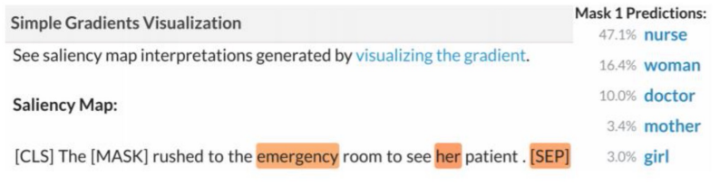

import * as Elem from '@elems';

<Elem.Comment>
이 챕터는 많은 부분이 생략되어 적혀 있으므로
잘 참고해서 보는 것으로,,,
</Elem.Comment>

우리는 모델에 입력을 넣고 출력을 기다립니다.
하지만 이 출력이 옳다는 증거를 어떻게 찾을 수 있을까요?
우리는 모델을 metric을 통해 수치로 평가합니다.
하지만 모델이 어떤 근거로 그런 결과를 냈는지 알 수 없어요.
우리는 모델이 더 나은 성능을 내도록 만들기 위해 이러한 부분을 분석할 필요가 있습니다.

# Model analysis

넓은 범위로 모델을 분석하는 방법은 몇 가지 있습니다.

* 모델을 확률 분포로서 바라보는 방법
* 모델을 벡터의 표현으로 바라보는 방법
* Weight을 보거나 attention과 같은 특별한 메카니즘을 보는 방법

하지만 무엇도 명쾌하게 모델 전체를 보여주지 않습니다.
또한 어디서부터 분석을 시작해야 할지 모르죠.

# Out-of-domain evalution set

우리는 모델이 어떻게 작동하는지 분석하는 것이 아닌 특정 상황에서 어떻게 행동하는지 관찰을 할 수 있어요.

훈련한 데이터셋과 동일한 분포를 가지는 모델로부터 어떻게 행동을 하는지 측정하는 방법
`i.i.d (independently and identically distributed)` 즉 test set을 이용한 accuracy / F1 / BLEU

실제로 모델이 특정 문장 구조에만 의존하여 결정을 내리는지, 언어의 복잡성을 이해하는지 확인필요

`Diagnostic test set`을 구성하여 언어적인 이해를 하는지, 어떤 유형의 오류가 발생하는지 평가

`HANS(Heuristic Analysis for NLI Systems)`는 

'`LSTM` 모델이 실제로 얼마나 먼 거리의 정보까지 보존할 수 있을까?' 에서 영감을 받았습니다.
K보다 먼 거리의 내용들을 전부 섞거나 없애서 모델 성능을 평가할 때 K가 몇일때 성능이 하락하는지 조사하는 방법으로 테스트를 했습니다.

### Prediction explanation

`Saliency maps`라는 각 단어가 모델 예측시 얼마나 중요한지 나타내는 점수입니다.

그렇다면 우리는 saliency map을 어떻게 형성할까요?
기울기를 측정하는 방식으로 구할 수 있습니다.
우리는 예측을 진행할 때 입력 $x_1, \cdots, x_n$에 대해서 output $s_c(x_1, \cdots, x_n)$를 구합니다.

$$
Salience(x_i) =  \left\| \triangledown_{x_i} s_c(x_1, \cdots, x_n) \right\|
$$

이때 $s_c$에 대한 어떠한 단어의 미분값이 가장 큰지 구하는 방법이죠.
큰 기울기를 가지는 단어는 변경되었을 때 스코어의 큰 영향을 미친다는 것이죠.

그러나 이 방법은 완벽한 방법이 아닙니다.
위 방법은 선형 근사법의 일종인데, 이는 모델의 동작이 해당 지점 근처에서 선형적으로 변한다고 가정합니다.
하지만 대부분의 모델은 비선형적입니다.
이러한 원인은 작은 saliency score를 가지더라도 큰 폭의 변화를 줄 수 있습니다.

### Explanation by input reduction

Reading comprehension 문제를 생각해봅시다.
모델에 passage와 question을 주고 답을 결정할 때, passage를 어느 정도까지 생략해도 동일한 답이 나오는지 관찰하는 방법이에요.
Saliency method를 이용해서 가장 중요하지 않은 단어부터 차례대로 제거해보면서 테스트 하는 방식이죠.

또 passage를 answer을 도출하기엔 영향 없게 내용을 바꾸는 방법이 있습니다.
그리고 답이 동일한지 확인을 하는 방식이에요.

사람은 의도적인 오타를 보고도 이상함을 인지하지 못하고 문장의 의미를 제대로 해석하는 경우가 있습니다.
모델 역시 텍스트에서 noise는 필연적으로 발생하지만 이를 보고 잘 처리할 수 있는 능력이 필요합니다.

# Analyzing Representation

몇몇 레이어는 그 자체로도 관찰할 수 있습니다.
예를 들면 BERT의 attention head에서 각 단어들이 어디를 주로 보고 있는지 알 수 있죠.
또 LSTM은 각 step마다의 output을 통해 볼 수 있구요.

# Probing
`Probing`은 단어 표현에서 특정 속성(품사, 문법, 등등)을 예측하는 간단한 모델 `probe`를 훈련시켜 해당 속성이 얼마나 잘 표현되어 있는지 측정합니다.
모델의 고정된 층에서 단어를 추출해서 probe를 학습시킵니다.
물론 이때 기존 모델은 학습되지 않구요.
Probe가 해당 속성을 얼마나 잘 예측하는지를 통해 모델의 해당 층에서 그 속성에 대한 이해를 나타냅니다.
그렇지만 이는 특정 정보를 얼마나 잘 표현하는지 나타내는 것이지, 결과를 낼 때 그 속성을 잘 사용한다는 것과는 다른 의미입니다.

# Revisiting model ablations as analysis

우리는 간단한 방법으로도 성능을 향상시키고 싶어합니다.
또 복잡한 부분을 단순하게 바꾸더라도 잘 작동하게 만들고 싶어합니다.
이 역시 일종의 모델 분석이죠.

2019년 트랜스포머 기반 모델에서 많은 부분의 attention heads를 제거해도 잘 작동하는 것을 확인하였어요.
트랜스포머 모델은 selt-attention -> feed-forward -> self-attention -> $\cdots$ 의 연속적인 레어이로 이루어 진 것을 보았씁니다.
그 순서 배치를 바꾸었을 때 더 좋은 성능의 모델이 있을까?

# Conclusion

모델은 복잡하고 특징을 찾기 어렵습니다.
또한 하나의 평가 지표로 정확하게 성능을 평가할 수 없어요.
우리는 모델의 행동에 대한 직관적인 설명을 찾고 싶어하죠.
그래서 다양한 수준의 추상화를 통해 모델에 대한 통찰을 얻으려고 합니다.

하지만 아직까지 해석가능한 모델에 대해 완벽한 방법은 존재하지 않아요.
꼭 모델을 분석하려 하는 목적이 아니어도, 해석가능한 모델을 통해 모델의 동작 방식을 이해하고 이를 활용하여 더 나은 모델을 설계할 수 있을 것입니다.