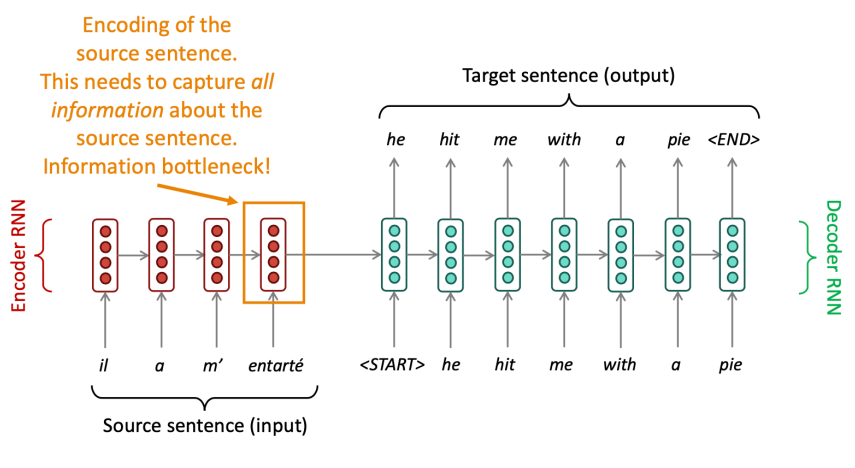
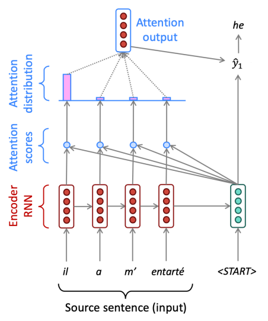
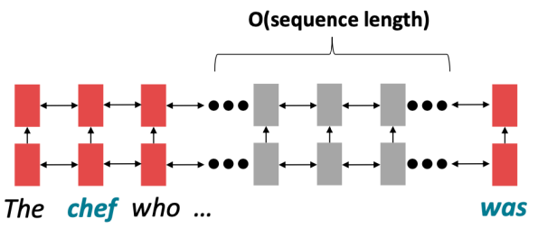
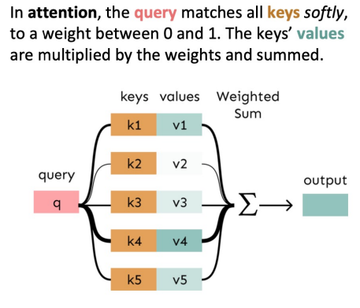
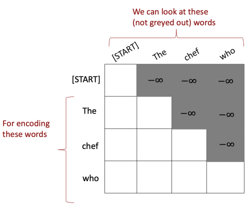

import * as Elem from '@elems';

우리는 seq2seq 모델을 통해 MT 작업을 수행하는 것을 보았습니다.
그런데 여기에 한 가지 문제가 있어요.
입력의 모든 정보가 인코더의 마지막 레이어에 저장되어야 한다는 것이죠.
그로 인해 정보가 압축되는 현상이 발생해요.
이를 `bottleneck problem`이라고 합니다.

# Attention

이를 출력을 생성하는 단계에서 인코더의 모든 step에 대한 정보와 접근하여 출력을 결정하는 `attention` 메카니즘을 통해 해결했습니다.

Attention 메카니즘은 아래와 같아요.

1\. 디코더의 각 step에서 생성된 hidden state $s_t$와 인코더의 hidden state $h_N$을 이용하여 attention score $e^t$를 계산합니다.  
$$
e^t = [s_t^T h_1, \cdots, s_t^T h_N] \in \mathbb{R}^N
$$

2\. Attention score에 softmax를 적용하여 attention distribution $\alpha^t$를 구합니다.
$$
\alpha^t = softmax(e^t) \in \mathbb{R}^N
$$

3\. $\alpha^t$를 이용하여 $h_N$의 가중 합 attention output $a_t$를 구합니다.
$$
a_t = \sum_{i=1}^{N} \alpha_i^t h_i \in \mathbb{R}^h
$$

4\. Attention output $a_t$와 $s_t$를 합친 후 기존 seq2seq 모델처럼 연산을 진행합니다.
$$
[a_t; s_t] \in \mathbb{R}^{2h}
$$

### Attention is great!

Attention은 디코더를 source의 어떠한 부분에 집중할 수 있도록 하여 NMT의 성능을 크게 높였습니다.
이전 정보를 기억하기보다 번역시 다시 source 정보를 되돌아보며 더욱 사람과 같은 형태를 띄게 되었네요.
또 attention은 bottleneck problem과 vanishing gradient problem을 해결할 수 있었어요.
Attention distribution을 이용하면 디코더가 어느 부분에 집중하는지 알 수 있어서 더욱 해석가능한 모델이 되었어요.
우리가 어디를 보라고 알려준 것도 아닌데 말이죠!

우리는 seq2seq 모델의 성능 향상을 위해 attention을 사용하였지만, 사실 attention은 거의 모든 아키텍처에 적용이 가능합니다.
attention의 더 일반적인 정의는 query, value 벡터가 주어지고 query에 따른 value의 가중 합을 계산하는 기술이에요.
즉, query가 어느 value를 집중해서 볼 것인지 선택해서 합치는 방식이죠.

### Attention variants

사실 attention score를 계산하는 방법을 여러 가지가 있어요.
* Basic dot-product attention: 위에서 사용한 방식이죠. $e_i = s^T h_i \in  \mathbb{R}$
* Multiplicative attention: 앞선 방식에 weight를 추가한 방법이에요. $e_i = s^T W h_i \in  \mathbb{R}$
* Reduced-rank Multiplicative attention: 트랜스포머의 self-attention에서 사용하는 방식입니다. $e_i = s^T(U^T V)h_i = (Us)^T(Vh_i)$
* Additive attention: $e_i = v^T \tanh (W_1 h_i + W_2 s) \in \mathbb{R}$

# From RNN to Attention-Based NLP Models

RNN에서 긴 거리의 단어와 상호작용을 위해서는 그 길이 만큼의 step이 필요합니다.
이는 기울기의 문제로 긴 거리 의존성을 학습하는 것은 쉽지 않죠.
또한 forward, backward 모두 병렬적으로 처리할 수 없어요.
미래의 hidden state는 이전 step의 hidden state가 계산되어야 하기 떄문이죠.
이는 학습을 느리게 만듭니다.

우리는 앞서 attention을 디코더에서 인코더의 hidden state를 참조하여 생성하는 것으로 보았어요.
이번에는 하나의 문장 내에서 각 단어가 다른 모든 단어와의 관계를 고려하는 `self-attention`을 생각해볼게요.
문장 내 모든 단어에 대해 연산을 진행하므로 병렬적으로 계산을 할 수 있어요.
문장이 길어져도 메모리만 충분하다면 말이죠.

문장 내 단어 $w_i$에 embedding matrix $E$에 대한 word embedding $x_i = E w_i$라고 합시다.

1\. word embedding에 대해 weight matrices Q, K, V로 각 벡터를 구해줍니다.
$$
q_i = Q x_i, k_i = K x_i, v_i = V x_i
$$

2\. query와 key를 이용하여 attention score를 구하고 softmax를 이용하여 attention distribution을 계산합니다.
$$
e_{ij} = q_i^T k_j, a_{ij} = \frac{\exp(e_{ij})}{\sum_{j} \exp(e_{ij}')}
$$

3\. 위 attention score와 value를 이용하여 가중 합을 구합니다.
$$
o_i = \sum_{j} a_{ij} v_i
$$

### Barrier and solution for self-attention

사실 위와 같은 방식은 몇 가지 문제가 있어요.

1\. <Elem.ColorText color='var(--error)'>단어의 순서를 고려하지 못합니다.</Elem.ColorText>
RNN 에서 각 단어의 순서대로 연산을 진행하며 자연스럽게 순서에 대한 정보도 포함되고 있습니다.
하지만 위와 같은 self-attention 방식은 모든 단어에 대한 연산을 병렬적으로 진행하여 순서에 대한 정보가 존재하지 않아요.
그래서 이를 해결하기 위해 <Elem.ColorText color='var(--info)'>위치에 관한 정보를 embedding 해줍니다.</Elem.ColorText>

$$
\widetilde{x}_i = x_i + p_i, \quad p_i \in \mathbb{R}^d \quad (for \; i \in {1,2,\cdots,n})
$$

위치 정보 $p_i$는 `sinusoidal position`으로 나타냅니다.
이는 다양한 주기를 가진 사인, 코사인 함수를 연결하여 각 단어의 위치 정보를 인코딩하는 방식이에요.

* <Elem.ColorText color='var(--info)'>위치 정보가 절대적이지 않고 주기성을 가져 모델이 위치 정보를 유연하게 해석합니다.</Elem.ColorText>
* <Elem.ColorText color='var(--info)'>주기적인 패턴 덕분에 모델이 훈련 중 본 적 없는 더 긴 시퀀스에 대해 추론할 수 있습니다.</Elem.ColorText>
* <Elem.ColorText color='var(--error)'>그러나 위치 표현이 학습 가능하지 않고 실제로 긴 시퀀스에 대한 효과가 제한적일 수 있습니다.</Elem.ColorText>

2\. <Elem.ColorText color='var(--error)'>비선형적인 결과를 만들어 낼 수 없어요.</Elem.ColorText>
가중 합을 사용하기 때문에 self-attention 만으로는 비선형적인 결과를 만들어 낼 수 없어요.
이는 <Elem.ColorText color='var(--info)'>self-attention 결과에 feed-forward network를 적용하여 해결할 수 있습니다.</Elem.ColorText>

3\. <Elem.ColorText color='var(--error)'>문장을 예측할 때 미래를 보지 않아야 합니다.</Elem.ColorText>
self-attention은 문장의 모든 단어를 보고 연산을 진행하기 때문에 예측 시점에서 미래의 단어까지 정보로 들어올 수 있어요.
이는 <Elem.ColorText color='var(--info)'>미래에 대한 정보를 masking 하는 기법을 사용하여 해결할 수 있어요.</Elem.ColorText>

$$
e_{ij} = \begin{Bmatrix} q_i^T k_j, j \leq i \\ -\infty \end {Bmatrix}
$$

Attention distribution을 구하기 위해 softmax를 할 때, $- \infty$ 값은 0에 가까운 값이 될 거에요.
그래서 고려하지 않는 정보가 되는 것입니다. 
