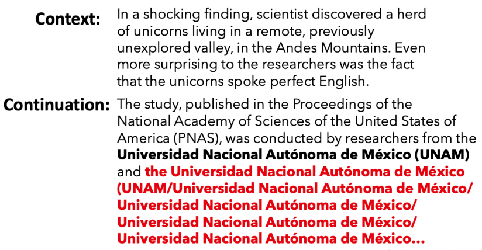
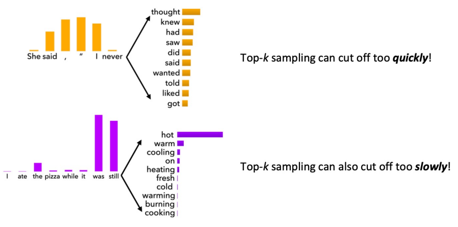
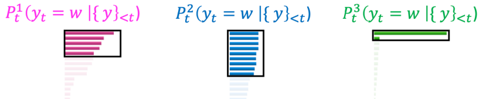
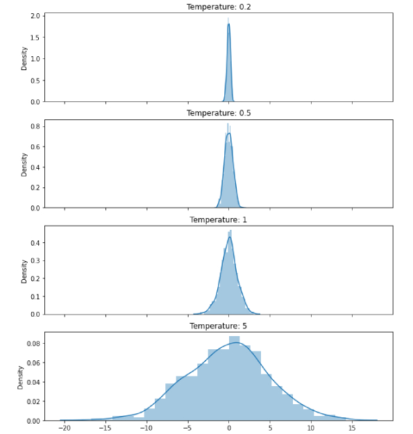
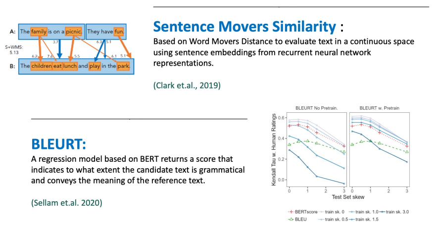

import * as Elem from '@elems';

`NLG(Natural Language Generation)`은 유창하고 일관성있고 유용한 언어를 생성해내는 작업이에요.
MT, digital assistant, summarization, chitchat 등 모두 NLG라고 할 수 있죠.
하지만 번역과 같은 작업은 output이 크게 다양하지 않은 반면 chichat dialog는 다양한 결과가 생산될 수 있죠.
스토리 제작과 같은 창의적인 활동은 더 심하고요.
즉, 번역과 같은 작업과 더 다양한 결과를 낼 수 있는 open-ended 작업은 서로 다른 decoding, training 전략이 필요할거예요.

# Basics of NLG

앞서 다루었듯, autoregressive text generation은 각 step마다 output을 생성하고 이를 다시 input으로 취합니다.
Non-open-ended 작업의 경우 인코더를 통해 입력 정보를 구축하고 디코더를 통해 autoregressive generation을 수행하죠.
하지만 open-ended 작업의 경우는 인코더 없이 디코더만으로 동작합니다.

Autoregressive generation 작업을 학습시키기 위해 이전에 생성한 output을 input으로 주는 것이 아닌,
ground truth를 입력으로 주어 학습시키는 `teacher forcing` 방법을 쓰기도 합니다.

# Decoding from NLG Models

앞서 다루었듯, text generation은 vocabulary중 가장 확률이 높은 토큰을 선택하거나 beam search와 같은 방식으로 여러 후보를 생성할 수 있죠.
이렇게 높은 확률을 가지는 단어를 선택하는 작업은 번역과 요약 작업등에 좋습니다.
그러나 open-ended 작업에서는 동일한 문장이 반복해서 나타나는 현상 `repetition problem`이 발생합니다.
모델 사이즈가 충분히 커도 동일한 현상이 나타납니다.

이러한 문제를 해결하기 위해 몇 가지 방법이 있어요.
* 간단한 옵션으로 n-grams 의 반복을 방법이 있어요.
* 학습 전략을 변경하는 방법이 있습니다.
    * 이미 생성된 토큰의 확률을 낮추는 방법.
    * attention mechanism이 동일한 단어를 attend 하지 못하게 하는 방법.
* 모델을 이용한 방법이 있어요.
    * 큰 언어 모델과 작은 언어 모델을 이용하여 두 언어 모델의 차이를 최대화 하는 문자열을 찾도록 하는 방법.

# Sampling

언어 모델들은 사람에 비해 표현과 단어 선택의 다양성에 있어 부족함을 보입니다.
사람은 예측하기 힘든 단어를 종종 사용하는데 비해 기계는 한정된 학습데이터에 기반하여 문장을 생성하기 떄문이죠.
이러한 방법을 극복하기 위해 무작위성을 적용합니다.
`Sampling`은 앞서 사용했던 높은 확률의 단어 `gold token`을 생성하는 것이 아닌, 확률 분포에서 랜덤하게 단어를 선택하는 방법입니다.
하지만 무작위로 선택한 단어는 문맥과 어울리지 않는 어색한 단어가 등장할 수 있죠.

### Top-K sampling

또 어색한 단어가 등장하지 않게 K개의 후보 단어를 먼저 선택한 후 그 사이에서 확률분포를 이용하여 단어를 선택하는 `Top-K sampling`방식을 사용할 수 있습니다.
K를 늘리면 다양성은 증가하지만 어색한 단어가 생성될 확률이 높아지고, K를 줄이면 안전하지만 다양성은 줄어듭니다.
또한 그 확률에 따라 충분히 고려가 될 수 있는 단어임에도 후보에 들지 못해 사용되지 못하고, 불필요한 단어임에도 후보가 되는 경우가 발생하죠.

### Top-P (Nucleus) sampling

위 문제를 해결하기 위해 `Top-P sampling`은 누적 확률 P를 기준점으로 후보군을 선택합니다.

이 외에도 `typical sampling`, `epsilon sampling` 등 다양한 방법이 연구되고 있습니다.

### Scaling randomness

이를 통해 사용되는 단어의 폭이 기존보다 넓어지지만 어색한 표현이 등장할 수 있습니다.
그래서 확률이 높은 단어의 확률은 더 높게, 낮은 단어의 확률은 더 낮게 확률 분포를 조정하는 방법을 사용합니다.
이를 조정하는 정도를 `temperature`라고 합니다.

$$
P_t(y_t = w) = \frac{\exp (S_w)}{\sum_{w' \in V} \exp (S_{w'})}
$$
$$
P_t(y_t = w) = \frac{\exp (S_w / \tau)}{\sum_{w' \in V} \exp (S_{w'} \tau)}
$$

# Exposure bias

다시 repetition problem 으로 돌아가서 이 문제가 왜 생기는지 생각해볼까요?
우리는 모델을 학습시킬 때 teacher forcing 방법을 사용한다고 하였어요.
이전에 생성된 단어가 ground truth와 달라도 다음 step의 입력으로 ground truth를 주어 학습시키는 방법이죠.
하지만 모델의 실제 추론 시간에는 이전에 생성된 단어를 다음 step의 입력으로 사용합니다.
그래서 학습과 추론의 차이가 발생하는 거죠.
이를 `exposure bias`라고 합니다.

이를 해결하기 위해서는 몇 가지 방법이 존재하죠.
* Scheduled sampling  
Gold token이 아닌 확률 P에 의해 선택된 단어를 다음 입력으로 사용하는 것이죠.
훈련 과정에서 확률 P를 점차 증가시켜 자신의 점차 예측에 의존하도록 만드는 방식이에요.
<Elem.ColorText color='var(--error)'>실제 성능을 개선하기도 하지만, 비정상적인 방향으로 훈련이 진행될 수 있어요</Elem.ColorText>
* Dataset aggregation  
현재 모델을 이용하여 sequence를 생성하고 이 sequence를 훈련 예시로 사용합니다.
이를 통해 자신의 출력에 대한 이해하고 더 잘 대응하도록 하는 방법이죠.
* Retrieval augmentation  
기존 인간이 작성한 corpus에서 sequence를 검색하고 이를 수정하고, 새로운 토큰을 추가하거나 기존 토큰을 제거하는 방법을 학습합니다.
이 방법을 활용하여 조금 더 사람과 같은 결과물을 만들 수 있어요.
* Reinforcement learning  
reward function을 이용하여 학습을 진행합니다.

### Reward estimation

그렇다면 강화 학습을 사용하기 위한 reward function은 무엇을 사용해야 할까요?
간단하게 evaluation metric을 사용하면 됩니다.
그러나 더 나은 reward score를 얻도록 학습된 모델이 사람이 보았을 때 향상이 없는 것 처럼 보일 수 있어요.

Teacher forcing은 여전히 text generation을 위한 학습의 주요 알고리즘입니다.
따라서 아직도 exposure bias를 해결하기 위한 ㅕㅇ러 연구가 진행되고 있어요.

# Evaluating NLG systems

모델을 통해 생성된 text를 평가하기 위해서는 아래와 같은 방법이 있습니다.

### Content overlap metrics

생성된 text와 refernce text에서 비슷한 어휘 점수를 계산하는 방식이죠.
N-gram overlap metrics(BLUE, ROUGE, METEOR 등) 이죠
빠르고 효과적이고 널리 사용됩니다.
<Elem.ColorText color='var(--error)'>하지만 open-ended 작업에 대해 적합하지 않죠</Elem.ColorText>

### Model-based metrics to capture more semantics

생성된 text와 refernce text의 의미적 유사성을 판단하는 모델을 이용할 수 있어요.

앞선 방법보다 너 넓은 의미를 볼 수 있지만, <Elem.ColorText color='var(--error)'>해석 불가능한 부분도 존재할 수 있죠.</Elem.ColorText>

### Human evaluation

가장 기본적인 방법은 사람이 직접 평가하는 것이죠.
사람은 문장의 의미적, 문법적 등 다양한 기준을 볼 수 있으니까요.
사람이 결정한 기준을 `gold standard`라고 합니다.
<Elem.ColorText color='var(--error)'>물론 사람이 하는 것이기에 비싼 비용과 일관적이지 않을 수 있죠. 실수도 발생할 수 있구요.</Elem.ColorText>
