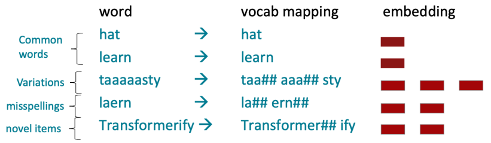
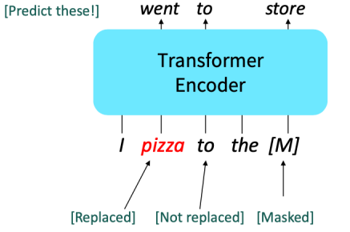

import * as Elem from '@elems';

우리는 보통 훈련 데이터셋으로 부터 만들어진 고정된 크기의 vocabulary를 사용합니다.
테스트 단계에서 나오는 새로운 단어는 [UNK] 토큰으로 할당되죠.
많은 언어들은 복잡한 형태를 띄고있어 한정된 vocabulary는 언어를 더 깊게 이해하지 못하게 해요.

<Elem.Comment>
밥을, 밥이, 밥의 등과 같은 조사의 영향을 받아 여러 형태를 가짐
</Elem.Comment>

따라서 단어를 더 작은 단위로 나누어 처리하는 `subword modeling` 이용하고는 했어요.
현재에도 훈련, 테스트때 각 단어가 subword로 나누어져 학습되고 있죠.
앞서 다루었던 `byte-pair encodig`은 아주 간단하고 효과적인 subword vocabulary를 정의하는 전략이에요.
텍스트 데이터에서 가장 흔한 문자 조합을 찾아 점진적으로 subword vocabulary를 구축합니다.
흔한 단어들은 subword가 되고 자주 등장하지 않은 단어는 분리되어 subword의 구성요소가 될거예요.

하지만 단어의 완벽한 의미는 문맥에서 옵니다.
동일한 단어라고 해도 문맥을 보고 여러 의미중 정확히 어떤 의미로 사용되었는지 알 수 있는 것이죠.

# Pretraining

초반에는 사전 학습된 word embedding만을 이용하여 훈련중에 문맥에 대한 정보와 합치는 형태로 학습을 진행했습니다.
그래서 downstream task가 문맥을 충분히 알려줄 수 있을 만큼 충분히 효율적이어야 했죠.
즉 word embedding 부분만 사전 학습된 상태로 모델 학습을 진행했습니다.

최근에는 모든 파라미터가 사전 학습된 상태로 시작합니다.
보통 입력의 일부를 숨긴 후, 해당 부분을 모델이 재구성하는 방식으로 사전 학습이 진행되죠.
이러한 방식의 사전 학습이 언어의 강력한 표현을 구축하는 데 효과적이고, 모델의 초기화 및 언어에 대한 확률 분포를 생성하는데 효과적입니다.

그렇기에 최근에는 대규모의 텍스트로 사전 학습된 모델을 이용하여 각 작업에 맞도록 fine-tuning하는 형식으로 진행됩니다.
사전 학습된 모델은 fine-tuning 단계에서 좋은 출발점을 가지고 시작하는 것이죠.
또한 사전 학습된 파라미터 근처의 fine-tuning의 local minima가 꽤 좋은 일반화 성능을 보이고는 합니다.

# Three ways of pretraining

사전 학습 방식은 모델 구조에 따라 영향을 받습니다.

### Encoder pretraining

인코더는 내용의 양방향 정보를 모두 가지고 있어요.
그래서 이전 시점의 정보를 보고 문장을 생성해내는 language modeling이 불가능합니다.
그래서 입력중 일부를 [MASK] 토큰으로 만든 후 이를 예측하는 방식으로 사전 학습을 진행하죠.
이를 `Masked LM`이라고 합니다.

대표적인 인코더 모델 BERT의 Masked LM 과정은 다음과 같아요.
임의의 15% 토큰에 대한 예측을 진행할거예요.
* 예측을 진행할 단어의 80%를 masking합니다.
* 예측을 진행할 단어의 10%는 다른 임의의 토큰으로 교체합니다.
* 남은 10%는 변경하지 않고 그대로 둡니다. (예측은 진행합니다!)

BERT는 두 개의 내용이 연속되는 텍스트를 입력으로 사용하였어요.
그래서 하나의 텍스트가 또 다른 텍스트와 연결된 문장인지 혹은 임의로 선택된 문장인지 예측하는 `next sentence prediction` 방식도 사용했죠.
그런데 나중에 밝혀진 바로는 next sentence prediction 방식은 불필요하다는 것이 밝혀졌네요.

하지만 인코더를 사전 학습시키는 위와 같은 방식은 한번에 한 단어를 생성하는 생성형 방식과 적합하지 않습니다.

### Decoder pretraining

기본적으로 seq2seq의 디코더와 비슷한 방식으로 사전 학습을 진행합니다.
Fine-tuning을 진행하며 출력이 classifier에 의해 결정되는 부분이 학습되는 방식이죠.

### Encoder-Decoder pretraining

인코더 부분은 양방향 문맥에 대한 정보를 얻을 수 있고, 디코더 부분은 language modeling을 통한 생성이 가능합니다.
여기서 `span corruption`이라는 방식이 꽤 좋은 성능을 낸다는 것을 확인했어요.
이는 하나 또는 연속된 두개 이상의 토큰을 하나의 토큰으로 masking하고 이를 다시 복원하는 방식으로 사전 학습을 진행하는 것입니다.
