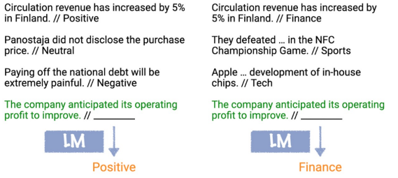
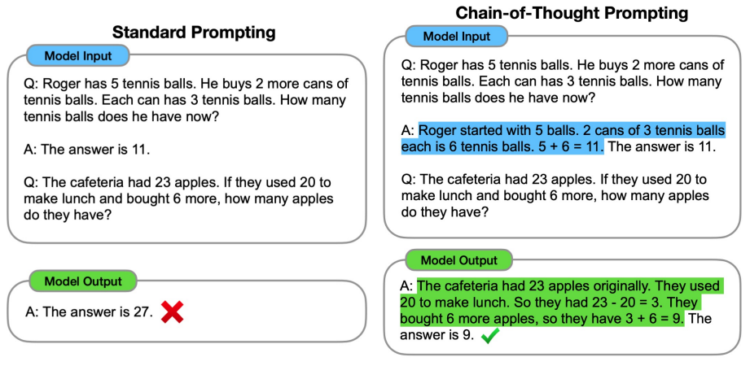
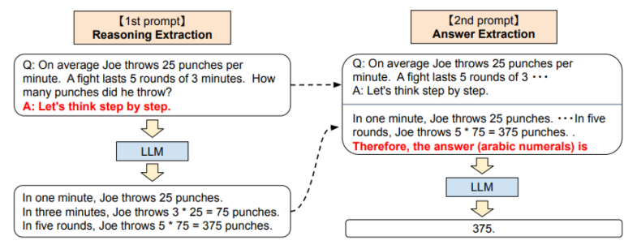

2018년 Open AI에서 `GPT(Generative Pretrained Transformer)`를 발표했어요.
12개의 디코더 레이어와 7000 가지가 넘는 책을 통해 학습이 되었지요.
GPT는 language modeling은 효과적인 사전 학습 방법이라는 것을 보여주었어요.

2019년에는 GPT2가 공개되었어요.
파라미터는 117M에서 1.5B로 늘었고, 40GB 되는 온라인 텍스트를 통해 사전 학습 되었어요.
여기서 한가지 중요한 점은 `zero-shot learning`의 등장입니다.

2020년에는 GPT3가 발표되었습니다.
파라미터가 175B으로 늘었고, 학습된 데이터의 수도 600GB를 넘었습니다.
GPT3에서 특징은 `few-shot learning`이 등장하였습니다.

# Zero-shot, Few-shot learning

`Zero-shot learning`은 우리가 학습시키지 않은 작업에 대해서도 작동하는 것을 의미합니다.
예를 들면 우리는 그저 사전 학습만을 시켰으나, QA 작업에 대해서도 좋은 답변을 내놓은 것이죠.
GPT2는 추가적인 fine-tuning 없이 기존의 task에서 높은 성능을 내어 여러 부문에서 SOTA를 달성하였어요.

`Few-shot learning`은 하나의 작업을 수행하기 전 그 작업과 관련한 예시와 함께 넣어주는 것이에요.
새로운 작업을 배울 때 가중치 업데이트가 일어나지 않는다고 하여 `in-context learning`이라고도 불립니다.

# Prompting

특히 규모가 큰 모델에서 높은 정확도를 나타내는 것을 확인할 수 있었어요.
가중치 업데이트 없이 새로운 작업을 수행시킬 수 있다는 발견으로 prompt에 대한 중요성이 대두되었습니다.
하지만 여라 단계를 통한 추론과 같은 몇몇 작업들은 prompting 만으로는 어려움이 있었습니다.

이를 해결하기 위해 나온 개념이 `CoT(Chain-of-Thought) Prompting`입니다.

위 그림과 같이 예시에 대한 해결 방식을 step by step으로 제시함으로 모델에게 prompt에 대한 이해도를 높입니다.
이 방식은 모델의 규모가 클때 지도학습된 모델의 성능을 따라가는 결과를 볼 수 있었어요.
이것을 조금 더 발전시켜 모델의 step by step 출력을 이용하여 prompt로 다시 제공하는 방식으로 원하는 답변을 얻을 수 있습니다.
이를 `zero-shot chain-of-thought prompoting`이라고 해요.

