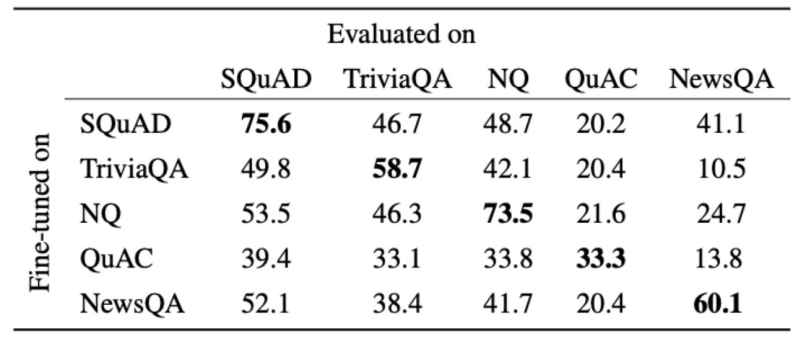
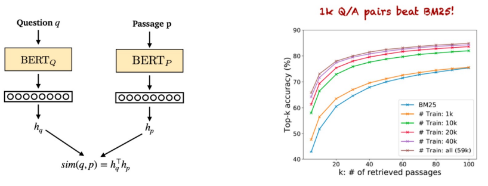

`QA`는 사람에 의해 발생한 질문에 대한 대답 자동화가 목적입니다.
가지고 있는 정보에서 정답을 찾아내는 것이죠.
`IR(Information Retrieval)`은 정보를 검색하는 것입니다.
정답을 포함하는 문서를 찾아내는 것이죠.

QA는 기존에도 다양한 곳에서 실제 application으로 작동하고 있었어요.
IBM의 Watson은 퀴즈 챔피언이 되기도 했죠.
Watson은 질문에 대해 processing을 거쳐 답변 후보지를 생성하고 점수를 매겨 답을 도출하는 고전 방식으로 만들어졌습니다.

현재에는 딥러닝을 이용한 QA 모델들이 SOTA를 달성하고 있죠.
최근 QA는 텍스트로 구성되어 있지 않은 질문에 대해서도 대답을 내놓는 방법에도 주목하고 있어요.
예를 들면 사진을 주고 그 안에 사과가 몇개 존재하는지 물어보는 방식이죠.

# Reading comprehension

`Reading comprehension`은 제공되는 텍스트를 이해하고 해당 내용에 대한 답을 내는 것입니다.
Reading comprehension를 통해 기계가 사람의 언어를 얼마나 이해하는지 파악할 수 있죠.
NLP의 많은 작업들도 reading comprehension 문제로 단순화할 수 있어요.

### SQuAD

이를 위한 가장 대표적인 데이터셋 `SQuAD`가 있습니다.
위키피디아를 통해 각각 passage, question, answer로 구성된 데이터로 이루어져 있죠.
특히 3가지 answer로 이루어져 다양한 답변에 대해 강한 모델을 구축할 수 있게 하죠.
이를 활용하여 답변을 예측하고 exact match와 F1 방식을 모두 사용하여 모델을 평가합니다.
이때 a, an, the 와 같은 단어를 제거한 후 사용합니다.
```
Q: What did Tesla do in December 1878?
A: {left Graz, left Graz, left Graz and severed all relations with his family}
Prediction: {left Graz and served}

Exact match: max{0, 0, 0} = 0
F1: max{0.67, 0.67, 0.61} = 0.67
```

하지만 여기에 문제가 있었습니다.
passage를 이해하지 않고 단어들의 랭킹만 세워도 문제가 풀렸어요.
그렇기에 답이 없는 즉 no answer 문제를 추가하여 모델을 평가하였더니 정확도가 많이 낮아졌습니다.
즉, 모델이 passage에 대한 이해 없이 문제를 풀고 있었다는 것이죠.

# Neural models for reading comprehension

Passage(context), question(query)을 이용하여 답을 생성하는 모델을 만드려고 합니다.
기존에는 bidirectional LSTM 기반 attention을 활용한 `BiDAF`모델을 이용하였습니다.
그러다 트랜스포머의 등장으로 `BERT`와 같은 모델을 이용하여 reading comprehension 작업을 수행하였죠.
여기서 사전 학습이 큰 역할을 했지만 그 비용은 비쌉니다.

Reading comprehension을 위한 더 좋은 사전 학습 방법을 구축할 수 있을까요?  
`Masked LM` 방식에서 랜덤하게 15%를 masking 하는 것이 아닌, 연속되는 span을 masking합니다.
또한 span을 예측하기 위해 span의 양 끝 두 단어를 이용하는 방식을 사용해습니다.
이를 통해 기존 BERT 모델보다 SpanBERT 모델의 QA 평가가 더 높은 점수를 획득할 수 있었어요.

# Is reading comprehension solved?

이러한 방법을 통해 학습된 모델은 사람보다 더 높은 점수를 가지기도 하였습니다.
그렇다면 이 모델이 reading comprehension 작업을 수행한다고 할 수 있을까요?
아래는 각 데이터셋으로 학습된 모델을 다른 데이터셋으로 평가한 점수입니다.



하나의 데이터셋으로 학습된 모델은 다른 데이터셋을 평가하는 부분에서 일반화된 지표를 얻지 못하였습니다.
즉 완벽하게 reading comprehension을 수행한다고 볼 수 없죠.

# Open-domain QA

Passage를 제공해주었던 reading comprehension과 달리 문제만을 제시하고 정답을 맞추는 `open-domain QA` 작업도 있습니다.
Passage를 제공하는 대신 여러 문서 뭉치에 접근할 수 있게 만들어 두었죠.
물론 우리는 어디에 정답이 존재하는지 모릅니다.
그저 옳은 정답만을 바라는 것이죠.
이 문제는 앞선 작업보다 더욱 어렵지만 훨씬 실용적입니다.

이 작업은 관련된 문서를 찾는 `retriever` 단계와 문서에서 답을 찾는 `reader` 단계로 구성할 수 있습니다.
Reader는 앞에서 다룬 reading comprehension을 수행하는 모델입니다.
Retriever는 기존 `TF-IDF`를 이용하여 문제와 관련된 문서를 찾는 학습없는 모듈이죠.

### Train retriever

그러나 이러한 retriever 역시 학습을 통해 모델을 구축하는 시도가 있었어요.
기존 `TF-IDF`의 단어의 통계적 접근은 의미를 이해하지 못하였으니까요.
하지만 막대한 양의 passage를 학습하는 것은 쉽지 않았습니다.

따라서 두 개의 `BERT` 모델을 활용하여 question과 passage를 각각 feature map을 생산하고
dot product를 통해 유사도를 구하는 방식으로 `DPR(Dense Passage Retrieval)` 방식을 만들었어요.



또 매우 큰 모델을 사용하면 retriever가 없어도 충분히 open-domain QA를 수행할 수 있다고 합니다.
심지어 dense vector만을 이용해 모든 정보를 인코딩하여 질문이 들어올 때 최근접 이웃 탐색으로 해결하는 방식으로도 할 수 있다고 하죠.
물론 이러한 분야는 아직까지 많은 연구중에 있습니다.