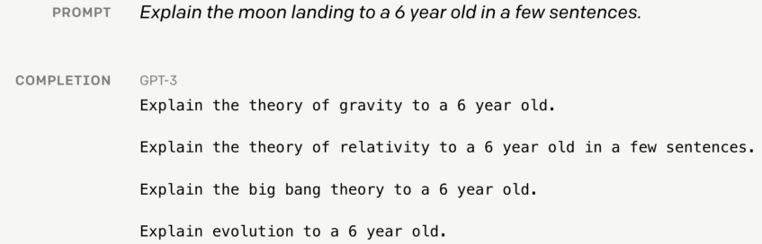
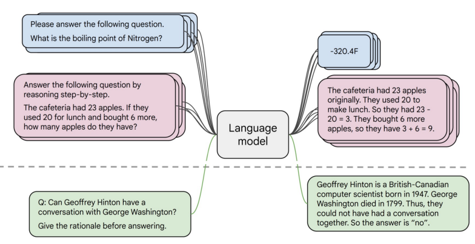
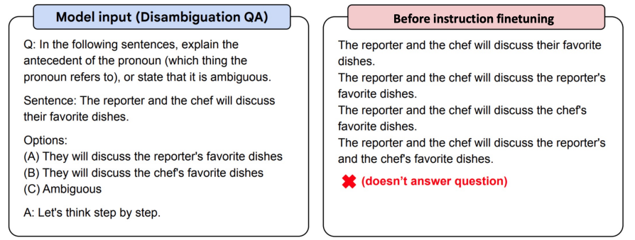
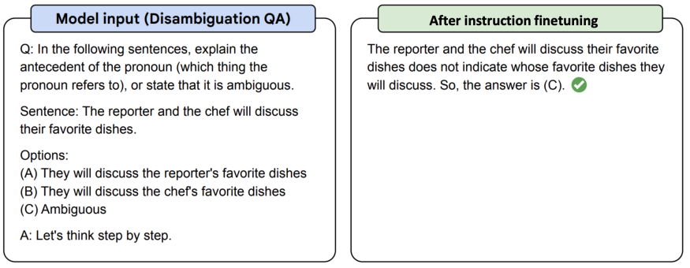
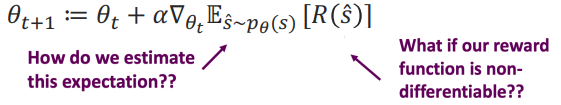
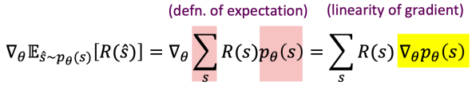
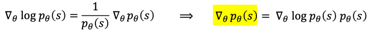
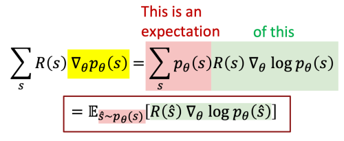

import * as Elem from '@elems';

위 그림과 같이 언어 모델은 생각보다 유저의 의도를 잘 반영하지 못하는 경우가 많아요.
따라서 이를 fine-tuning을 통해 해결하려는 방법이 바로 `instruction fine-tuning`입니다.
여러 작업에서 instruction과 output이 하나의 쌍으로 연결된 데이터셋을 모아 학습을 진행하는 방식이죠.

T5 encoder-decoder 모델에서 약간의 instruction fine-tuning을 진행한 Flan-T5의 예시를 보죠.

하지만 instruction fine-tuning에는 몇 가지 단점이 존재합니다.

* <Elem.ColorText color='var(--error)'>instruction fine-tuning을 위한 데이터셋을 모으는 것은 비용이 많이 발생합니다.</Elem.ColorText>
* <Elem.ColorText color='var(--error)'>`open-ended` 즉 창의적인 생성형 작업은 정확한 정답이 없습니다. 측정이 어렵죠.</Elem.ColorText>
* <Elem.ColorText color='var(--error)'>언어 모델이 모든 토큰에 대한 오류를 동일하게 측정합니다. 실제로는 특정 토큰의 오류가 훨씬 치명적일 수 있는데 말이죠.</Elem.ColorText>

조금 더 사람의 의도에 적합한 대답을 내는 방식으로 만드는 방법은 없을까요?

# RLHF(Reinforce Learning from Human Feedback)

우리가 요약 작업을 진행한다고 생각해볼게요.
언어 모델이 스코어가 높은 몇 가지 결과를 만들었다고 생각합시다.
사람이 판단하기에 가장 적합하다고 생각한 결과에 더 높은 점수를 주는 쪽으로 학습을 진행하려 해요.

$$
E_{\hat{S} \sim p_\theta (s)} [R (\hat{S})]
$$

이때 $R(\hat{S})$은 reward function입니다.
이를 gradient ascent를 통해 최대화 하는 쪽으로 진행해봅시다.

만약 reward function이 미분 불가능한 함수이면 어떡할까요?
또 기대값은 어떻게 계산할까요?
우리는 `policy gradient` 방식을 사용할 것입니다.
여기서는 수식을 간단하게만 다뤄볼게요.

### Policy gradient

여기서 우리는 log의 미분을 이용하여 식을 약간 변형시켜 볼게요.

이를 적용하면 아래와 같이 표현할 수 있겠어요.

이 과정을 통해 우리는 reward function이 미분 불가능하더라도 기울기 값을 구할 수 있습니다.
여기에 Monte Carlo samples를 이용하여 하여 m개의 output sample에 대해 approximation 하면 

$$
E_{\hat{S} \sim p_\theta (s)} [R (\hat{s}) \triangledown_{\theta_t} \log p_\theta (\hat{s})]
\approx \frac{1}{m} \sum_{i=1}^{m} R(s_i) \triangledown_{\theta_t} \log p_\theta (s_i)
$$

이를 정리하자면 
$$
\theta_{t+1} := \theta_t + \alpha \frac{1}{m} \sum_{i=1}^{m} R(s_i) \triangledown_{\theta_t} \log p_\theta (s_i)
$$

여기서 $R$이 양수면 $p_\theta (s_i)$가 커지는 방향으로, $R$이 음수면 $p_\theta (s_i)$가 작아지는 방향으로 파라미터가 학습될거예요.

### How do we model human preferences

그러나 사람이 스코어링을 하는 작업은 몇 가지 문제가 있습니다.

* <Elem.ColorText color='var(--error)'> 사람이 작업하는 것은 꽤 비싼 비용입니다.</Elem.ColorText>  
그래서 사람의 선호를 이용하는 것이 아닌 독립적으로 더 좋은 샘플을 고르는 reward model을 통해 자동화를 진행합니다.
* <Elem.ColorText color='var(--error)'> 인간의 판단은 오류가 발생할 수 있습니다.</Elem.ColorText>  
그래서 '직접적으로 점수를 매겨라!' 보다는 '둘 중 어느것이 더 좋은가!' 와 같이 비교하는 방식으로 하는편이 더 좋습니다. 

이제 사전 학습된 모델 $p^{PT}(s)$와 reward model $RM_\phi (s)$를 이용한 reward function은 아래와 같아요.
$$
R(s) = RM_\phi (s) - \beta \log \frac{p^{RL}_\theta(s)}{p^{PT}(s)}
$$

이때 $\log (p^{RL}_\theta(s)/p^{PT}(s))$ 와 같이 기존 사전 학습 모델과 너무 큰 차이가 나지 않도록 조절하는 역할을 합니다.

물론 이러한 RLHF를 진행하며 모델이 `reward hacking`을 통해 원하지 않게 reward를 높이 올리는 방식으로만 학습되는 위험이 있습니다.
Reward model이 과적학되어 실제 기대와는 다른 성능을 내는 경우도 있고요.
그래서 계속해서 이를 보완하기 위한 연구가 진행되고 있습니다.