import * as Elem from '@elems';

언어 모델은 다음 단어가 무엇이 오는지 예측하는 작업이에요.
구체적으로 말하자면 연속적인 단어 $x^{(1)}, x^{(2)}, \cdots, x^{(t)}$가 주어질 때, 다음 단어 $x^{(t+1)}$의 확률을 예측하는 것이죠.
$$
P(x^{(t+1)}|x^{(t)}, \cdots, x^{(1)})
$$

이러한 시스템을 `language model`이라고 해요.
조금 더 생각해보면 언어 모델은 [EOS]이 나올 때 까지 문장의 모든 부분을 확률로 할당하는 시스템인 셈이죠.

$$
P(x^{(1)}, \cdots, x^{(T)}) = P(x^{(1)}) \times P(x^{(2)}|x^{(1)}) \times \cdots \times P(x^{(T)}|x^{(T-1)}, \cdots, x^{(1)})
$$

# N-Gram Language Model

`N-Gram Language Models`은 딥 러닝 이전 고전적인 언어 모델을 구현하는 방법입니다.
n-gram은 연속된 단어 덩어리에요.
아래 예시를 보면 이해가 쉬울 것입니다.

```
the cat was under the bed

unigrams: "the", "cat", "was", "under", "the", "bed"
bigrams: "the cat", "cat was", "was under", "under the", "the bed"
trigrams: "the cat was", "cat was under", "was under the", "under the bed"
```

`Markov assumption`은 이러한 덩어리를 이용하여 다음 단어가 무엇이 나올지 예측하는 방식입니다.
하나의 큰 corpus에서 나올 확률을 세는 방식이죠.
아래 4-gram 언어 모델의 예시를 보겠습니다.

$$
P(w | students \; opened \; their) = \frac{count(students \; opened \; their \; w)}{count(students \; opened \; their)}
$$

여기서 "student opened thier"이 총 1000번 등장한다고 합시다.  
"student opened their books"가 400번 등장하면 $P(books | student \; opened \; their) = 0.4$.  
"student opened their exams"가 100번 등장하면 $P(exams | student \; opened \; their) = 0.1$.  
이런 식으로 계산이 되는 것이죠.

하지만 여기에는 몇 가지 문제가 있습니다.

<Elem.ColorText color='var(--primary)'>Sparsity problem</Elem.ColorText>  
- "students opened their w" 라는 문장이 전혀 등장하지 않는다면 w에 대한 확률은 0이 됩니다.  
이럴 때에는 모든 $w \in V$에 대해 카운트를 하여 적용하는 방법이 있을거에요. `smoothing`
- "students opened their" 라는 문장이 전혀 등장하지 않는다면 "opened theire"로 대체하는 방법이 있을 거에요.
여기서 n이 클수록 이 문제가 자주 발생할 확률이 높겠죠.

<Elem.ColorText color='var(--primary)'>Storage problem</Elem.ColorText>  
- 사용할 모든 n-gram의 수를 저장해야 하는 문제가 있죠.
이는 n이 커지고, corpus가 클수록 모델 사이즈가 커진다는 것이죠.

n-gram을 이용하여 아래와 같은 방식으로 문장을 생성할 수 있어요.

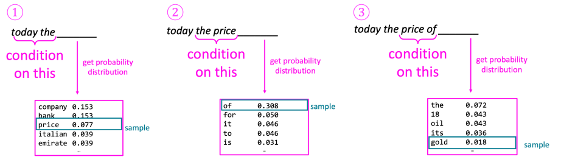
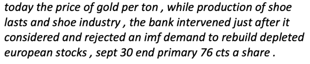

놀랍게도 문법적으로는 틀리지 않지만, 문맥에 맞지 않는 내용이 만들어지죠.
자연스럽게 문맥을 생성하려면 n을 키워야하고, 이는 모델 사이즈가 커지고 sparsity problem이 커지는 문제가 발생하죠.

# RNN

위 문제를 해결하기 위해서 언어 모델에 인공 신경망을 사용하는 방법이 등장했어요.

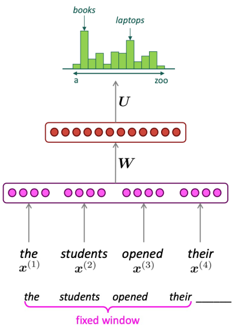

Sparsity problem을 해결하고 모든 n-gram을 저장할 필요가 없어졌어요.
하지만 window를 키우기 위해서는 $W$도 커져야 하기에 window를 충분히 크게 만들 수 없습니다.
그래서 어떤 길이의 입력이든 처리할 수 있는 방법이 필요합니다.

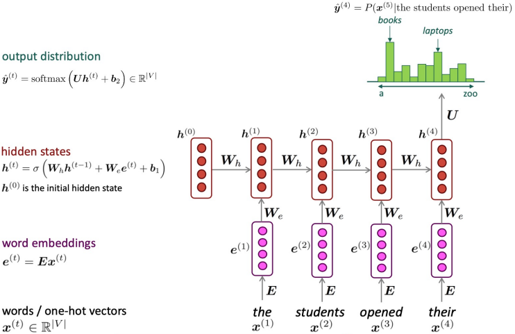

`RNN`의 기본 아이디어는 입력에 대해 동일한 $W$를 사용하는 것이에요.
RNN은 아래와 같은 특징을 가집니다.

* 입력에 길이에 상관없이 처리할 수 있어요.
* 이론적으로 $t$ 시점에서 정보는 이전 시점에서 모든 정보를 가지고 있어요.
* 긴 입력이 들어와도 모델 사이즈는 커지지 않아요.
* <Elem.ColorText color='var(--primary)'>연산 속도가 느립니다.</Elem.ColorText>
* <Elem.ColorText color='var(--primary)'>실제로 오래 전 시점의 정보에 접근하긴 어렵습니다.</Elem.ColorText>

## Training RNN

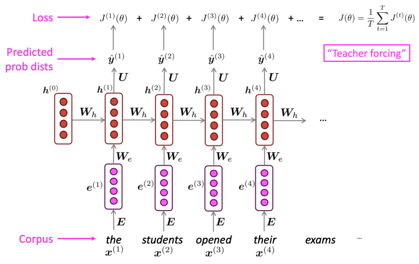

$$
\frac{\partial J}{\partial W} = \frac{1}{T} \sum_{t=1}^{T} J^{(t)} (\theta) \tag{1}
$$

RNN을 학습하기 위해서 모든 결과에 대해 loss를 계산하고 이를 평균내 전체 loss를 구합니다.
하지만 실제로 우리가 다루는 입력은 문장이거나 어쩌면 문서가 될 수 있어요.
이런 방식으로 전체 corpus의 loss를 구하는 작업은 큰 연산을 필요로 하게 되죠.
이를 SGD와 같은 방식으로 어느정도 해결을 할 수 있겠죠.

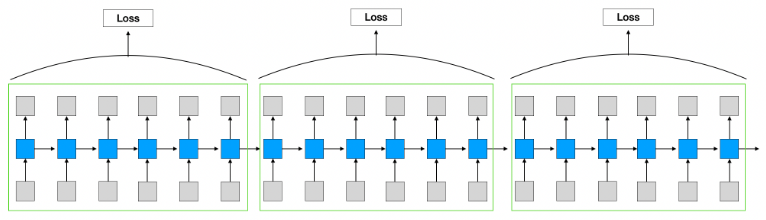
혹은 전체 loss에 대해 계산하지 않고, 일부 길이마다 잘라 계산하는 형식으로 연산량을 줄일 수 있을거에요.

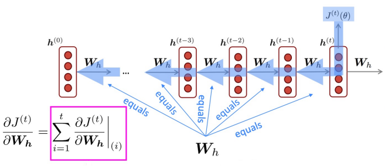

각 step마다 loss를 구하는 식은 아래와 같습니다.

$$
h^{(t)} = \sigma (W_x x^{(t)} + W_h h^{(t-1)}) \tag{2}
$$

$$
\frac{\partial J^{(4)}}{\partial W} = 
\frac{\partial J^{(4)}}{\partial \hat{y}^{(t)}} \frac{\partial \hat{y}^{(t)}}{\partial h^{(t)}}
\frac{\partial h^{(t)}}{\partial h^{(t-1)}} \cdots
\frac{\partial h^{(1)}}{\partial W} \tag{3}
$$


## Generate & Evaluate

RNN을 이용하여 텍스트를 생성하는 과정은 다음과 같아요.

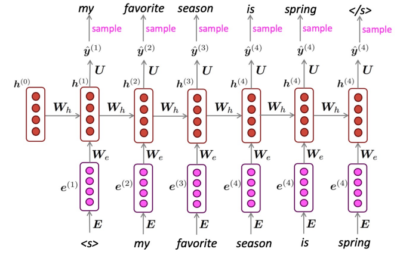

hidden state를 통해 예측한 단어를 다음 시점의 입력으로 사용하는 것이죠.
이렇게 [EOS]라는 단어가 나올 때 까지 반복하여 문장을 생성하는 것입니다.
이때 생성된 확률 분포에서 무작위로 단어를 선택하여 예측하는 `repeated sampling`을 사용합니다.
이는 확률이 높은 단어가 자주 선택되겠지만, 낮은 확률을 가진 출력도 선택될 수 있어요.

$$
perplexity = \prod_{t=1}^{T} (\frac{1}{P_{LM} (x^(t+1) | x^(t), \cdots, x^(1))}) ^ {1/T}
$$

이제 우리는 언어 모델의 평가 지표로 `perplexity`를 사용할거예요.
언어 모델에서 이전 단어들이 주어졌을 때 다음 단어에 대한 확률의 역수를 모두 곱하여 $\frac{1}{T}$승으로 normalization 한 것이죠.
이는 cross-entrophy를 이용한 loss $J(\theta)$의 exponential을 한 것과 같습니다.

$$
\prod_{t=1}^{T} (\frac{1}{P_{LM} (x^(t+1) | x^(t), \cdots, x^(1))}) ^ {1/T} = 
\prod_{t=1}^{T}(\frac{1}{\hat{y}_{x_{t+1}}^{(t)}})^{1/T} =
\exp (\frac{1}{T} \sum_{t=1}^{T} - \log \hat{y}_{x_{t+1}}^{(t)}) = \exp (J(\theta))
$$

우리는 loss가 낮아지도록 모델을 학습시켜요.
즉 perplexity는 점수가 낮을수록 잘 학습된 모델이라고 할 수 있겠네요.

뭐 문장 생성작업 외에도 entity recognition, text classification 등의 작업을 수행할 수 있어요.

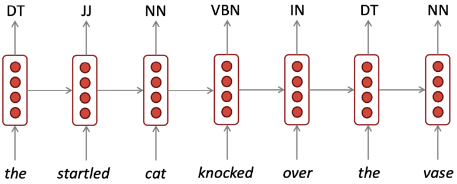
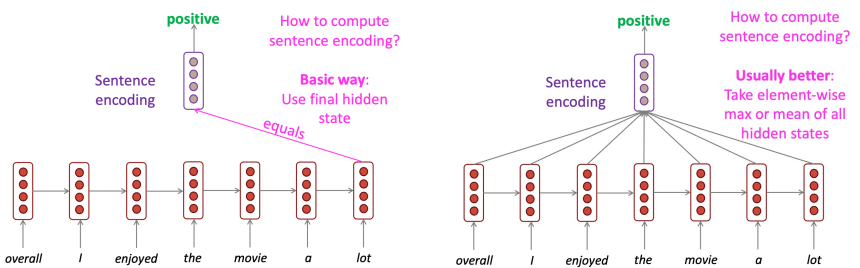

# LSTM, RNN Variants

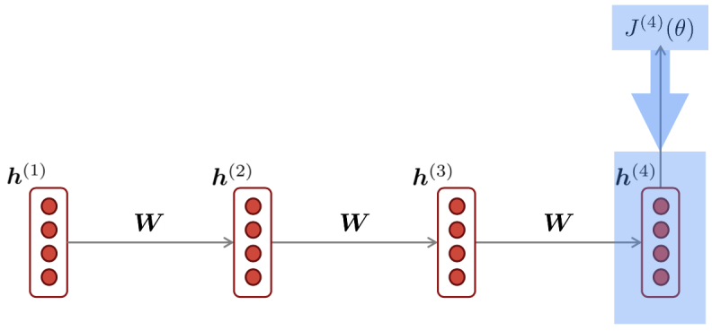

우리는 학습을 위해 식 (3)과 같이 loss에 대한 기울기를 계산하였습니다.

$$
\frac{\partial h^{(t)}}{\partial h^{(t-1)}} = 
\frac{\partial h^{(2)}}{\partial h^{(1)}} \times
\frac{\partial h^{(3)}}{\partial h^{(2)}} \times
\cdots \times \frac{\partial h^{(t)}}{\partial h^{(t-1)}} \tag{4}
$$

$$
\frac{\partial h^{(t)}}{\partial h^{(t-1)}} = W_h h^{(t-1)} \tag{5}
$$


식 (3)을 풀어보면 식 (4)의 형태가 등장하는데 식 (5)를 활용하면 $W_h$가 여러번 곱해지는 형태를 가지는 것을 볼 수 있어요.
만약 step $t$가 크면 클수록 $W_h$가 더 많이 곱해지는 모습이 보이겠죠.
그런데 만약 $\left| W_h \right| > 1$ 이라면 step이 길어질수록 loss에 대한 $W_h$의 기울기는 점점 더 커질거에요.
이 상태로 gradient descent를 한다면 minimum과 멀어지는 쪽으로 학습이 진행될 것입니다.
이를 `exploding gradient`라고 합니다.
이를 해결하기 위해서 기울기가 일정 크기 이상 커지면 적당한 값으로 clipping하는 방식으로 해결할 수 있을거예요.

반대로 $\left| W_h \right| < 1$ 이라면 step이 길어질수록 loss에 대한 $W_h$의 기울기는 점점 더 작아질거에요.
이를 `vanishing gradient`라고 합니다.
loss를 계산할 때 너무 먼 step과의 기울기를 구하는 것은 문제가 발생하게 됩니다.

## LSTM

vanishing gradient 문제를 해결하기 위해 등장한 모델 구조가 `LSTM (Long Short-Term Memory Network)`입니다.
LSTM은 기존 RNN에서 멀리 떨어진 정보에 대해 저장하는 `cell`이 추가된 형태에요.
이 cell로부터 정보를 읽고, 쓰고, 지우고를 할 수 있어요.

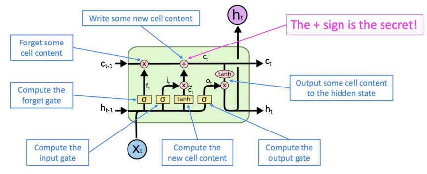

기능을 천천히 살펴봅시다.

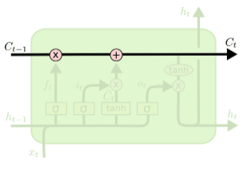

위 부분은 LSTM의 cell state 입니다.
이는 정보가 저장되는 장소에요.

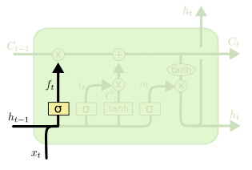

LSTM의 첫 단계는 cell state에 저장된 정보를 잊을지 보존할지 선택하는 경로에요.
`forget gate`에서 $h_{t-1}$과 $x_t$를 $W_f$와 연산한 후 sigmoid를 통해 0과 1사이 값으로 만들어 줍니다.
만약 이 값이 1이 되면 모든 정보를 보존하고 0이되면 모든 정보를 버리는 것이 되겠죠.
실제로는 0~1 사이 값이 나올테니 일부 정보를 보존하고 버리는 식으로 진행되겠죠.

$$
f_t = \sigma (W_f \cdot [h_{t-1}, x_t] + b_f)
$$

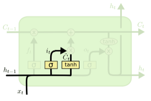

다음 단계는 앞으로 들어오는 정보 중 어떤 것을 cell에 저장할 지 정하는 부분이에요.
`input gate`라고 불리는 sigmoid가 어떤 값을 업데이트할지 정합니다.
이를 tanh를 거친 정보와 곱해 cell에 전달합니다.

$$
i_t = \sigma (W_i \cdot [h_{t-1}, x_t] + b_i)
$$
$$
\tilde{C}_t = tanh(W_C \cdot [h_{t-1}, x_t] + b_C)
$$

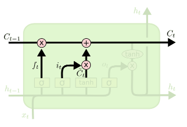

forget gate와 input gate에서 생성된 정보를 이용하여 cell state를 업데이트 할거에요.

$$
C_t = f_t * C_{t-1} + i_t * \tilde{C}_t
$$

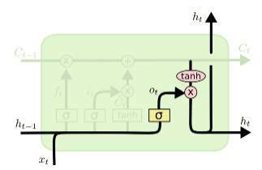

마지막으로 무엇을 output으로 보낼지 정하는 작업이 남아있어요.
`out gate`에서 $h_{t-1}$과 $x_t$를 통해 어느 정보를 cell state에서 output으로 낼 것인지 결정합니다.
cell state에 tanh를 거친 정보와 sigmoid와 곱해 결과를 만들어 내는 것이죠.

$$
o_t = \sigma (W_o [h_{t-1}, x_t] + b_o)
$$
$$
h_t = o_t * tanh(C_t)
$$

이런 방식으로 우리는 오래된 정보를 기억하는 식으로 설계할 수 있습니다.
만약 forget gate가 1이고 input gate가 0이면 오래된 정보도 영원히 남아있을 수 있죠.
하지만 너무 깊은 neural network는 항상 optimization 문제가 발생했어요.
이를 residual connection을 통해 해결하고는 합니다.

## Bidirectional and Multi-layer RNN

```
I am _____ , and I can eat half a pig.
```
만약 우리는 위와 같이 문장의 빈칸에 어울릴 단어를 찾는 문제를 해결해야 한다면 어떻게 할까요?
먼저 문장의 끝까지 보고 빈칸에 'hungry'라는 단어가 들어갈 수 있다고 생각할 것입니다.
즉, 문장의 앞 뒤 정보를 아는 것은 단어를 선택하는 것에 있어 중요한 부분이라고 할 수 있죠.
하지만 기존 RNN은 예측하고자 하는 단어 뒤에 있는 정보를 알 수 없었어요.
이러한 문제를 해결하기 위해 `Bidirectional RNN`이 등장합니다.

```
The movie was terribly exciting !
```
위 예시를 볼게요.
우리는 이 문장의 감정을 분석하려고 합니다.
중간에 terribly라는 단어가 있지만 뒤에 있는 exciting을 보면 이 단어는 긍정적으로 사용되는 것을 알 수 있어요.
그래서 뒤에 있는 exciting의 정보를 앞으로 전달할 수 있는 모델을 설계할거에요.
방법은 간단해요 2개의 레이어를 사용하는 것입니다.

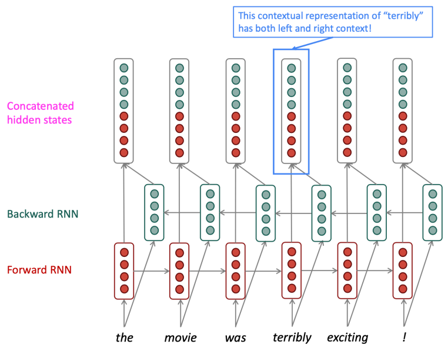

하나는 문장의 앞에서 뒤로 정보를 전달하는 레이어, 다른 하나는 뒤에서 앞으로 정보를 전달하는 레이어죠.
출력은 두 레이어의 정보를 합친 상태를 이용하여 output을 생산하는 방식이에요.

$$
\overrightarrow{h}^{(t)} = RNN_{FW}(\overrightarrow{h}^{(t-1)}, x^{(t)})
$$
$$
\overleftarrow{h}^{(t)} = RNN_{FW}(\overleftarrow{h}^{(t-1)}, x^{(t)})
$$
$$
h^{(t)} = [\overrightarrow{h}^{(t)}; \overleftarrow{h}^{(t)}]
$$

RNN은 사실 여러 state를 거치기 때문에 그 자체로도 이미 깊다고 할 수 있어요.
이를 여러 레이어를 추가한 것이 `multiple RNN`입니다.
이는 더 복잡한 문제를 해결하는 데 사용할 수 있죠.
다른 말로는 `stacked RNN`이라고도 해요.

