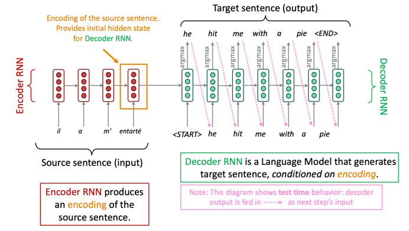
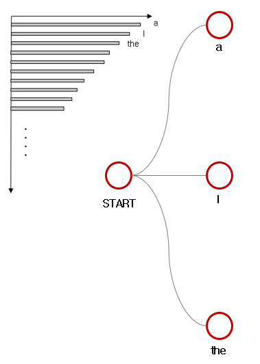
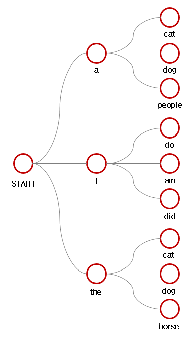
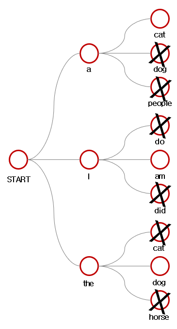

import * as Elem from '@elems';

`Machine translation`은 `source language`에서 `target language`로 번역하는 작업을 의미합니다.
고전적인 방식의 `SMT(Statistical Machine Translation)`는 데이터에 의한 확률 모델이었어요.
독립적으로 디자인된 여러 서브 컴포넌트들로 이루어졌고, 무수히 많은 feature engineering으로 구성되었어요.

# NMT(Machine Translation)

이후 인공신경망을 사용한 `NMT(Neural Machine Translation)`가 발전하기 시작했어요.
이를 `seq2seq(sequence-to-sequence)` 모델이라 부르기 시작했습니다.



위 그림과 같이 source 문장에서 feature를 추출하는 인코더와 이를 이용해 target 문장을 생성하는 디코더의 형태, 총 2개의 RNN으로 구성되어 있죠.
인코더의 마지막 레이어의 hidden state를 디코더의 첫 입력으로 넣는 구조입니다.
이처럼 입력과 출력이 시퀀스인 경우 우리는 seq2seq 모델이라고 부릅니다.
대표적으로 아래와 같은 작업들이 있지요.

* Summarization (long text -> short text)
* Dialogue (previous utterances → next utterance)
* Code generation (natural language → Python code)

seq2seq 모델은 `conditional language model`의 한 예시입니다.
디코더는 source sentence x로부터 예측하기 때문에 conditional하고,
다음 단어를 이전 단어 y로부터 예측하기 떄문에 language model이죠.

$$
P(y|x) = P(y_1|x) P(y_2|y_1,x) \cdots P(y_T|y_1, \cdots, y_{(T-1)}, x)
$$

Seq2seq 모델은 end-to-end로 학습이 가능한 하나의 최적화된 시스템인 셈입니다.
거대한 말뭉치 쌍을 이용해 학습을 진행할수도, 데이터 어그멘테이션을 통한 unsupervised 학습을 진행할수도 있죠.
즉 SMT와 비교하여 더 효과적으로 최적화를 진행할 수 있고 더 적은 사람의 개입이 필요하죠.
그러나 NMT는 해석하기 더 어렵고 그로 인해 컨트롤이 더 힘들죠.
안전성의 문제가 있습니다.

## Evaluation

`BLEU(BiLingual Evaluation Understudy)`는 기계 번역된 텍스트를 사람이 번역한 참조 번역과 비교하여 유사도를 계산합니다.
주로 n-gram 정확도를 사용하고, 너무 짧은 번역에 대해 패널티도 부과합니다.
BLEU는 유용하지만 완벽한 것은 아니에요.
번역은 여러가지 형태로 이루어질 수 있기 때문이죠.
좋은 번역이라도 참조 번역과 n-gram 뭉치가 겹치는 것이 적다면 낮은 점수를 받게 되니까요.

## Beam Search Decoding

우리는 argmax를 이용하여 target sentence를 생성해 냈어요.
이것을 `greedy decoding`이라고 하죠.
하지만 greedy decoding은 잘못된 결정을 돌이킬 수 없어요.
```
input : il a m’ entarté (he hit me with a pie)
output : he hit a ____
```

$$
P(y|x) = P(y_1|x) P(y_2|y_1, x) \cdots P(y_T|y_1, \cdots, y_{T-1}, x)
$$

이상적으로 우리는 입력 x에 대해서 확률이 최대인 출력 y를 찾고싶습니다.
그렇지만 가능한 모든 y의 조합을 구하는 것은 엄청나게 비싼 연산을 필요할거예요.
그래서 우리는 k개의 가능성이 있는 번역을 남겨두는 방식으로 진행할 것입니다.
이를 `beam search decoding`이라고 해요.
예시를 보면 이해가 쉬울거예요.



먼저 beam size $k=3$으로 출력을 생성한다고 하죠.
그럼 가장 확률이 높은 $k$개의 후보를 생성합니다.



다음으로 생성된 후보군에 대해 또 각각 $k$개의 후보를 생성합니다.
이중 모든 후보군에 대해 점수를 계산하여 가장 높은 후보 $k$개를 제외한 나머지를 후보에서 제거합니다.
이때 점수를 계산하는 방식은 아래와 같아요.

$$
\sum_{i=1}^{t} \log P_{LM} (y_i|y_1, \cdots, y_{t-1}, x)
$$



greedy decoding에서 [EOS]토큰이 나올 때까지 생성을 진행했지만 beam search decoding은 후보군마다 종료되는 시점이 다릅니다.
따라서 $k$개의 후보군이 [EOS]토큰을 생성할 때까지 진행합니다.
혹은 우리가 설정한 최대 timestep T에 도달하면 종료하도록 할 수 있구요.
최종 후보군중 가장 점수가 높은 선택지를 최종 솔루션으로 선택하게 될 거에요.
하지만 위 점수 계산 방식은 길이가 길수록 더 낮은 점수를 얻게 되어있어요.
그래서 step의 길이로 나눠주어 normalization을 한 값으로 결정을 할 것입니다.

$$
\frac{1}{t} \sum_{i=1}^{t} \log P_{LM} (y_i|y_1, \cdots, y_{t-1}, x)
$$

<Elem.ColorText color='var(--primary)'>Beam search는 항상 최적의 솔루션을 보장하는 것은 아니에요.</Elem.ColorText>
하지만 완전 탐색보다는 효율적이죠.
