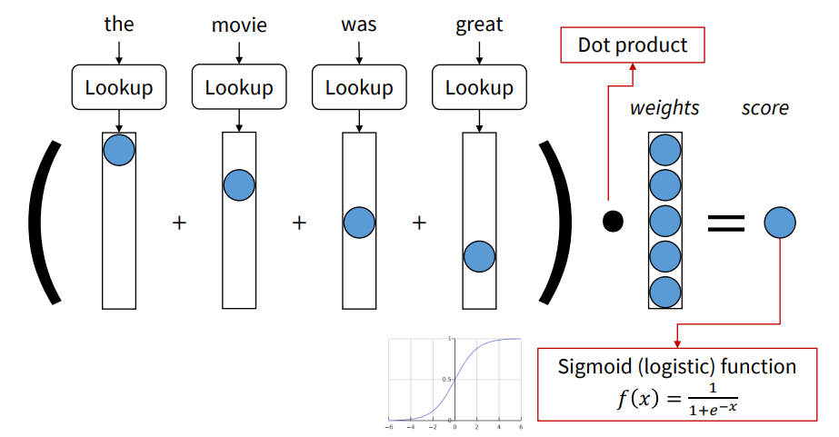
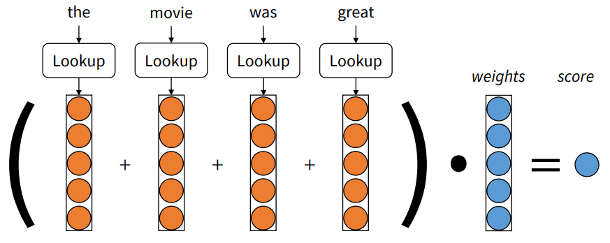
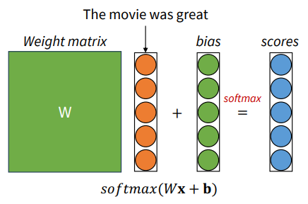
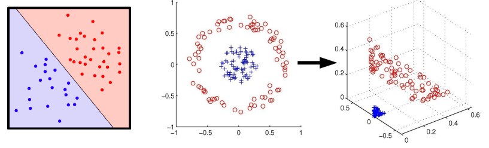
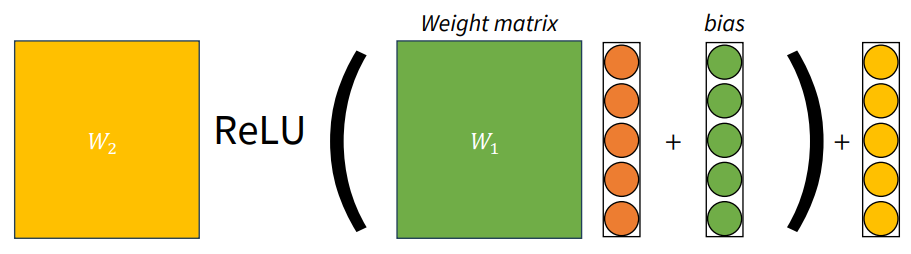

import * as Elem from '@elems';

`NER(Named entity recognition)`은 텍스트에서 개체명을 식별하고 분류하는 작업이에요.
즉, 중요한 정보(사람 이름, 조직명, 지역, 수량 등)을 추출하고 이를 특정 카테고리(사람, 조직, 위치)에 할당하는 거죠.
또 우리는 방금 받은 문자가 스팸인지 아닌지 판단할 수 있겠죠.

위 작업들이 classification 입니다.
이를 구현하기 위한 구체적인 방법을 살펴보도록 하죠.

# BOW(Bag-of-words)

```
The movie was great!
```
위와 같은 문장이 있다고 할게요.
위 단어들을 one-hot vector로 만들어 봅시다.

```
The     [1, 0, 0, 0, 0, ...]
movie   [0, ...,  1, 0, ...]
was     [0, 0, 0, 1, 0, ...]
great   [0, ..., 0, 1, 0, 0]
```

위 벡터들을 모두 더하면 아래와 같은 벡터가 되겠죠.
```
[1, 0, 0, 1, ...., 1, 1, 0, 0]
```

이를 $W$ 벡터와 연산한 결과에 sigmoid 함수를 사용해 최종 점수를 냅니다.



embedding된 단어 벡터에 대해서도 같은 방식으로 할 수 있을 거예요.



다중 클래스 분류의 경우는 어떨까요?



$$
s_i = W_i x + b_i \tag{1}
$$

$$
p(y | x) = \frac{\exp (s_y^{(i)})}{\sum_{c=1}^{C} \exp (s_c^{(i)})} = softmax(s_i) \tag{2}
$$

$W$ matrix와 앞선 방법과 같은 방식으로 구한 단어 벡터들의 합을 연산한 후 bias를 더한 결과에 softmax 함수를 이용하여 확률값을 계산합니다.
이때 가장 높은 확률을 가지는 클래스로 분류가 되는 것이죠.


가중치를 학습시키는 방법은 우리가 word vector를 학습하는 방식과 유사합니다.
softmax의 cross-entrophy를 이용하여 loss function을 구하는 거죠.

$$
J(\theta) = - \frac{1}{N} \sum_{i=1}^{N} \log p(y^{i} | x^{i}) = - \frac{1}{N} \sum_{i=1}^{N} - \log (\frac{\exp (s_y^{(i)})}{\sum_{c=1}^{C} \exp (s_c^{(i)})}) \tag{3}
$$




위와 같은 방법은 선형적으로 분리된 데이터에 대해서만 분류가 가능합니다.
조금 더 복잡한 문제의 솔루션을 얻기 위해서 더 많은 파라미터와 비선형적 함수가 필요해요.
그렇다면 우리는 인공 신경망을 사용할 수 있죠.



앞서 다루었던 모델에서 비선형함수 ReLU와 가중치를 하나 더 추가하였습니다.
이렇게 더 깊은 레이어를 통한 딥 러닝을 활용하여 더 복잡한 문제를 해결할 수 있죠.

# TF-IDF

`TF-IDF`는 문서 내 단어 중요도를 평가하는 데 사용되는 통계적 수치에요.
이 방법은 정보 검색과 텍스트 마이닝에서 널리 사용되며, 문서 내용을 요약하거나 특정 키워드의 중요도를 평가하는 데 유용합니다.
TF와 IDF는 두 가지 주요 개념으로 구성돼요.

`TF(Term Frequency)`는 특정 단어가 문서 내에서 얼마나 자주 등장하는지를 나타내는 지표에요.

$$
tf(t,d) = \frac{f_{t,d}}{\sum_{t \in d} f_{t', d}} \tag{4}
$$

여기서 $f_{t,d}$는 문서 $d$에서 단어 $t$가 나타나는 횟수에요.
수식은 어렵게 표현되었지만, 단순하게 단어의 등장 횟수를 문서 내 전체 단어 수로 나눈 것입니다.
문서 내 특정 단어의 빈도를 수치화하여 중요도를 반영하는 것이죠.

`IDF(Inverse Documnet Frequency)`는 단어가 문서 집합 전체에서 얼마나 고유한지를 나타내는 지표에요.

$$
idf(t,D) = \log \frac{N}{\begin{vmatrix} \begin{Bmatrix} d \in D: t \in d \end{Bmatrix} \end{vmatrix}} \tag{5}
$$

수식을 풀어서 이야기하면, 총 문서의 수를 단어 $t$가 등장한 문서의 수로 나눈 값의 로그를 씌운 거에요.
이는 'this', 'is'와 같은 흔하게 사용되는 단어의 중요도를 낮추는 역할을 합니다.

TD-IDF 값은 개별 단어의 TF값과 IDF값을 곱하여 계산합니다.
즉, TF-IDF = TF$\times$IDF 이죠.
이 값이 높을수록 문서 내에서 해당 단어가 중요하다고 보는 것이에요.
TD-IDF는 간단하고 효과적인 방법이지만, <Elem.ColorText color='red'>단어의 문맥이나 의미를 고려하지 않는다는 한계가 있어요</Elem.ColorText>.