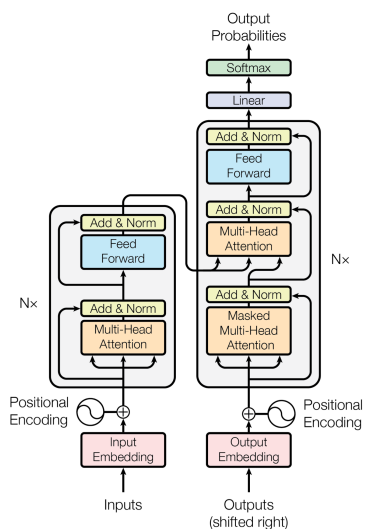
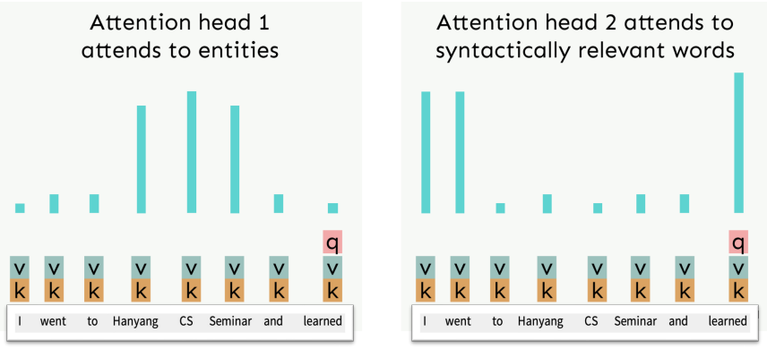
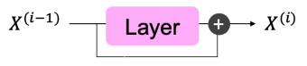

import * as Elem from '@elems';

우리는 앞서 attention mechanism에 대해 배웠습니다.
이러한 attention mechanism만을 이용하여 구성된 아키텍처가 `transformer`입니다.

# Transformer

Transforemr의 핵심은 self-attention mechanism 이에요.
이는 병렬 연산을 가능하게 하여 확장성을 높여 주었죠.

여기서 이전에 배운 attention과는 다른 multi-head attention이 존재합니다.
이는 정보를 처리할 때 한 가지 시선으로 보지 않고 여러 방면으로 처리를 하는 방법입니다.
즉 하나의 query에 대한 N가지 attention이 존재하는 것이죠.

### Sequence stacked form of attention

Query, key, value를 이용해 attention을 계산하는 과정을 다시 생각해보죠.
먼저 각 단어 $x$를 포함하는 하나의 큰 matrix $X$와 $Q, K, V$ matrix를 이용하여 query, key, value 벡터를 구합니다. 
$$
X = [x_1; \cdots; x_n] \in \mathbb{R}^{n \times d}, \quad XK \in \mathbb{R}^{n \times d}, \quad XQ \in \mathbb{R}^{n \times d}, \quad XV \in \mathbb{R}^{n \times d}
$$

이를 query와 key를 이용하여 attention score를 구한 후 softmax를 통해 구해진 attention distribution와 value를 곱해 결과를 얻어냅니다.
$$
output = softmax(XQ (XK)^T ) XV \in \mathbb{R}^{n \times d}
$$

# Multi-head attention

만약 이 연산 한번에 여러 관점으로 정보를 추출하고 싶다면 어떻게 해야 할까요?
우리는 `multiple attention heads`를 정의할거예요.
`Attention head`가 $h$이고 $1$부터 $h$까지 범위를 가지는 $l$에 대해 $Q_l, K_l, V_l \in \mathbb{R}^{d \times \frac{d}{h}}$라고 합시다.
각 attention head는 attention 연산을 각각 독립적으로 진행합니다.
$$
output_l = softmax(XQ_l (XK_l)^T ) XV_l \in \mathbb{R}^{n \times \frac{d}{h}}
$$

그리고 모든 head들에 대한 output을 합치면 최종 output이 나옵니다.
$$
output = [output_1; \cdots; output_h], \; where \; output \in \mathbb{R}^{n \times d}
$$

위와 같은 방식을 실제로는 한번의 연산으로 진행합니다.
먼저 $XQ, XK, XV \in \mathbb{R}^{n \times d}$의 상태를 $\mathbb{R}^{n \times h \times \frac{d}{h}}$의 형태로 만들어줍니다.
그 후 이를 transpose하여 $\mathbb{R}^{h \times n \times \frac{d}{h}}$로 만들고 이를 query, key 연산을 진행하면 $\mathbb{R}^{h \times n \times n}$ 형태가 됩니다.
여기서 softmax를 적용하면 각각의 head별 softmax가 진행되고 이를 $XV$와 곱해 $\mathbb{R}^{h \times n \times \frac{d}{h}}$의 형태가 됩니다.
이를 다시 $\mathbb{R}^{n \times d}$의 형태로 만들어 주면 연산은 끝이 납니다.
이처럼 한번의 연산으로 multi-head atttention 연산이 진행됩니다.

이때 dimension $d$가 클수록 dot product의 결과가 더 큰 값을 가지게 되고,
이는 softmax 함수를 거칠 때 가장 큰 값에 대해 높은 확률을 할당하여 여러 문제가 발생할 수 있어요.
그래서 우리는 softmax를 하기 전 $\sqrt{\frac{d}{h}}$로 나누어주는 `scaled dot product`를 진행할거예요.

$$
output_l = softmax(\frac{XQ_l K_l^T X^T}{\sqrt{d/h}}) XV_l
$$

# Optimization

모델의 깊이가 깊을수록 학습을 시키는 일은 쉽지 않습니다.
그래서 우리는 최적화를 위한 몇 가지 방법을 사용할 것이에요.

### Residual Connection

레이어 앞뒤로 short cut을 만들어 주는 것입니다.

### Layer normalization

기존 DNN 모델들은 feature map이 hidden layer를 지나면서 그 분포가 점점 정규분포를 벗어나는 현상이 발생하였습니다.
이로 인해 너무 큰 값을 가지게 되고 이는 여러 backpropagation 시 여러 activation function에서 기울기를 0에 수렴하도록 만드는 원인이 되었어요.
그래서 이를 해결하기 위해 feature map을 표준정규분포의 모양으로 만들어 주는 batch normalization이란 방법이 등장하였습니다.

하지만 batch normalization은 batch size에 대한 의존적인 면이 크고 특히 size가 1일 경우 분산이 0이 되어 적용이 불가능합니다.
또한 다양한 길이의 데이터를 처리하는 recurrent한 모델에서는 작동하기 어려워요.
특히 시간적인 정보를 전달하는 모델의 특성이 batch normalization으로 인해 독립적인 통계치로 정규화 되어 시간적 의존성을 무시하게 됩니다.
따라서 새로운 방법을 찾을 필요가 있었어요.

`Layer normalization`은 feature별 정규화가 아닌 레이어 내에서 hidden vector의 정규화를 진행합니다.
레어이별 정규화를 진행하기 떄문에 batch size에 대한 의존성이 존재하지 않아요.
또한 레이어별 정규화를 진행하기 떄문에 이전 단계와의 의존성이 변하지 않습니다.

<Elem.Comment>
$n \times d$ 형태의 입력 $X$ 라면 $d$ 차원에 대해 정규화를 진행
</Elem.Comment>

### Cross attention

기존 seq2seq 모델을 생각하면 인코더 마지막 레이어의 hidden state를 디코더에서 이용하여 문장을 생성하였어요.
이처럼 transformer 에서도 인코더에서 추출한 정보와 masked-multihead attention을 통해 생성된 정보를 이용하여 출력을 생산할거예요.
이때 self-attention과 비슷하지만 약간 다른 방식으로 연산을 진행할 생각입니다.
Key와 value는 인코더에서, query는 디코더에서 가져오는 방식이죠.
인코더의 hidden state $h_i$, 디코더의 hidden state $z_i$라고 한다면 $k_i = Kh_i, v_i = Vh_i, q_i = Qz_i$ 입니다.
이후 기존 self-attention과 같은 방식으로 연산을 진행하는 것이죠.

### Quadratic cost of attention

Self-attnetion의 장점은 병렬적인 연산을 수행할 수 있다는 것이에요.
하지만 큰 단점이 sequence와 dimension의 크기에 따라 연산량이 크게 증가하는 것이죠.
$O(n^2 d)$의 연산량을 가지고 있습니다.
그럼에도 좋은 성능때문에 self-attention을 쓰지 않는 모델은 거의 없을 정도에요.