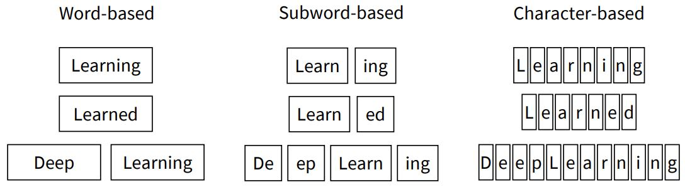
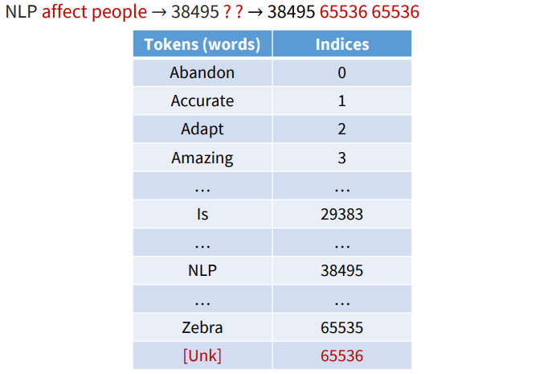
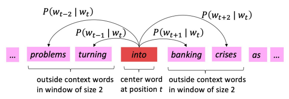
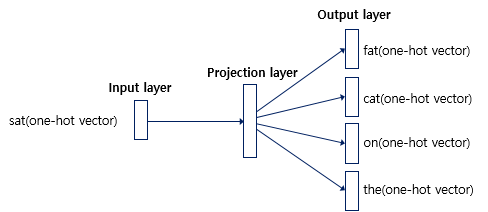
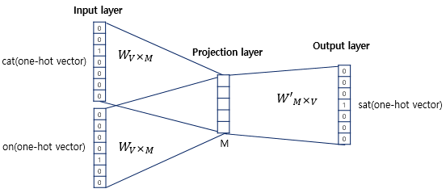
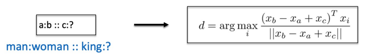
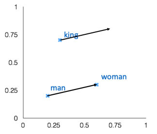
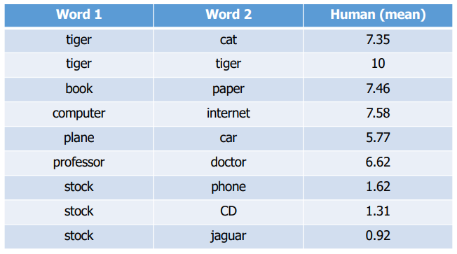

import * as Elem from '@elems';

우리는 문장을 이해하기 위해 문장을 구성하는 각각의 단어들을 봅니다.
여러 단어들의 구성을 보고 문장의 의미를 찾을 수 있는 것이죠.
그렇다면 컴퓨터는 문장을 보기 전에 어떠한 과정을 거치는지 알아볼까요?

# Tokenize

컴퓨터는 문장을 이해하기 전에 여러가지 과정을 거칩니다.
그 중 사람과 같이 문장을 단어와 같은 더 작은 단위로 쪼개는 과정이 필요하죠.
이러한 과정을 우리는 `토큰화(Tokenize)` 라고 불러요.

우리는 문장을 볼 때 각각의 단어만을 보는 것이 아닌 쉼표, 온점, 따옴표 등 여러가지 특수 문자도 함께 보고 있어요.
특수 문자에 따라 어떠한 방식으로 해석할 지 달라질 수 있기 때문이죠.
또한 모르는 단어라고 하더라도 pre-, post- 와 같은 접두사, 접미사를 통해 어느정도 예측을 할 수 있죠.
토큰 역시 마찬가지 입니다.
우리는 각 단어를 토큰으로 만드는 것이 아닌 더 작은 의미로 토큰을 생성할 수 있습니다.
토큰화를 하는 방식은 여러가지가 있기 때문에 토큰 = 단어 라는 생각을 가지면 안돼요!



* 먼저 단어 마다 토큰화를 할 수 있어요. `word-based`   
아주 직관적이지만 vocabulary의 사이즈가 커지게 되고, 새로운 단어가 생기거나 할 때 vocabulary가 변화할 가능성이 있죠.

* 또 철자를 기준으로 나눌 수 있겠죠. `character-based`  
vocabulary의 사이즈는 작고 변화할 일이 없겠지만, 그 의미를 거의 담을 수 없겠죠.

* 위 두 가지를 절충하는 방법을 사용할 수도 있어요. `subword-based`

## BPE(Byte Pair Encoding)

우리는 토큰화를 진행할 때, 단어 집합에 없는 단어가 생성되면 [Unkwon Token]을 생산하게 됩니다.
이를 `OOV (Out Of Vocabulary)` 문제라고 해요.
그래서 단어를 의미있는 단위로 나누는 작업을 진행하려고 합니다.
대표적인 subword 분리 알고리즘 BPE에 대해 알아볼게요.

```
aaabdaaabac
```
위와 같은 문장이 있다고 합시다.
가장 자주 등장하는 byte pair에 대해 치환하는 방식을 적용해볼 거예요.
aa를 Z로 바꿔서 표기해보죠.
```
ZabdZabac
Z=aa
```
그 다음으로 자주 등장하는 byte pair에 대해 치환을 한 후 또 적용해볼 거예요.
```
ZYdZYac
Z=aa
Y=ab
```
byte pair가 없어질 때 까지 계속 진행할까요?
```
XdXac
Z=aa
Y=ab
X=ZY
```
이제 더 압축할 수 있는 byte pair는 없어 보여요.
이렇게 문자쌍을 압축하는 형태로 만드는 알고리즘이 `BEP(Byte Pair Encoding)` 입니다.

이를 자연어 처리에서 활용하는 예시를 보도록 하죠.

```
# dictionary
l o w : 5,  l o w e r : 2,  n e w e s t : 6,  w i d e s t : 3

```
각 단어가 위와 같은 빈도수로 출현했다고 생각을 해 봅시다.
이를 참고하여 만든 vocab의 초기 집합은 아래와 같아요.
```
# vocabulary
l, o, w, e, r, n, s, t, i, d
```
BPE 알고리즘은 몇번 반복할지 사용자가 지정해줄 수 있습니다.
우리는 총 10번을 반복하여 subword를 만들어 낸다고 생각을 해보죠.
```
# dictionary update!
l o w : 5,
l o w e r : 2,
n e w es t : 6,
w i d es t : 3
# vocabulary update!
l, o, w, e, r, n, s, t, i, d, es
```
먼저 가장 빈도 수가 높은 e, s 를 하나로 묶어 표현을 해 줄 것입니다.
```
# dictionary update!
l o w : 5,
l o w e r : 2,
n e w est : 6,
w i d est : 3
# vocabulary update!
l, o, w, e, r, n, s, t, i, d, es, est
```
다음으로 빈도 수가 높은 es, t 를 하나로 묶어 표현합니다.
이러한 방식으로 총 10번을 반복하여 얻은 결과는 아래와 같아요.
```
# dictionary update!
l o w : 5,
l o w e r : 2,
n e w e s t : 6,
w i d e s t : 3
# vocabulary update!
l, o, w, e, r, n, s, t, i, d, es, est, lo, low, ne, new, newest, wi, wid, widest
```

이제 우리는 <Elem.ColorText color='blue'>`lowest`</Elem.ColorText>라는 단어를 <Elem.ColorText color='blue'>`low`</Elem.ColorText>와 <Elem.ColorText color='blue'>`est`</Elem.ColorText>의 형태로 인코딩할 수 있게 되었어요.

## Text Preprocessing

우리는 위와 같은 토큰화 과정 이외에도 여러가지 전처리 과정이 필요합니다.
예를 들면 아래와 같은 종류가 있겟네요.

* Normalization  
'USA', 'United States', 'United States of America' 이 셋 모두 미국을 가리키는 단어에요.
동일한 의미를 가지는 여러 단어를 굳이 vocabulary로 가질 필요는 없죠.
그래서 전부 'USA'와 같은 하나의 포맷으로 통일하는 것입니다!

* Lemmatization  
위와 비슷하게 의미는 같지만 다른 형태로 존재하는 것들을 하나로 통일하는 것입니다.
예를 들어 볼게요.
'am', 'are', 'is' 모두 동일한 의미 'be'의 형태로 변경해도 될 것 같아요.
<Elem.ColorText color='red'>`그런데 이게 문법이 중요한 task와 같은 작업의 형태에 따라 결정해야 할 사항 같다.`</Elem.ColorText>

* Case folding  
'NLP', 'nlp', 'Nlp' 와 같은 모두 같은 자연어 처리를 의미하지만 대소문자 차이 뿐이죠.
이런 경우에는 역시 'NLP'로 전부 대소문자 변경을 시켜줍니다.

* Stopwords(removal)  
제거되어도 의미에 큰 변화가 없는 단어들을 걸러주는 것입니다.
예를 들면 'a', 'the', 'is', 'in'과 같은 자주 등장하지만 의미가 거의 없는 단어들이죠.

위 작업들을 통해 어느정도 전처리가 완료된 토큰들에 대해서 번호를 매겨주는 작업을 진행합니다.
또 vocabulary에 없는 토큰에 대해서는 [Unkwon Token] 처리 역시 해주죠.



# Word Vector

이제 컴퓨터가 각 단어를 벡터의 형식으로 바꾸어 비슷한 의미를 가진 단어는 서로 가까운 위치에 있도록 만드는 인코딩할 생각입니다.
> 두 단어의 similarity는 euclidean distance보다 cosine similarity를 이용하여 구한다고 합니다!

## One-hot Vectors (sparse representation)

전통적인 NLP 분야에서 각 단어를 불연속적인 심볼로 다루는 `one-hot vectors`를 사용하였어요.
이 방식은 총 vocabulary의 크기만큼 벡터 차원이 존재하고, 의미에 해당하는 차원만 1이 되는 형식입니다.
```
motel=[0 0 0 0 0 0 1 0 0 0]
hotel=[1 0 0 0 0 0 0 0 0 0]
```
위와 같이 총 10개의 단어 vocabulary가 존재하고 motel의 index가 7번, hotel의 index가 1번인 상태일 때 각 단어에 해당하는 벡터 차원만 1로 만들어주는 방식이죠.
두 벡터는 서로 수직인 상태이고 어떠한 의미적 비슷함도 관찰할 수 없어요.
이를 해결하기 위해 단어의 유사성을 임베딩하는 방식을 생각하였습니다.


## Word2Vec (disrtibuted representation)

우리는 one-hot vectors 방식의 문제점을 해결하기 위해 단어의 의미를 여러 차원에 분산하여 표현하는 형식을 사용할 거예요.
```
motel=[0.2 0.3 0.1 0.7 0.4]
hotel=[0.1 0.5 0.1 0.7 0.1]
```

우리의 목적은 비슷한 의미를 지닌 단어의 벡터들끼리 서로 가깝게 만드는 것이에요.
그렇기에 각 차원에 대한 값을 어떻게 지정하는지 고민할 필요가 있어요.

> A word’s meaning is given by the words that frequently appear close by.

단어의 의미는 꽤 자주 근처 단어들에 의해 결정됩니다.
이를 활용해서 주변 단어들과 의미가 비슷해지도록 임베딩하는 파라미터를 학습하는 방법을 봅시다!

## Skip-Gram
Word2Vec의 학습 방식은 CBOW와 Skip-Gram 두 가지 방식이 있어요.
`Skip-Gram`은 중심 단어를 기준으로 주변 단어들을 예측하는 방법이에요.
즉, 중심 단어`(center word)`에 대해서 좌우로 n개의 단어를, 총 2n개의 주변 단어`(context word)`를 예측하는 것이죠.



위와 같은 문장이 있다고 합시다.
우리는 중심 단어 <Elem.ColorText color='blue'>`into`</Elem.ColorText>가 나왔을 때, 주변 단어의 확률을 구할 거예요.
단어를 $w$, 중심 단어를 $c$, 주변 단어를 $o$, vocabulary를 $V$, 중심 단어 벡터를 $v_c$, 단어 벡터를 $u$ 라고 할게요.
이때 우리가 구해야 하는 loss function을 아래와 같이 정의할 수 있어요.

$$
J(\theta) = \frac{1}{T} \sum_{t=1}^{T} \sum_{-m \leq j \leq m, j \ne 0} \log P(w_{t+j} | w_t; \theta) \tag{1}
$$
$$
P(w_{t+j} | w_t; \theta) = P(o | c) = \frac{\exp(u_o^T v_c)}{{\sum}_{w \in V} \exp(u_w^T v_c)} \tag{2}
$$

식 (2)와 같이 중심 단어 $w_t$가 나왔을 때 주변 단어 $w_{t+j}$가 나올 확률은 $w_t$가 나왔을 때 모든 단어가 나올 확률의 softmax 값을 한 것이라고 할 수 있어요.
그리고 loss function은 식 (1)과 같이 문장의 모든 단어에 대해 각각 중심 단어와 주변 단어 s의 확률값을 cross entrophy한 값의 합이라고 할 수 있죠.
이를 gradient descent를 사용하여 업데이트를 진행합니다.
그런데 $J(\theta)$를 구하기 위해 모든 vocabulary에 대해 모든 window를 계산해야 하는데, 이는 한번의 업데이트를 위해 오랜 시간을 기다려야 하는 만만치 않은 비용을 가지죠.

이를 보완하기 위해 `SGD(Stochastic Gradient Descent)`를 사용할 수 있습니다.
몇몇 window를 샘플링하여 업데이트를 진행하는 방식이죠.

$$
\frac{\partial}{\partial v_c} \log P(o | c) = u_o - \sum_{x=1}^{V} P(x | c) u_x \tag{3}
$$

> 자세한 풀이는 생략할게요. 직접 미분해보면 쉽게 위 값을 얻을 수 있어요.

여기서 $\sum_{x=1}^{V} P(x | c) u_x$는 중심 단어에 대한 주변 단어들의 가중 평균이네요.
이는 물론 $v_c$에 대한 미분값이기 때문에 $u_o$에 대해서도 진행해야 겠죠.
이러한 방식으로 optimization을 진행할 수 있어요.

여기서 조금 더 연산을 줄이기 위해 `negative sampling`을 사용할 수 있습니다.
우리는 softmax를 통해 모든 vocabulary에 대한 연산을 하는 행위는 높은 비용을 가지고 있어요.
이를 조금 더 완화하기 위해 우리는 중심 단어와 주변 단어, 상관 없는 단어의 조합으로 구성합니다.
그리고 중심 단어와 주변 단어의 sigmoid가 1이 되도록, 상관 없는 단어는 0이 되도록 학습을 진행하여 비용을 더 줄일 수 있어요.

위 방법을 조금 더 간단하게 one-hot vector를 이용하여 구현하는 방식을 볼까요?
위와 동일한 center word와 context words의 one-hot vector를 구해줍시다.
여기서 vocabulary의 크기는 총 10개라고 가정할게요.
```
problems    [0 0 1 0 0 0 0 0 0 0]
turning     [0 0 0 1 0 0 0 0 0 0]
into        [0 0 0 0 1 0 0 0 0 0]
banking     [0 0 0 0 0 1 0 0 0 0]
cises       [0 0 0 0 0 0 1 0 0 0]
```

중심 단어의 one-hot vector와 $W_{V \times M}$과 연산으로 projection layer를,
projection layer와 $W'_{M \times V}$의 연산을 통해 output layer를 만들어 냅니다.
여기서 $V$는 vocabulary의 크기, $M$은 임베딩 차원의 크기를 뜻해요.
이때 최종 결과 output layer의 softmax 값이 각 주변 단어들의 one-hot vector가 되도록 $W$와 $W'$을 학습시키는 것입니다.
이를 cross entrophy 함수를 통해 loss 를 계산하고 gradient descent를 진행하며 학습을 시키는 것이죠!

학습이 완료되면 $W$를 이용하여 각 단어들을 임베딩 벡터로 사용하거나, $W$와 $W'$ 모두를 가지고 임베딩 벡터를 사용하기도 합니다.

앞선 방식은 동일한 단어도 중심 단어일때 벡터 $v$, 주변 단어일때 벡터 $u$로 서로 다른 값을 가지고 연산을 진행했습니다.
두 개의 벡터를 이용하는 것이 optimization이 더 쉽다고 합니다.
<Elem.ColorText color='red'>`자세한 내용은 조금 찾아봐야 할 것 같아요.`</Elem.ColorText>

## CBOW(Continuous Bag of Words)

Skip-Gram에서는 중심 단어를 통해 주변 단어를 예측했다면, `CBOW`은 주변 단어를 통해 중심 단어를 예측합니다.



Skip-Gram과는 다르게 CBOW에서는 주변 단어들의 one-hot vectors와 $W_{V \times M}$과 연산을 통해 합의 평균을 projection layer로,
projection layer와 $W'_{M \times V}$의 연산을 통해 output layer로 예측 결과를 만들어 냅니다.


## Evaluation

학습된 word embedding 모델에 대해 성능을 평가하는 방법을 봅시다.
평가는 크게 외적 평가`(Extrinsic Evaluation)`와 내적 평가`(Intrinsic Evaluation)`으로 나뉩니다.

### Intrinsic Evalution

단어 벡터 자체의 특성을 직접적으로 평가합니다.
즉, 단어 벡터가 얼마나 잘 형성되었는지, 그 자체의 품질을 측정하는 데 중점을 두는 거예요.

* 속도: 일반적으로 실행 속도가 빠르고, 계산이 간단해요.  
* 단순성: 단어 간의 유사성, 단어 관계 테스트 등 구체적이고 간단한 테스트를 사용해요.
* 직접성: 벡터의 품질을 직접적으로 평가하기 때문에 신속하게 문제를 파악할 수 있어요.
* <Elem.ColorText color='red'>제한성: 실제 성능과는 직접적 연관이 없을 수 있어, 실용적인 평가가 어려울 수 있어요.</Elem.ColorText>

#### Word vector analogies




위 그림과 같이 a와 b의 관계 벡터를 이용하여 c와 동일한 관계를 이루는 d를 찾는 방식이에요.
벡터 공간의 선형 관계를 통해 구하는 것이죠.

<Elem.ColorText color='red'>하지만 모든 언어적 관계가 선형적인 것은 아니에요.</Elem.ColorText>
언어는 더 복잡하고, 추상적이며, 비선형적 관계가 존재하죠.
이러한 비선형 관계를 선형 모델로 해석하려 하면 **정확도 저하**, **복잡한 관게 무시**, **일반화 문제**등이 생길 수 있어요.

#### Methodology

단어 벡터 간 거리와 상관관계를 사람의 판단으로 측적하는 거예요.



### Extrinsic Evaluation

단어 벡터를 실제 작업에 적용했을 때의 성능을 평가합니다. 
즉, 단어 벡터가 특정 어플리케이션에 얼마나 유용한지를 측정하는데 중점을 두는 것이죠.

* 실용성: 실제 어플리케이션과 연관이 있어, 실용적인 가치를 평가할 수 있어요.  
* 시간 소모: 평가에 상대적으로 많은 시간과 자원이 필요해요.  
* <Elem.ColorText color='red'>간접성: 단어 벡터의 품질 뿐 아니라, 작업의 특성과 다른 요소에도 영향을 받을 수 있어요.</Elem.ColorText>

