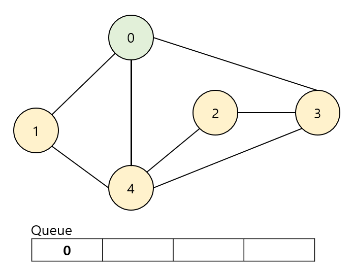
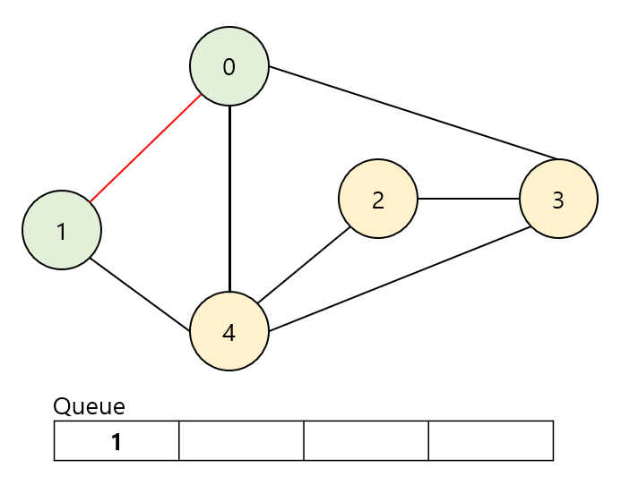
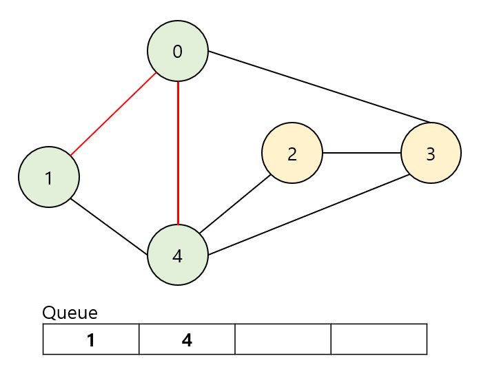
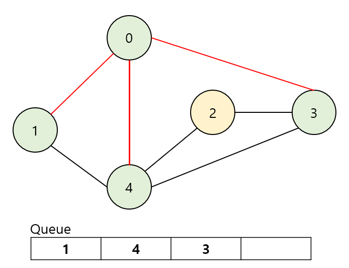
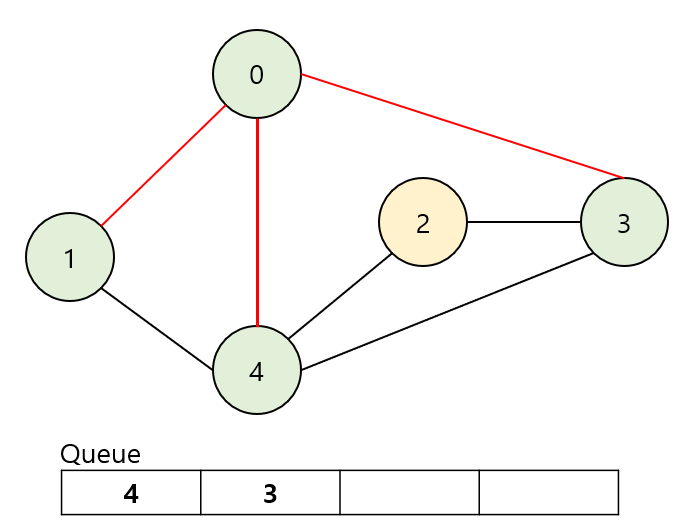
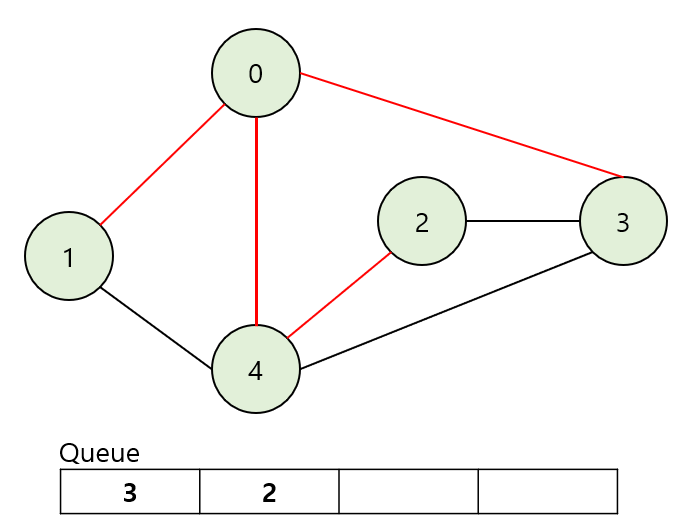
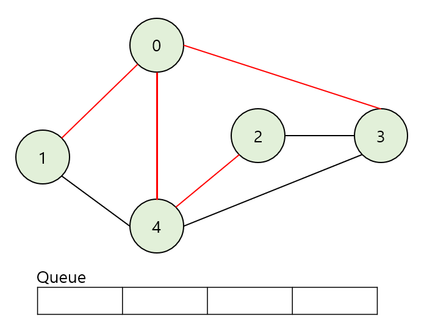

import * as Elem from '@elems';
import dfs_bfs from './dfs_bfs.gif';

하나의 정점으로 시작하여 다른 정점들을 한 번씩 방문하는 그래프 탐색의 일종이에요.
경로가 연결되어 있는지 없는지 확인할 수 있고, 모든 경로가 동일한 가중치를 가진다는 조건하에 최단 경로 역시 구할 수 있어요.
DFS (Depth First Search)와 비교되는 알고리즘 입니다.

<Elem.Image src={dfs_bfs}/>

위 그림에서 볼 수 있듯, 연결된 노드들에 대한 탐색을 먼저 진행하는 방식이에요.
그래프와 queue를 이용하여 구현하는 순서를 보도록 하죠.

# BFS 순서

우리는 아래 그림과 같은 형태의 그래프를 가지고 있다고 해 볼게요.

루트 노드의 값을 queue에 넣고 방문했다는 표시를 해줍니다.

이제 queue에서 노드를 제거하고 해당 노드와 연결된 노드에 대해 조사를 진행합니다.
가장 먼저 연결된 1번 노드에 대해 방문 완료 표시를 하고 queue에 값을 넣어줍니다.

이번엔 4번 노드에 대해 방문 완료 표시를 하고 queue에 값을 넣어줍니다.

마지막으로 3번 노드에 대해 방문 완료 표시를 하고 queue에 값을 넣어줍니다.
이제 우리는 0번 노드와 연결된 모든 노드에 대한 방문을 완료하였습니다.

더 이상 연결된 노드가 없으니 queue에서 가장 앞에 있는 노드를 제거하고 해당 노드와 연결된 노드들에 대해 조사를 진행합니다.
하지만 1번 노드와 연결된 0번 4번 노드는 이미 방문한 상태이므로 추가적인 연결이 발생하지 않습니다.

우리는 queue에서 가장 앞에 있는 4번 노드의 연결에 대해 조사합니다.
4번 노드는 아직 방문하지 않은 2번 노드에 대해 방문 완료 표시를 하고 queue에 값을 넣어줍니다.

queue에서 가장 앞에 있는 3번 노드의 연결에 대해 조사합니다.
하지만 더 이상 방문 가능한 노드가 없으므로 상태는 변화하지 않습니다.

queue에서 가장 앞에 있는 2번 노드의 연결에 대해 조사합니다.
하지만 더 이상 방문 가능한 노드가 없으므로 상태는 변화하지 않습니다.

이처럼 연결된 노드들에 대해 먼저 조사를 한 후 다음 하위 노드들을 조사하는 형태로 구현할 수 있습니다.
BFS를 구현하기 위해서는 방문한 노드에 대해 표시를 해주어야 무한 루프에 빠지지 않을 수 있습니다.