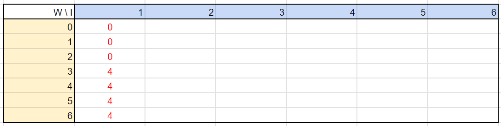
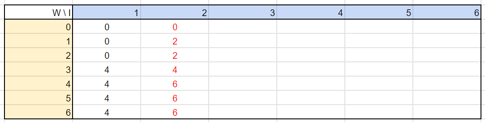
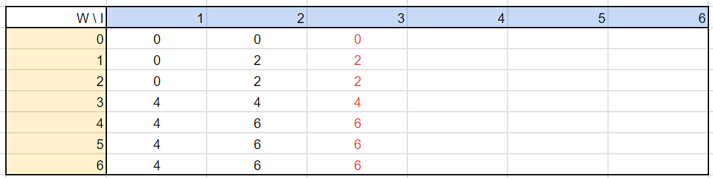
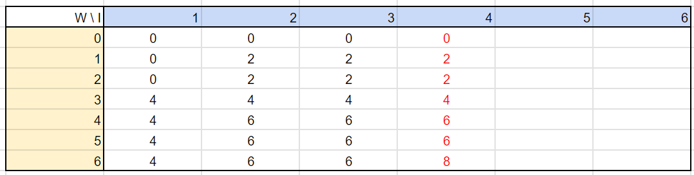
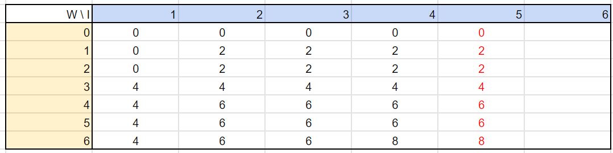
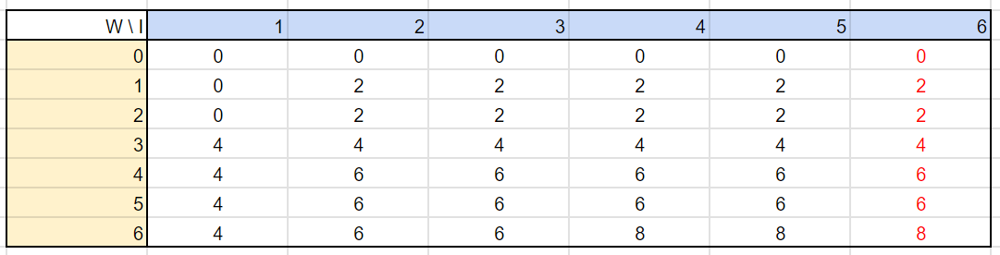

`동적 계획법 DP(Dynamic Programming)`은 하나의 큰 문제를 여러 개의 작은 문제로 나누어서 그 결과를 저장하여 다시 큰 문제를 해결할 때 사용하는 일종의 문제 해결법으로 볼 수 있습니다.
즉 작은 문제로 쪼개서 답을 저장해두고 이를 재활용하는 기억하며 풀기 방법이라 할 수 있죠.
일반적인 재귀를 사용하면 동일한 문제가 반복 계산되는데, 이를 효율적으로 활용할 수 있어요.

DP가 적용되기 위해서 2가지 조건을 만족해야 합니다.
* Overlapping Subproblems  
DP는 기본적으로 큰 문제를 작은 문제들로 나누고 값을 재활용하여 문제를 해결합니다.
따라서 동일한 작은 문제들이 반복하여 나타나야 이를 활용할 수 있는 것이죠.

* Optimal Substructure  
작은 문제의 최적 결과 값을 활용하여 전체 문제의 최적 결과를 나타낼 수 있어야 합니다.


# Knapsack


위 그림과 같이 최대 적재량이 존재하는 배낭과 각각 무게와 가치를 가지는 아이템이 존재합니다.
이때 배낭에 들어가는 아이템 가치의 합이 가장 높을 때 값은?

이는 배낭의 최대 용량이 $w$일 때, $i$번째 아이템까지 넣었을 때 최대 가치를 계산하는 방법으로 구현할 수 있다.
위 문제에서 표를 만들어 본다면 아래와 같이 표현할 수 있다.



첫 번째 아이템을 넣기 위해 $3kg$ 이상의 공간이 필요합니다.
따라서 $w$가 3이하에서 0의 가치를, $w$가 3이상에서 4의 가치를 가지게 되죠.
$$
[0:2, 1] = 0, [3:6, 1] = 4
$$



두 번째 아이템을 넣는 경우를 생각해봅시다.
$w$가 1, 2일 때 아무 아이템도 들어가지 않았던 첫 번째 순서에 비해 무게가 1인 두 번째 아이템에 경우에는 가방에 들어갈 수 있겠죠.
$$
[1:2, 2] = 1 \tag{1}
$$

그러나 $w$가 3일 때 첫 번째 아이템이 들어가있는 경우의 가치가 첫 번째 아이템을 빼고 두 번째 아이템을 넣는 경우보다 더 높습니다.
따라서 이 경우에는 두 번째 아이템을 넣지 않는 것이죠.
$$
[3, 2] = 4 \tag{2}
$$

$w$가 4이상인 경우, 기존에 들어간 첫 번째 아이템에 추가로 두 번째 아이템을 넣을 수 있습니다.
$$
[4:6, 2] = 6 \tag{3}
$$

위 세 가지 경우를 조금 일반화 해볼게요.
위 식 모두는 동일 용량의 직전 아이템까지 넣었을 때 가치와, 새로 들어오는 아이템의 용량만큼 비운 후 새로운 아이템의 가치를 더한 값을 비교해서
더 큰 값을 취한다는 전략을 사용할 수 있을 것입니다.
$$
[1:2, 2] = \max ([1:2, 1], [1-1:2-1, 2] + 2) \tag{1'}
$$
$$
[3, 2] = \max ([3, 1], [3-1, 2] + 2) \tag{2'}
$$
$$
[4:6, 2] = \max ([4:6, 1], [4-1:6-1, 2] + 2) \tag{3'}
$$

이를 모든 항에 적용할 수 있도록 일반화한다면
$$
[w, i] = \max ([w, i-1], [w-{item \ weight}, i-1] + {item \ value})
$$

이 식을 이용하여 모든 표를 작성하면 아래와 같은 순서로 완성시킬 수 있겠습니다.






이를 코드로 구현해볼게요.

```python
bag = 6
items = [[4, 3], [2, 1], [5, 6], [6, 5], [1, 2], [3, 3]]

values = [0]
weights = [0]
for item in items:
    values.append(item[0])
    weights.append(item[1])

import numpy as np
num_items = len(values)
val_map = np.zeros((bag + 1, num_items))
val_map
```
```
array([[0., 0., 0., 0., 0., 0., 0.],
       [0., 0., 0., 0., 0., 0., 0.],
       [0., 0., 0., 0., 0., 0., 0.],
       [0., 0., 0., 0., 0., 0., 0.],
       [0., 0., 0., 0., 0., 0., 0.],
       [0., 0., 0., 0., 0., 0., 0.],
       [0., 0., 0., 0., 0., 0., 0.]])
```

```python
for i in range(1, num_items):
    value = values[i]
    weight = weights[i]
    
    for w in range(1, bag+1):
        if w < weight:
            val_map[w, i] = val_map[w, i-1]
            continue
        
        if w == 0:
            val_map[w, i] = max(val_map[w, i-1], value)
        else:
            val_map[w, i] = max(val_map[w, i-1], value + val_map[w - weight, i-1])
            
val_map
```
```
array([[0., 0., 0., 0., 0., 0., 0.],
       [0., 0., 2., 2., 2., 2., 2.],
       [0., 0., 2., 2., 2., 2., 2.],
       [0., 4., 4., 4., 4., 4., 4.],
       [0., 4., 6., 6., 6., 6., 6.],
       [0., 4., 6., 6., 6., 6., 6.],
       [0., 4., 6., 6., 8., 8., 8.]])
```

# 동전 교환

1, 3, 4원짜리 동전이 있을 때, $x$원을 최소한의 동전으로 교환하는 문제

이는 Greedy Algorithm으로 해결한다면 4, 1, 1로 3개의 동전이 필요합니다.
하지만 3, 3으로 2개의 동전만으로도 교환할 수 있죠.
이를 DP로 구현해봅시다.

$f(x)$는 $x$를 교환 가능한 최소한의 동전 수 라고 할 때, 먼저 1, 2, 3, 4에 대해 최적의 방법을 구합니다.
```
f(1) = 1
f(2) = 2
f(3) = 1
f(4) = 1
```

이후 $x$를 1씩 원하는 금액에 이를 때까지 증가시킵니다.
이때 이전에 계산한 결과를 이용하는 방식이죠.
```
f(5) = min(f(5-1)+1, f(5-2)+1, f(5-4)+1)
f(6) = min(f(6-1)+1, f(6-2)+1, f(6-4)+2)
```

이렇게 DP를 이용하여 동전 교환 문제를 해결할 수 있습니다.

```python
coins = {1, 5, 10, 20}
target = 72

results = [0 for _ in range(target)]
units = {}
for coin in coins:
    results[coin-1] = 1
    units[coin] = True

for i in range(1, target):
    if results[i] > 0:
        continue

    min_result = 1e8
    best = 0
    for coin in coins:
        if i+1-coin < 0:
            continue
        result = results[i-coin]
        if min_result > result:
            min_result = result
            best = coin
            
    results[i] = min_result + 1

results[-1] # 6
```

