우리는 카메라를 이용해서 3차원 세상을 2차원의 이미지로 만들 수 있어요.
이때 3차원의 어떠한 부분이 이미지의 어디에 맵핑되는지는 카메라의 위치와 방향에 따라 결정되죠.
기하학적 위치뿐만 아니라 사용하는 렌즈의 굴절에 의한 부분에서도 영향을 받을 것입니다.
즉 여러가지 파라미터를 이용해서 3차원 공간과 이미지 사이 관계를 알아내는 것을 `camera calibration`이라고 합니다.

# Homogeneous coordinates

보통 어떤 벡터를 transformation 할 때, transformation matrix를 곱해서 변환해줍니다.
그런데 벡터라는 것은 크기와 방향만을 가지기에 벡터 자체만으로 위치를 알 수 없죠.
즉 transformation matrix만을 가지고 얼마나 이동하는지는 알지만 어디로 이동하는지는 모르는 것이에요.
이를 변환 + 이동을 한번에 적용할 수 있는 `Affine Transformation`을 이용하여 한번의 곱으로 해결할 수 있습니다.

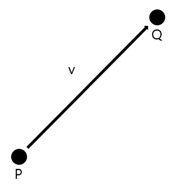

위 그림에서 벡터 $v$는 아래와 같은 식으로 표현할 수 있어요.

$$
v = P - Q \tag{1}
$$
$$
P = Q + v \tag{2}
$$

벡터와 포인트를 더하면 포인트가 되는 것을 알 수 있죠.
이처럼 단순히 벡터만 존재하는 벡터 공간에서 포인트를 통한 위치 정보를 추가하면 목적지를 정확하게 알 수 있어요.
이를 `Affine Space`라고 합니다. 

$$
y = Ax \tag{3}
$$
$$
y = Ax + b \tag{4}
$$

식 (3)은 linear transformation이고 식 (4)는 변환과 이동을 하는 affine transformation 입니다.
그런데 여기서 식 (4)를 식 (3)과 같이 한번의 연산으로 표현할 수 없을까요?
다시 말해, 포인트의 transformation과 벡터의 transformation을 한번에 표현하는 transformation matrix를 찾을 수 있을까요?
Homogeneous coordinates를 이용하면 됩니다!

`Homogeneous coordinates`는 $n$차원 사영공간(Projective space)을 $n+1$개의 좌표로 나타내는 좌표계 입니다.
일반적으로 우리가 사용하는 데카르트 좌표계(Cartesian coordinates) 보다 한 단계 위의 차수의 형태로 만드는 것을 의미하죠.
식 (2)에서 사용된 v와 P를 변환하는 예시를 보면 이해가 빠를 거예요.

$$
v = \begin{bmatrix} v_x \\ v_y \\ 0 \\ \end{bmatrix} \qquad P = \begin{bmatrix} p_x \\ p_y \\ 1 \\ \end{bmatrix} \tag{5}
$$

v와 같은 벡터의 경우에는 추가된 차원에 0을, P와 같은 좌표는 추가된 차원에 1을 사용합니다.
흠 이게 뭔지, 어디에 쓰는건지 잘 모르겠지요?
식 (4)를 homogeneous coordinates를 이용해서 식 (3)의 형태로 만들어 볼게요.
여기서 $A$는 2배로 scaling 하는 transformation matrix라고 합시다.

$$
y = \begin{bmatrix} 2 & 0  \\ 0 & 2  \\ \end{bmatrix} \begin{bmatrix} x_1 \\ x_2 \\ \end{bmatrix} + \begin{bmatrix} b_1 \\ b_2 \\ \end{bmatrix} \tag{6}
$$

위 식을 homogeneous coordinates를 통해 아래와 같이 표현할 수 있어요.

$$
y = \begin{bmatrix} 2 & 0 & b_1  \\ 0 & 2 & b_2 \\ 0 & 0 & 1  \\ \end{bmatrix} \begin{bmatrix} x_1 \\ x_2 \\ 1 \\ \end{bmatrix} \tag{7}
$$

이처럼 homogeneous coordinates를 사용하면 한 번의 연산으로 affine transformation을 수행할 수 있답니다.


사실 cartesian coordinates인 ${\begin{bmatrix} x, y \end{bmatrix}}^T$를 homogeneous coordinates로 변환할 때 
$(w \neq 0)$인 값에 대해서 ${\begin{bmatrix} x, y, w \end{bmatrix}}^T$ 의 형태로 표현할 수 있어요.
하나의 포인트에서 무수히 많은 homogeneous coordinate를 만들 수 있다는 소리죠.
이게 무슨 뜻일까요?

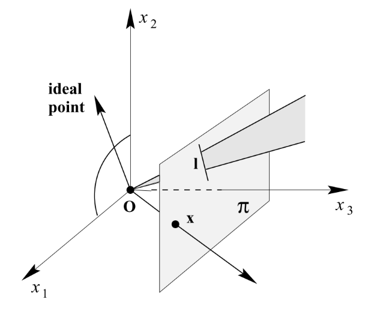

위 그림에서 원점의 위치에 카메라가 있고 평면의 범위를 이미지로 촬영한다고 가정해 보겠습니다.
실제 원점과 점 x를 지나는 벡터위의 모든 물체는 이미지의 점 x 위치로 투영된다는 것을 알 수 있죠.
그렇기에 homogeneous coordinates로 변환할 때 무수히 많은 좌표를 형성할 수 있는 것이죠.
이때 homogeneous coordinate를 cartesian coordinate로 변환하기 위해서는 w를 1로 만드는 값을 곱해주면 됩니다.
$p = {\begin{bmatrix} x/w, y/w, 1 \end{bmatrix}}^T$ 

> 사실 추가된 차원 w가 0이 되는 것은 catesian coordinates로 변환하면 $(\infty,  \infty)$이 됩니다.
즉 무한대에서 오는 방향을 나타내며, 위치 대신 방향성을 갖는다고 할 수 있어요.
그래서 벡터라고 나타내는 것이죠.

오늘은 camera calibration에 관련한 내용을 다룰 것이니 여기까지 하고 조금 더 자세한 내용은 다음에 해보자구요.

# Camera calibration

현실 세계의 물체를 이미지로 변환하기 위해 world coordinates에서 camera coordinates와 image coordinates로 변환하는 과정이 필요해요.
아래 사진을 봅시다.

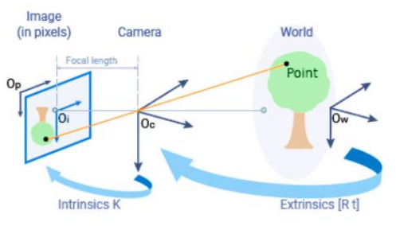

실제 세계의 물체를 카메라의 위치와 방향에 따라 world coordinates 에서 camera coordinates로 변환하는 과정을 `Exrinsic calibration`,
카메라 렌즈와 센서의 특성을 포함하여 카메라가 이미지를 어떻게 형성하는지 나타내는 `Intrinsic calibration` 이라고 해요.

## Intrinsic calibration

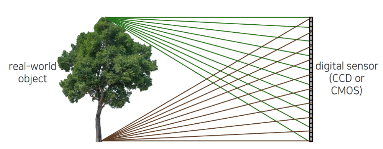

기존에 물체를 통해 반사된 빛을 벽에 투영한다면, 한 지점에 들어온 빛은 물체의 여러 부분에서 반사된 빛이 모인 것예요.
즉 위 그림과 같이 여러 빛이 중첩된 상태이기 때문에 하나의 픽셀 값을 결정하지 못하는 상태랍니다.

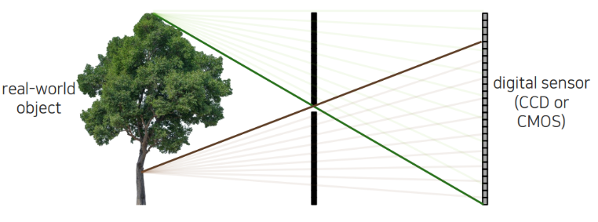

그렇다면 물체에서 반사된 단 하나의 빛만이 투영되도록 중간에 구멍을 뚫어 보면 어떨까요?
한 지점에는 단 하나의 빛만 들어오기 때문에 우리는 픽셀 값을 결정할 수 있게 됩니다.
이를 이용한 방식이 바로 `pinhole camera`예요.
pinhole camera는 벽`barrier`사이 작은 구멍`pinhole (aperture)`을 뚫고 이 원점`camera center`을 통해 하나의 빛만 들어오도록 하여 `image plane`에 도달하도록 만든 것입니다.

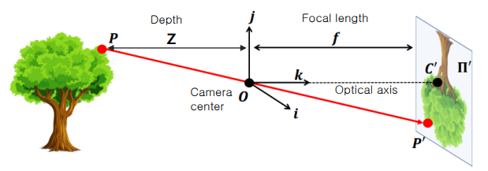

하지만 실제로 맺히는 상은 거꾸로 뒤집히고 거리에 따라서 적절하게 크기가 변화된 형태일 거예요.
이를 고려해서 위 그림에서 점 $P(x, y, z)$에 대해 image plane에 맺히는 점 $P'$를 구하는 방법을 봅시다.
점 $P$ 에서 camera center $O$를 지나는 $y$ 성분 기울기는 $-\frac{y}{z}$ 입니다.
기울기와 focal length $f$를 이용하면 $P`$의 $y$ 성분은 $-f\frac{y}{z}$ 라는 것을 알 수있죠.
하지만 image plane은 180도 뒤집힌 상태에요.
즉 이를 다시 180도 돌리면 $P'$의 $y$ 성분은 $f\frac{y}{z}$가 되네요.
동일하게 $x$ 성분에도 적용하면 최종적으로 $P'(f\frac{x}{z}, f\frac{y}{z})$가 되는 것을 알 수 있습니다.

$$
P = \begin{bmatrix} x \\ y \\ z\end{bmatrix} \rightarrow  P' = \begin{bmatrix} f\frac{x}{z} \\ f\frac{y}{z} \end{bmatrix} \tag{8}
$$

이를 homogeneous coordinates를 활용하여 구해볼가요?

$$
K = \begin{bmatrix} f & 0 & 0 \\ 0 & f & 0 \\ 0 & 0 & 1 \\ \end{bmatrix} \qquad
P' = KP = \begin{bmatrix} fx \\ fy \\ z \end{bmatrix} = \begin{bmatrix} f\frac{x}{z} \\ f\frac{y}{z} \\ 1 \end{bmatrix} \tag{9}
$$

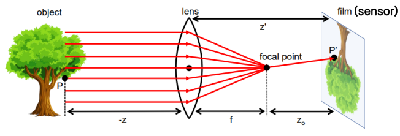

그렇다면 대부분의 카메라를 구성하는 렌즈를 이용한 촬영은 어떨까요?
```
이 부분 이해가 좀 안가니까 다시 확인하자잉
```


우리는 위에서 intrinsic matrix $K$를 구했습니다.
하지만 실제 카메라에 적용하기 위해서는 추가적인 파라미터가 필요해요.
그 전에 먼저 초점 거리 `focal length`에 대해 먼저 설명하고 가볼게요.

픽셀은 이미지 센서의 셀에 대응되기 때문에 카메라의 초점 거리 $f$는 이미지 센서의 셀 크기에 대한 상대적인 값으로 표현됩니다.
예를 들어, 이미지 센서의 셀 크기가 0.1mm이고 카메라의 초점 거리가 500픽셀이라 하면 카메라 중심에서 이미지 센서까지 거리는 이미지 센서 셀 크기의 500배 즉 50mm라는 뜻이에요.
그런데 실제 카메라의 초점 거리는 $x, y$ 성분이 다를 수 있어요.
즉 셀의 간격이 가로 방향과 세로 방향이 다를 수 있다는 소리죠.
그래서 intrinsic matrix에서 추가적인 파라미터 $f_x, f_x$가 필요합니다.
(요즘 카메라는 가로와 세로 방향의 셀 간격 차이가 거의 없다고 하네요.)

또 우리는 카메라 조립 과정에서 여러가지 이유로 오차가 발생할 수 있어요.
특히 핀홀에서 이미지 센서에 수직으로 내린 부분인 `principal point`가 이미지의 중심점이 아닐 수 있죠.
그래서 우리는 이를 보정해주는 파라미터 $cx, cy$가 추가로 필요합니다.

추가로 `skew coefficeint`라는 이미지 센서 셀의 $y$축이 기울어진 정도를 나타내는 계수가 있어요.
이는 마찬가지로 카메라 공정중에 발생하는 과정을 보정하는 역할을 합니다.
$y$축이 기울어진 정도이기 때문에 $y$성분과 연산하도록 matrix에 위치시킵니다.
(요즘 카메라는 skew 에러가 거의 없다고 합니다.)

이를 모두 고려한 intrinsic matrix는 아래와 같아요.
$$
K = \begin{bmatrix} f_x & s & c_x \\ 0 & f_x & c_y \\ 0 & 0 & 1 \\ \end{bmatrix} \tag{10}
$$

혹시 다른 방법으로 intrinsic matrix를 구하는 방법이 있을까요?

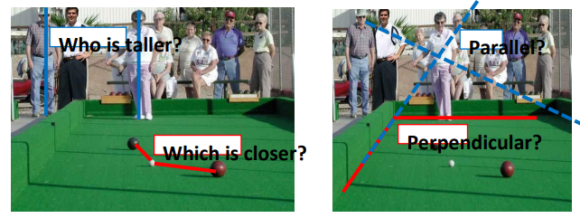

카메라로 촬영한 이미지의 특징을 한번 볼까요?
촬영된 이미지는 실제 세계의 특성을 어느정도 잃어버리는 경향이 있어요.
위 그림에서 볼 수 있듯 당구대의 외곽을 표현하는 붉은 직선은 현실과 마찬가지로 직선의 형태를 그대로 유지하지만 서로 이루는 각도가 변했죠.
또 어느 위치에서 보았느냐에 따라 그 길이 역시 차이가 납니다.

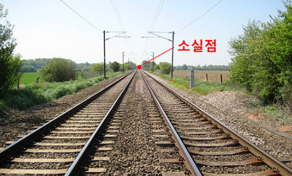

위 사진을 보면 기차 선로가 있어요.
기차 선로는 실제 세상에서 평행한 직선으로 이루어져 영원히 만나지 않은 상태이죠.
하지만 이미지로 촬영된 선로는 결국 어느 한점`vanishing point`에서 만나기 마련이에요.
즉 이미지로 투영된 평행한 직선들은 결국 동일한 어느 한 점으로 수렴하는 것을 확인할 수 있습니다.
물론 모든 평행한 직선들이 한 점에서 만나는 것은 아니에요.

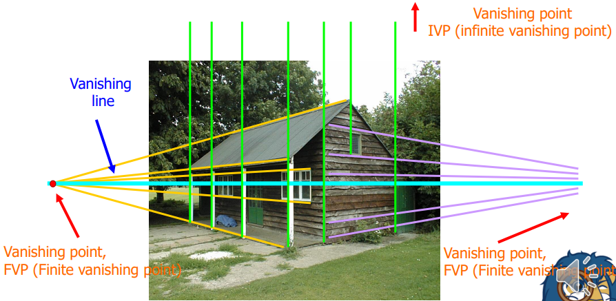

위 사진에서 노란 직선들과 보라 직선들은 각각 한점에서 만나는 점 `FVP(Finite Vanishing Point)`을 가지는데 반해 초록 직선이 한 점에서 만나는 점`IVP(Inite Vanishing Point)`은 존재하지 않죠.
여기서 서로 다른 두 vanishing point를 연결한 선을 `vanishing line`이라고 합니다.

그렇다면 vanishing point를 이용하여 intrinsic matrix를 구하는 방법이 있을까요?

* $f_x = f_y$
* skew는 존재하지 않음 $(s=0)$
* 3 이상의 FVP$(P_1, P_2, P_3)$
* 서로 다른 두 FVP는 수직

위와 같은 조건의 이미지가 있다고 합시다.
그렇다면 $P_1$이 카메라를 통해 이미지에 투영된 점 $P'_1$은 다음과 같아요.

$$
{P'}_1 = K[R t]P_1 = KRP_1 \tag{11}
$$

여기서 $R$과 $t$는 각각 extrinsic matrix의 rotation과 translation 입니다.
FVP의 실제 위치 P는 평행선이 만나는 지점 즉 무한대에 위치하는 점이에요.
이를 homogeneous coordinates로 표현하게 되면 가장 마지막 차원의 성분 $w = 0$이 되죠.
그렇기 때문에 translation에 대한 성분은 0과 계산되어 상쇄됩니다.

$$
P_1 = (KR)^{-1} P'_1 = R^{-1} K^{-1} P'_1 \tag{12}
$$

식 (11)을 변형시켜 식 (12)를 만들었어요.
$P_2, P_3$ 역시 위 처럼 표현할 수 있겠죠?
우리는 두 FVP가 수직하다고 가정을 했습니다.
그렇기 때문에 ${P_1}^T P_2 = 0$ 인것을 알고있죠.
이를 식 (12)에 적용하면

$$
(R^{-1} K^{-1} P'_1)^T R^{-1} K^{-1} P'_2 = {P'_1}^T (K^{-1})^T K^{-1} P'_2 = 0 \tag{13}
$$
위 결과를 얻어낼 수 있어요.
우리는 FVP가 이미지로 투영된 점 $P'_1, P'_2$를 이용해서 intrinsic matrix $K$를 구할 수 있게 되었네요.


## Exrinsic calibration

우리는 위에서 camera coordinates에서 image plane으로 변환하는 과정을 살펴봤어요.
그렇다면 world coordinates의 물체를 camera coordinates로 변환하는 과정을 봅시다.

$$
P^C = {R_W}^C P^W + {t_W}^C \tag{14}
$$

* ${R_W}^C$는 camera coordinates에서 world coordinates의 rotation
* ${t_W}^C$는 camera coordinates에서 world coordinates의 origin

```
이 부분은 자세하게 다루는 것 같지 않음
```


# Recover calibration parameter

자 이제 camera calibration을 위해 transformation matrix의 파라미터를 구해봅시다.
calibration을 하기 위해서 우리는 intrinsic matrix의 $f_x, f_y, s, c_x, c_y$ 총 5 가지 파라미터와,
extrinsic의 rotation $r_x, r_y, r_z$ 3 가지, translation $t_x, t_y, t_z$ 3 가지, 총 11 가지의 파라미터를 알아야 하네요.

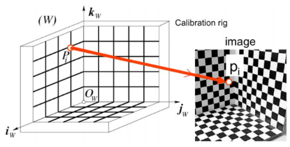
우리는 위와 같은 단순화된 패턴을 이용하여 실제 세상과 대응되는 포인트 쌍을 통해 transformation matrix의 파라미터를 얻을 거예요.

$$
p_i = \begin{bmatrix} u_i \\ v_i \end{bmatrix} = MP_i = \begin{bmatrix} m_1P_i/m_3P_i \\ m_2P_i/m_3P_i \end{bmatrix} \tag{15}
$$

($m_1, m_2, m_3$는 matrix $M$의 각 행을 의미)

$$
u_i (m_3 P_i) - m_1 P_i = v_i (m_3 P_i) - m_2 P_i = 0 \tag{16}
$$

식 (15)를 통해 식 (16)과 같이 $P_i, p_i$ 쌍으로부터 2개의 식을 얻을 수 있다.
우리가 구해야 하는 파라미터는 위에서 서술했듯 총 11 가지.
따라서 6개의 포인트 쌍이 있다면 matrix를 찾을 수 있다.
하지만 실제 세상에는 노이즈가 존재하기 때문에 정확하게 값이 측정되기 어렵습니다.
따라서 $n$개의 포인트 쌍을 모두 사용하여 matrix에 대한 식을 구하면 아래와 같아요.

$$
P = \begin{bmatrix} {P_1}^T & 0 & -u_1 {P_1}^T \\ 0 & {P_1}^T & -v_1 {P_1}^T \\ \vdots \\ {P_n}^T & 0 & -u_n {P_n}^T \\ 0 & {P_n}^T & -v_n {P_n}^T \\ \end{bmatrix} \qquad
m = \begin{bmatrix} {m_1}^T \\ {m_2}^T \\ {m_3}^T \end{bmatrix} \qquad
P m = 0 \tag{17}
$$

위 `homogeneous linear system`은 $2n > 11$일 때 미지수보다 방정식이 더 많은 `overdetermined` 상태이고, $m = 0$은 항상 trivial solution이 됩니다.
따라서 제약을 주어 minimization problem을 구성하면 아래와 같아요.
```
여기서부터 복작합 수식으로 자세한 과정은 생략하고 넘길게요.
```

$$
minimize \; {\left\| Pm \right\|}^2 \; subject \; to \; {\left\| m \right\|}^2 = 1 \tag{18}
$$

이를 SVD를 이용하여 풀면 아래와 같은 파라미터를 구할 수 있어요.

$$
M = \begin{bmatrix} {a_1}^T & {b_1} \\ {a_2}^T & {b_2} \\ {a_3}^T & {b_3} \end{bmatrix} = K \begin{bmatrix} R & t \end{bmatrix} \tag{19}
$$

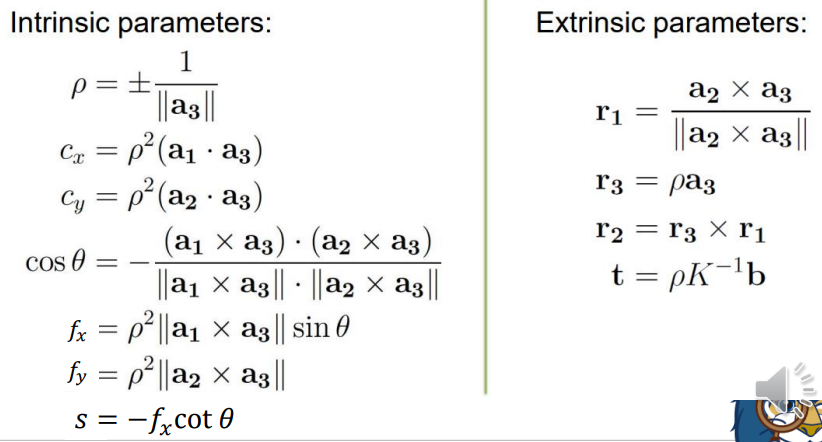

하지만 위의 방법으로 모든 문제를 해결할 수 있는 것은 아니다.
모든 $P_i$가 동일한 평면위나 아래 그림과 같은 이차 표면의 교차 곡선위에 존재하면 안된다.
> 정확한 워딩은 `Cannot lie on the intersection curve of two quadric surfaces.`

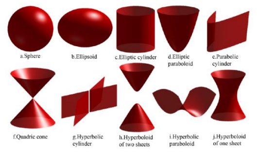