import * as Elem from '@elems';

우리는 앞서 camera calibration을 통해 3차원 물체를 2차원으로 변환하는 방법을 배웠어요.
그렇다면 반대로 2차원 이미지를 이용하여 3차원 물체로 변환하는 과정은 어떨까요?
모두가 알고 있듯, 하나의 이미지만으로는 2차원에서 3차원으로 복구하는 과정을 불가능해요.
차원이 줄어들어 모든 정보를 담을 수 없기 때문이죠.

그래서 우리는 다른 방법으로 여러 방향에서 촬영한 이미지들을 활용할 수 있겠어요.
이때 필요한 동일한 물체에 대한 서로 다른 지점에서의 이미지 쌍에 대한 기하학적 관계를 다루는 것이 `Epipolar Geometry`입니다.

# 용어 정리

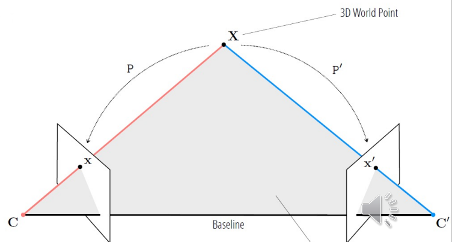

먼저 기본적인 용어를 먼저 정리하고 가도록 하죠.
두 카메라의 원점을 연결한 선을 `Baseline`이라고 합니다.
그리고 이 baseline을 지나는 모든 평면을 `epipolar plane`라고 하죠.
이때 동일한 포인트 $X$를 각 이미지에 투영한 포인트를 각각 $x$, $x'$이라고 한다면, $X$, $x$, $x'$ 모두 동일한 epipolar plane위에 존재합니다.

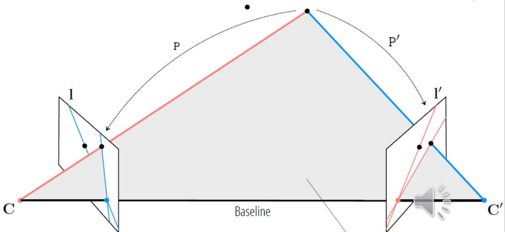

`Epipolar line` $l$, $l'$은 epipolar plane과 이미지가 만나는 라인을 의미해요.
$X$의 위치에 따라 계속해서 달라지죠.

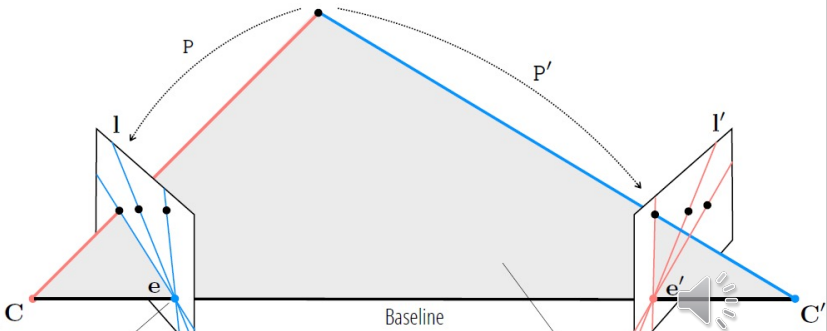

`Epipole` $e$, $e'$은 baseline과 이미지가 만나는 지점이에요.
이는 상대 카메라의 중심이 내 이미지에 어디에 위치하는지를 나타내는 것이죠.

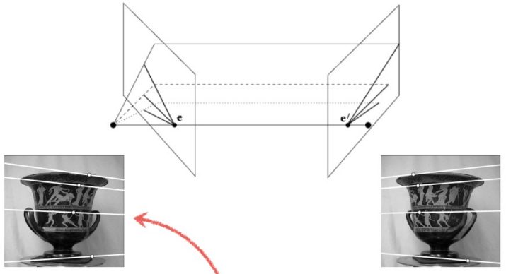
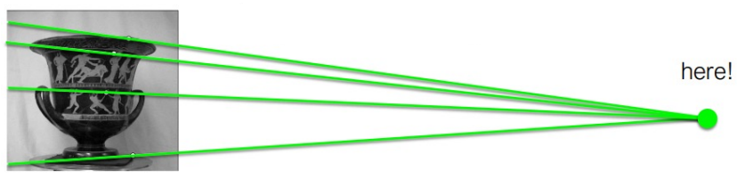

위 그림과 같이 같은 도자기를 찍은 두 사진이 있다고 하였을 때,
epipole은 꼭 이미지 속에 있는 것이 아니에요.

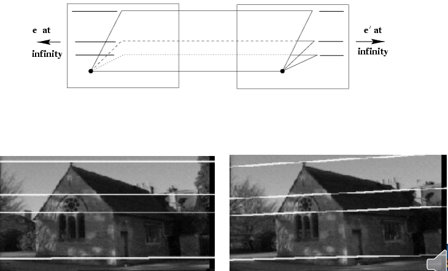

위 사진도 마찬가지로, 스테레오와 같은 평행하게 한 물체를 찍었다면 epipole은 무한대가 되겟죠.

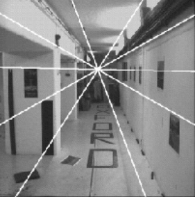

상대 카메라의 위치가 이미지 내에 있다면 이런 식으로 epipolar line이 이미지 내 카메라 위치로 모이는 것을 볼 수 있어요.

# Epipolar constraint

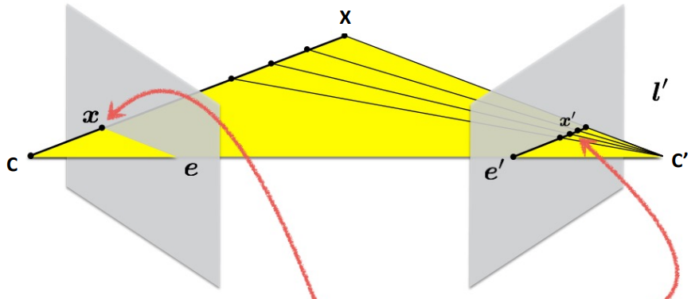

동일한 $X$를 촬영한 두 이미지를 봅시다.
좌측 이미지에서 $x$라는 위치에 투영되었다고 할게요.
그렇다면 우측 이미지에서 $X$에 해당하는 $x'$은 epipolar line $l'$위 어딘가에 있을거에요.
그럼 우리는 한쪽 이미지에서 어떠한 feature를 다른 이미지에서 찾기 위해서 epipolar line위 점들만 조사하면 되는 거네요!

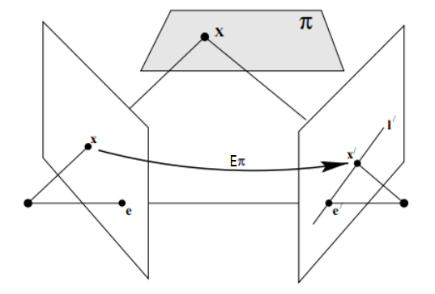

위 그림과 같이 좌측 카메라가 평면 $\pi$를 이미지로 투영한 상태라고 합시다.
이 때 $X$를 투영한 점을 $x$, epipole을 $e$라고 할게요.

$$
l' = e' \times x' \tag{1}
$$
<Elem.Comment>
3차원에서 두 점 p1과 p2를 지나는 직선의 방정식의 normal vector $l$은 $l = x_1 \times x_2$다.
</Elem.Comment>
우리는 epipolar line $l'$를 식 (1)과 같이 정의할 수 있어요.
이때 $x$를 $x'$로 변환하는 행렬 $H_{\pi}$라고 하면

$$
x' = H_{\pi}x \qquad l' = e' \times H_{\pi} x = F x \tag{2}
$$

여기서 $l'$은 $x'$, $e'$을 지나는 직선의 방정식의 normal vector이고 $x'$와 수직관계를 가지기 때문에 ${x'}^T l' = 0$가 되죠.
$e' \ times H_{\pi}$를 `fundamental matrix` $F$라고 합시다.
이를 식 (2)와 합쳐보면

$$
{x'}^T F x = 0 \tag{3}
$$

### Properties of the fundamental matrix

Fundamental matrix $F$는 방향성을 가집니다.

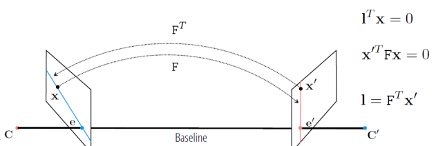

또한 모든 epipolar line은 epipole을 지나갑니다.

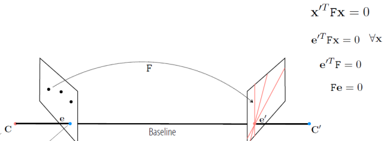

<Elem.Comment>
사실 이 부분은 좀 이해가 안되는 부분이 많아서 추가로 조사를 해야 할듯!
</Elem.Comment>

### Fundamental matrix estimation

즉 $x$와 $x'$ 쌍을 이용하여 식 (3)을 만족시키는 $F$를 찾아야 해요.
$F$는 homogeneous matrix이기 때문에 동일한 상수 배수로 scaling이 됩니다.
이로 인해 전체적인 scale 값은 중요하지 않으므로 하나의 파라미터 자유도를 가지게 돼요.

$def(F) = 0$, $F$는 rank가 2입니다.
즉, 행렬의 두개의 행이 선형적으로 독립적이죠.
나머지 하나의 행은 다른 행의 선형 조합으로 표현될 수 있습니다.
이로 인해 추가로 하나의 파라미터 자유도를 가지게 돼요.
<Elem.Comment>
rank 2가 뭐지 이해가 안되어서 GPT 답변 가져왔음.
이 관계는  F가 에피폴라 선을 올바르게 나타내려면 계수가 2여야 함을 의미합니다.
왜냐하면, 계수가 3이면, 이는 F가 풀 랭크(full rank)를 가지고 있으며, 그 결과로 모든 점들이 대응 관계를 만족하지 않게 될 것이기 때문입니다.
반면, 계수가 1이거나 0이라면, 이는 F가 충분한 정보를 포함하지 않아 에피폴라 선을 올바르게 나타내지 못할 것임을 의미합니다.
</Elem.Comment>

$F$는 원래 $3 \times 3$크기의 행렬이기 떄문에 9개의 파라미터를 조사해야 하지만, 위와 같은 조건으로 7개의 파라미터만 알면 됩니다.
하지만 7개의 포인트 페어를 사용할 경우, 무수히 많은 해를 가질 수 있으므로 총 8개의 독립적인 포인트 페어가 필요해요.

$$
F = 
\begin{bmatrix}
f_{11} & f_{12} & f_{13} \\
f_{21} & f_{22} & f_{23} \\
f_{31} & f_{32} & f_{33} \\
\end{bmatrix}
$$

$$
x'xf_{11} + x'yf_{12} + x'f_{13} + y'xf_{21} + y'yf_{22} + y'f_{23} + xf_{31} + yf_{32} + f_{33} = 0
$$

$$
\begin{bmatrix}
x'_1 x_1 & x'_1 y_1 & x'_1 & y'_1 x_1 & y'_1 y_1 & y'_1 & x_1 & y_1 & 1 \\
&&&& \vdots \\
x'_n x_n & x'_n y_n & x'_n & y'_n x_n & y'_n y_n & y'_n & x_n & y_n & 1
\end{bmatrix} f = Af = 0
$$

### 8 point algorithm

즉 $f$를 구하는 방법은 아래와 같아요.
1. n개의 포인트 페어를 이용하여 $Af = 0$ 식을 세웁니다.
2. SVD를 통해 $A = UDV^T$
3. $\left\| f \right\| = 1$에 대해 $\left\| Af \right\|$를 최소화하는 $V$ 찾습니다. 이를 통해 $\hat{f}$가 생산되죠.

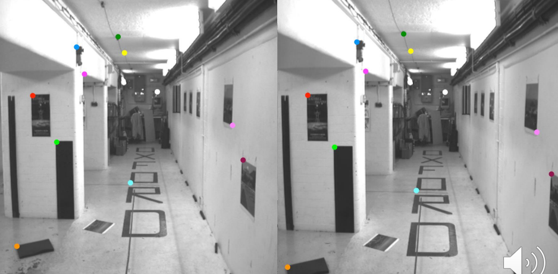
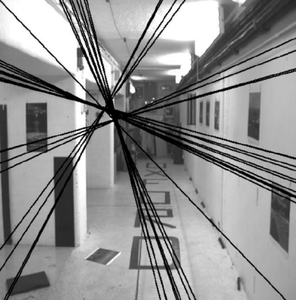

그런데 실제로 위 예시를 이용해 epipola line을 구하면 하나의 epipole로 수렴하지 않을 수 있어요.
그래서 하나의 포인트를 보장하기 위해 추가적인 연산을 진행합니다.
$def(F) = 0$인 것을 기억합시다!

4\. $\hat{F}$에 대해 SVD를 진행합니다.  
5\. $\hat{F}^*$를 구해 $\hat{F} - \hat{F}^*$ 

<Elem.Comment>
자세한 방법은 생략,,
</Elem.Comment>

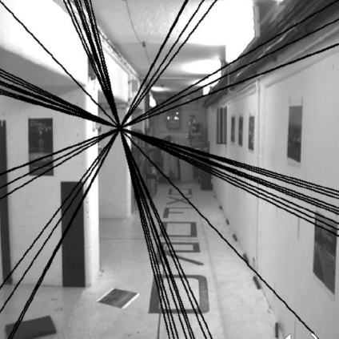

이를 통해 하나의 epipole을 얻을 수 있게 되었어요.
하지만 이 방법은 늘 정확한 것은 아니에요.
바로 변수들의 resolution 차이 떄문이죠.

### Data normalization

$$
x'_1 x_1\;(10^4) \quad x'_1 y_1\;(10^4) \quad x'_1\;(10^2) \quad y'_1 x_1\;(10^4) \quad y'_1 y_1\;(10^4) \quad y'_1\;(10^2) \quad x_1\;(10^2) \quad y_1\;(10^2) \quad 1 \\
$$

이러한 차이는 좋지 않은 결과를 만들 수 있습니다.
그래서 우리는 픽셀을 normalization하여 계산을 더 정확하게 만드려고 합니다.

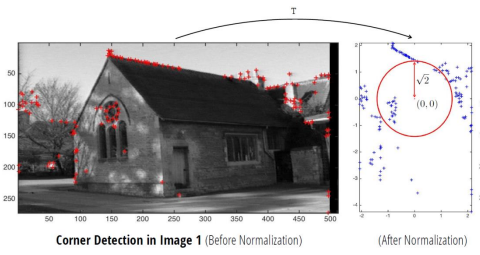

전체 과정을 보면 두 이미지를 normalization을 한 값의 fundamental matrix를 구하는 방식입니다.

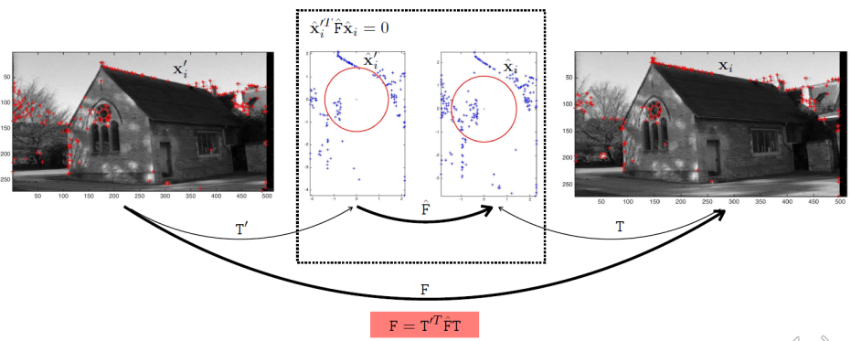

### RANSAC(RANdom SAmple Consensus)

실제 사진에서 우리는 8 point algorithm을 사용하기 위해 실제 사진에서 feature matching을 진행하면 꼭 모든 포인트 페어가 잘 매칭되는 것은 아닙니다.

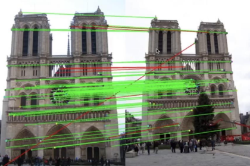

우리는 정확한 페어를 얻어야 정확한 epipole을 얻을 수 있어요.
그래서 우리는 `RANSAC` 알고리즘을 사용합니다.
알고리즘은 다음 순서로 이루어져요.

1. 무작위로 N개의 랜덤한 포인트를 선택합니다.
2. 이를 통해 적절한 모델을 만들죠.
3. 모델의 결과의 threshold 범위 내 갯수를 이용하여 점수를 계산합니다.
4. 최적의 모델을 찾을 때 까지 1~3을 반복합니다.

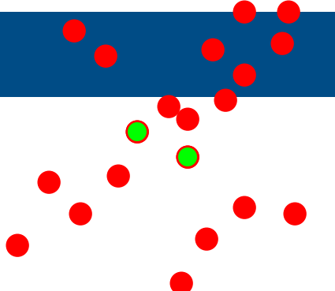
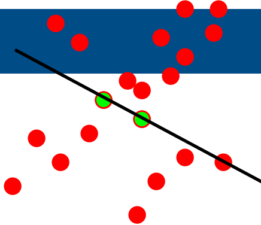
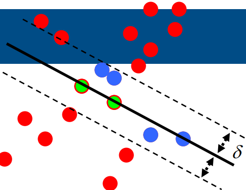
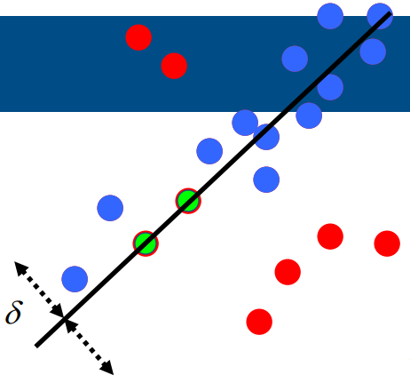

이를 8 point algorithm에 적용시켜보면 다음과 같겠네요.

1. 8개의 랜덤한 포인트 페어를 선택합니다.
2. 8 point algorithm을 이용하여 F를 찾아요.
3. $-\delta < x'^T F x < \delta$의 수를 확인합니다.
4. 이를 반복합니다.

우리는 fundamental matrix $F$를 찾고 이를 이용하여 카메라 포즈 $P$와 $P'$를 찾고 이를 통해 3D points $X$를 찾습니다.
현실에서는 이러한 과정에서 reprojection error가 발생합니다.
