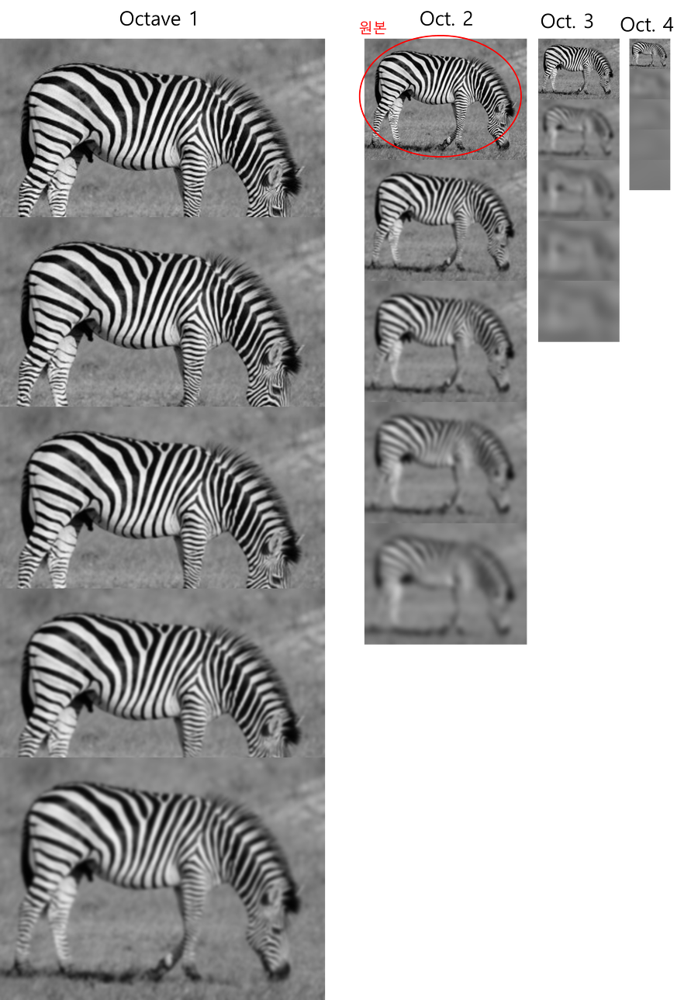
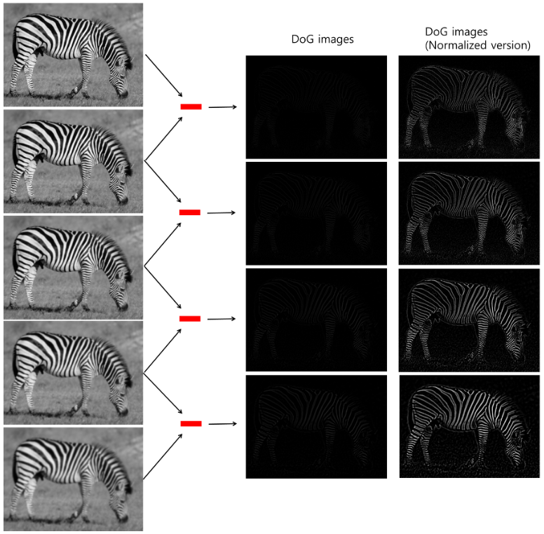
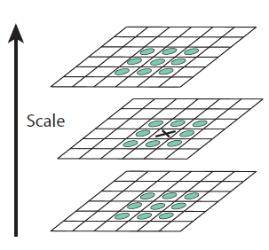
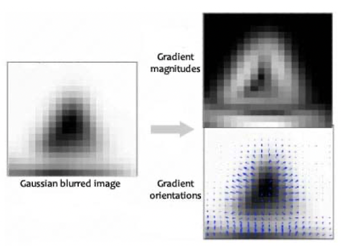
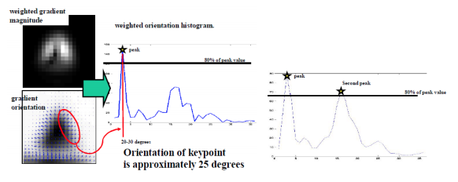
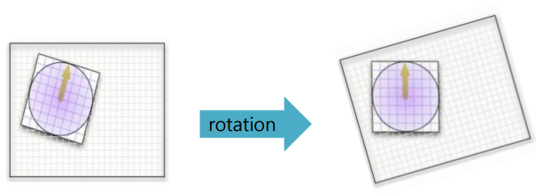
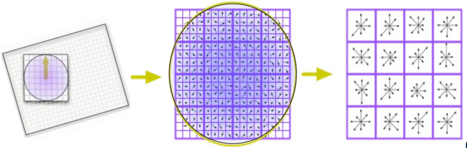
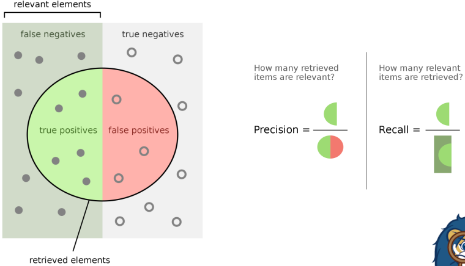
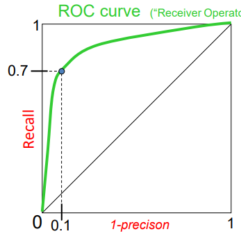

## SIFT (Scale Invariant Feature Transform)
Feature matching의 순서는 아래와 같다.
1. feature 찾기
2. feature의 descriptor 생성
3. descriptor를 통한 두 이미지의 feature matching

여기서 이상적인 descriptor는 아래와 같은 특징을 가져야 한다.
* invariance (noise,, translation, rotation 등으로 부터)
* distinctiveness (one to one matching)
* compact, efficient for fast matching

## Scale-space
scale invariant한 특징을 가지기 위해 다양한 scale에서 feature를 추출한다.
scale-space는 원본 이미지의 scale을 변화시켜 여러 scale의 이미지를 모아놓은 집합이다.

원본 이미지에 guassian blur scale factor $\sigma$를 적용하여 이미지를 blurring한다.
이 때 $\sigma$가 기존의 2배가 될 떄 까지 동일한 비율 k배로 증가시킨다.
이렇게 만들어진 이미지들은 동일한 octave에 있다고 한다.

$\sigma$가 2배가 되었다는 뜻은 2배 먼 거리에서 본 것과 동일하므로 원본 이미지를 1/2로 Downsampling하여 연산량을 줄인다.
후에 동일한 방법으로 $\sigma$가 기존의 2배가 될 때 까지 blurring을 진행하여 새로운 octave를 구성한다.

## DoG Feature Detection
위 방법으로 생성한 scale-space에서 동일한 octave에 있는 순차적인 두 이미지의 차이를 DoG라고 한다.
DoG를 이용하면 edge나 corner와 같은 keypoint를 추출할 수 있다.
$$$
DoG:D(H)=H\cdot G(\sigma_i)-H\cdot G(\sigma_j)
$$$

위 scale-space에서 한 octave당 4개의 DoG, 총 16개의 DoG가 생성된다.

## Keypoint Localization
생성된 동일한 octave내 DoG 이미지들에서 극대값, 극소값의 위치를 이용하여 keypoint를 찾는다.

SIFT에서는 target point와 동일한, 상위의, 그리고 하위의 DoG이미지에서 자신의 이웃 픽셀에 대해 각각의 값과 target point의 값을 비교하였을 때, target point가 가장 크거나 작을 경우 keypoint로 판단한다.
이를 $D(x, y, \sigma^n)$으로 표시한다.

앞서 얻은 keypoint 중에서 contrast가 너무 낮거나 edge라서 검출된 좋지 않은 point가 있으므로 이를 걸러주는 작업을 진행한다.

1. $D(x,y,\sigma) < \epsilon$인 points는 제거한다.
2. Harris Corner Detection을 이용하여 edge를 걸러낸다.  
    $\frac{{trace(H)}^2}{det(H)}=\frac{{\lambda_{max}+\lambda_{mim}}^2}{\lambda_{max}\lambda_{min}}< \frac{(r+1)^2}{r}$ (H : Harris Matrix, r : a threshold)

## Orientation Assignment
SIFT 알고리즘은 회전에도 강하도록 keypoint에 대해 방향 정보도 제공한다.
먼저 keypoint 주변 16x16 윈도우를 설정하여 그 안 이미지를 Gaussian blurring 후 윈도우의 각 점에 대해 아래와 같은 연산을 통해 gradient 방향과 크기를 결정해준다.

$$
m(x,y) = \sqrt{(L(x+1,y)-L(x-1,y))^2+(L(x,y+1)-L(x,y-1))^2}
$$
$$
\theta(x,y)=\tan^{-1}((L(x,y+1)-L(x,y-1))/(L(x+1,y)-L(x-1,y)))
$$

L은 Guassian blurred image이다. 간단하게 보면 상하, 좌우 gradient를 이용하여 각도를 구하는 것 같다. (m은 뭐임?)  

이후 keypoint와 픽셀간 거리에 따른 가중치를 적용하고 각 방향들에 대해 10도씩 분류한다. 
이때 가장 큰 값을 가지거나 일정 threshold 이상의 크기를 가지는 방향을 keypoint 방향으로 설정한다.

설정된 방향의 반대 방향으로 회전시키는 orientation normalization 이라고 한다.

그래서 각 keypoint의 16x16사이즈 window를 4x4의 cell로 나누어 각 cell마다 orientation histogram, normalization을 진행하여 feature에 대한 descriptor를 만들어 낸다.

## Feature Matching
생성된 두 이미지의 feature들의 descriptor의 $L_2$ distance를 이용하여 각 feature를 matching한다.

위 그림과 같이 $f_1$과 두 개의 feature $f_2$, ${f_2}'$이 유사한 경우가 있다.
그래서 best distance와 second distance를 이용해 ratio distance($\frac{\left\|f_1-f_2 \right\|}{\left\|f_1-{f_2}' \right\|}$)를 구한다.
ratio distance가 threshold 이하일 때 유효한 matching으로 판단한다.

그 외에도 threshold 이하의 distance만 유효한 matching으로 판단하는 등 

## 정확도 측정
여타 이진분류 문제와 동일한 측정 방법을 사용하는듯!

유효하다고 판단한 matching중 (옳은 matching / 전체 matching) 이 precision, (옳은 matching / 실제 matching) 이 recall.

ROC curve라고 recall과 precision을 통해 그래프를 나타내는데 그래프 아래 면적이 1에 가까울수록 더 좋은 detector라고 할 수 있다.
