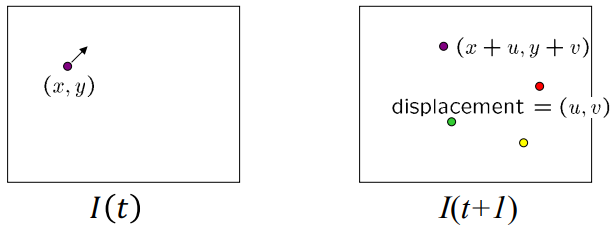
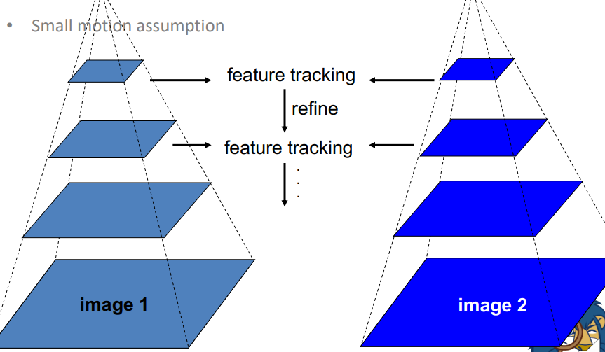
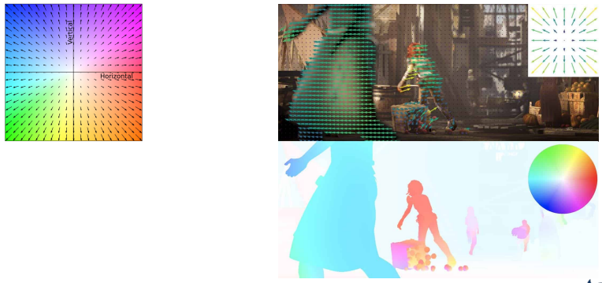

## Feature Tracking
동영상과 같은 연속적인 이미지에 대해서 feature를 추출하고 tracking 하는 것에는 아래와 같은 어려움이 있다.
* 몇몇 point는 시간이 지나면서 변화한다. (회전, 그림자 등)
* Drift (small errors can accumulate as appearance model is updated)
* Point가 나타나거나 사라질 수 있다.

다음 시퀀스에서 feature의 이동을 계산하기 위해서 우리는 아래와 같은 가정을 한다.
* Brightness constancy - 동일한 faeture는 동일하거나 비슷한 색을 가진다.
* Small motion - point가 많이 움직이지 않는다.
* Spatial coherence - point가 그 주변 point들과 비슷하게 움직인다.

## Brightness constancy + Small motion
Brightness constancy와 Small motion 특징에 의해 다음 시퀀스에서도 아주 조금 움직이고 동일한 밝기를 가진다고 하면 아래와 같이 표현할 수 있다.
$$
I(x,y,t) = I(x+u,y+v,t+1)
$$
위 식을 N=1인 Taylor Series를 적용하면
$$
I(x+u,y+v,t+1) \approx I(x,y,t) + I_xu+I_yv+I_t
$$
$$
I_xu+I_yv+I_t = 0
$$
으로 근사할 수 있다.  
이 때 $[u, v]$는 motion vector, $[I_x, I_y]$는 gradient vector, $I_t=I(x,y,t+1)-I(x,y,t)$이다.

## Lucas-Kanade Method
위 식만을 가지고는 motion vector를 구할 수 없다.
하지만 Spatial coherence 특징을 생각하면 주변의 point들 역시 동일한 움직임을 했다고 생각해보자.
feature point 주변 5x5 window를 구성하고 내부 점들은 같은 움직임을 보인다고 하면 아래와 같이 표현할 수 있다.
$$
I_x(p_1)+I_y(p_1)=-I_t(p_1)
$$
$$
I_x(p_2)+I_y(p_2)=-I_t(p_2)
$$
$$
\vdots
$$
$$
I_x(p_25)+I_y(p_25)=-I_t(p_25)
$$
이를 행렬로 표현하면
$$
\begin{bmatrix}
I_x(p_1) & I_y(p_1) \\
I_x(p_2) & I_y(p_2) \\
\vdots & \vdots \\
I_x(p_25) & I_y(p_25) \\
\end{bmatrix}
\begin{bmatrix}
u \\
v \\
\end{bmatrix}
=-
\begin{bmatrix}
I_t(p_1)\\
I_t(p_2) \\
\vdots \\
I_t(p_25)\\
\end{bmatrix}
$$
위 $Ad=b$ 형태의 행렬을 $(A^TA)d=A^Tb$ 형태로 표현하면 아래와 같다.
$$
\begin{bmatrix}
\sum I_xI_x & \sum I_xI_y \\
\sum I_xI_x & \sum I_yI_y \\
\end{bmatrix}
\begin{bmatrix}
u \\
v \\
\end{bmatrix}
=-
\begin{bmatrix}
\sum I_xI_t
\sum I_yI_x
\end{bmatrix}
$$
u,v를 구하기 위해서는 아래와 같은 조건이 필요하다
* $A^TA$ should be invertible (역행렬이 존재)
* $A^TA$ should not be too small due to noise ($A^TA$의 eigenvalue $\lambda_min$이 너무 작으면 안됨)
* $A^TA$ should be well-conditioned ($\lambda_max / \lambda_min$ 가 너무 크면 안됨 -> 계산 오차가 커질 수 있다고 함)

위 방법은 window size에 의해 영향을 받는다.  
너무 작으면 noise에 민감해진다.
또한 window보다 큰 움직임은 계산하지 못한다.  
너무 크면 배경과 물체가 다르게 움직이는 등 상황에 따라 오차가 발생한다.
또한 계산 비용이 증가한다.

현실적으로 큰 Object에 대해서 tracking을 시도하는 경우가 많다.
하지만 위 방법은 작은 window 사이즈로 small motion을 가정하기 때문에 그림처럼 축소한 후 작은 사이즈부터 tracking을 하는 것으로 진행할 수 있다.

## Optical flow
Brightness 패턴의 움직임을 추정하는 것이다.
이는 Object의 모션 움직임 뿐 아니라 카메라 이동등에 따른 이미지 Translation과 같은 것도 추정한다.
Optical flow는 아래 그림처럼 움직임에 따라 색으로 표현한다.

Optical flow는 모든 포인트를 feature로 Lucas-Kanade equation을 적용한다.
큰 모션을 다루기 위해서는 coarse-to-fine 로 접근한다. (coarse-to-file은 한가지 작업을 더 작은 부분으로 나누어 각 부분을 자세하게 살펴보는 것)

그러나 모든 픽셀으로 연산을 해야 하기에 많은 연산량이 필요하다.  
그래서 GPU와 같은 병렬 연산이 필요하다.  
또 flat이나 edge region의 경우는 추정 불가능하다. (Lucas-Kanade 역행렬이 존재 x)  
부가적인 smooth regularization이 필요하다.

요즘에는 FlowNet과 같은 deep learning으로 하고 있기도 하다.

## 응용
* Estimating 3D structure
* Segmenting objects based on motion cues (motion segmentation)
* Learning and tracking dynamical models
* Recognizing events and activities
* Improving video quality (motion stabilization) - 카메라 흔들림 같은거 예측