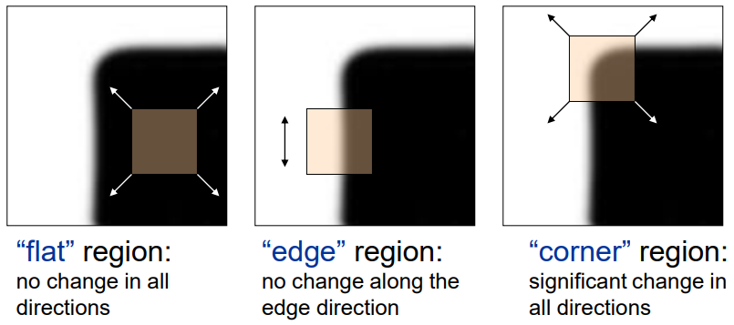
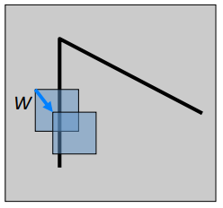
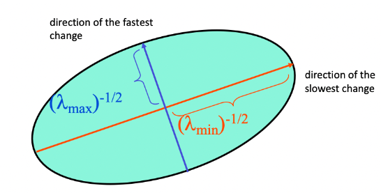
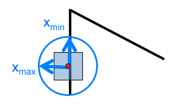
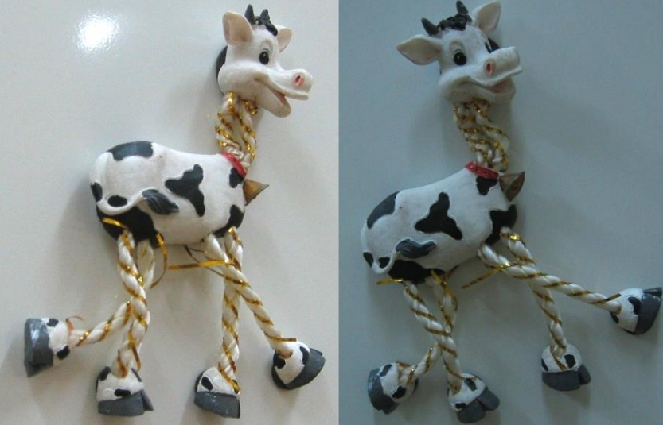
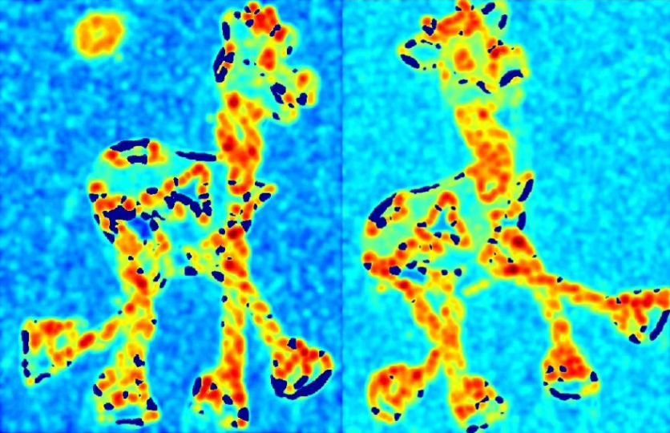
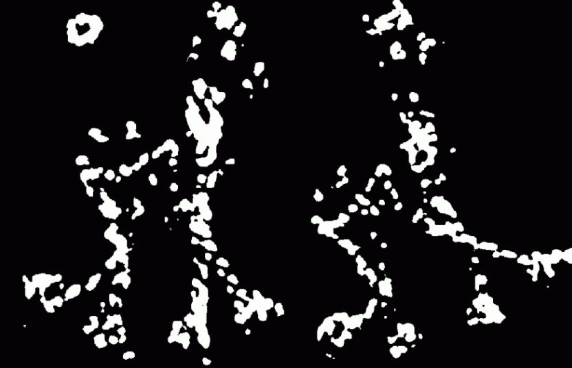
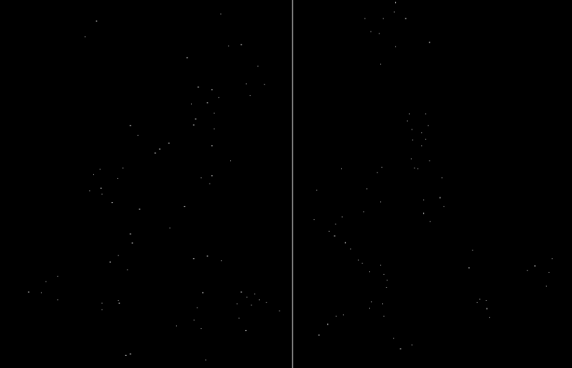
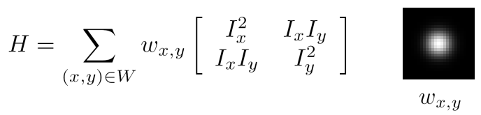
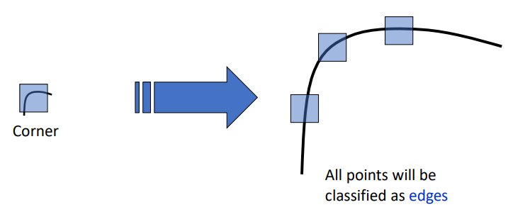

import * as Elem from '@elems';
import gif_01 from './01.gif';

이미지에서 영역에 따른 window 내부 값의 변화량은 아래와 같아요.
* Flat 구간에서는 window를 어느 방향으로 움직여도 큰 변화가 없습니다.
* Edge 구간에서는 window를 수직 또는 수평 방향으로 움직일 때 큰 변화량을 가지죠.
* Corner 구간에서는 window를 어느 방향으로 움직여도 큰 변화량을 가집니다.

# 수치 해석 돌아보기
우리 본격적으로 harris corner detection을 알아보기에 앞서, 예전에 배운 내용들을 기억하는 시간을 가져봅시다.

## Taylor Series
$$
f(x)=C_{0}+C_1(x-a)+C_2(x-a)^2+C_3(x-a)^3+...
$$
$$
f(a)=C_0, f'(a)=C_1, f''(a)=2\cdot C_2, f'''(a)=2\cdot 3\cdot C_3, C_n= \frac{{f}^{(n)}(a)}{n!} \tag{1}
$$
$$
f(x)=\frac{{f}^{(n)}(a)}{n!}\cdot (x-a)^n
$$
위 식은 x가 a근처에서만 성립하고, a의 범위는 f(x)에 따라 달라집니다.
<Elem.Image src={gif_01}/>

위는 $log(1+x)$의 그래프에요. 
Taylor Series의 다항식 차수 N이 증가함에 따라 그래프에 점점 근사하는 것을 볼 수 있어요. 
또한 $\left| x\right|\geq 1$인 구간에서 오차는 급격하게 증가합니다.
따라서 $log(1+x)$ 함수는 $\left| x\right|< 1$인 경우에만 Taylor Series를 적용 가능해요.

식 (1)을 아래와 같이 약간 변형시켜봅시다.
$$
f(x_0+\Delta x)=\sum_{n=0}^{\infty }\frac{f^{(n)}(x_0)}{n!}\Delta x \tag{2}
$$
$x_0=a$이고 $\Delta x=(x-a)$로 약간 변형을 준 것이에요.
이때 $\Delta x$는 0에 가까운 값이죠.

기본적인 2차원 형태의 함수는 아래와 같이 표현할 수 있어요.
$$
f(x_0+\Delta x,y_0+\Delta y), \; g(t)=f(x_0+t\Delta x,y_0+t\Delta y) \tag{3}
$$
$$
g(t)=f(x(t),y(t)), \; x(t)=x_0+\Delta x, \; y(t)=y_0+\Delta y \tag{4}
$$
위 식에 동일하게 Taylor Series를 적용하면 아래와 같아집니다.
$$
f(x_0+\Delta x,y_0+\Delta y)=g(0)+g'(0)+\frac{1}{2}g''(0)+... \\
=f(x_0,y_0)+f_x(x_0,y_0)\Delta x+f_y(x_0,y_0)\Delta y + ... \tag{5}
$$

## Visualizing Quadratics

함수 $f(x,y)=x^2+y^2$는 위 그림과 같은 그릇 모양을 하는데 이를 `paraboloid`라고 합니다.
이 paraboloid를 $z=1$인 지점에서 xy평면으로 자른다면 $x^2+y^2=1$인 원의 방정식이 나와요.
이 $f(x,y)$를 
$
\begin{bmatrix}
x & y \\
\end{bmatrix}
\begin{bmatrix}
1 & 0 \\
0 & 1 \\
\end{bmatrix} 
\begin{bmatrix}
x \\ y
\end{bmatrix}
$ 와 같은 행렬의 형태로 표시할 수 있습니다.

위와 같은 방식으로 $f(x,y)=4x^2+y^2$를 $xy$평면으로 잘랐을 때 타원 방정식의 형태를 띄는 함수를
$
\begin{bmatrix}
x & y \\
\end{bmatrix}
\begin{bmatrix}
4 & 0 \\
0 & 1 \\
\end{bmatrix} 
\begin{bmatrix}
x \\ y
\end{bmatrix}
$ 와 같은 행렬의 형태로 표시할 수 있어요.

가운데 행렬을 `SVD(Singular Value Decomposition)`를 적용하여 `eigenvector`와 `eigenvalue`를 구할 수 있습니다.

이때 첫번째 행렬은 eigenvector이고 각각 타원을 이루는 축에 대한 정보를 가져요.
또한 가운데 행렬은 eigenvalue이고 각각 타원의 반지름에 대한 정보를 가집니다.
조금 더 복잡한 타원 방정식을 SVD를 통해 기하학적으로 표현하면 아래와 같습니다.

$
\begin{bmatrix}
0.50 \\
-0.87 \\
\end{bmatrix} 
$벡터를 축으로 하는 반지름은 1,
$
\begin{bmatrix}
-0.87 \\
-0.50 \\
\end{bmatrix} 
$벡터를 축으로 하는 반지름은 $\frac{1}{\sqrt{4}}$를 가지는 타원이 되는 것이죠.

# Harris Corner Detection

앞서 이야기한 이미지의 영역에 따른 window 내부 값 변화량을 이용하여 우리는 corner detection을 수행하려 합니다.
변화량을 측정하기 위해 `SSD(Summing up the Squared Differences)`를 이용합시다.
기준 위치 $(x, y)$에서 window가 이동하며 변화한 SSD는 아래와 같이 구할 수 있어요. 
$$
E(u,v)=\sum_{(x,y)\in W}^{}(I(x+u,y+v)-I(x,y))^2 \tag{6}
$$

하지만 이는 모든 픽셀에 대해 연산을 수행하기에는 너무 큰 비용을 가집니다.
그래서 우리는 $N=1$인 Taylor Series를 이용해서 근사값을 구하도록 할 것이에요.
$$
I(x+u,y+v)\approx I(x,y)+I_x(x,y)u+I_y(x,y)v
$$
$$
E(u,v)\approx \sum_{(x,y)\in W}(I_x u+I_y v)^2\approx Au^2+2Buv+Cv^2 \tag{7}
$$
$$
A=\sum_{(x,y)\in W}{I_x}^2, \; B=\sum_{(x,y)\in W}I_x I_y, \; C=\sum_{(x,y)\in W}{I_y}^2
$$

식 (7)을 정리하면 아래와 같이 표현할 수 있겠네요.
$$
E(u,v)\approx
\begin{bmatrix}
u & v \\
\end{bmatrix}
M
\begin{bmatrix}
u \\ v
\end{bmatrix}, \;
M = \begin{bmatrix}
A & B \\
B & C \\
\end{bmatrix}  \tag{8}
$$

여기서 $M$을 `second moment matrix` 또는 `Harris matrix`라고 합니다.
Harris matrix는 window의 변화에 따라 아래와 같은 특징이 있어요.

위와 같은 경계의 경우 window 이동에 따른 $I$의 $x$축 변화량은 0이기 떄문에 $y$축 변화에만 영향을 받는 그래프의 모습을 나타냅니다.

위와 같은 경계의 경우 window 이동에 따른 $I$의 $y$축 변화량은 0이기 때문에 $x$축 변화에만 영향을 받는 그래프의 모습을 나타냅니다.

# Second Moment Matrix 해석

근사된 $E(u,v) \approx Au^2+2Buv+Cv^2$를 약간 변형하면 $A({u-a}^2)+C({v-b}^2)$로 타원 방정식 형태로 변형할 수 있어요.
즉 $E(u,v)$는 수평하게 잘랐을 때 그 모양이 타원의 모습을 이룹니다.

Second moment matrix $M$에 SVD를 적용하면
$
M = R^-1
\begin{bmatrix}
\lambda_1 & 0 \\
0 & \lambda_2 \\
\end{bmatrix}
R
$
로 표현할 수 있고 eigenvalue를 통해 타원의 형태를 확인할 수 있어요.

$\lambda_1$과 $\lambda_2$가 비슷하면서 0에 가까우면 flat 영역이라고 할 수 있죠.
$\lambda_1 >> \lambda_2$이면 $x$축에 대한 변화량이 크다는 의미이고 이는 수직 방향의 edge를 나타냅니다.
반대로 $\lambda_1 << \lambda_2$이면 $y$축에 대한 변화량이 크다는 의미이고 이는 수평 방향의 edge를 나타내죠.
만약 $\lambda_1$ 와 $\lambda_2$가 둘다 큰 값을 가진다면 그곳이 바로 corner 입니다.

Eigenvalue와 eigenvector를 구하는 방법을 생각해봅시다.  
$$
Mx = \lambda x, \; (M-\lambda)x=0 \tag{9}
$$
식 (9)를 만족하는 $\lambda_{min}$, $\lambda_{max}$, $x_{min}$, $x_{max}$를 찾습니다.
이때 M의 eigenvalue와 eigenvector는 아래와 같아요.
* $x_{max}$는 E를 급격하게 증가시키는 방향
* $\lambda_{max}$는 $x_{max}$방향에서 E의 증가량
* $x_{min}$는 E를 느리게 증가시키는 방향
* $\lambda_{min}$는 $x_{min}$방향에서 E의 증가량

위 그림에서 일정 값 이상의 $\lambda_{max}$를 표시한 부분은 모든 edge를 나타내고 있으며,
일정 값 이상의 $\lambda_{min}$를 표시한 부분은 corner를 나타내고 있어요.
위와 같이 $\lambda_{min}$이 threshold값 이상을 가지는 모든 points를 찾습니다.

사실 각 픽셀마다 $\lambda_{min}$를 구하는 것은 쉽지 않아요.
따라서 harris operator를 사용하여 $\lambda_{min}$의 근사값을 찾습니다.
연산에는 많은 종류가 있지만 그중 가장 유명한 `harris response`는 아래와 같아요.
$$
{\lambda_{min}}\approx f=\frac{\lambda_1\lambda_2}{(\lambda_1 + \lambda_2)}=\frac{det(M)}{trace(M)}
$$

# Corner Detection
마지막으로 Harris Corner Detection으로 feature를 찾는 방법은 다음과 같아요.

1. 각 포인트마다 gradient를 계산합니다.
2. $I_x$와 $I_y$를 계산하여 harrix matrix $H$를 구성하고 threshold 이상의 $\lambda_{min}$들을 찾습니다.
3. 찾은 $\lambda_{min}$중 local maximum인 부분을 feature로 선택합니다.

이때 조금 더 성능을 향상시키기 위해 window내 모든 gradient를 동등하게 계산하는 것이 아닌 guassian과 같이 거리에 따라 가중치를 주는 방법도 있어요.

# Harris Detector 특징

타원의 방향(eigenvector)이 바뀌지만 모양(eigenvalue)은 유지되기 때문에 회전과 이동에도 변하지 않는 특징이 있어요.

하지만 window크기에 따라 계산되기 때문에 scaling에는 큰 영향을 받습니다.