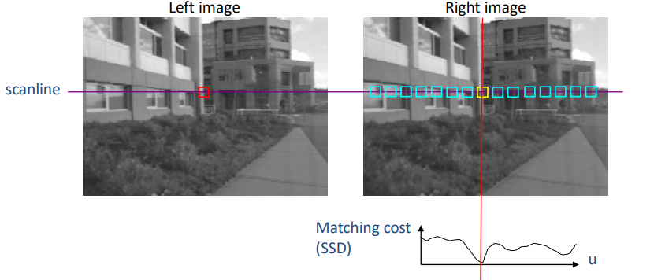
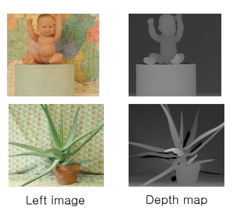
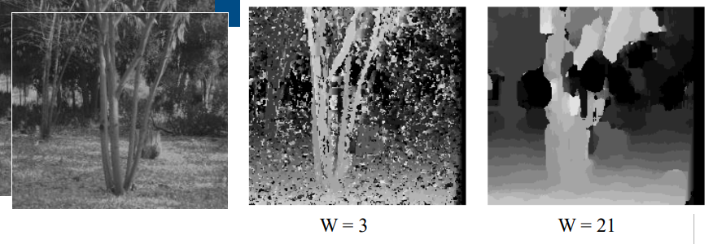

`Stereo algorithm`은 좌우 차이가 존재하는 두 카메라로 동일한 영역을 촬영하여 `disparity`를 이용해 depth를 계산하는 방법이에요.

동일한 지점을 찾는 방법은 이전의 feature matching보다 더 간단합니다.
찾고자 하는 지점의 scanline 위에 존재하는 포인트들만 검사하면 되는 것이지요.
Scanline 위 포인트 중 matching cost가 가장 낮은 부분을 찾으면 되는 것입니다.

이후 $u = x - x'$로 disparity를 구해줍니다.  
최종적으로 $depth(x) \approx \frac{1}{u}$ 입니다.

이를 통해 깊이에 대한 정보를 담은 이미지를 `depth map`이라 합니다.
Matching cost를 계산하기 위한 window의 사이즈에 따라 결과가 다릅니다.
* 작은 window : 더 디테일한 정보가 들어가지만 노이즈에 민감해집니다.
* 큰 window: 더 부드럽게 depth map을 형성하지만 디테일이 더 적어집니다.

하지만 stereo algorithm을 적용하기 힘든 이미지도 존재합니다.
우리는 matching cost를 사용하여 대응점을 찾고 있지만, 대응점을 찾기 힘든 이미지에는 사용하기 힘들죠.
stereo algorithm을 적용하기 힘든 이미지의 특징은 아래와 같아요.
* Textureless surface  
텍스처가 없거나 단순한 표면은 대응점을 찾기 어렵습니다.
* Occlusions  
하나의 카메라에서 보이는 물체가 다른 카메라에서는 보이지 않을 때 일부 지점에서 특징점을 찾을 수 없게됩니다.
* Repetition regions  
반복 패턴이 등장하는 경우 실제 대응점이 어느 부분인지 구별하기 힘들어요.
* Non-lambertian surfaces  
`Lambertian surface`는 모든 방향으로 빛을 균일하게 반사하는 표면을 의미합니다.
non-lambertian surface는 반대로 빛의 반사가 방향에 따라 다르게 나타나 두 카메라의 위치에 따라 다르게 보여 특징점을 찾기 어렵습니다.
* Specularities  
광택이 있는 표면은 빛을 강하게 반사하여 표면의 색상이나 텍스처를 가리거나 왜곡시켜 대응점을 찾기 어렵습니다.

위 특징을 보면 stereo algorithm은 대응점을 잘 찾을 수 있어야 한다는 가정이 필요합니다.