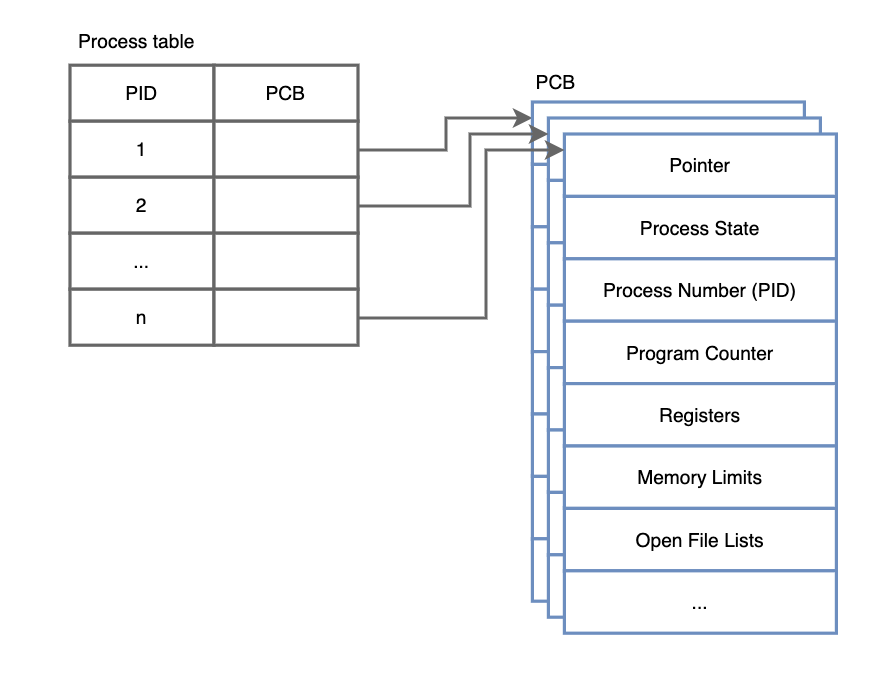
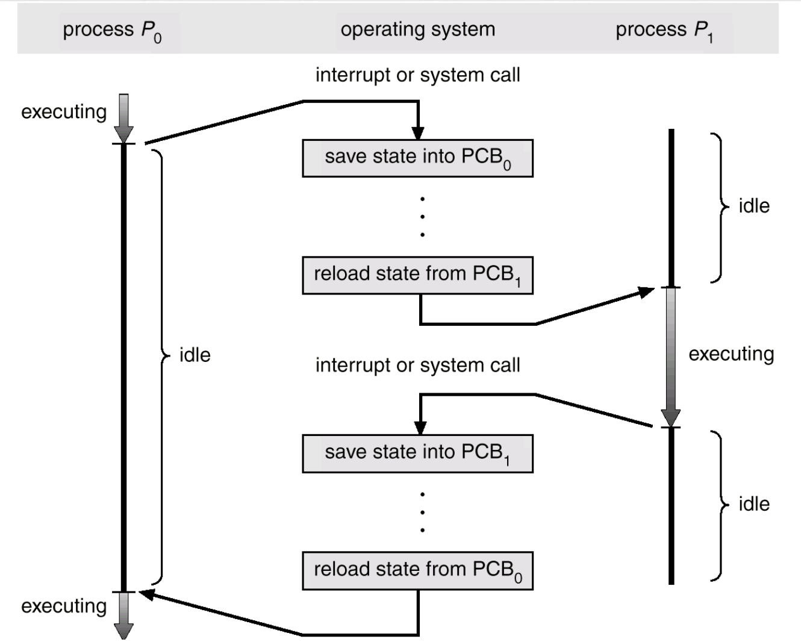
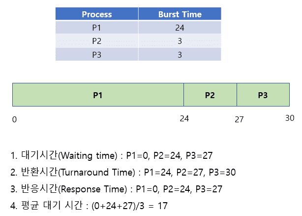
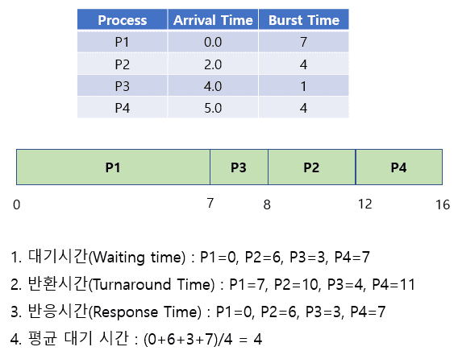
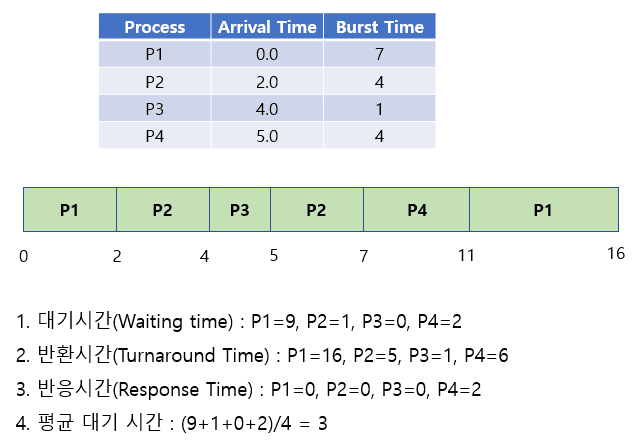
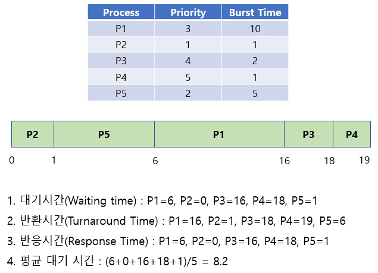
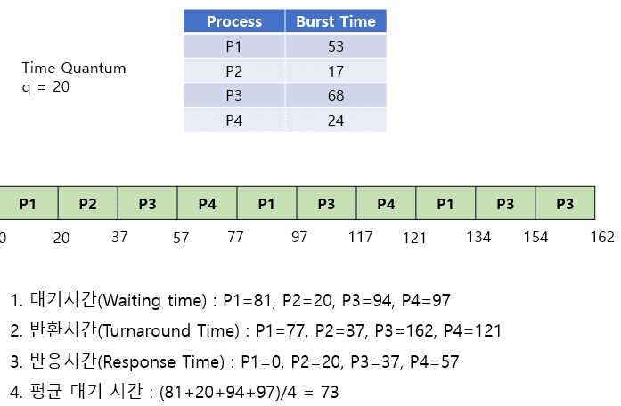
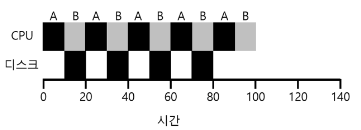
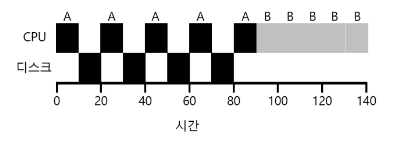

import * as Elem from '@elems';

컴퓨터 시스템에서 프로세스 관리는 효율적인 멀티태스킹과 자원 활용을 가능하게 하는 중요한 역할을 수행합니다.
이러한 관리의 핵심에는 `PCB`와 `Context Switching`이 있습니다.

# PCB (Process Control Block)

운영체제는 구동 중인 여러개의 프로세스를 CPU 스케줄링을 통해 어떤 프로세스가 CPU에 할당될지 결정합니다.
<mark>`PCB`는 프로세스 관리의 메타 데이터를 저장해놓은 곳입니다.</mark>
하나의 `PCB`에는 하나의 프로세스 정보가 담기죠.
커널은 하나의 프로세스 테이블을 두고 모든 프로세스를 관리합니다.
프로세스를 생성할 때마다 `PCB`를 생성하여 프로세스 정보를 저장하고, 프로세스 테이블의 비어있는 항목에 `PID`와 `PCB`를 연결합니다.

### PCB에 저장되는 정보

* **Pointer**: 프로세스의 현재 위치
* **Process State**: 프로세스의 상태 정보(Create, Ready, Running, Waiting, Termiated)
* **PID**: 프로세스의 고유 식별 번호
* **Program Counter**: 프로세스가 다음에 실행할 명령어 주소
* **Registers**: CPU 레지스터
* **Memory Limits**: 메모리 관리 시스템 정보(Page Table, Segment Table)
* **Open File Lists**: 프로세스가 실행 중에 열어놓은 파일에 관한 정보

# Context Switching

하나의 프로세스가 끝나기 전까지 다른 프로세스는 기다려야 한다면 여러 프로세스를 실행시키는 작업은 할 수 없습니다.
여러 <mark>프로세스들이 동시에 작동하는 것 처럼 만들기 위해 `Context Switcing`으로 프로세스를 변경해가며 작업을 처리해야합니다.</mark>

1. $P_0$ 프로세스가 진행 중 스케줄러에 의해 CPU 할당 시간이 끝나면 인터럽트가 발생합니다.
2. 현재 프로세스의 상태를 $PBC_0$에 저장합니다.
3. $PBC_1$에서 다음에 진행시킬 프로세스의 정보를 불러옵니다.
4. $P_1$ 프로세스를 실행합니다.

# CPU Scheduling

CPU가 하나의 프로세스 작업이 끝나면 다음 프로세스 작업을 수행해야 합니다.
이때 <mark>어떤 프로세스에 CPU를 할당할 것인지 결정하는 작업을 CPU 스케쥴링이라고 합니다.</mark>
먼저 대기 중인 프로세스를 실행하는 것이 가장 좋고 빠른 방법이 아닐 수 있습니다.

## Process State

프로세스의 각 상태들을 아래와 같은 의미를 가집니다.
- **Create**: 프로세스가 새로 생성되었을 때의 초기 상태입니다. 필요한 자원과 초기 설정을 할당받아 실행을 준비합니다.
- **Ready**: CPU를 제외한 모든 필수 자원을 할당받아 실행을 위해 준비된 상태입니다. CPU 스케쥴러의 관리 아래에서 실행 차례를 기다립니다.
- **Running**: CPU를 할당받아 명령을 처리하고 있는 상태입니다.
    - 우선순위가 높은 프로세스가 등장하면 실행 중인 프로세스가 중단될 수 있습니다.
- **Waiting**: 필요한 어떤 이벤트나 자원의 가용성을 기다리는 중입니다.
    - I/O 요청, 파일 접근, 네트워크 통신 완료 등의 작업을 기다리는 경우 이 상태가 됩니다.
    - 대기 상태의 프로세스는 CPU를 할당받을 수 있떠라도 요구 자원 혹은 이벤트가 준비될 때까지 기다려야 합니다.
- **Termitaed**: 프로세스가 작업을 완료하거나 어떠한 이유로 중단되어 더 이상 실행되지 않는 상태입니다.
    - 해당 프로세스는 시스템에서 제거되며, 사용하던 자원은 운영체제에 반환됩니다.

### CPU 스케쥴링은 아래와 같은 상황에서 발생할 수 있습니다.
1. **한 프로세스가 Running에서 Waiting 상태로 전환될 때 (I/O 발생)**
    - 프로세스가 실행 중일 때, 파일 읽기 및 쓰기, 네트워크 통신등의 I/O 작업을 요청하면 해당 I/O 작업이 끝날 때까지 프로세스는 CPU 사용할 수 없도록 Running에서 Waiting으로 전환.
2. **프로세스가 Running에서 Ready 상태로 전환될 때 (인터럽트 발생)**
    - 프로세스가 인터럽트에 의해 중단될 경우, 프로세스가 Ready 상태가 됩니다.
3. **프로세스가 Waiting에서 Ready 상태로 전환될 때 (I/O 종료)**
    - 프로세스가 요청한 I/O 작업이 완료되면, 프로세스가 Readt 상태가 됩니다.
4. **프로세스가 종료할 때**

<Elem.Comment>
1번과 4번 상황에서만 스케쥴링이 발생하는 것은 Non-Preemptive 스케쥴링이라고 합니다.
</Elem.Comment>

## Preemptive & Non-Preemptive

CPU 스케쥴링 알고리즘은 크게 선점형(Preemptive), 비선점형(Non-preemptive) 스케쥴링으로 나눌 수 있습니다.

### Non-Preemptive

비선점형 스케쥴링은 프로세스가 CPU를 점유하고 있다면 이를 뺐을 수 없는 방식입니다.
<Elem.ColorText color='var(--info)'>Context Switching으로 인한 비용이 상대적으로 적지만</Elem.ColorText>,
<Elem.ColorText color='var(--error)'>프로세스 배치에 따라 효율성 차이가 많이 납니다.</Elem.ColorText>

### Preemptive

선점형 스케쥴링은 프로세스가 CPU를 할당받아 실행 중이라도 운영체제가 강제로 이를 뺐을 수 있는 방식입니다.
<Elem.ColorText color='var(--info)'>CPU 처리 시간이 매우 긴 프로세스의 CPU 사용 독점을 막을 수 있어 효율적으로 운영</Elem.ColorText>이 가능하죠.
하지만 <Elem.ColorText color='var(--error)'>잦은 Context Switching으로 인한 비용이 발생합니다.</Elem.ColorText>

## CPU Scheduling Criteria

- **CPU Utilization**: 시간당 CPU를 사용한 시간의 비율
- **Throughput**: 시간당 처리한 작업의 비율
- **Turnaround Time**: 프로세스가 생성된 후 사용하던 자원을 모두 반환하는 데까지 걸리는 시간
    - 작업이 대기열에 들어와 실행된 시간, I/O 작업 시간을 모두 거쳐 작업을 반환하는 데까지 걸리는 시간
- **Waiting Time**: 대기열에 들어와 CPU를 할당받기까지 기다린 시간
    - 대기열에서 기다린 시간의 총 합
- **Response Time**: 대기열에서 처음으로 CPU를 얻을 때까지 걸린 시간
    - Waiting Time은 대기 시간의 총 합, Response Time은 첫 할당까지 대기 시간

<mark>CPU Utilization과 Throughput은 최대화, Waiting Time과 Response Time은 최소화</mark> 하는 알고리즘이 효율적인 알고리즘

# CPU Scheduling Algorithm

## FCFS(First Come First Served)

- 가장 먼저 요청한 프로세스에 CPU를 할당하는 방식으로 Non-preemptive Scheduling 입니다.
- Convoy Effect로 인해 Average Waiting Time과 Response Time이 길어질 수 있습니다.

<Elem.Comment>
Convoy Effect: CPU 사용시간이 긴 프로세스에 의해 짧은 프로세스들이 오래 기다리는 현상.
평균 대기 시간이 길어집니다.
</Elem.Comment>

## SJF(Shortest-Job-First)

- 다음 CPU 소요 시간을 고려하여 적은 작업을 우선적으로 할당하는 Non-preemptive Scheduling 입니다.
- Average Waiting Time을 줄일 수 있습니다.
- 늦게 추가된 프로세스는 아무리 짧더라도 이전 프로세스의 완료를 기다려야 하는 Convoy Effect가 존재합니다.

## STCF(Shortest Time-to-Completion First), SRTF(Shortest Remaining Time First)

- 현재 실행되고 있는 프로세스의 남은 시간보다 추가된 프로세스가 더 빨리 끝난다면 해당 프로세스를 먼저 실행하도록 CPU를 할당하는 Preemptive Scheduling 방식입니다.
- Convoy Effect를 해결했습니다.
- 프로세스가 CPU를 얼마나 필요로 하는지 예측하기 힘들고. Response Time 측면에서 좋지 않을 수 있습니다.

## Priority

- 각 프로세스들은 우선순위를 가지고 높은 우선순위의 프로세스에 CPU를 먼저 할당하는 방식입니다.
- Preemptive, Non-preemptive Scheduling 방식이 존재합니다.
- 낮은 우선순위의 프로세스가 절대 실행되지 않는 Starvation 문제가 발생할 수 있습니다.
    - 이를 해결하기 위해 대기 시간이 오래된 프로세스의 우선 순위를 높여주는 Aging 방식을 적용할 수 있습니다.

<Elem.Comment>
SRTF 방식도 CPU burst time을 우선순위로 하는 Priority Scheduling의 일종
</Elem.Comment>

## RR(Round Robin)

- 각 프로세스에 동일한 CPU Time Slice를 부여하여 해당 시간 동안만 CPU를 이용하게 합니다.
- 할당 시간 내 작업을 완료하지 못하면 다른 프로세스로 할당을 넘기는 Preemptive Scheduling 방식입니다.
- 프로세스가 대기하는 시간을 예측할 수 있습니다.
    - N개의 프로세스, 할당 시간이 Q 라면 (N-1)Q 시간 이상을 기다리지 않음
- Time Slice가 짧을수록 적은 Response Time을 가지지만 Context Switching 비용이 증가합니다.
- 공정하고 좋은 Response Time을 가지지만 Turnaround Time은 좋지 않습니다.

## 그 외

### 입출력 연산 고려

대부분의 프로세스는 CPU만을 사용하는 것이 아닌 I/O 작업을 진행합니다.
따라서 I/O 작업을 진행할 때 다른 프로세스에 CPU를 할당할 수 있도록 CPU를 반납합니다.

<Elem.TwoCols>
<Elem.Cols size={50}>

</Elem.Cols>
<Elem.Cols size={50}>

</Elem.Cols>
</Elem.TwoCols>