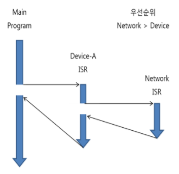
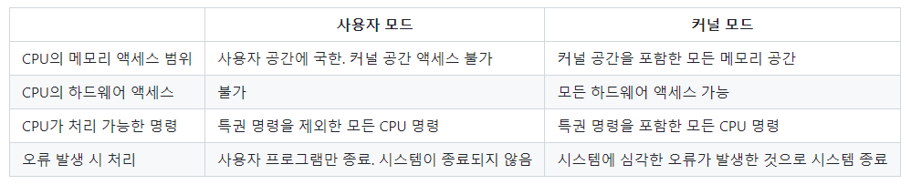
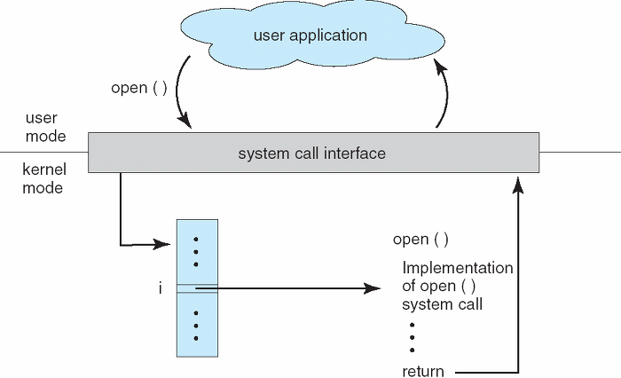
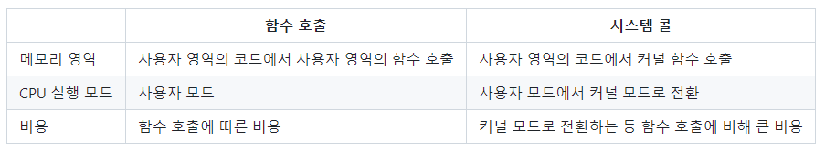

import * as Elem from '@elems';

인터럽트와 시스템 콜은 컴퓨터 시스템에서 중요한 역할을 수행하는 두 가지 기본적인 메커니즘입니다. 
이들은 하드웨어와 소프트웨어 사이의 상호작용을 관리하고, 운영 체제가 시스템 자원을 효율적으로 조정하며 프로세스 간의 통신을 가능하게 하는 데 중추적인 역할을 합니다.

# Interrupt

<mark>인터럽트는 CPU가 프로그램을 실행하고 있을 때 입출력 하드웨어 등의 장치 또는 예외 상황의 처리가 필요한 경우에 CPU에게 알려 처리할 수 있도록 합니다.</mark>
CPU가 프로그램을 순차적으로 수행하는 도중 인터럽트가 발생하면 프로그램의 수행을 중단하고 인터럽트를 먼저 처리하게 됩니다.
인터럽트 처리가 끝나면 다시 복귀하여 프로그램을 수행하는 것이죠.

## Hardware Interrupt

CPU의 외부에서 인터럽트 요구 신호에 의해 발생하는 인터럽트입니다.
- **Power Fail Interrupt**: 정전, 전원 이상 등의 경우에 발생합니다.
- **Machine Check Interrupt**: CPU등의 기능적인 동작 오류가 생긴 경우에 발생합니다.
- **External Interrupt**: 타이머 인터럽트(자원이 할당된 시간이 다 끝난 경우), 종료키(Ctrl+C) 등 외부 이벤트로부터 발생합니다.
- **I/O Interrupt**: 키보드 입력, 하드디스크 I/O 등 입출력 장치가 데이터 전송을 요구하는 경우 발생합니다.

## Software Interrupt

CPU 내부에서 잘못된 명령 혹은 데이터를 사용할 때 발생하는 인터럽트입니다.
- **Program Check Interrupt**: 0으로 나누거나, overflow/under flow, 예외 등에 발생합니다.
- **System Call**

## Interrupt Operation

앞서 나열한 순서대로 인터럽트의 우선 순위가 결정됩니다.
인터럽트의 동작 순서는 다음과 같아요.

1. **인터럽트 신호 발생**
2. **프로그램 실행 중단**
    - CPU는 현재 수행 중인 명령을 완료하고 다음 명령을 수행하지 않습니다.
3. **현재 실행 중인 프로그램 상태 보관**
    - 중단된 프로그램의 레지스터 상태를 저장합니다.
    - 인터럽트 번호를 읽고 `ISP` 주소값을 얻습니다.
    - 현재 `PC(Program Counter)`를 저장하고 `ISP` 주소로 점프합니다.
4. **`ISP(Interrupt Service Routine)` 처리**
    - 이 단계에서 우선순위가 더 높은 인터럽트가 발생하면 해당 인터럽트를 처리하는 과정을 먼저 진행합니다.
    - 위 그림에서 Network의 우선순위가 더 높아 Interrupt Handling 도중 Network Interrupt를 처리하기 위해 앞선 과정을 반복합니다.
5. **상태 복구**
    - `ISP` 끝에 도달하면 저장된 `PC`를 이용하여 이전 실행 위치로 복귀합니다.

# System Call

사용자 응용 프로그램이 실수로 혹은 악의적으로 커널 코드와 데이터를 훔쳐보거나 훼손하는 것을 방지하기 위해 메모리는 사용자 공간과 커널 공간으로 나누어 사용합니다.
응용 프로그램은 커널이 있는 메모리에 접근할 권한이 없기 때문에 일반적으로 사용자 모드에서 파일 입출력, 메모리 할당 해제, 프로세스 생성 관리 등의 작업을 구현할 수 없습니다.
<mark>시스템 콜은 응용 프로그램에서 커널에 작성됨 함수를 실행하는 커널과 응용프로그램 사이의 인터페이스 입니다.</mark>
OS는 커널 함수에 접근할 수 있는 시스템 콜 라이브러리를 제공합니다.
시스템 콜은 응용 프로그램이 커널 코드를 호출할 수 있는 유일한 방법이죠.
시스템 콜을 `Trap` 이라고 부르기도 합니다.
Trap을 실행하면 `mode bit(user mode=1, kernel mode=0)`가 0으로 전환됩니다.

## System Call Operation

각 시스템 콜에는 번호가 부여되고, 시스템 콜 인터페이스는 시스템 콜 번호와 핸들러 함수 주소로 구성된 시스템 콜 테이블을 가집니다.
시스템 콜 함수가 실행되면 시스템 콜 핸들러를 통해 해당 핸들러 함수를 실행시키죠.
해당 함수의 작업의 완료되면 CPU에게 인터럽트를 발생시켜 수행이 완료되었음을 알립니다.

