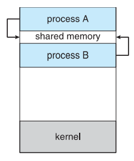
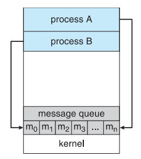

import * as Elem from '@elems';

현대의 컴퓨터 시스템에서 다양한 프로세스들이 효율적으로 작업을 수행하기 위해서는 서로 간의 통신과 데이터 공유가 필수적입니다. 
이러한 요구를 충족시키기 위해, `IPC(Inter-Process Communication)` 기술이 개발되었습니다.

# IPC(Inter-Process Communication)

프로세스는 독립적으로 실행되는 객체지만 정보 공유, 계산 속도 향상, 모듈성, 편의성을 위해 통신을 필요로 할 수 있습니다.
하지만 프로세스들의 주소 공간은 분리되어 있어 일반적으로 프로세스가 다른 프로세스의 공간에 접근할 수 없습니다.
<mark>`IPC`는 프로세스들 사이에 서로 데이터를 주고받는 행위 또는 그에 대한 방법이나 경로를 뜻합니다.</mark>
`IPC`를 통해 프로세스간 데이터를 공유할 수 있습니다.

## IPC Model

`IPC`의 두 가지 기본 모델에는 `Shared-memory Model`과 `Message-passing Model`이 있습니다.
- Shared-memory Model: `Shared Memory`, `Memory Map`
- Message-passing Model: `Signal`, `PIPE`, `FIFO`, `Message Queue`, `Socket`, `Semaphore`

## Shared-memory Model

<Elem.TwoCols align='center'>
<Elem.Cols size={30}>

</Elem.Cols>
<Elem.Cols size={60}>
<mark>프로세스 간의 공유 메모리 영역을 설정한 다음 공유 영역에서 데이터를 읽고 쓰는 방식</mark>으로 정보를 교환합니다.
<Elem.ColorText color='var(--info)'>System call이 공유 메모리 생성 및 제거 할때에만 필요하여 커널의 개입이 적어 상대적으로 빠르다</Elem.ColorText>는 장점이 있습니다.
하지만 메모리를 공유하는 만큼 <Elem.ColorText color='var(--error)'>동기화 문제가 발생할 수 있다</Elem.ColorText>는 단점이 있습니다.
</Elem.Cols>
</Elem.TwoCols>

## Message-passing Model

<Elem.TwoCols align='center'>
<Elem.Cols size={60}>
<mark>공유되는 주소 공간 없이, 협력 프로세스 간에 교환되는 메세지를 통해 정보를 교환합니다.</mark>
System call을 이용하여 생성된 queue를 통해 프로세스 간 메세지를 주고 받게 됩니다.
<Elem.ColorText color='var(--info)'>커널의 개입으로 동기화 문제로부터 안전하다</Elem.ColorText>는 장점이 있지만,
<Elem.ColorText color='var(--error)'>비교적 많은 시간이 걸린다</Elem.ColorText>는 단점이 존재합니다.
</Elem.Cols>
<Elem.Cols size={30}>

</Elem.Cols>
</Elem.TwoCols>

`Message-passing model`은 세 가지 요소가 다른 방식으로 구현될 수 있습니다.

### Direct & Indirect Communication
- **Direct Communication**: 프로세스가 커널에 메세지를 전달하면, 커널이 상대 프로세스에 직접 메세지를 전달합니다.
- **Indirect Communication**: 프로세스가 커널을 통해 메세지를 넣어두고, 상대 프로세스가 커널을 통해 메세지를 읽어옵니다.

### Synchronous
- **Blocking**: 두 프로세스는 메세지가 수신될 때 까지 기다립니다.
- **Non-blocking**: 송신측은 메세지를 보내두고 작업을 계속해서 진행하고, 수신측은 작업을 진행하다 메세지를 받으면 이를 처리합니다.
    - 메세지를 확인하는 방법은 주기적인 검사`(pooling)`를 진행하거나, 운영체제가 제공하는 event handling 방식으로 비동기적 처리

### Buffering
메세지를 보내는 프로세스와 받는 프로세스 사이에서 메세지를 임시로 저장하는 과정을 말합니다.
통신 중에 발생할 수 있는 속도 차이나 데이터 처리 능력 차이를 조절하는 역할이죠.
- **Zero Capacity**: 송신 프로세스는 수신 프로세스가 메세지를 받을 준비가 되어 있을 때만 메세지를 전송할 수 있습니다.
    - 두 프로세스가 모두 메세지를 주고 받을 준비가 되어있지 않다면 송신 프로세스는 blocking 됩니다.
- **Bounded Capacity**: N개의 메세지를 저장할 수 있고, N개의 메세지가 쌓여 있으면 송신 프로세스는 메세지를 보내지 못하고 기다립니다.
- **Unbounded Capacity**: Queue의 길이가 무한하여 송신 프로세스는 기다리지 않고 메세지를 보냅니다.

