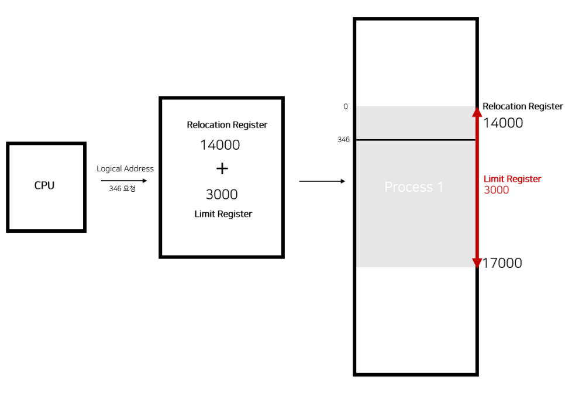
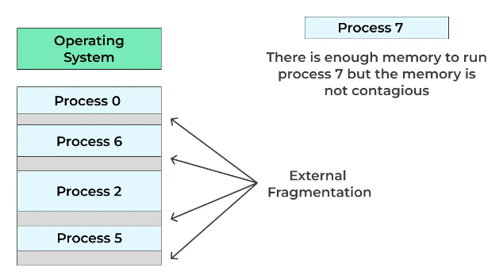
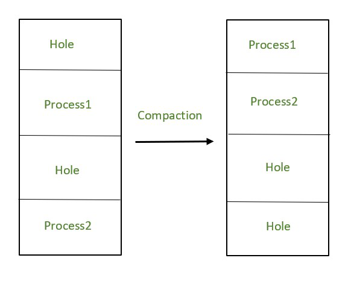
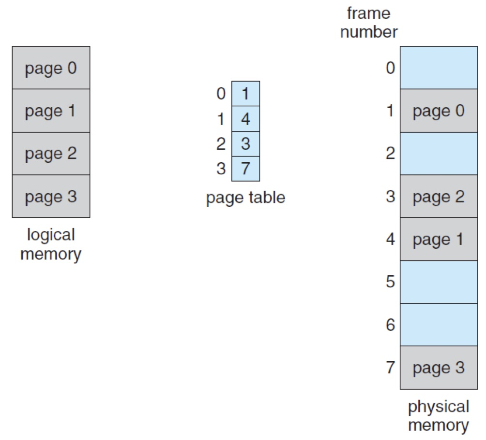
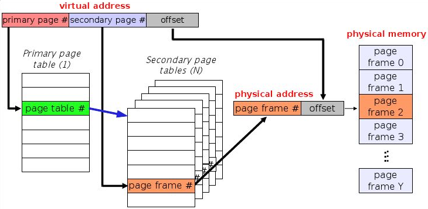
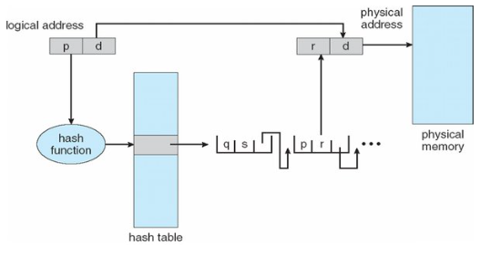
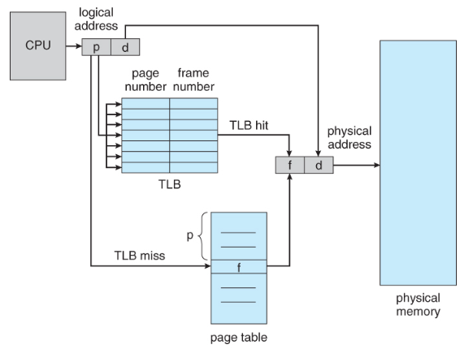

import * as Elem from '@elems';

메모리 관리는 운영 체제(OS)의 핵심 기능 중 하나로, 컴퓨터 시스템의 효율성과 성능을 극대화하는 데 필수적인 역할을 합니다.
모든 컴퓨터 시스템은 제한된 메모리 자원을 가지고 있으며, 이를 효과적으로 관리하는 것은 다양한 프로그램과 응용 프로그램이 원활하게 작동할 수 있도록 보장합니다.
운영 체제가 메모리를 어떻게 할당, 관리, 회수하는지에 대해 자세히 살펴볼 것이며, 이를 통해 운영 체제의 메모리 관리 전략의 중요성과 구체적인 메커니즘을 이해할 수 있습니다.

# Address Binding

`Logical Address` 프로그램이 실행되는 동안 사용되는 가상의 주소 공간입니다.   
`Physical Address` 메모리 장치 내에 실제 데이터가 저장되는 위치입니다.

<Elem.Comment>
Logical address는 보안과 메모리 사용의 유연성을 높이기 위함입니다.
</Elem.Comment>

<mark>CPU가 프로세스의 작업을 실행하기 위해 논리 주소 만으로 실제 메모리의 주소를 알 수 없기 때문에 물리 주소를 맵핑하는 작업을</mark> `address binding`이라고 합니다.

Address binding 시점으로 `compile time binding`, `load time binding`, `run time binding` 세 가지로 나눌 수 있습니다.

## Compile Time Binding

말 그래도 컴파일 시 물리 주소가 결정되는 방식입니다.
간단하게 말해서 프로그램 내부에서 사용하는 논리 주소와 물리 주소가 동일합니다.
현재 우리가 사용하는 컴퓨터는 <Elem.ColorText color='var(--error)'>한 가지 프로세스만 실행시키지 않기 때문에 이는 잘 사용되지 않는 방식입니다.</Elem.ColorText>

## Load Time Binding

프로세스가 실행될 때 물리 주소가 결정됩니다.
프로세스가 로딩되는 위치에 따라 물리 주소를 맵핑하는 방식입니다.
여러 프로세스를 동시에 실행시키는 멀티테스킹 환경에서 <Elem.ColorText color='var(--error)'>프로세스가 메모리에 로드될 때 고정된 위치에 배치되어야 하므로 메모리 관리가 복잡합니다.</Elem.ColorText>

## Run Time Binding

프로세스가 실행한 후에도 물리적 주소가 변경될 수 있는 방식입니다.
CPU가 주소를 참조할 때마다 해당 데이터가 물리 주소의 어느 위치에 있는지 `address mapping table`을 이용하여 binding 합니다.

# MMU(Mamory Management Unit)

`MMU`는 <mark>논리 주소를 물리 주소로 맵핑하기 위한 하드웨어 장치입니다.</mark>
이는 `relocation register`와 `limit register`로 이루어졌습니다.

`Limit register`는 프로세스가 접근 가능한 논리 주소의 크기입니다.
요청하는 논리 주소가 `limit register`보다 크면 OS에서 interrupt를 통해 프로세스를 종료합니다.

`Relocation register`는 프로세스가 접근할 수 있는 물리 주소의 최소값입니다.
논리 주소에 `relocation register` 값을 더하는 방법으로 물리 주소를 찾을 수 있습니다.

위 그림에서 논리 주소 346를 요청했을 때, `relocation register` + 논리 주소 인 14346의 값을 읽어 전달합니다.
이렇듯 `MMU`는 context switching이 발생할 때 `relocation register` 값을 바꿔주며 address binding을 할 수 있습니다.

# Fragmentation

사실 앞서 소개한 방법은 연속적인 시퀀스를 통채로 메모리에 올리는 방법입니다.
이러한 방식은 몇 가지 문제를 야기할 수 있습니다.

## External Fragmentation

위 그림은 같이 여러 프로세스가 실행되고 종료된 상황입니다.
연속적인 크기로 메모리를 할당한다면 적은 메모리를 사용하던 프로세스가 종료되면 다음과 같이 비어있는 공간 `hole`이 생깁니다.
이때 만약 모든 `hole`보다 큰 메모리 사용량을 가지는 프로세스가 실행되었을 때, 메모리 할당 공간이 부족해서 프로세스는 대기하게 됩니다.
<mark>충분한 메모리 공간이 파편화 되어 있어 프로세스가 실행되지 못하는 현상을</mark> `external fragmentation`라고 합니다.

## Compaction

`External fragmentation` 문제를 해결하기 위해 필요한 메모리 공간만큼 사용 중인 메모리 공간들을 정리하여 자리를 만들어주면 됩니다.

이러한 방법은 프로세스를 저장소(SSD, HDD)에 복사한 후 다시 가져와 연속된 빈 공간을 만들어내는 방식이죠.
하지만 <Elem.ColorText color='var(--error)'>복사 후 가져오는 과정은 큰 overhead를 발생시키는 문제가 있습니다.</Elem.ColorText>

# Paging

`page` 논리 주소를 여러 개로 나눈 단위  
`frame` 물리 주소를 여러 개로 나눈 단위

<Elem.TwoCols align='center'>
<Elem.Cols size={45}>

</Elem.Cols>
<Elem.Cols size={50}>
앞선 문제들은 결국 연속적인 메모리 할당으로 인해 발생하였습니다.
이를 <mark>페이지와 프레임을 이용하여 연속적이지 않은 형태로 저장하는 방법을 </mark>`paging`이라고 합니다.
이때 페이지와 프레임은 모두 동일한 크기로 나누어야 합니다.

위 그림과 같이 작은 단위로 메모리를 사용할 수 있고 이를 `page table`을 이용하여 논리 주소에서 물리 주소를 알아낼 수 있습니다.
이러한 방법으로 <Elem.ColorText color='var(--info)'>`external fragmentation` 문제를 해결할 수 있습니다.</Elem.ColorText>
</Elem.Cols>
</Elem.TwoCols>

## Page Table

`Page table`을 이용하여 물리 주소를 찾는 과정을 조금 더 자세히 바라보겠습니다.
$2^{32}$bit의 논리 메모리를 가지고, 페이지의 크기가 $2^{12}$bit 라고 한다면, 페이지 테이블의 크기는 $2^{20} \cdot 4$bytes, 즉 4MB 입니다.
만약 프로세스가 10개가 되면 페이지 테이블의 크기만 총 40MB가 되고 성능에 문제가 발생하죠.
이를 해결하기 위해 다양한 방법이 존재합니다.

## Multi-level paginig

`Multi-level paging`은 여러 단계의 레이어를 거쳐 물리 주소를 찾는 방법입니다.
<Elem.ColorText color='var(--info)'>모든 페이지 테이블을 들고 다니지 않아도 되기 때문에 메모리 문제가 덜하지만</Elem.ColorText>, 
<Elem.ColorText color='var(--error)'>레이어가 많아짐에 따라 메모리 접근에 대한 overhead가 발생합니다.</Elem.ColorText>

## Hashed Page Table

주소 공간이 32bit보다 크면 가상 페이지 번호가 되는 `hashed page table`을 많이 사용합니다.
논리 주소 공간의 페이지 번호인 p를 hash를 이용한 결과값으로 테이블을 검색한 후 해당 물리 메모리를 찾아갑니다.

## Internal Fragmentation

앞서 동일한 크기의 페이지와 프레임을 이용하여 `external fragmentation` 문제를 해결했습니다.
하지만 메모리의 크기가 페이지의 크기에 맞춰 나누어 떨어지지 않을 수 있습니다.
이러한 경우 <mark>페이지 내부에 빈 공간이 발생하는 것을</mark> `internal fragmentation`이라 합니다.

# TLB(Translation Look-aside Block)

페이지 테이블을 어디에 저장해야 가장 빠르게 참조할 수 있을까요?
`MMU`는 4MB가 되는 페이지 테이블을 저장할 수 없습니다.
또한 페이지 테이블을 메모리에 저장한다면 메모리에 접근하기 위해 메모리를 접근하는, 2번의 접근 과정이 필요합니다.

사실 페이지 테이블은 크기가 크지만 모두 다 사용되는 것은 아닙니다.
프로그램은 `locality` <mark>라는 특성을 가지고 있어 자주 쓰이는 녀석은 자주 쓰이고 안쓰이는 녀석은 거의 안쓰입니다.</mark>
이를 이용하여 캐시 메모리에 페이지 테이블을 저장하려고 합니다.

가상주소가 주어지면 이를 `TLB`에서 확인을 합니다.
`TLB`에 가상주소가 존재하면`(TLB hit)` 프레임 번호를 추출하여 오프셋과 물리 주소를 구성합니다.
`TLB`에 가상주소가 존재하지 않으면`(TLB miss)` 페이지 테이블로 가서 프레임 번호를 얻어 오프셋과 물리 주소를 구성합니다.

# Segmentation

일정단 단위로 나누어 저장하는 `paging` 방법에도 문제가 있습니다.
프로세스의 메모리는 code, data, stack, heap 영역으로 구성되어 있는데 페이지를 통해 나누면 여러 영역이 섞일 수 있다는 문제가 있습니다.
따라서 이를 아주 간단하게는 code, data, stack & heap 처럼 <mark>영역별로 나누어 저장하는</mark> `segmentation` 방식이 등장합니다.

 
`Segment Table`에서는 각 segment에 대한 기본 주소와 크기를 가지고 있습니다.
오프셋과 리밋을 이용하여 초과된 메모리를 가르키는지 확인하고, 기본값과 오프셋을 이용해 물리 주소를 파악할 수 있습니다.
이러한 방법은 <Elem.ColorText color='var(--info)'>여러 영역이 섞이지 않게 하는 보호`(protection)` 기능을 합니다.</Elem.ColorText>
같은 프로그램을 여러 프로세스가 사용한다면 <Elem.ColorText color='var(--info)'>동일한 세그먼트를 공유하도록 하여 메모리를 절약할 수도 있습니다.</Elem.ColorText>
또한 <Elem.ColorText color='var(--info)'>고정된 영역이 아니기 때문에 영역내 빈 공간이 발생하는 `internal fragmentation`이 발생하지 않습니다.</Elem.ColorText>
하지만 <Elem.ColorText color='var(--error)'>세그먼트의 크기가 고정적이지 않고 가변적이기 때문에 `external fragmentation`이 발생할 수 있습니다.</Elem.ColorText>

# Paging + Segmentation

서로의 장점만을 이용하기 위해 `paging`과 `segmentation`을 결합하여 사용하는 방법이 등장하였습니다.
하나의 segment를 page로 쪼개어 저장하는 방식으로 `external fragmentation`을 해결할 수 있습니다.
하지만 <Elem.ColorText color='var(--error)'>테이블을 두번 참조해야 하기 때문에 상대적으로 큰 오버헤드가 발생합니다.</Elem.ColorText>