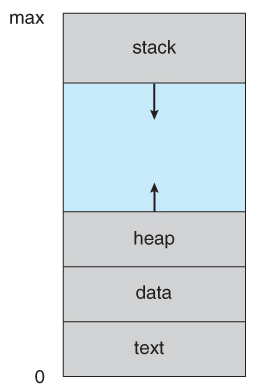
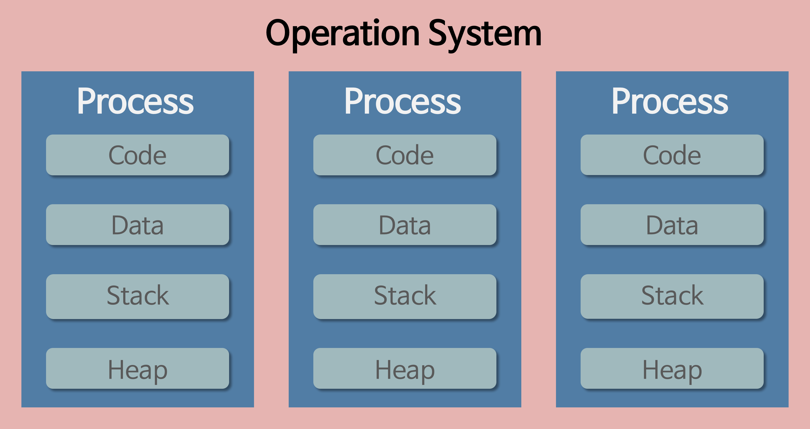
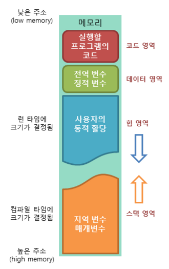
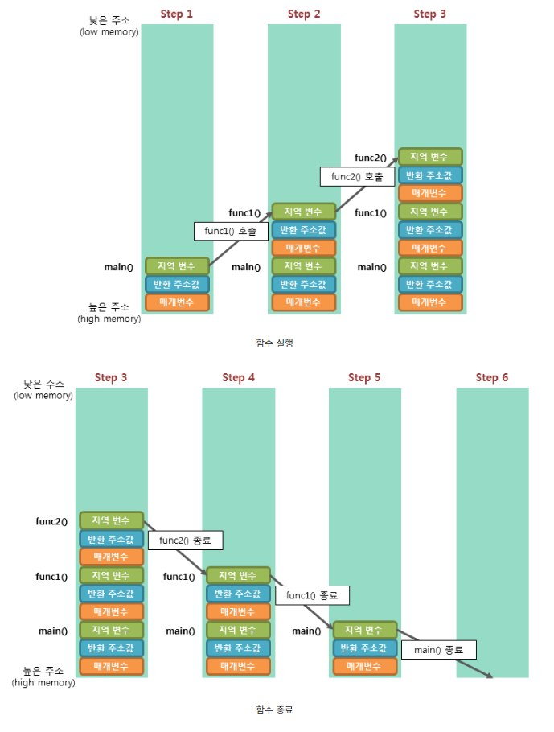

import * as Elem from '@elems';

예전에는 컴퓨터가 하나의 동작밖에 수행하지 못했다.
하지만 다중 작업을 가능하게 하는 멀티테스킹이 기능이 나오며 컴퓨터가 프로세스 여러 개를 함께 돌리는 것이 가능해졌다.

# Process

<mark>프로세스는 메모리에 올라와 실행 중인 프로그램 인스턴스(개별요소)이다.</mark>
프로그램이 실행되면 메모리에 올라가고 운영체제로 시스템 자원을 할당 받는다.

<Elem.Comment>
여기서 시스템 자원은 CPU 시간, 주소 공간, 독립된 메모리 영역등을 말함!
</Elem.Comment>

<Elem.TwoCols align='center'>
<Elem.Cols size={65}>
프로세스 메모리 역영은 code, data, heap, stack 4개의 메모리 영역으로 구성됩니다.
- code: 프로세스 코드가 적재되는 영역
- data: 프로세스의 전역 변수와 정적 변수들이 적재되는 영역
- heap: 프로세스가 실행 중에 동적 할당받는 영역
- stack: 함수가 호출될 때 지역 변수, 매개 변수, 함수로부터 돌아갈 주소 등이 저장되는 영역등을
</Elem.Cols>
<Elem.Cols size={30}>

</Elem.Cols>
</Elem.TwoCols>

프로세스는 각각 독립된 메모리 영역을 할당받기 때문에 다른 프로세스의 영역이나 자료구조에 바로 접근할 수 없습니다.
다른 프로세스의 자원에 접근하기 위해서는 프로세스간 통신 `IPC(Inter-Process Communication)`을 사용해야 합니다.
운영체제는 프로세스마다 고유 번호를 할당하고, 프로세스의 정보를 관리합니다.
프로세스를 만들고, 실행하고, 대기하고, 종료하는 관리를 커널이 수행하죠.

### Multi Process

하나의 프로그램에서 여러 개의 프로세스를 실행하는 것을 멀티 프로세스라고 합니다.
대표적으로 웹 브라우저의 탭을 예시로 들 수 있죠.

멀티 프로세스는 <Elem.ColorText color={'var(--info)'}>**하나의 자식 프로세스에 문제가 발생해도 다른 자식 프로세스에는 영향을 미치지 않는다는 장점이 있습니다.**</Elem.ColorText>
하지만 모든 프로세스는 독립적인 공간을 가지므로 <Elem.ColorText color={'var(--error)'}>**생성, 초기화에 많은 시간이 소요되고, 프로세스간 변수를 공유하기에 어려움이 있습니다.**</Elem.ColorText>
또한 공유하는 메모리가 없기 때문에 실행중인 프로세스를 변경하기 위해 캐시에 모든 데이터를 리셋하고 다시 불러와야 해서 
<Elem.ColorText color={'var(--error)'}>**Context Switching 비용이 큽니다.**</Elem.ColorText>

# Thread

프로세스 내에 실행되는 흐름의 단위인 스레드의 개념이 탄생합니다.
<mark>하나의 프로세스는 반드시 하나 이상의 스레드를 가지게 됩니다.</mark>

<mark>스레드는 프로세스 내에서 각각의 stack만 할당받고 code, data, heap 영역을 공유합니다.</mark>
따라서 하나의 스레드가 프로세스의 자원을 변경하면, 다른 스레드에서 이를 확인할 수 있습니다.
또한 프로세스에 비해 생성과 종료가 빠르고 가볍습니다.

### Multi Thread

하나의 프로세스에 여러개의 스레드가 있는 것을 멀티 스레드라고 합니다.
대표적으로 웹 서버를 예시로 들 수 있죠.

멀티 스레드는 하나의 스레드가 블락되어도 다른 프로세스는 실행되기 때문에 <Elem.ColorText color={'var(--info)'}>**프로세스 전체가 블록되는 일은 발생하지 않습니다.**</Elem.ColorText>
프로세스를 생성하고 자원을 할당하는 시스템 콜 역시 줄어들어 <Elem.ColorText color={'var(--info)'}>**시스템 처리량이 증가합니다.**</Elem.ColorText>
또한 프로세스 내 stack을 제외한 모든 메모리를 공유하기 때문에 <Elem.ColorText color={'var(--info)'}>**스레드 간의 통신 비용이 적습니다.**</Elem.ColorText>
그러나 자원을 공유하기 때문에 <Elem.ColorText color={'var(--error)'}>**디버깅이 어렵고 주의 깊은 설계가 필요합니다.**</Elem.ColorText>

# Process Address Space

앞서 운영체제가 프로세스에 대한 자원을 할당한다고 했습니다.
프로세스가 메모리를 할당 받으면 자신만의 방법으로 메모리를 관리합니다.

**Code(Text) 영역**
- 프로그램을 실행시키는 실행 파일 내의 명령어들이 위치하는 공간으로 컴파일 시 결정됩니다.
- 프로그램의 코드는 수정되면 안되므로, **Read-Only**로 지정됩니다.
- 같은 프로그램으로 실행된 여러 프로세스는 동일한 코드를 가집니다.  
<Elem.ColorText color={'var(--success)'}>동일한 내용을 특정 공간에 할당하여 메모리 사용량 절약 가능 (Paging)</Elem.ColorText>

**Data 영역**
- 전역 변수, 정적 변수들이 위치합니다.
- 한 프로세스 내 여러 스레드가 공통으로 Data 영역을 공유합니다.
- 실행 중에 변수가 수정될 수 있기 때문에 **Read-Write**로 지정됩니다.

<Elem.Comment>
Data 영역 중 초기화된 데이터 영역(Initialized Data Segment)는 `int global_var = 5;` 와 같이 컴파일 시 초기값이 설정된 변수들이 저장되는 메모리 영역입니다. 프로그램 로딩 시 메모리에 로드되어 실행 파일의 크기에 직접적인 영향을 줍니다. 반면 초기화되자 않은 데이터 영역(Uninitialized Data Segment) 또는 BSS(Block Stated Symbol)은 초기값이 명시되어 있지 않은 전역, 정적 변수들이 저장되는 메모리 영역입니다. 이 변수들은 기본적으로 0 또는 null 값으로 초기화되고, 실행 파일에는 실제 데이터 대신 초기화해야 할 메모리의 크기만 저장됩니다.
</Elem.Comment>

**Heap 영역**
- 프로세스 실행 중 동적으로 할당 및 해제되는 메모리 할당 영역으로 런타임에 크기가 결정됩니다.
- Class와 같은 참조형 데이터 값이 저장됩니다.
- 정해진 heap size 이상으로 heap을 할당하려 하면 `heap overflow`가 발생합니다. (메모리 해제 없이 과도한 메모리 할당)

**Stack 영역**
- 프로세스 실행 시 사용되는 임시 영역으로 지역 변수, 매개 변수, 반환 주소 등을 저장합니다.
- 정해진 stack size 이상으로 stack을 할당하려 하면 `stack overflow`가 발생합니다. (너무 많은 함수 호출)

1. 프로그램이 실행되면 가장 먼저 main() 함수가 호출되어 main() 함수의 stack frame이 stack에 저장됩니다.
2. func1() 함수를 호출하면 해당 함수의 매개 변수, 반환 주소값, 지역 변수 등을 가진 stack frame이 stack에 저장됩니다.
3. func2() 함수를 호출하면 해당 함수의 stack frame이 stack에 저장됩니다.
4. func2() 함수의 작업이 완료되면 func2() 함수의 stack frame이 stack에서 제거됩니다.
5. func1() 함수의 작업이 완료되면 func1() 함수의 stack frame이 stack에서 제거됩니다.
6. main() 함수의 작업이 완료되면 main() 함수의 stack frame이 stack에서 제거되며 프로그램이 종료됩니다.

<Elem.Comment>
AClass member = new AClass();
위와 같은 선언에서 변수의 값은 heap에 저장되고 이를 가르키는 주소는 stack에 저장됩니다.
</Elem.Comment>