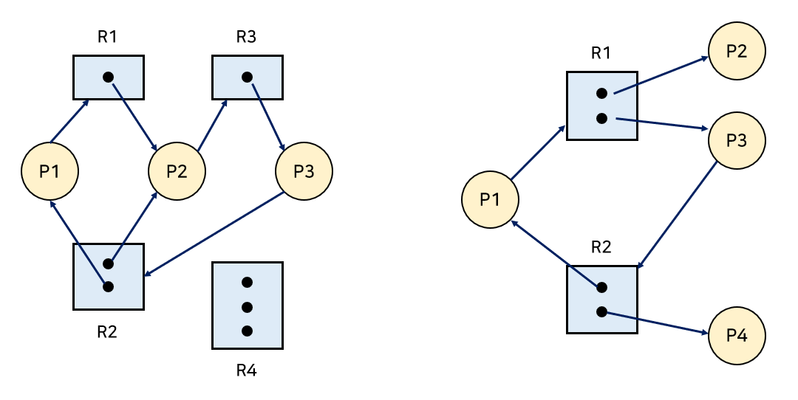

import * as Elem from '@elems';

멀티스레딩 또는 멀티프로세싱 환경에서 여러 프로세스 또는 스레드가 동시에 실행되면서 자원에 대한 접근을 시도할 때, 다양한 동기화 문제가 발생할 수 있습니다.
이러한 문제들을 이해하고 해결하는 것은 소프트웨어 개발에서 매우 중요한 부분입니다. 
가장 일반적인 동기화 문제로는 `race condition`, `deadlock`이 있으며, 
이를 방지하고 관리하기 위한 메커니즘으로 `mutex`와 `semaphore`가 널리 사용됩니다. 
동기화 이슈의 개념을 설명하고, 각각이 시스템에 미치는 영향과 해결 방안을 통해 동시성을 효율적으로 관리하는 방법을 이해할 수 있을 것입니다.

# Race Condition

각 프로세스에 존재하는 공유 자원에 접근하는 코드 영역을 `critical section`이라 합니다.
<mark>`critical section`에 둘 이상의 프로세스 또는 스레드가 접근하여 읽거나 쓰는 경우 순서에 따라 실행 결과가 달라지는 상황 `race condition`이 발생</mark>합니다.

위 그림처럼 어떠한 CPU가 마지막으로 Count를 저장했는지에 따라 결과값이 달라집니다.
이를 `critical section problem`이라고 하죠.

`Critical section problem`을 해결하기 위해 아래와 같은 조건이 충족되어야 합니다.
- **Mutual Exclusion**: 하나의 스레드가 `critical section` 코드를 수행 중이면 다른 스레드들은 그 영역에 접근할 수 없어야 합니다.
- **Progress**: 현재 `critical section`에 진입한 스레드가 없는 상태에서 스레드가 진입하려 한다면 이를 허용해야 합니다.
- **Bounded Waiting**: `critical section`에 진입을 위해 무한정 대기하는 스레드는 없어야 합니다.

# Synchronization Algorithms

`Critical section problem`을 해결하기 위해 여러 알고리즘이 등장합니다.

### Algorithm 1

위 방식은 `critical section`에 들어갈 어떠한 프로세스가 들어갈지 변수를 통해 명시하는 방식입니다.
<Elem.ColorText color='var(--info)'>`turn`이라는 변수에 특정한 프로세스만 진입을 허용하도록 명시하여 `mutual exclusion`을 만족</Elem.ColorText>합니다.
하지만 <Elem.ColorText color='var(--error)'>진입한 프로세스가 없음에도 `turn`에 명시되어 있지 않으면 접근할 수 없다는 `progress`는 만족하지 못하죠.</Elem.ColorText>

### Algorithm 2

위 방식은 `critical section`에 진입할 준비가 되었다는 변수를 두어 다른 프로세스가 `critical section`에 진입하려 하면 기다리는 방식입니다.
<Elem.ColorText color='var(--info)'>`Mutual exclusion`은 만족하지만</Elem.ColorText> 
만약 <Elem.ColorText color='var(--error)'>두 프로세스가 모두 `critical section`에 진입하기 전 `flag`가 모두 `true`가 된다면 
두 프로세스 모두 무한히 대기하는 `deadlock`에 걸리게 됩니다.</Elem.ColorText>

## Peterson's Algorithm

`Perterson's algorithm`은 이전의 두 알고리즘을 합쳐놓은 개념입니다.
`flag`와 `turn`을 모두 사용하여 <Elem.ColorText color='var(--info)'>`critical section`에 한 번에 하나의 프로세스만 접근하도록 하여 `mutual exclusion`을 만족하고,
접근한 프로세스가 없다면 진입을 요청한 프로세스가 접근하도록 하는 `progress`를 만족하죠.</Elem.ColorText>
하지만 <Elem.ColorText color='var(--error)'>`critical section`의 진입을 기다리는 프로세스는 계속해서 진입 조건을 검사하며 CPU와 메모리를 사용하는 `busy waiting` 문제</Elem.ColorText>가 있습니다. 

## Synchronization Hardware

이전까지 알고리즘들은 데이터를 읽고 쓰는 것을 하나의 명령어로 처리할 수 없기 때문에 복잡했습니다.
이를 하드웨어적으로 현재 상태를 확인하고 변경하는 명령을 atomic하게 수행할 수 있도록 만들어 복잡한 알고리즘을 간단하게 만들었습니다.
위는 Test_and_Set 명령을 이용하여 쉽게 lock을 구현하는 방법입니다..

## Mutex

`Critical section problem`을 해결하기 위한 방법으로 `Mutex(Mutual Exclusion) locks`가 있습니다.
`Mutex`는 하나의 프로세스가 `critical section`에서 작업 중이면 다른 프로세스들은 `critical section`에 들어갈 수 없도록 하는 locking 메커니즘을 따릅니다.
Lock을 걸고 푸는 동작은 atomic하게 수행됩니다.

이러한 방식은 여전히 <Elem.ColorText color='var(--error)'>`critical section`에 프로세스가 존재할 때 다른 프로세스는 CPU와 메모리를 사용해 진입을 시도하려는 `busy waiting` 문제</Elem.ColorText>가 남아있습니다.
이렇게 lock이 반환될 때까지 계속 확인하며 기다리는 것을 `spin lock`이라고 합니다.
<mark>`Spin lock`은 context switching 비용보다 진입을 위한 대기 시간이 짧은 특수한 상황을 위해 고안되었습니다.</mark>

## Semaphores

`Semaphore`는 `counter`를 이용하여 동시에 자원에 접근할 수 있는 프로세스를 제한하는 방식입니다.

`Semaphore`는 오직 atomic한 `wait(P-operation)`, `signal(V-operation)`을 통해 semaphore 변수에 접근할 수 있습니다.

위와 같이 P, V operation을 이용하여 `semaphore`를 구현할 수 있습니다.
하지만 이 방식은 `busy waiting` 문제가 발생합니다.
이를 <Elem.ColorText color='var(--info)'>`critical section`으로 진입을 실패한 프로세스를 block 시킨 후 `critical section`에 자리가 나면 다시 깨우는 식의 `block & wakeup` 방법으로 CPU 낭비 문제를 해결</Elem.ColorText>할 수 있습니다.
하지만 `critical section` 대기 시간이 짧은 경우 `block & wakeup`의 overhead가 더 크게 발생할 수 있습니다.

Block을 수행하면 커널은 block을 호출한 프로세스를 정지시키고, 해당 프로세스의 PCB를 `wait queue`에 넣습니다.
Wakeup을 수행하면 block 된 프로세스 P를 깨운 다음, 이 프로세스의 PCB를 `ready queue`로 이동시킵니다.

<Elem.Comment>
signal에서 자원을 반환 했음에도 S.value가 0 이하라는 의미는 기다리는 프로세스가 존재한다는 의미!
또 N개의 프로세스가 접근 가능하다는 의미지, 그 안에서도 읽고 쓰기를 위한 설계가 필요함!
</Elem.Comment>

## Monitor

`Semaphore`의 문제점은 <Elem.ColorText color='var(--error)'>구체적인 설계가 필요하고, 정확성을 입증하기 어렵습니다.</Elem.ColorText>
이러한 단점을 보완하기 위해 <mark>동시 수행 중인 프로세스 사이에서 추상 데이터의 안전한 공유를 보장하기 위한 high level 동기화 구조 `monitor`</mark>가 등장합니다.

공유 데이터를 접근하기 위해서는 `monitor`의 내부 procedure를 통해서만 접근할 수 있습니다.
동일한 시간에 오직 하나의 프로세스나 스레드만이 `monitor`에 들어갈 수 있습니다.

# Deadlock

<mark>`Deadlock`은 프로세스들이 서로 가진 자원을 기다리며 block되어 더 이상 진행할 수 없는 상태를 의미합니다.</mark>

### Deadlock 발샐 조건

1. **Mutual Exclusion**: 하나의 프로세스만이 자원을 사용할 수 있습니다.
2. **Hold and Wait**: 자원을 가진 프로세스가 다른 자원을 기다릴 때, 보유하고 있는 자원을 놓지 않고 계속 가지고 있습니다.
3. **No preemption**: 프로세스는 OS에 의해 강제로 자원을 빼앗기지 않습니다.
4. **Circular Wait**: 자원을 기다리는 프로세스 간에 사이클이 형성되어 있어야 합니다.
    - $P_0$는 $P_1$을 기다리고, $P_1$은 $P_2$를 기다리고, $P_2$는 $P_0$를 기다리고..

위 네 가지중 어느 하나라도 만족하지 않도록 설계하여 `deadlock`을 막을 수 있지만, 
<Elem.ColorText color='var(--error)'>이는 처리량과 효율성을 감소시키고, starvation이 발생할 수 있습니다.</Elem.ColorText>

프로세스 간의 관계를 그래프로 도식화하면 `deadlock`이 발생할 지 예상할 수 있습니다.
위 그림에서 왼쪽은 cycle이 존재하기 떄문에 `deadlock`이 발생할 수 있습니다.
반면 오른쪽 그림에서 $P1$, $P3$ 에 대한 cycle이 존재하지만 $P2$와 $P4$의 작업이 끝나면 가용한 자원이 많기 때문에 `deadlock`이 발생하지 않습니다.

## Deadlock Avoidance

따라서 프로세스들이 필요로 하는 각 자원의 최대 사용량을 미리 선언하도록 하여 `deadlock`이 발생할 가능성이 있는 경우 자원을 할당하지 않는 방식으로 설계할 수 있습니다.

**Safe Sequence**: 프로세스의 sequence가 존재할 때, **$P_i$의 자원 요청**이 **가용 자원 + $P_j (j < i)$의 보유 자원** 에 의해 충족되는 경우를 말합니다.  
**Safe State**: 시스템 내의 프로세스들에 대한 `safe sequence`가 존재하는 상태입니다.

시스템이 `safe state`에 있으면 `deadlock`이 발생하지 않습니다.
`Deadlock Avoidance`는 시스템이 `unsafe state`에 들어가지 않도록 보장하는 것입니다.

### Banker's Algorithm

어떤 자원의 할당을 허용하는지에 대한 여부를 결정하기 전, 미리 결정된 모든 자원들의 최대 할당량을 가지고 시뮬레이션을 통해 `safe state`를 검사합니다.

총 자원이 12개인 시스템에 위와 같이 자원을 요구하는 프로세스들이 있다고 생각합시다.
현재 $5+2+2=9$개의 자원이 할당되어 있고, 사용 가능한 자원은 $3$개입니다.
이를 해결하기 위해 아래와 같은 순서를 거칩니다.

1. $P1$은 필요로 하는 자원이 가용한 자원보다 작으므로 2개의 자원을 할당합니다. <Elem.ColorText color='var(--success)'>**[가용 자원 1]**</Elem.ColorText>
2. 실행이 끝난 $P1$은 할당된 4개의 자원을 반납합니다.  <Elem.ColorText color='var(--success)'>**[가용 자원 5]**</Elem.ColorText>
3. $P0$에게 가용한 자원 5개를 모두 할당합니다.  <Elem.ColorText color='var(--success)'>**[가용 자원 0]**</Elem.ColorText>
4. 실행이 끝난 $P0$는 할당된 10개의 자원을 반납합니다.  <Elem.ColorText color='var(--success)'>**[가용 자원 10]**</Elem.ColorText>
5. $P2$에게 가용한 자원 7개를 할당합니다.  <Elem.ColorText color='var(--success)'>**[가용 자원 3]**</Elem.ColorText>
6. 실행이 끝난 $P2$는 할당된 9개의 자원을 반납합니다.  <Elem.ColorText color='var(--success)'>**[가용 자원 12]**</Elem.ColorText>

이러한 방법은 <Elem.ColorText color='var(--success)'>미리 최대 자원 요구량을 알아야 하는 어려움이 존재합니다.</Elem.ColorText>

## Deadlock Detection and Recovery

`Deadlock`이 발생 여부를 `Resource Allocation Graph`등을 통해 탐지하고 이를 회복하기 위해 프로세스를 종료하거나 자원을 선점하는 방식을 사용할 수 있습니다.

프로세스를 중단하기 위해 우선 순위, 할당된 자원의 양, 얼마나 오래 실행 되었는가 등 여러 가지 상황을 고려하여 한번에 하나의 프로세스를 종료합니다.
이 후 `deadlock`을 조사하고 이 방법을 `deadlock`이 해제될 때 까지 반복합니다.
해제되는 프로세스는 `deadlock`이 발생하기 전으로 롤백하여 프로세스를 재시작합니다.
이러한 방식은 <Elem.ColorText color='var(--error)'>동일한 프로세스가 계속해서 희생하는 경우 starvation이 발생할 수 있습니다.</Elem.ColorText>

## Deadlock Ignorance

`Deadlock`이 발생하는 것이 매우 드물고, `deadlock`에 대한 조치가 오히려 더 큰 overhaed를 발생할 수 있습니다.
따라서 `deadlock`이 발생하여 시스템이 비정상적으로 작동하는 것을 느끼면 직접 프로세스를 죽이는 방법으로 처리할 수 있습니다.
UNIX, Windows 등 운영체제가 선택하는 방식입니다.