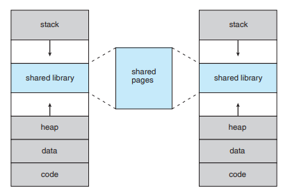
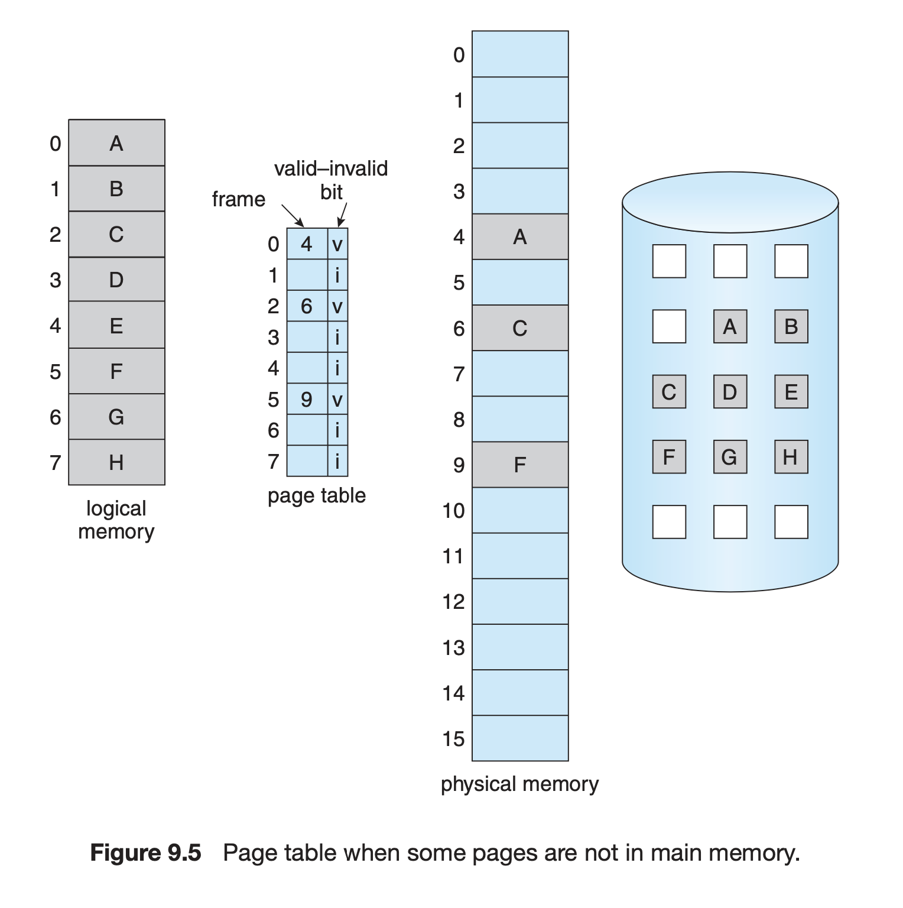
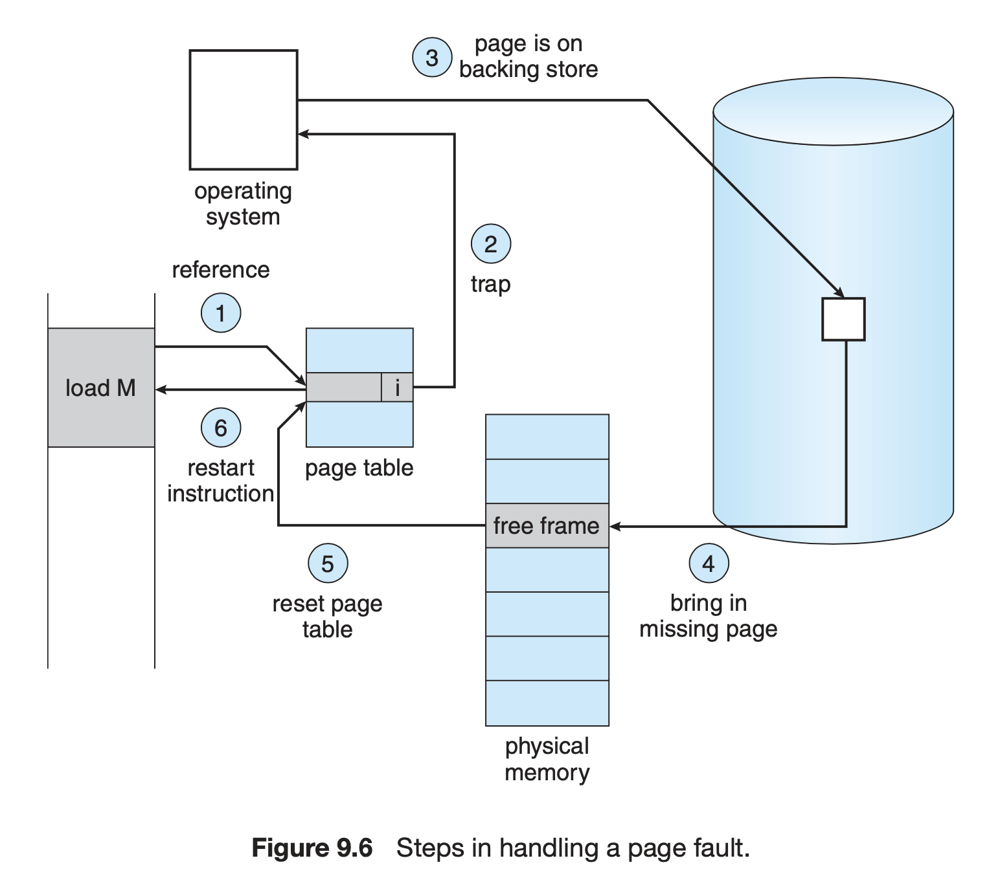
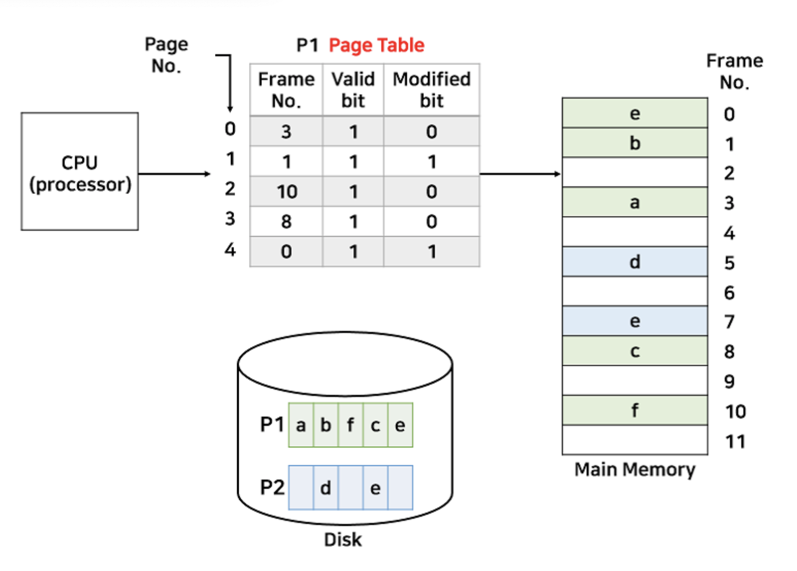
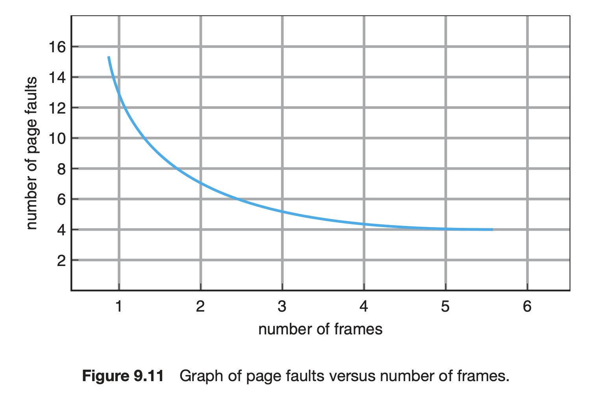
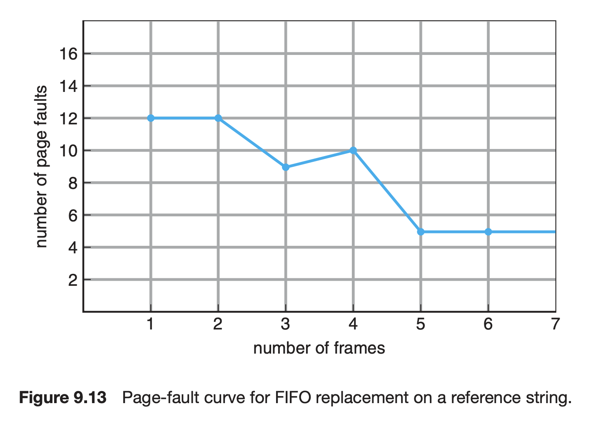
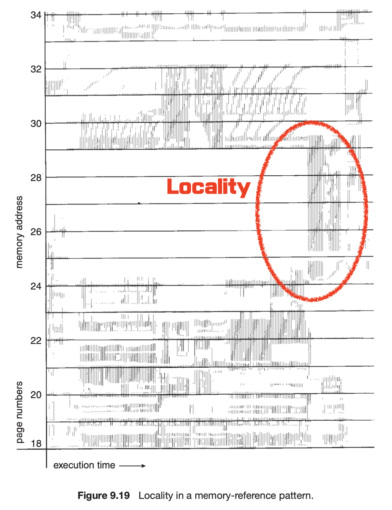
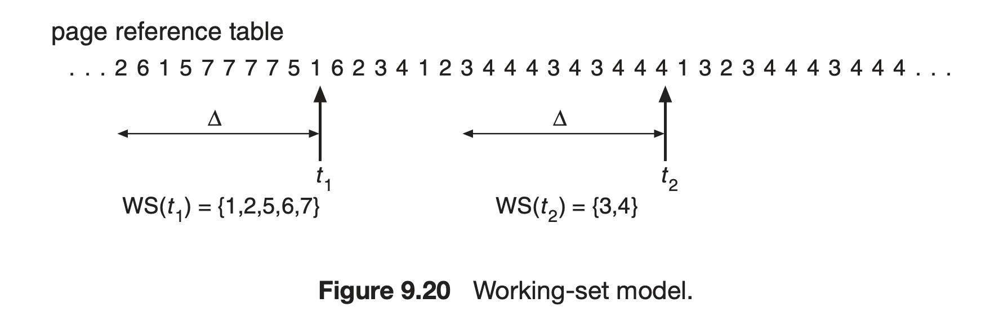
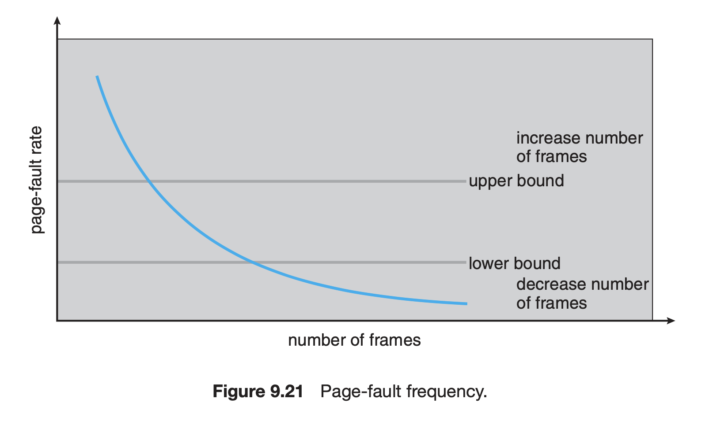

import * as Elem from '@elems';

초기 컴퓨터 시스템은 매우 제한된 메모리 자원을 가지고 있었기 때문에, 프로그래머들은 사용 가능한 메모리 내에서 최대한 효율적으로 프로그램을 작성해야만 했습니다. 
하지만 시간이 지나면서 하드웨어 기술의 발전과 함께 프로그램들은 점점 더 복잡하고 메모리 요구사항이 증가하는 추세를 보였습니다. 
이러한 변화 속에서, 메모리를 더욱 효과적으로 관리하고 최대한 활용하기 위해 가상메모리라는 개념이 도입되었습니다.

# Virtual Memory

지금까지 메모리 관리 방법은 명령어가 반드시 물리적 메모리에서 실행되어야 한다는 필요에 의해 사용되었습니다.
하지만 프로그램은 일반적으로 발생하지 않는 오류들에 대한 코드들과 같이 실행되지 않을 부분들이 존재합니다.
또한 배열, 테이블과 같은 자료구조는 실제 필요한 양보다 더 많은 양의 메모리를 할당받습니다.
즉, **프로그램의 모든 부분이 항상 동시에 필요하지 않을 수 있습니다.**
이러한 관찰을 통해 <mark>프로그램의 일부만 실제 메모리를 할당하여 실행하는</mark> `virtual memory` 방법이 등자하였습니다.

<Elem.ColorText color='var(--info)'>가상 메모리는 시스템 라이브러리와 같은 공유된 자원을 여러 프로세스에서 공유할 수 있습니다.</Elem.ColorText>
각 프로세스는 공유되는 라이브러리를 자신의 주소 공간의 한 부분으로 생각하지만, 실제로 여러 프로세들이 동일한 페이지를 공유하는 것이죠.

## Demanding Paging

프로그램의 모든 기능을 포함한 전체를 메모리에 올리는 것은 비효율적이므로, 필요한 만큼만 페이지에 적재하는 것이 더 방법입니다.
<mark>프로그램이 실행되는 동안, 가상 메모리는 페이지 사용을 요구받은 경우에만 페이지에 적재하는 것을</mark> `demanding paging`라고 합니다.

<Elem.Comment>
Swapping은 프로세스 단위로 메모리를 전부 교체하는 것이라면,
Demamding Paging은 페이지 단위로 메모리를 교체하는 것을 의미합니다.
</Elem.Comment>

## Page Fault

가상 메모리를 사용하면 접근하려는 페이지가 실제 메모리에 올라와 있지 않을 수 있습니다.
즉 <mark>페이지 테이블에서 프레임의 valid bit가 0의 값을 가지는 경우</mark> `page fault`라고 합니다.
가상 메모리는 이를 처리하기 위한 방법이 필요합니다.

1. CPU가 page table에 가서 page에 접근을 시도합니다.
2. Valid bit(1-valid, 0-invalid)를 확인하고, invalid 상태이면 interrupt를 발생합니다.
3. `ISR`에서 interrupt를 처리하기 위해 디스크에서 page를 찾습니다.
4. 찾은 page를 메모리에 올려 frame으로 만듭니다.
5. Page table을 업데이트합니다.
6. CPU에게 다시 명령을 수행하도록 합니다.

### Pure Demanding Paging

어떠한 페이지가 필요한지 알 수 없으므로, 순수하게 요구된 페이지만 올리는 방법을 `pure demanding paging`이라고 합니다.
이는 <Elem.ColorText color='var(--success)'>효율적으로 메모리를 사용할 수 있지만</Elem.ColorText>, 
<Elem.ColorText color='var(--error)'>프로그램 시작부터 `page fault`가 발생하므로 느립니다.</Elem.ColorText>

### Preparing

위와 반대로 프로그램을 실행할 때 필요할 것이라고 판단되는 페이지를 미리 올리는 방법입니다.
<Elem.ColorText color='var(--success)'>`Page fault`가 발생할 확률이 적으므로 속도 면에서 빠르지만</Elem.ColorText>, 
<Elem.ColorText color='var(--error)'>미리 올라간 페이지를 사용하지 않는다면 메모리가 낭비됩니다.</Elem.ColorText>

## Effective Access Time

`Page Fault`가 발생하면 디스크에서 해당 페이지를 메모리에 로드하고, page table을 업데이트 하는 시간이 필요합니다.
이러한 시간을 고려하여 평균적으로 어느정도 소요되는지 계산하는 것을 `effective access time`이라고 합니다.

$p$ 페이지 부재 확률 (probability of a page fault = page fault rate)  
$T_m$ 메모리를 읽는 시간  
$T_p$ Page fault가 발생했을 때 소요되는 시간

$$
T = (1-p) T_m + p \cdot T_p
$$

$T_m = 200nsec$ 이고 $T_p = 8msec$ 일때  
* $p = \frac{1}{1000}$ -> $T = 8200usec$  
* $p = \frac{1}{399990}$ -> $T = 220nsec$

`Effective Access Time`을 줄이기 위해서 `page fault`의 비율을 낮추는 것이 중요합니다!

# Page Replacement

필요한 페이지를 계속해서 올리기만 하면 메모리 공간은 부족해집니다.
따라서 페이지를 올림`(page in)`에 따라 필요 없는 페이지`(victim page)`를 방출`(page out)`하는 과정이 필요하죠.
효율적인 메모리를 만들기 위해, 어떠한 페이지가 올라오고 어떠한 페이지가 희생될지 적절한 스케쥴링이 필요합니다.

### Locality of Reference

사실 paging 기법이 실용적인 이유는 <mark>메모리 접근이 시간적 지역성과 공간적 지역성을 가진다는</mark> `locality of reference`의 원리 때문입니다.

`temporal locality` 참조된 메모리 공간은 또 참조될 가능성이 높은 특징을 가집니다.
- 반복문과 같은 코드는 동일한 공간을 여러 번 읽음

`spatial locality` 참조된 메모리 주변도 참조될 가능성이 높은 특징을 가집니다.
- 프로그램 대부분은 순서대로 읽는 경우가 빈번

## Victim Page

만약 어떠한 페이지가 메모리에서 변경되고, `victim page`가 되어 디스크에 쓰여지면, 페이지 교체 시 디스크에 교체된 내용을 기록하는 작업이 추가됩니다.
따라서 `victim page` 를 고를 때 메모리 내에서 수정되지 않은 페이지를 선택하는 것이 이상적이죠.
이를 위해 page table에 `modified bit(dirty bit)`를 추가하여 이를 검사합니다.

위 그림에서 `victim page`를 결정하기 위해서 modified bit를 검사한 후 변경되지 않은 후보 중 선택하는 방법입니다.

## FIFO(First-In-First-Out)

초기화에 사용된 코드가 더 이상 사용되지 않을 것이라는 아이디어에서 나왔습니다.
이전에 내보낸 페이지가 바로 다음에 다시 사용된다고 하면 `page fault`가 발생하여 비효율적인 모습을 보여줍니다.

### Belady's Anomaly

일반적으로 프레임의 수가 증가하면(=메모리 크기가 커지면) `page fault`의 비율을 줄어들어야 합니다.

하지만 FIFO는 프레임 수가 증가하여도 `page fault` 수가 줄어들지 않는 현상이 발생하는데 이를 `belady's anomaly` 라고 합니다.

## OPT(Optimal)

가장 오랫동안 사용되지 않을 페이지를 선택하는 방법입니다.
현재 시점에서 그 이후에 최초로 동일한 페이지가 나타나는 시점과의 거리를 계산하여 가장 큰 값이 오랫동안 사용되지 않을 페이지로 간주하고 내보내는 방식이죠.
<Elem.ColorText color='var(--error)'>하지만 이 방법은 미래에 어떤 프로세스가 사용되는지 예측하기 어려워 현실적으로 불가능한 방법입니다.</Elem.ColorText>

## LRU(Least-Recently-Used)

가장 오래전에 사용된 페이지를 내보내는 방법입니다.
최근에 사용되지 않은 것은 나중에도 사용되지 않을 것이라는 `temporal locality`를 생각한 방식입니다.
이 방법은 FIFO보다 더 적은 `page fault`를 발생하여 최근에도 대부분의 환경에서 채택하고 있습니다.

# Allocation of Frames

프로세스의 수가 증가할수록 CPU 이용률도 증가할 것 같으나, 일정 범위를 넘어가면 오히려 CPU 이용률이 감소합니다.
프로세스 수가 증가하게 되면 메모리와 디스크 사이 I/O 작업이 발생하는데, 이는 CPU를 사용하지 않으므로 CPU가 그 동안 놀게 되는 것이죠.
이렇듯 I/O 작업이 증가하여 CPU의 이용률이 감소하는 현상을 `trashing` 이라고 합니다.
이러한 문제를 극복하기 위해 적절한 수의 프레임을 할당할 필요가 있습니다.

## Static Allocation

* **동일 할당(Equal Allocation)**
    * 모든 프로레스에게 동일한 수의 프레임을 할당합니다.
    * <Elem.ColorText color='var(--error)'>각 프로세스의 크기에 따라 요구 메모리가 다르기에 비효율적입니다.</Elem.ColorText>
* **비례 할당(Proportional Allocation)**
    * 프로세스의 크기에 따라 프레임을 할당합니다.
    * <Elem.ColorText color='var(--error)'>프로세스 크기가 크더라도 모두 사용하는 것은 아니기에 비효율적입니다.</Elem.ColorText>

## Dynamic Allocation

### Working Set Model

프로세스가 실행 중일 때 어느 페이지를 사용하는지 측정한 결과를 보면 특정 시간대에 참고하는 부분이 어느 정도 일정하다는 것을 볼 수 있습니다.
이를 통해 특정 시간에 따라 사용하는 페이지의 개수만큼 프레임을 할당해줄 수 있습니다.
하지만 **어떠한 방법으로 locality를 알 수 있을까요?**

프로세스의 locality를 조사하기 위해서 과거에 사용한 범위를 관찰할 수 있습니다.
현재에서 일정 시간 이전동안 사용되었던 페이지의 집합을 `working set`이라 합니다.
`Working set`을 참고하여 할당할 프레임 수를 결정하는 방법입니다.

### PFF(Page-Fault Frequency)

`Page fault`의 비율은 프로세스에 할당된 프레임의 수와 반비례합니다.
따라서 OS는 프로세스의 `page fault` 횟수를 계속해서 검사하여 상한선보다 많이 발생하는 프로세스에세 더 많은 프레임을, 하한선보다 적은 프로세스에게 더 적은 프레임을 할당합니다. 

# Page Size

현재 일반적으로 페이지의 크기는 4KB ~ 4MB 입니다.
페이지의 크기에 따라 성능이 달라 질 수 있습니다.

* **Internal fragmentation**
    * 페이지 크기가 작을수록 internal fragmentation이 줄어듭니다.
* **Page table**
    * 페이지 크기가 클수록 페이지 수가 적어 테이블 크기도 감소합니다.
* **Memory resolution** - 해당 메모리에 필요한 데이터가 있는 확률
    * 페이지 크기가 클수록 필요 없는 내용이 함께 있을 가능성이 높습니다.
* **Page fault frequency**
    * Locality 성질에 의해 페이지가 클수록 곧 호출될 내용이 동일한 페이지에 존재할 가능성이 높아집니다.