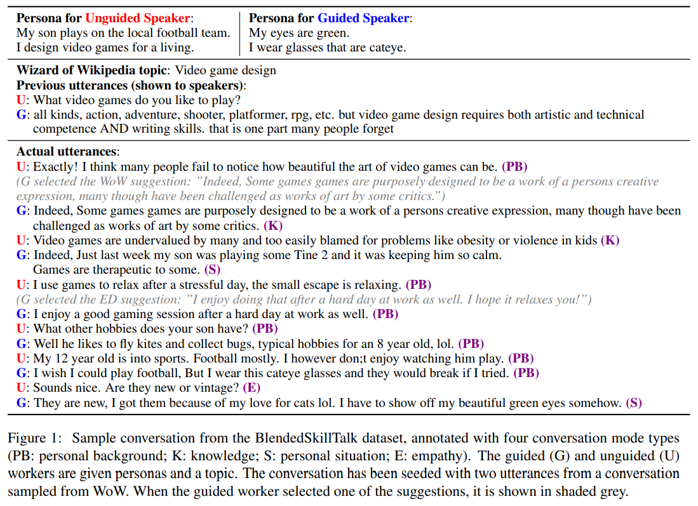

import * as Elem from '@elems';

[Can You Put it All Together: Evaluating Conversational Agents' Ability to Blend Skills](https://arxiv.org/pdf/2004.08449.pdf)  
[Recipes for building an open-domain chatbot](https://arxiv.org/pdf/2004.13637.pdf)  
[Poly-encoders: architectures and pre-training strategies for fast and accurate multi-sentence scoring](https://arxiv.org/pdf/1905.01969.pdf)  
논문을 바탕으로 작성하였습니다.

사람과 같은 대화는 어떻게 정의할 수 있을까요?
논문에서는 사람과 같은 대화를 상대방의 말에 공감할 수 있고, 지식이 필요한 주제에 대해 대화할 수 있고, 개인이 겪은 경험과 성격에 기반한 응답을 만들 수 있어야 합니다.
기존의 각 작업에 대한 여러 모델이 등장하였지만, 이를 모두 다룰 수 있는 open-domain conversation을 위해서는 추가적인 데이터가 필요하다고 생각하였어요.

# BST

`BST(Blended Skill talk)`는 위 모든 작업을 번갈아가며 수행할 수 있도록 여러 데이터를 이용하여 구성했습니다.
논문에서는 크게 3가지 dataset을 활용하여 `BST`를 만들었어요.

* ConvAI2  
`ConvAI2`는 각 발화자가 서로에 대해 알아가기 위해 자신의 페르소나에 의거해 대화를 이어나가도록 만들어진 데이터입니다.
발화자는 상대방의 페르소나를 알아내기 위해 질문과 답을 주고 받으며 대화를 이어나가는 것이죠.
이러한 대화 이력을 통해 bot에게 주어진 페르소나와 일관성 있는 답변을 생성하는 능력을 기를 수 있습니다.

* ED(Empathetic Dialogues)  
`ED`는 감정적인 대화로 구성된 데이터입니다.
한 발화자가 개인적인 상황에 대해 묘사하면, 상대 발화자가 이에 공감을 보여주는 대화로 구성되어있죠.
공감을 보여주는 발화자의 역할을 모델이 수행하도록 학습을 진행하여 bot이 공감적인 응답을 생성하도록 만들 수 있습니다.

* WoW(Wizard of Wikipedia)  
`WoW`는 주제에 대한 깊이있는 지식을 요하는 대화를 기반으로 구성하였습니다.
무작위로 선택된 주제에 대해 retrieval system을 통해 선별된 Wikipedia 주제를 활용하여 대화를 진행하는 방식입니다.

논문에서는 위 3가지 데이터를 활용하여 각 작업을 모두 수행할 수 있는 응답을 만들어내는 모델을 만드려고 합니다.
이를 위해서 응답을 생성할 때 상황에 맞춰 위 데이터를 선택적으로 사용하는 데이터를 만든 것이 바로 `BST`입니다.

데이터를 구성하기 위해 두 발화자는 `ConvAI2`로 부터 임의로 선택된 페르소나를 할당받습니다.
또 대화는 `ConvAI2`, `ED`, `WoW` 데이터중 하나의 대화로부터 시작됩니다.
이때 한 가지 스킬(공감, 지식, 페르소나)만을 사용하여 대화하는 것을 막기 위해 각 발화자를 guided speaker, unguided speaker로 나눕니다.
대화는 unguided speaker 차례부터 시작되며, guided speaker의 차례가 되면 각 모델을 통해 각각의 스킬에 해당하는 최적의 응답을 제시합니다.
Guided speaker는 제시된 응답을 기반으로 혹은 이를 무시하고 응답을 생성하도록 합니다.

# BlenderBot

이제 앞서 다루었던 3종류의 데이터와 이를 통해 구성한 `BST`, 총 4가지 데이터를 활용하여 사람과 같은 대화를 생성하는 모델을 만들려고 합니다.
논문에서 모델은 모두 transformer를 사용하는 3가지 구조로 구성되어 있습니다.

## Retriever

`Retriever` 모듈은 context(dialogue history)를 입력으로 받을 떄 다음 발화 후보에서 가장 높은 점수를 가지는 발화를 선택하는 작업을 진행합니다.
학습 데이터의 모든 응답이 발화 후보가 되며, 여기서 가장 높은 점수를 받은 응답을 선택하는 것이죠.
입력 context의 응답으로 올 수 있는 $N$개의 후보를 선정하는 방법으로 `FAISS`를 사용하였습니다.

논문에서 $N=64$인 `poly-encoder`를 이용하여 이를 구현하였습니다.
Cross-entrophy loss를 이용하여 $y_{cand_1}, \cdots, y_{cand_n}$ 중에서 $y_{cand_1}$ 을 제외한 나머지는 negative sampling 방식으로 학습을 진행했습니다.
이때 batch의 각 element를 gold candidate로 두어 하나의 batch 안에서 발화 후보들을 한번만 embedding 하는 방식으로 빠르게 학습할 수 있었어요.

## Generator

`Generator` 모듈은 context와 `Retriever` 모듈을 통해 선택된 발화 후보(best candidate)를 이용하여 응답을 생성하는 작업을 진행합니다.
논문에서 Seq2Seq 모델을 이용하여 이를 구현하였습니다.
특히 2 encoder layer와 24 encoder layer로 구성된 2.7B 파라미터의 모델과 같이 적은 encoder와 많은 decoder로 이루어졌어요.
`MLE(Maximum Likelihood Estimation)` 접근으로 모델을 학습시킵니다.
$$
L_{MLE}^{(i)} (p_\theta, x^{(i)}, y^{(i)}) = - \sum_{t=1}^{\left| y^{(i)} \right|} \log p_\theta (y_t^{(i)} | x^{(i)}, y_{<t}^{(i)})
$$
$x^{(i)}$, $y^{(i)}$, $y_t^{(i)}$는 각각 gold input context, gold next-utterance, $y_{(i)}$의 $t$ 번째 토큰입니다.

## RetNRef(Retrieve and Refine)
Generative model은 여전히 지루하고 반복적인 응답을 생성하는 문제가 있습니다.
또 모델 파라미터에 embedding 되지 않은 지식에 대해서 접근하지 못하고, 이로 인해 거짓된 정보를 생성할 수 있죠.
이러한 문제를 해결하기 위해 dialogue retrieval, knowledge retrieval 단계를 통해 조금 더 정제된 응답을 생성합니다.

### Dialogue retrieval

앞서 설명한 방식대로 데이터베이스에서 입력으로 들어온 대화 이력과 유사한 대화를 찾아 응답을 선택하는 방식을 사용합니다.
이때 선택된 응답은 입력인 대화 이력과 특정 토큰으로 구분된 채 `Generator`의 입력으로 들어갑니다.
`Generator`가 검색된 응답의 요소를 사용할 지 안할지 선택하여 발화를 생성하도록 하여 조금 더 사람과 같은 대화를 할 수 있게 만드는 것이죠.

### Knowledge retrieval

위와 같은 방식을 지식 기반 대화에도 적용할 수 있습니다.
먼저 현재 대화와 관련한 지식을 찾기 위해 Wikipedia를 TF-IDF 기반 검색을 통해 후보 문서셋을 찾습니다.
이를 앞서 사용한 `Retriever` 모델을 이용하여 순위를 매기고 단일 문장을 선택합니다.
그리고 나서 같은 방식으로 `Generator`에 입력으로 넣어주어 적절한 발화를 생성하도록 하는 것이죠.

하지만 모든 대화에 대해 검색을 시도하는 것은 좋은 방법이 아닙니다.
그래서 현재 대화가 지식을 기반한 대화인지 분류하는 작업을 거치고, 필요하다 생각되면 검색을 진행하는 방식을 선택했어요.

### $\alpha$-blending

`RetNRef` 모델은 앞서 언급한 `Retriever`, `Generator` 모델을 각자의 방식대로 사전학습한 후 결합하여 추가적인 방법으로 `Generator`를 학습시키는 과정입니다.
이때 gold label과 retrieved utterance 사이가 명확하게 일치하지 않기 때문에 retrieved utterance를 무시하도록 학습되는 경향이 있어요. 
이를 방지하기 위해 학습시 $\alpha %$ gold label을 retrieved utterance로 대체하여 무시하지 못하도록 만들어 줄 수 있습니다.
Knowledge retrieval 단계에는 이러한 현상이 적게 발생하여 gold label만 사용해 학습해도 충분했습니다.

### Unlikelihood training

`Unlikelihood loss`는 generative model의 단어가 중복되고 반복되는 문제를 해결하고 사람과 모델의 단어 선택 분포 차이를 줄여주는 효과를 가지고 있어요.

<Elem.Comment>
unlikelihood loss에 관해서는 구현할 때 조금 더 찾아보자고!
</Elem.Comment>

# Decoding

짧게 말하는 것은 대화에서 실수를 줄이는 방법으로 사람들이 자주 사용하는 방법입니다.
Beam을 이용하면 이렇게 짧은 응답을 생성하는 경향이 있죠.
하지만 우리는 bot과 이러한 대화를 원하지 않아요.
그래서 생성되는 응답에 길이에 대한 제약을 걸어 줄 것입니다.

우선 `Retriever` 모델과 동일한 구조로 응답의 길이가 10 이하, 20 이하, 30 이하, 30 이상 총 4가지 분류로 예측하는 모델을 구성할거에요.
이를 통해 응답의 길이를 예측한 후 생성되는 응답의 최소 길이를 예측값에 맞춰 변화하는 식으로 적용을 하여 조금 더 자연스러운 응답을 생성하도록 하는 것이죠.

<Elem.Comment>
짧은 응답을 생성하는 경향은 Beam Search의 문제인데 Sampling을 사용하면 이러한 복잡한 과정을 만들지 않아도 될까?
</Elem.Comment>

또한 beam과 sampling 모두 일정한 단어들을 반복적으로 생성하는 경향이 있습니다.
논문에서는 이를 $n=3$인 n-gram blocking을 이용하여 응답에서 반복을 줄이는 것은 물론, 똑같은 대화가 반복되는 것을 방지합니다.

# Evaluation

논문에서 

# Etc.

앞서 모델의 구조, 학습 방법, 그리고 decoding 방법까지 보았습니다.
이 후 내용은 학습 데이터를 활용하는 방법, pre-training, fine-tuning의 자세한 방법들이 나열되어 있어요.
이는 구현할때 참고하며 보는 것으로 하겠습니다.

논문에서는 기존의 데이터셋으로 언어에 대해 이해하도록 모델들을 pre-training 하는 것 보다 task에 맞는 데이터로 pre-training 하는 것을 제안하고 있습니다.
여기서는 reddit disccusion 데이터를 이용하였지요.
