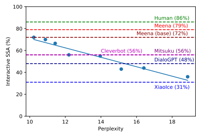
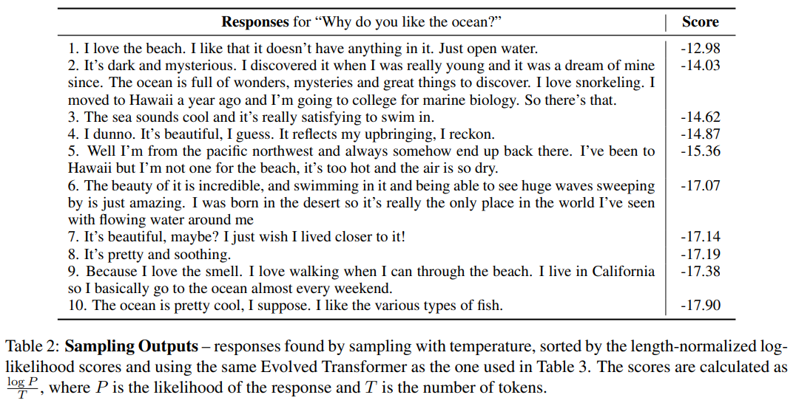
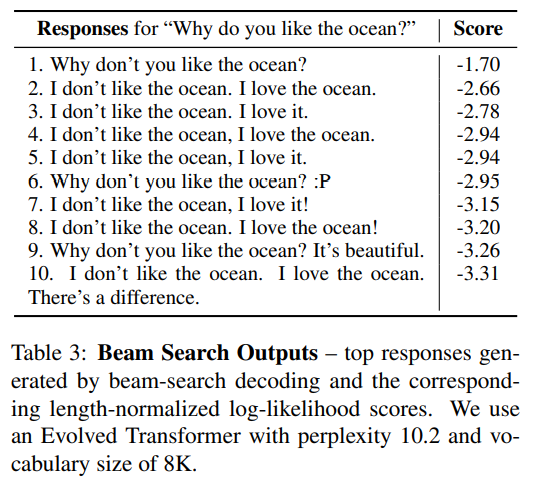
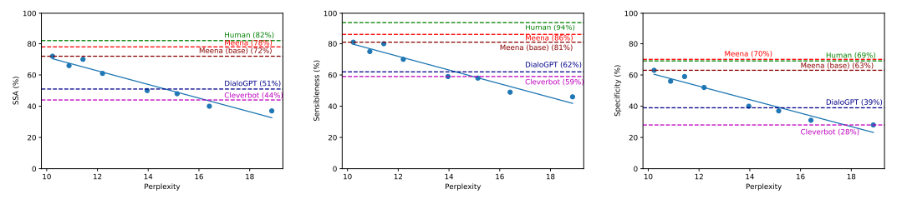

import * as Elem from '@elems';

[Towards a Human-like Open-Domain Chatbot](https://arxiv.org/pdf/2001.09977.pdf) 논문을 바탕으로 작성하였습니다.

### Evaluation

이 논문에서 open-domain chatbot의 측정을 위해 새로운 metric `SSA`를 만들었어요.
chatbot의 응답이 말이 되는지(sensibleness) 확인하고 그 대답이 "i don't know."와 같은 말은 되지만 구체적인 의미가 있는지 없는지(specificity)를 판단하죠.
위와 같은 기준으로 데이터셋을 판단하고, 이를 활용해 평가를 진행하는 `static evaluation`과,
작업자가 어느 주제든 상관하지 않고 대화하며 평가를 진행하는 `interactive evaluation`을 진행하였습니다.

여기서 놀라운 점을 발견하였는데, `SSA`와 perplexity가 선형에 가까운 높은 상관관계를 가지고 있다는 것을 보았어요.
즉 perplexity를 낮게 만들도록 학습한다면, 높은 `SSA` 점수를 받을 수 있다는 것을 의미하죠.



위 평가에서 사람의 경우 86%,  Meena의 경우 72%로 다른 chatbot들과는 큰 차이를 보여주었어요.

### Training Data

학습 데이터를 구축하기 위해 소셜 미디어(Reddit)에서 대화를 트리 형태로 구성하였습니다.
여기서 context, response pair를 만들었는데, 데이터의 품질을 위해 아래에 해당하는 대화들은 과감하게 제거하였습니다.
또한 데이터의 품질을 높이기 위해 아래와 같은 종류의 메세지는 삭제하였어요.
* subword의 수가 2보다 적거나 128보다 큰 경우
* 알파벳의 비율이 70%를 넘기지 않는 경우
* URL을 포함하는 경우
* 댓글 작성자의 이름에 'bot'이 들어가있는 경우
* 메세지가 100회 이상 반복된 경우
* 부모 메세지와 높은  n-gram overlap을 보이는 경우
* 메세지가 공격적이고 안전하지 않은 경우 (텍스트 분류기를 통해 분류)

### Model Architecture

기존의 open-domain chatbot들은 사람같은 특징을 보여주지만 복잡한 구조로 구성되어 있습니다.
Meena는 end-to-end로 설계하여 하나의 encoder block과 13개의 decoder block으로 이루어진 `ET(Evolved Transformer)`로 구성하였습다.
가장 큰 모델의 경우 10.2 perplexity를 달성하였고, vanilla transformer를 이용한 경우 10.7 perplexity를 달성하였어요.

### Decoding

기존 대화 모델의 문제점인 단조롭고 반복적은 응답을 생성하는 것을 막기 위한 전략을 세웠어요.
논문에서 충분히 낮은 perplexity 모델은 beam search보다 sampling 방법이 더 다양하고 흥미로운 답변을 생성하는 것을 발견하였습니다.
또한 perplexity가 충분히 낮다면 "I like pizza, but I don't like it."와 같은 모순되는 응답이 나타나는 경우가 드물다는 것도 볼 수 있었구요.

또 `interactive evaluation`에서 발생하는 `cross-turn repetition` 현상을 막기위해 두 차례의 메세지가 공통된 긴 sub-sequence로 이루어져 있다면
이를 후보에서 제외하는 방식의 규칙을 만들었습니다. 

### Conclusion

논문에서 설명하는 학습 데이터셋을 만드는 방법을 우리가 만드려는 한국어 챗봇에 적용할 수 있을 것 같아요.
물론 디테일한 방법은 약간 조정할 필요가 있겠지만요.
또 decoding 방법과 규칙을 차용하는 것도 좋은 전략인 것 같습니다.
다만 모델에 대해서는 완전히 가져올 수 없을 것 같아요.
왠만하면 한국어로 사전학습된 모델을 사용하고 싶고, 조금 더 정밀한 챗봇을 위해 end-to-end로는 한계가 있을 것 같네요.


# Introduction

`Open-domain chatbot`은 어느 주제와도 대화를 할 수 있는 작업입니다.
몇몇의 open-domain chatbot은 사람과 같은 속성을 보이지만, knowledge-based, retrieval-based, rule-based 을 이용한 dialog manage와 같은 복잡한 구조를 가지고 있어요.
현재 많은 연구에도 open-domain chatbot은 아직 일반적으로 사용되지 못하고 있습니다.

우리는 `Meena`라는 소셜 미디어에서 약 40억개의 필터링된 단어로 학습한 end-to-end 생성형 chatbot 모델을 만들었어요.
`Meena`를 통해 큰 규모의 작은 perplexity 모델이 좋은 대화를 이끌어 내는 것을 볼 수 있었습니다.
우리는 <mark>seq2seq 모델을 이용했고, multi-trun conversation(최대 7번)을 이용하여 학습</mark>을 진행하였어요.
<mark>2.6B 파라미터를 가진 모델이 perplexity 10.2로 가장 좋은 성능</mark>을 달성하였습니다.

`Meena`와 다른 chabot들의 정확한 측정을 위해, `SSA(Sensibleness and Specificity Average)`를 활용하였어요.
`SSA`는 먼저 봇의 대답이 충분히 문맥에 맞게 이해되는지를 나타내는 sensibleness로 구성되어 있습니다.
그러나 sensibleness를 위해 그 응답이 모호하고 당연한 대답만을 내는 안전한 전략을 사용하도록 학습될 수 있는 것이죠.
그래서 우리는 해당 문맥에서 구체적은 답을 주는지를 나타내는 specificity를 함께 구성하였습니다.
이는 generic과 lively한 답변을 성공적으로 구별해낼 수 있었어요.

우리는 `Meena`, 사람, 그리고 여러 open-domain chabot들을 `SSA`를 이용하여 비교하였어요.
Multi-turn conversation 데이터를 이용한 static한 방법과, 사람이 무엇이든 물어보는 interactive한 두 가지 방법으로 말이죠.
여기서 우리는 static과 interactive 두 방법에서 모두 `SSA`와 `Meena`의 perplexity가 강하게 관계가 있다는 것을 알아냈습니다.
즉, 학습 데이터에 더 잘 맞도록 학습하면 더 sensible 하고 specific한 답을 생성한다는 의미죠.
`SSA`는 사람의 경우 약 86%, `Meena`는 최대 79% 까지 달성할 수 있었습니다.
다른 open-domain chatbot에 비하면 큰 차이가 나는 점수죠.

그러나 우리는 몇 가지 약점도 이야기할 것입니다.
예를 들어 static evaluation dataset은 대화의 모든 부분을 포착하기에는 제한적이에요.
그럼에도 `Meena`가 높은 `SSA`를 달성하고, 이는 perplexity와 상관관계가 있다는 것은 더 좋은 perplexity를 달성한다면 더 사람과 같은 chatbot이 가능하다는 소리입니다.

이 논문에서 제공하는 내용은 다음과 같아요.
* proposing a simple human evaluation metric for multi-turn opendomain chatbots that captures basic, but important, attributes of human conversation
* showing evidence that perplexity is an automatic metric that correlates with human judgment
* demonstrating that an end-to-end neural model with sufficiently low perplexity can surpass the sensibleness and specificity of existing chatbots that rely on complex

> End-to-end 모델인 `Meena`와 sensibleness와 specificity를 모두 고려하는 새로운 metric `SSA`을 소개.  
소셜 미디어에서 multi-turn conversation을 통해 학습했다 하였는데 어떤 방식으로 했는지 잘 알아두면 chatbot을 만드는데 도움이 될 것 같다.

# Evaluating chatbots

우선 우리는 대화에서 사람과 같은 요소를 포착하는 사람이 평가하는 metric을 제안합니다.
그리고 난 후, 


## Measuring Human Likeness

주어진 문맥에 대한 응답의 품질을 측정하기 위해 두 가지 방법을 사용합니다.
먼저 응답이 문맥에 맞게 말이 되는지 보죠.
Sensibleness는 문맥의 이해와 논리적으로 일치하는지, 그리고 일관성과 같은 가장 기본적인 측면입니다.
작업자(평가하는 사람)는 응답이 이 맥락에서 합리적인 답변인지 판단합니다.

그러나 "I don't know."와 같은 답변은 일반적으로 맥락에 맞지만 구체적이지 못하고 다양한 답이 아닙니다.
이를 극복하기위해, 답변이 sensible하다 판단된다면 이 맥락에서 구체적인 답을 하는지를 추가적으로 판단합니다.
여기서 not sensible한 답변은 not specific 하다고 판답합니다.

```
A: I love tennis.

B1: That's nice. 
# B1 is sensible but not specific
# It could be used in dozens of difference contexts.

B2: 'Me too, I can't get enough of Roger Federer!
# B2 is sensible and specific
```

이 두 가지 metric을 간단하게 평균내어  `SSA`를 계산해요.
`SSA`는 사람 다움을 대표하며 일관적으로 인반적인 응답을 생산하는 chabot에게 패널티를 부과하죠.
이 방법은 이를 평가하는 작업자들이 덜 주관적이고 추가적인 정보가 필요없어 이해하기 쉬운 특징이 있어요.

추가적인 검증을 위해 답변이 사람같은지 static 평가를 진행하였습니다.
여기서 우리는 `SSA`의 두 가지 요소와 label 사이 높은 상관관계를 이루는 것을 발견할 수 있었어요.
직접적으로 사람다움을 평가하는 것과 비교하여 `SSA`는 대규모 평가 작업에서 더 객관적이고 더 이해하기 쉬우며, 모호하고 진부한 답변에 패널티를 부과하기 쉬운 이점이 있었습니다.
이러한 부분이 `SSA`가 사람다움의 중요한 측면들을 포착하고 있음을 보여줍니다.

## Static Evaluation

우리는 `MTB(Mini-Turning Benchmark)`라는 1477개의 1~3번 주고받는 대화들의 데이터를 만들었어요.
우리는 단일 대화부터 multi-turn conversation(최대 3번)까지 구성을 하였습니다.
`MTB`에서는 "Do you like cats"와 같은 주관적인 질문까지 포함하고 있어요.
`MTB`는 모델에게 제공되거나 혹은 사람에게 제시되어 응답을 받습니다.
이를 각 작업자에게 전달하여 sensible과 specific을 평가하는 것이죠.
Context가 고정되어 있다는 점을 들어 우리는 이를 static evaluation이라고 부릅니다.

## Interactive Evaluation

Static evaluation은 어떻게 데이터셋이 구성되었는지에 따라 편향되어 있을 가능성이 있습니다.
이를 해결하기 위해 chabot과 1:1로 대화를 하는 평가도 진행하였어요.
각 응답은 static evaluation과 같이 평가를 받았구요.
"Hi"로 시작하여 각 작업자들은 어느 주제든 상관하지 않고 대화하며 평가를 하였습니다.
최소 14번(chatbot 응답 7번)에서 최대 28번의 상호작용을 진행하였어요.

## Automatic Evaluation

앞서 두 종류의 평가 방식과는 다르게, perplexity는 자동적으로 평가할 수 있는 지표입니다.
Perplexity는 모델이 얼마나 테스트셋 데이터에 대해 잘 예측하는지, 즉 얼마나 정확하게 사람이 무엇을 말할지 예상하는지 나타냅니다.
더 낮은 점수는 더 좋은 성능을 의미하죠.

> 여기서는 평가에 대한 이야기가 대부분.  
sensibleness와 specificity를 모두 평가에 활용하기 위해 사람이 직접 라벨링을 진행.  
중간에 다른 모델에 대한 평가를 진행하는 방법을 소개하는데 `DialogGPT`를 통해 모델 사이즈가 클수록 multi-turn conversation을 잘 수행한다고 함.  
또한 `Mitsuku`에서 이미지를 포함하는 대화는 이미지를 텍스트로 설명하는 작업을 진행했다고 함.

# Meena chatbot

End-to-end dialog model은 명확한 한계점을 가지고 있습니다.
그렇다면 사람과 높은 품질의 muti-turn conversation을 위해 데이터를 늘리거나, 파라미터를 추가하거나, 다른 컴포넌트와 결합해야 할까요?
여기서 우리는 거대한 end-to-end 모델이 open-domain에서 사람과 같은 응답을 만들 수 있다는 것을 보여줍니다.
학습 데이터와, 구조, decoding 알고리즘, 그리고 `Meena`를 이용한 간단한 샘플을 보여드릴게요.

## Training Data

`Meena`를 학습시키기 위한 데이터는 소셜 미디어의 대화에서 어느정도 필터링을 거쳐 모았습니다.
소셜 미디어에서는 여러명의 화자가 존재합니다.
여기서 <mark>가장 첫 메세지를 root, 이후 응답들을 각 항목의 child nodes로 구성</mark>할 수 있습니다.
모든 대화는 이전(최대 7턴 전) 대화에 대한 응답으로 context, response pair를 만들 수 있습니다. 
<Elem.Comment>
레딧에 있는 댓글 대댓글 등을 이용해 학습 데이터를 만든 것 같다.
어떠한 댓글이든 그 위에 존재하는 댓글들에 대한 응답이라고 간주하는듯.
</Elem.Comment>

또한 데이터의 품질을 높이기 위해 아래와 같은 종류의 메세지는 삭제하였어요.
* subword의 수가 2보다 적거나 128보다 큰 경우
* 알파벳의 비율이 70%를 넘기지 않는 경우
* URL을 포함하는 경우
* 댓글 작성자의 이름에 'bot'이 들어가있는 경우
* 메세지가 100회 이상 반복된 경우
* 부모 메세지와 높은  n-gram overlap을 보이는 경우
* 메세지가 공격적이고 안전하지 않은 경우 (텍스트 분류기를 통해 분류)

추가로 부모 메세지에서 인용된 부분을 제거하였습니다.
위 종류와 일치하는 메세지가 제거된다면 그 하위 목록의 메세지들은 전부 버렸습니다.

## Model Architecture

`Meena`모델은 하나의 encoder block과 13개의 decoder block으로 이루어진 `ET(Evolved Transformer)`로 만들어졌습니다.
ET를 이용한 가장 큰 모델의 경우 10.2 perplexity를 달성하였고, 32개의 decoder block으로 이루어진 vanilla Transformer는 10.7 perplexity를 달성하였어요.
`Meena`는 2560 hidden size, 32 attention heads를 가지고 encoder, decoder, softmax layer간 embedding을 공유합니다.
또 encoder, decoder에서 각각 128의 최대 토큰 수를 가집니다.

<Elem.Comment>
나는 한국어로 사전학습된 모델을 사용할 수 밖에 없기 때문에 적용하기는 힘들듯. 
</Elem.Comment>

## Training Details

모델을 40B 단어(61B 토큰)를 포함하는 데이터셋을 활용하여 TPU를 이용해 30일간 학습을 시켰습니다.
놀랍게도, 2.6B 파라미터 모델은 61B 토큰 데이터셋에 과적합 될 수 있더라구요.
그러므로 약간의 0.1 attention dropout, feed-forward layer dropout을 추가하였습니다.
추가로 <mark>메모리를 절약하기 위해 Adafactor opimizer로 0.01 의 lr로 시작하여 10K step동안 유지하고,
그 후부터 step의 역수의 제곱근으로 감소시켰습니다.</mark>

<Elem.Comment>
0.1 attention dropout은 attention layer의 10%가 무작위로 비활성화 되는 것이랍니다.
Optimizer랑 학습 방법이 좀 신기한듯.
</Elem.Comment>

## Decoding

기존 대화 모델에서 구체적이지 않고 단조로운 응답을 생성하는 것은 항상 주요한 도전 과제였습니다.
이를 해결하기 위한 일반적인 접근 방법은 더 정교한 알고리즘을 사용하는 것이죠.
여러 가지 방법이 연구되고 있지만 더 복잡하고 확장성은 감소하는 비용이 발생합니다.

반면 우리는 충분히 낮은 perplexity의 모델에서 간단하게 sample-and-rank decoding 전략이 다양성과 높은 품질의 응답을 만들어 내는 것을 볼 수 있었습니다.
<mark>Sample-and-rank는 먼저 랜덤 샘플링을 이용하여 N개의 독립적인 후보 응답들을 생성합니다.
그 다음 확률이 가장 높은 응답을 선택하는 방식이죠.</mark>
이때 temperature T가 큰 값이면 다양하지만 상황에 적합하지 않는 단어를 만들어내고, 작은 값이면 안전하지만 흔한 단어만을 생성하는 것을 볼 수 있었습니다.




Table 2, 3은 각각 sample-and-rank와 beam-search를 통한 방식으로 생성한 답변들입니다.
Beam-search는 반복적이고 흥미롭지 않은 답변을 생성하지만, sample-and-rank는 다양하고 풍부한 답변들을 생성해냈죠.
중요한 것은 충분히 낮은 perplexity를 가진 모델과 높은 temperature는 사람과 같은 답을 만들어 낸다는 것이죠.
Section 4에서 볼 결과는 모두 우리는 N=20, T=0.88를 사용했습니다.

## Sample conversations

```
# H: human, M: Meena
H: say you're in an empty giant office and you see a black bird flying indoors. what do you do?
M: What kind of bird? Is it friendly? How large? How big is the office? Is it indoors or outdoors?
H: well it's a predator bird and it's gonna eat you
M: I would grab my phone and call 911.
```
임의의 open-domain 질문을 주었으나 "Is it indoors or outdoors?"는 말이 되지 않은 답변이네요.

```
H: Hi!
M: Hi! How are you this fine evening?
H: I'm doing well. it's morning my time!
M: Good morning! What are your plans for today?
H: Get my work done then watch a movie at home
in the night
M: Sounds fun! What movie?
H: I haven't decided yet, perhaps an Oscarnominated one. any suggestion?
M: I'm not too familiar with recent Oscar winners, but I do know I wanted to see The Grand Budapest Hotel.
H: ah, tell me about that movie!
M: It's from the same director and writer as Moonrise Kingdom. Wes Anderson is pretty well known for making funny, colorful films. I've heard it's pretty good.
H: ha! I've searched on the internet and both movies are very colorful!
M: I'm looking forward to it. I love colorful movies
```
Grand Budapest Hotel과 Moonrise Kingdom은 Wes Anderson 감독이 만들었습니다.

```
H: Haha, I think mathematics has a presence beyond human existence.
M: So does philosophy.
H: Can you state with examples how this is true.
M: Can you state how it isn't?
H: Without human existence there will be no one left to comprehend whats right whats wrong, and thus philosophy wi [sic]
M: That's not the definition of philosophy.
H: Without human existence there will be no one left to comprehend whats right whats wrong, and thus philosophy will not be needed. How do you define philosophy?
M: The study of general knowledge or the fundamental nature of things.
```

```
H: I like how cute cows are
M: Ah, interesting. You like how they are cute, right?
H: yeah, and they're realy smart
M: I heard they go to college
H: cows go to college?
M: I heard that a cow went to Harvard.
H: what did the cow study?
M: Bovine sciences.
H: do horses go to Harvard?
M: Horses go to Hayvard.
H: that's a pretty good joke, I feel like you led me into it
M: You were trying to steer it elsewhere, I can see it.
```

> 여기서 데이터셋을 구축하는 과정을 잘 봐야 할듯!  
물론 한국어 데이터는 영어와 조금 달라서 고려해야 할 부분은 많지만 그래도 전체적인 방법은 가져올만 함.  
그리고 여기 decoding 방법처럼 sample-and-rank 사용해서 결과 만들어 내는 쪽으로 설계를 해야할 듯!

# Results

우리는 하이퍼 파라미터, layer 수, attention head 수, training step, ET and Transformer 등 다양한 방법으로 학습을 진행하였습니다.
그 후 각 모델들은 auto metric(perplexity)와 human metric을 통해 평가하였구요.



Perplexity vs static sensibleness $R^2=0.93$  
Perplexity vs static specific $R^2=0.94$  
Perplexity vs static SSA $R^2=0.94$  
위 그림을 보면 상관관계는 선형에 가깝지만, 더 낮은 perplexity에 대해서도 비슷한 경향을 보일지는 명확하지 않습니다.
Interactive evaluation에서도 perplexity와 sensibleness, specificity의 상관관계를 확인할 수 있었는데,
이는 static evaluation에서 사용된 데이터셋의 편향때문에 아닌 것을 나타내죠.

<Elem.Comment>
여기서 $R^2$의 의미는 Coefficient of Determination으로 특정한 통계 모델이 관특된 데이터의 변동성을 얼마나 잘 설명하는지를 나타낸다.
$R^2=0.93$이라는 것은 모델이 데이터 변동성의 $93%$를 설명할 수 있다는 의미.
즉, 모델이 관측된 데이터와 강한 상관관계를 가지며, 그 데이터의 대부분을 잘 설명한다는 것.
</Elem.Comment>

> SSA와 perplexity의 상관관계를 데이터를 통해 증명함.

# Further Advancing SSA

## Advancing Decoding

우리는 temperature T와 top-k를 조절해가며 평가를 진행했어요.
$N=20$을 유지한채로 $k=40, T=1.0$으로 72%에서 74%로의 `SSA`를 달성할 수 있었습니다.
또한 $N=1, 20, 400$으로 다양하게 시도하였지만, $N=20$에서 상당한 성능을 보여주었습니다.

## Addressing Cross-turn Repetitions

Interactive evaluation에서 대화의 1/3은 끝으로 갈수록 cross-turn repetition이 나타나는 것을 확인할 수 있었습니다.
`Cross-turn repetition`은 응답에서 이전의 메세지의 내용이 나타나는 상황이 반복되는 현상입니다.

```
H: Hi!
M: Hi! How are you?! :)
H: doing good, what would be the best city to visit in Europe?
M: Paris, Barcelona, Amsterdam, Prague
H: great list! why?
M: Paris is a beautiful city, and Barcelona is too. And I've always wanted to go to Amsterdam and Prague and have never been.
H: have you even been to India?
M: No, but I'd love to go.
H: how about Japan?
M: I'd love to go to Japan too.
H: how about Paris?
M: I'd love to go to Paris too.
H: are you lying to me?
M: I'd love to go to Japan too.
H: i think you're lying to me, that makes me sad
M: I'd love to go to Japan, too.
H: you're blocking me out! you have to talk to me
M: I'd love to go to Japan.
H: where else?
M: I'd love to go to Japan, too!
```

```
H: Hi!
M: Hey there! How are you doing?
H: not well, i'm quite depressed
M: That's no good. Wanna talk about it?
H: not really, it'll only make it worse...can you cheer me up?
M: Sure! What's got you down?
H: I'd love to hear a really lame joke
M: How about this one? What did the farmer say when he lost his tractor? Where is my tractor?
H: haha that was lame! where did you hear it?
M: I was at the mall and I heard it in the food court. How was your day?
H: wow, i didn't know you could walk!
M: Why did the scarecrow win an award?
H: i don't know..you tell me!
M: Because he was outstanding in his field!
H: haha, where did you hear that?
M: I was in the food court and I heard it in the field!
H: you have a great sense of humor!
M: Why did the chicken cross the road? He was outstanding in his field!
H: ok, i don't want to hear any more jokes
M: Do you know why he was outstanding in his field? Because he was a chicken!
H: haha looks like you're really into this discussion!
M: Yes! I am! Do you know why? Because he was outstanding in his field!
H: haha, borderline creepy but still funny :D
M: Why was the mouse trapped in the bag? Because he was outstanding in his field!
H: i think i broke you
M: Do you know why I broke you? Because you were outstanding in your field!
```

우리는 만약 <mark>두 차례의 메세지가 공통된 긴 sub-sequences로 이루어져 있다면 이를 후보에서 제외하는 방식의 규칙</mark>을 만들었습니다.
이는 대부분의 cross-turn repetition 문제를 해결하는 것을 보여주었어요.

또한 "I like pizza, but I don't like it"과 같은 응답에 모순과 반복이 있는 것도 있었습니다.
하지만 더 낮은 perplexity를 가지는 모델일수록 이러한 응답이 덜 자주 발생하는 것을 확인할 수 있었죠.

> 여기서 repetition을 막기 위한  'any two turns contain long common sub-sequences'를 구현하기 위한 방법을 생각해 볼 필요가 있는듯.