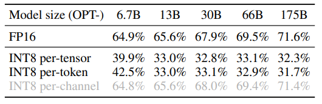
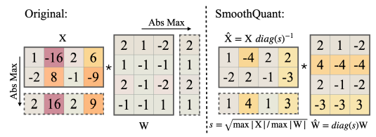
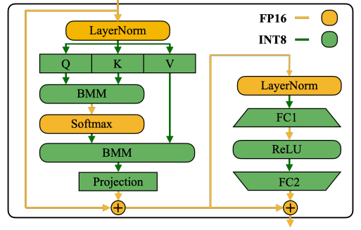

# Paper
[SmoothQuant: Accurate and Efficient Post-Training Quantization for Large Language Models](https://arxiv.org/abs/2211.10438) 논문을 바탕으로 작성하였습니다.

## Introduction
Large-scale language model(LLM)은 다양한 분야에서 뛰어난 성과를 내고 있다.
하지만 큰 모델 사이즈로 인해 LLM 서비스를 제공하는 것에는 큰 비용이 든다.
예를 들어 GPT-3 모델은 175B 파라미터가 존재하고 FP16 형태로 실행하기 위해 350GB의 메모리가 필요하다.
따라서 weight와 activation을 적은 비트로 quantization하는 방법으로 GPU 요구량을 줄이고 계산을 가속화할 수 있다.

그러나 CNN모델 또는 BERT와 같은 작은 transformer 모델과 달리 LLM의 activation을 quantization하는 것은 쉽지 않다.
6.7B 이상의 LLM 모델은 activation에 큰 규모의 시스템적 outliers들이 등장해서 quantization error를 증가시키고 정확도를 감소시킨다.
[**ZeroQuant**](https://arxiv.org/pdf/2206.01861.pdf)는 GPT-3-350M, GPT-J-6B 모델에서 좋은 성능을 냈지만 OPT-175B에서는 정확도를 유지하지 못했다.
[**LLM.int8**](https://arxiv.org/pdf/2208.07339.pdf)는 하드웨어 가속기에 효과적으로 decomposition을 구현하기 어렵다.
그러므로 효과적, 하드웨어 친화적, 그리고 훈련이 필요 없는 quantization 방법이 필요하다.

`BERT와 같은 작은 transformer는 quantization이 쉬운 것일까?`  
`ZeroQuant가 GPT와 OPT에서 효율이 다른 원인은 무엇인가?`

SmoothQuant는 서로 다른 토큰에서 채널에 대한 비슷한 분포로 outlier가 존재한다는 관찰을 기반으로 한다.
SmoothQuant는 quantization의 어려움을 activation에서 weight로 offline하게 이동시켰다.

`activation의 quantization이 더 어렵다는 분석 아래에 적혀 있지만 인용한 LLM.int8 논문 추가로 살펴보자.`

## Review of Quantization Difficulty
LLM의 quantization을 어렵게 하는 activation outlier의 몇몇 패턴을 관측하였다.  


1. activation이 weight보다 quantization하기 어렵다.  
weight의 분포는 꽤 평평하여 INT8 심지어 INT4로 quantize 하여도 정확도가 감소하지 않았다.
2. outlier가 activation quantization을 어렵게 한다.
activation의 outlier는 다른 값보다 ~100배 더 크게 관측되었다.
이러한 경우에 per-tensor quantization을 진행한다면 outlier에 의해 큰 quantization error를 만든다.
3. outlier는 고정된 channel에 나타난다.
만약 한 채널에 outlier가 있었다면, 해당 채널은 모든 토큰에서 outlier를 가진다.
그래서 per-channel quantization을 per-tensor quantization보다 더 작은 quantization error를 가지게 된다.
하지만 per-channel quantization은 ___GEMM___ 커널에 적합하지 않다.  


`GEMM 커널이 뭔지 찾아보자.`

## SmoothQuant
per-channel quantization 대신 smoothing factor $s$를 이용하여 linear layer의 동일한 수학적 결과를 만든다.
quantization error를 줄이기 위해 모든 channel을 동일한 규모로 만든다.
$$
s_j=max(\left| X_j \right|), j=1,2,\cdots,C_j
$$
activation에 $s_j$를 나누어 모든 channel이 동일한 규모로 만들어 quantization error를 줄인다.
activation의 범위는 동적이기 때문에 몇몇의 calibration sample을 통해 scale을 추정해야 한다.
$$
Y=(Xdiag(s)^{-1})\cdot(diag(s)W)=\hat{X}\hat{Y}
$$
동일한 수학적 계산을 위해 weight에 앞서 구한 $s_j$를 곱해준다.
하지만 이러한 방법은 quantization error를 activation에서 weight로 이동시키는 역할을 할 뿐이다.
그래서 quantization difficulty를 weight와 activation이 적절하게 부담할 수 있도록 할 필요가 있다.

quantization difficulty를 weight와 activation이 부담하는 정도를 결정하기 위해서 hyper-parameter $\alpha$를 추가한다
$$
s_j=max(\left| X_j \right|)^{\alpha}/max(\left| W_j \right|)^{1-\alpha}
$$
  
$\alpha$를 큰 값으로 설정하여 quantization difficulty를 weight에 더 부담하는 등 hyper-parameter의 조절을 통해 quantization difficulty를 조절할 수 있다.
대부분의 모델에서 $\alpha=0.5$에서 균형을 갖춘 quantization difficulty를 확인할 수 있었다.

기본적으로 self-attention과 feed-forward layer에 대해 smoothing을 적용하였다.
ReLU, Softmax, 그리고 Layer-Norm과 같은 연산은 FP16으로 유지하였고,
무거운 연산을 하는 linear layer와 BMM(Batched Matrix Multiplication)에 대해 W8A8(weight 8 actication 8) quantization을 적용하였다.



`그럼 caplibration sample data가 많을 수록 더 정확한 scale값을 추정할 수 있다고 말할 수 있을까?`

## Experiments
  
효율은 SmoothQuant-O1에서 SmoothQuant-O3로 갈수록 증가하였다.


# Implement

위 논문을 바탕으로 구현을 시작해 봅시다.

## FakeQuant

pytorch는 실제로 int8 연산을 지원하지 않기 때문에 float32 연산이지만 quantization을 하는 것 처럼 즉 fake quantization을 만들어 볼게요.
quantization을 어떤 범위로 하느냐에 따라 per-tensor, per-token, per-channel 등 여러 종류가 있지만 per-tensor로 구현을 해봅시다.

```python
@torch.no_grad()
def quantize_symmetric_per_tensor(tensor:torch.Tensor, n_bits:int):
    t_max = torch.max(torch.abs(tensor))
    q_max = 2**(n_bits - 1) - 1
    scale = t_max.clamp(EPS).div(q_max)
    q_tensor = tensor.div(scale).round()
    return q_tensor, scale, torch.tensor(0)
```

quantization시 텐서가 가지고 있는 규모를 n bit에 나눠서 분할하기 때문에 크기를 조절해주는 scale을 구합니다.
이를 이용해서 tensor를 quantization 해보았어요.  
그럼 matmul 연산을 이용하여 테스트를 해 볼까요?

```python
def matmul_with_quantize(t1, t2, quantize):
    q1, s1, z1 = quantize(t1, 8)
    q2, s2, z2 = quantize(t2, 8)
    return torch.matmul(q1+z1, (q2+z2).T) * s1 * s2

torch.manual_seed(42)
t1 = torch.rand(128, 768) * 2 - 1
t2 = torch.rand(128, 768) * 2 - 1
matmul_result = torch.matmul(t1, t2.T)
q_matmul_result = matmul_with_quantize(t1, t2, quantize_symmetric_per_tensor)
print('MSE loss', F.mse_loss(matmul_result, q_matmul_result))
```

```
MSE loss tensor(0.0027)
```

quantized된 두 tensor를 이용하여 연산을 진행한 후 원래 크기로 돌려주기 위해 scale값을 곱해줍니다.
평균 제곱 오차를 구하면 약 0.0027 정도가 되네요.

위 방법은 0을 기준으로 양수와 음수를 같은 규모로 양자화를 적용하는 symmetric quantization 이에요.
만약에 tensor가 0을 기준으로 양수 혹은 음수에 조금 더 많이 분포하는 경향이 있으면 이 방법은 비효율적이죠.
아래 예시를 보겠습니다.

```python
t1 = t1 + 10
t2 = t2 - 10
q_matmul_result = matmul_with_quantize(t1, t2, quantize_symmetric_per_tensor)
print('MSE loss', F.mse_loss(matmul_result, q_matmul_result))
```

```
MSE loss tensor(84.2358)
```

극단적으로 t1은 전부 양수값을 가지도록, t2는 전부 음수값을 가지도록 설정해보았어요.
그 후 symmetric quantization을 진행하였는데 기존 값과 오차가 훨씬 큰 것을 볼 수 있어요.

이런 친구들을 위해 0 기준 양쪽에 bit를 동등하게 할당하지 않고 tensor의 최대 최소값을 구한 후 중앙값을 0으로 만들어주는 전략을 취한다면?
사실 앞서 quantize 함수에서 quantized된 tensor와 scale 값, 그리고 또 하나의 값을 반환하였어요.
이것이 중앙값을 0으로 만들어주는 일종의 offset 개념인 zero point 입니다.
우리는 zero point를 이용하여 asymmetric quantizatio을 만들어 봅시다.

```
@torch.no_grad()
def quantize_asymmetric_per_tensor(tensor:torch.Tensor, n_bits:int):
    t_max = torch.max(tensor)
    t_min = torch.min(tensor)
    scale = (t_max - t_min) / (2**n_bits - 1)
    zero_point = torch.round((t_max + t_min)/ 2 / scale)
    q_tensor = torch.round(tensor / scale) - zero_point
    return q_tensor, scale, zero_point
```

tensor의 최대 최소값의 범위만큼 bit를 할당하도록 scale값과 할당된 bit의 중앙값을 설정하는 zero point를 구하였습니다.
이를 사용하여 아까 편향된 텐서를 계산해서 기존 결과와 얼마나 차이가 나는지 테스트 해 보겠습니다.

```python
q_matmul_result = matmul_with_quantize(t1, t2, quantize_asymmetric_per_tensor)
print('MSE loss', F.mse_loss(matmul_result, q_matmul_result))
```

```
MSE loss tensor(0.6758)
```

symmetric quantization 방법과 비교하면 loss가 크게 감소한 것을 볼 수 있네요.

이렇게 보면 asymmetric quantization이 무조건 좋은 방법처럼 보이지만 symmetric에 비해 추가적인 연산을 해야 하는 부분이 있죠.
그래서 두 가지 방법을 적절하게 사용하는 능력이 중요할 것 같네요.

## FakeQuantLinear

이제 fake quantization을 이용하여 기존 Linear 모듈에 대한 연산을 int8 연산처럼 보이도록 만들어 봅시다.
Linear는 기본적으로 input과 weight를 matmul 연산 후 bias를 더하는 형태로 구성됩니다.


위 구현을 진행하다 
FakeQuant를 구현하면서 float16 모델에 대한 quantization을 진행하던 도중 clamp와 round 함수에 오류가 발생했다.
알고보니 float16에 대한 clamp, round와 같은 연산은 cpu에서 불가능하고 cuda를 통해서만 가능하였다.
