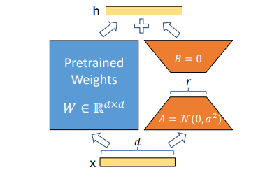

import * as Elem from '@elems';

기존에 효과적인 Fine-Tuning 방법이라고만 대략적으로 알고 있었던 `LoRA`에 대해 자세하게 논문을 읽어보려 합니다.

# Introduction 

최근에 NLP의 추세는 거대한 사전 학습 모델을 이용하여 여러 Down-Stream Task에 적용하는 것입니다.
보통은 기존 모델의 모든 파라미터를 Fine-Tuning을 이용하여 특정 작업에 효과적으로 만들고 있죠.

그런데 이를 몇몇 파라미터만을 적용하여 학습을 진행하거나, 외부 모델을 붙여 작업에 적용하는 방법으로 적용할 수 있다고 보았습니다.
현재까지 제시된 방법은 모델의 추론 속도를 늦추거나, 모델의 가용한 시퀀스 길이를 줄이는 효율과 성능의 Trade-Off 관계를 가집니다.

접근을 다르게 하여 작업에 비해 너무 많은 파라미터를 가진 모델은 실제로 낮은 Intrinsic Dimension을 가지고 있다는 발견을 기반으로 
논문에서는 `LoRA(Low-Rank Adaptation)`을 제안합니다.
`LoRA`는 사전 학습된 모델의 파라미터에 대해서는 고정을 시킨후 추가적인 파라미터를 통해 간접적으로 모델을 학습합니다.

`LoRA`는 아래와 같은 이점이 있습니다.
* 사전 학습 모델은 파라미터를 공유한 채 많은 `LoRA` 모듈을 만들어낼 수 있습니다.  
크기가 작은 `LoRA` 모듈을 교체하는 것만으로 다양한 작업을 수행할 수 있죠.
* 대다수의 파라미터를 고정하고 Low-Rank 행렬에 대한 최적화를 진행하므로 최대 3배까지 효과적으로 학습을 진행할 수 있습니다.
* 배포시 `LoRA` 모듈을 고정된 파라미터에 합칠 수 있어 기존 모델 대비 추론 속도에 영향이 없습니다.
* LoRA prefix-tuning <Elem.Comment> 4번째 항목은 다시 보고 정리</Elem.Comment>

# Problem Statement

Full Fine-Tuning 에서 업데이트되는 파라미터 $\Delta \Phi$의 크기는 기존 모델의 파라미터 $\Phi_0$와 같습니다. 
Fine-Tuning은 아래와 같은 Objective Function을 따르죠.

$$
\max_{\Phi} \sum_{(x,y) \in Z} \sum_{t=1}^{\left|y\right|} \log (P_{\Phi} (y_t | x, y_{<t})) \tag{1}
$$

논문에서 제시하는 방법은 훨씬 적은 파라미터 $\Theta$에 대해 업데이트를 진행합니다. 
학습되는 파라미터의 크기 $\Delta \Phi$는 $\Delta \Phi (\Theta)$와 같습니다.
이를 통해 Fine-Tuning을 진행하면 아래와 같은 Objective Function을 따르죠.

$$
\max_{\Theta} \sum_{(x,y) \in Z} \sum_{t=1}^{\left|y\right|} \log (p_{{\Phi_0} + \Delta \Phi (\Theta)} (y_t | x, y_{<t})) \tag{2}
$$

# Our Method

일반적으로 Full-Rank 행렬로 이루어져 있지만, 사전 학습된 언어 모델은 Low Instrisic Dimension을 가지고 더 적은 차원으로 효과적으로 학습시킬 수 있다고 가정합니다.
사전 학습 모델의 Weight $W_0 \in \mathbb{R}^{d \times k}$ 일때, $W_0$에 대해 업데이트를 진행하지 않습니다.
대신 새로운 Adapter $\Delta W$ 에 대해 업데이트를 진행하죠.

$$
W_0 + \Delta W = W_0 + B A \qquad B \in \mathbb{R} ^{d \times r} \quad A \in \mathbb{R} ^ {r \times k} \tag{3}
$$

$A$와 $B$는 각각 학습 가능한 파라미터를 가지고 있습니다.
또한 $r$ 은 $d$와 $k$ 보다 훨씬 작은 차원을 가지도록 설정하여 낮은 Instrisic Dimension으로 연산을 수행할 수 있도록 하죠.
입력 $x$에 대한 $y$를 구하기 위해서는 아래와 같이 연산할 수 있습니다.

$$
y = W_0 x + \Delta x = W_0 x + B A x \tag{4}
$$

처음 파라미터를 초기화할 때 임의의 수로 $A$를, $B$는 모두 0으로 설정하여 $\Delta W = BA$ 는 0이 되도록 초기화합니다.
이후 

