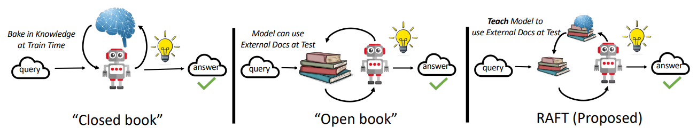
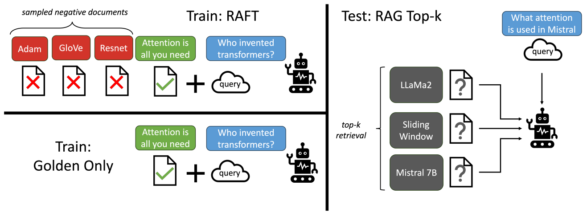
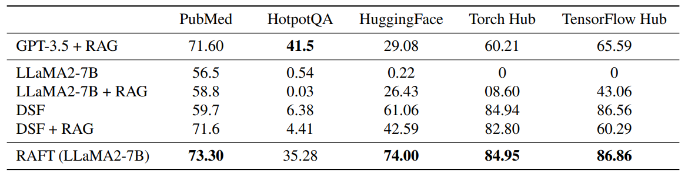
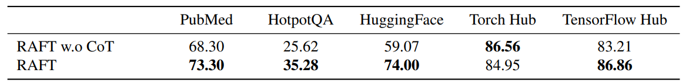
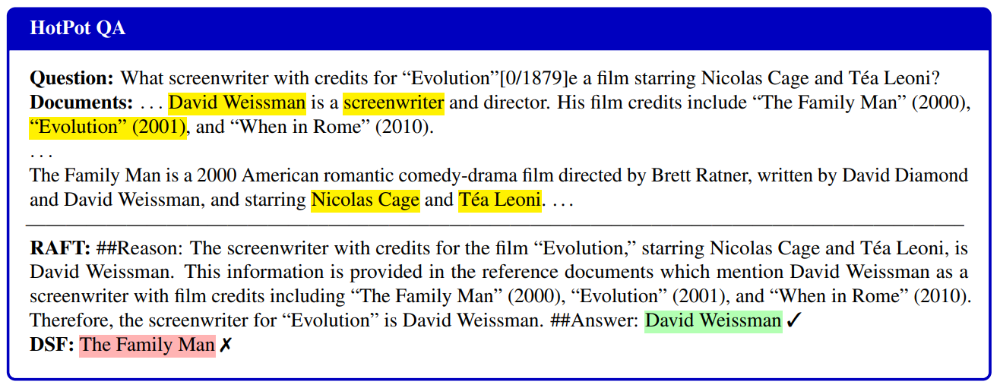
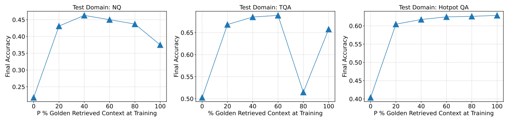
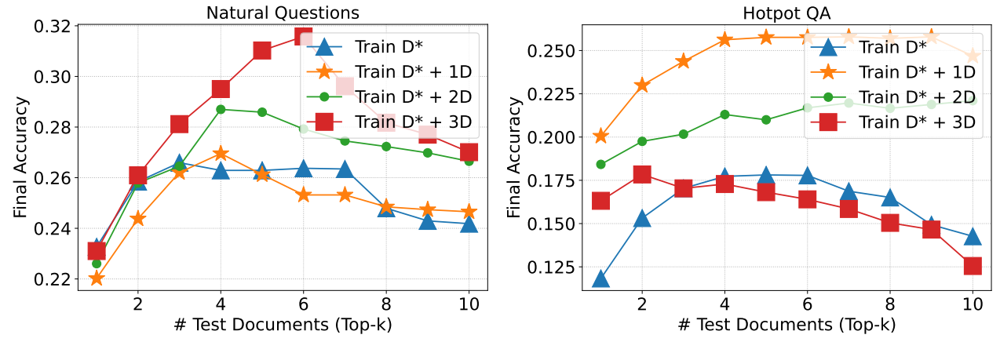

import * as Elem from '@elems';

[RAFT: Adapting Language Model to Domain Specific RAG](https://arxiv.org/pdf/2403.10131.pdf)

Open-Domain 챗봇을 만들기 위해 학습 데이터셋을 구성하던 도중, RAG를 통한 지식 기반 검색을 구축하고 있었습니다.
그러다가 문득 '학습시 일부러 관계없는 정보를 섞어 학습한다면 임베딩 모델의 한계로 인해 잘못된 정보가 Context로 입력되었을 때에도 강건한 대답을 만들 수 있지 않을까?' 라는 생각을 하고는 했죠.
그런데 이와 관련된 논문이 있어 읽어보았습니다.

논문에서는 특정 도메인 특화 모델에 대한 QA 작업을 진행시 효율적인 학습 데이터셋 구성을 논하고 있습니다.
학습 데이터셋에 필요한 정보`(oracle)`와 일정 비율로 관계 없는 정보`(distractor)`를 함께 제공하거나 혹은 관계 없는 정보만을 제공하여 학습을 진행합니다.
이는 특정 도메인에 관해 학습을 진행했을때 범용적인 LLM보다 높은 성능을 보여주었어요.

또한 Chain-of-Thought 의 전략으로 인용 문구와 추론에 대한 이유를 함께 생성하도록 하여 더 높은 결과물을 만든다는 사실을 실험을 통해 보여주었습니다.

하지만 데이터셋을 구성하기 위한 최적의 조건을 찾는 실험에서 일반화된 결과를 보여주지 못하였습니다.
특정 데이터셋에서는 일정 갯수의 `distractor`를 주어 학습을 진행했을 때 오히려 `oracle`만으로 학습을 진행했을 때 보다 더 낮은 성능을 보인 구간도 있습니다.
이를 실제 모델 개발에 적용하기 위해서는 다양한 실험을 진행해야 할 것 같습니다.


# Introduction 

LLM은 특정 소프트웨어 프레임워크를 위한 코드 개발부터 특정한 문서들에 대한 QA 작업까지 특수한 도메인에 대해 도움을 주도록 사용되고 있습니다.
이러한 작업은 일반적인 지식에 대해서는 덜 중요하지만 주어진 문서에 대해서는 확실하게 처리하는 것을 요구하죠.
이 논문에서는 '어떻게 사전 학습된 모델을 특정한 도메인에 대한 RAG로 적용할까?'에 대한 의문을 연구하였습니다.

특정 도메인에 대해 LLM을 적용하는 방법은 크게 두 가지로 나눌 수 있습니다.
* RAG를 통한 in-context learning
* SFT(Superviesd Fine-Tuning)

RAG 기반 방법은 QA시 LLM이 문서에 대한 참조를 가능하도록 하지만, 특정 도메인에 대한 고정과 문서에 대한 접근을 최대로 이용할 수 없다.
반면 SFT는 더 일반화된 패턴을 가지도록 하지만 추론 시 문서를 최대한 활용하지 못합니다.
따라서 논문에서는 두 방법을 결합한 `RAFT(Retrieval Augmented Fine Tuning)` 방식을 다룹니다.

`RAFT`는 Fine-Tuning시 특정 도메인에 대한 지식을 학습하는 것뿐 아니라, 부정확한 검색에 대해 강건하도록 만듭니다.
모델이 질문 Q에 대해 문서 D를 참고하여 응답 A를 생성하도록 학습하죠.
이때 문서에는 응답에 관련 없는 문서를 포함하고 있습니다.
이는 후에 더 자세하게 보도록 하죠.

# LLMs for Open-Book Exam

LLM의 추론 과정을 다음과 같이 비유할 수 있습니다.



### Closed Book Exam

우리는 시험을 보기 위해 공부를 합니다.
시험 도중에는 외부 지식에 접근할 수 없죠.
이는 LLM에서도 학습을 통해 지식을 쌓고 추론시 외부 지식에 접근하지 않고 학습된 파라미터를 이용해 응답을 생성하죠.

### Open Book Exam

반대로 LLM이 추론시 웹 사이트, 문서 등과 같은 외부 지식을 참조하여 응답을 생성하는 방법도 있습니다.
오픈북 시험을 보는 것과 마찬가지죠.
이러한 방식은 일반적인 목적의 LLM을 이용한 RAG의 성능이 Retriever가 얼마나 정확하게 정보의 일부를 찾을 수 있는지에 따라 달라집니다.

### Domain Specific Open-Book Exam

논문에서는 일반적인 오픈 북 시험이 아닌 도메인 특화, 더 좁은 도메인에 대해 집중합니다.
이러한 방식은 LLM이 특정 도메인에 대해 사전에 알고 있고, 이를 추론시에 활용합니다.
LLM이 특정 도메인에서 Fine-Tuning 되었던 정보를 이용하여 

# RAFT

SFT를 이용해 LLM을 조정할 때 $Q$와 그에 해당하는 $A$를 가진 데이터셋을 활용합니다.
고전 SFT는 그들이 사전 학습시 얻은 지식을 이용해 질문에 답을 하도록 학습하고 있죠.

* Train: $Q \underset{}{\rightarrow} A$
* 0-shot Inference: $Q \underset{}{\rightarrow} A$
* RAG Inference: $Q + D \underset{}{\rightarrow} A$

`RAFT`에서는 SFT와 다르게 질문 $Q$, 문서들의 전체 집합 $D_k$, Chain-of-though 형식 응답 $A^{*}$로 이루어집니다.
문서의 종류는 응답과 관련된 정보를 포함한 문서 `oracle` $(D^{*})$, 관련된 정보를 가지고 있지 않은 문서 `distractor` $(D_i)$ 두 가지로 나눌 수 있습니다.
`oracle`은 여러개의 문서가 될 수도 있습니다.

학습시 데이터셋을 크게 두 종류로 나눕니다. 
데이터셋중 P 만큼은 질문 $q_i$에 대한 `oracle` $(d_i^{*})$와 `distractor` $(d_{k-1})$ 로 구성합니다.
또 $(1-P)$ 만큼은 `oracle`이 없는 `distractor` $(d_k)$ 로만 구성합니다.
`distractor`만을 이용하여 구성한 데이터셋을 통해 파라미터에 정보를 저장하는 역할을 합니다.

* $P$ % of data: $Q + D^* + D_2 + \cdots + D_k \underset{}{\rightarrow} A^*$
* $(1-P)$ % of data: $Q + D_1 + D_2 + \cdots + D_k \underset{}{\rightarrow} A^*$



추론시 RAG 파이프라인을 통해 검색된 top-k 문서를 $Q$와 함께 제공합니다.

학습의 퀄리티를 높이는 중요한 요소는 응답에 대한 응답에 대한 설명을 하는 추론(Reasoning) 단계를 진행하는 것입니다.
`RAFT`의 접근 역시 비슷하게 모든 추론 이유를 생성하고, 모델의 정확성을 위해 인용 부분을 명시합니다.
`##begin_quote##` 와 `##end_quote##`를 이용하여 원문 내용을 표시하고, 이를 통해 디테일한 추론을 진행하도록 하죠.

```
Question: The Oberoi family is part of a hotel company that has a head office in what
city?

context: [The Oberoi family is an Indian family that is famous for its involvement in
hotels, namely through The Oberoi Group]...[It is located in city center of Jakarta,
near Mega Kuningan, adjacent to the sister JW Marriott Hotel. It is operated by The
Ritz-Carlton Hotel Company. The complex has two towers that comprises a hotel and the
Airlangga Apartment respectively]...[The Oberoi Group is a hotel company with its head
office in Delhi.]

Instruction: Given the question, context and answer above, provide a logical reasoning
for that answer. Please use the format of: ##Reason: {reason} ##Answer: {answer}.

---------------------------------------------------------------------------------------

CoT Answer: ##Reason: The document ##begin_quote## The Oberoi family is an Indian
family that is famous for its involvement in hotels, namely through The Oberoi Group.
##end_quote## establishes that the Oberoi family is involved in the Oberoi group, and
the document ##begin_quote## The Oberoi Group is a hotel company with its head office
in Delhi. ##end_quote## establishes the head office of The Oberoi Group. Therefore,
the Oberoi family is part of a hotel company whose head office is in Delhi. ##Answer:
Delhi
```

# Evaluation

논문에서는 LLaMA-2 를 Fine-Tuning한 RAFT-7B 모델이 도메인 특화로 학습된 모델과 일반적인 RAG 모델보다 특화 도메인에서 정보를 읽고 추출하는 등력이 뛰어나다는 것을 보았습니다.
또한 Chain-of-Thought 응답을 학습하는 것이 얼마나 중요한지를 증명하였어요.

## Results

실험에서 사용한 데이터셋은 아래와 같습니다.
* Natural Questions(NQ), Trivia QA(TQA), HotpotQA - Wikipedia를 기반으로한 Open-Domain QA 데이터
* Gorilla 논문에 제시된 APIBench 기반 데이터 - 적절한 API 콜을 생성하는지에 대한 벤치마크
* PubMed QA - 의료, 생물 기반 데이터셋



HotpotQA는 다른 데이터셋에 비해 일반적인 도메인을 다룹니다.
그에 비해 다른 데이터는 모두 특정 도메인에 특화된 데이터셋이죠.
HotpotQA를 제외한 벤치마크에서 RAFT-7B 모델이 가장 높은 점수를 획득한 것을 볼 수 있습니다.

## Effect of CoT

논문에서는 Chain-of-Thought 접근이 모델의 성능에 대한 효과 역시 측정하였습니다.



Chain-of-Thought 접근 없이 질문과 응답만을 제시한 모델과 비교를 하였을 때 대부분의 작업에서 더 높은 성능을 보였습니다.
추론 단계를 합치는 것은 모델이 응답을 생성하고 이해를 도와줍니다.

## Qualitative Analysis



`RAFT`와 `DSF(Domain-Specifically Fine-tuned)` 두 방법으로 생성된 응답을 비교하였습니다.
`DSF`는 작가를 물어보는 질문에 대해 혼란스러워 하는 반면, `RAFT`는 정확한 이름을 응답으로 제출하였습니다.
단순하게 질문-응답 쌍으로 구성으로 학습한 모델은 문서에서 관련된 내용을 가져오는 능력이 손상될 수 있다는 것입니다.
이는 <mark>학습 데이터셋에 표준 지시와 문맥에 대한 이해를 함께 제공하는 것이 모델의 처리 성능을 효과적으로 향상시킨다는 것을 보여줍니다.</mark>

## Should we train the LLM always with the oracle context for RAG?

논문에서는 RAG를 위한 모델 학습에서 항상 `oracle`을 제시해야 하는지, 아니라면 그 비율$(P)$을 어떻게 조정해야 하는지 실험하였습니다.
직관적으로 $P = 100%$ 일때 가장 좋은 성능을 보일 것 같지만, 몇 가지 특이점을 발견하였습니다.



$P%$의 비율을 다양하게 하고 데이터셋에 대해 테스트를 진행하였더니 최적의 비율은 각자 다르게 나타났습니다.
즉 <mark>때때로 적절한 문액을 제공하지 않고 학습하는 것이 문서에 대한 QA 작업에 대해 이점이 될 수 있다는 것을 의미합니다.</mark>

# RAFT Generalizes to Top-K RAG

논문에서는 `distractor`의 수가 `RAFT` 모델에 얼마나 영향을 미치지는 역시 실험을 진행하였습니다.



`oracle`만을 이용하여 학습한 경우 `distractor`와 함께 학습한 경우보다 대부분 더 낮은 성능을 가지는 것을 보입니다.
논문에서는 대부분 하나의 `oracle`과 4개의 `distractor`로 실험을 진행하였는데, `distractor`에 압도되지 않고 관련된 정보를 효과적으로 얻어올 수 있도록 밸런스를 맞췄다고 주장합니다. 
또한 테스트 단계에서 Top-K에 대해 역시 평가하였는데, 다양한 숫자의 문서에 대해 강건한 모습을 보인다고 합니다.

> 사실 몇 가지 실험에 대해서는 일반화된 결과가 없이 데이터셋에 따른 의존도가 존재하는 것 같습니다. 흠..
