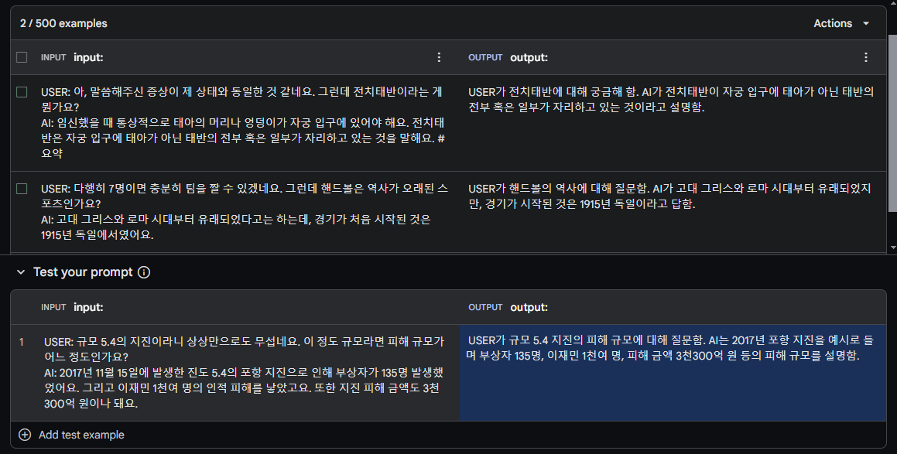
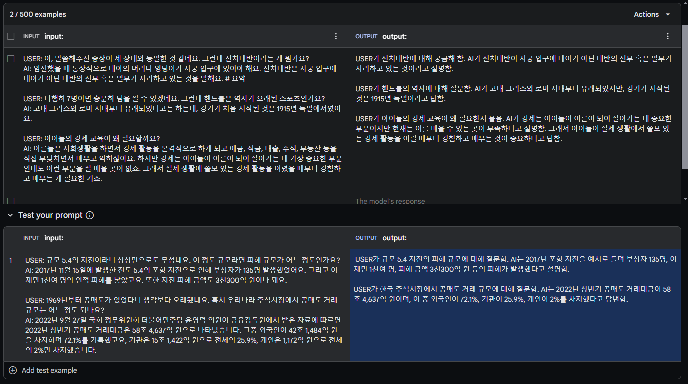

import * as Elem from '@elems';

챗봇과 대화를 진행할 때 이전 대화 내용에 대한 정보를 주지 않고 새로운 메세지만을 전달한다면, 챗봇은 처음 받는 질문으로 판단하고 대답하게 됩니다.
따라서 이전 대화 내용을 프롬프트에 함께 전달하여 일관성있는 답변을 생성할 수 있도록 만들어야 하죠.
하지만 모든 대화 원문을 저장하는 것은 많은 토큰을 필요로할 것입니다.
따라서 대화의 길이를 줄이면서 그 내용은 유지하기 위해 대화 내용을 요약하는 과정이 필요합니다.

# Langchain Memory

기본적으로 대화 내용을 `Langchain`의 Memory 기능과 비슷하게 제작하려고 합니다.
아래 대화를 `Langchain`의 `ConversationSummaryBufferMemory`를 활용하면 다음과 같이 저장하게 됩니다.
```
# 대화 내용
HUMAN   자기 전에 확인할게 있어.
AI      무엇을 확인해드릴까요?
HUMAN   내일 일정에 대해 알려줘
AI      내일 아침 8시에는 퓨리랑 미팅이 있습니다.
        어벤져스와 가디언즈 오브 갤럭시 팀의 관계에 대해 상의할 예정입니다.
        12시에는 페퍼와 점심식사가 있습니다. 치즈버거를 먹기로 했습니다.
        3시에는 해피와 스파이더맨 교육 계획 회의가 있습니다
        5시에는 아크 원자로 개선 버전 공개 행사가 있습니다.
        간단한 소개 자료를 준비해 놓았습니다.
HUMAN   행사 전 4시에 닥터 스트레인지와 약속을 추가해줘.
AI      행사 전 4시에 닥터 스트레인지와 약속을 추가했습니다.

# 요약 내용
The human asks the AI to check something before they go to bed.
The AI asks what they would like to check. 
The human asks the AI to inform them about their schedule for tomorrow. 
The AI informs the human that they have a meeting with Fury at 8 am to discuss the relationship between the Avengers and the Guardians of the Galaxy teams. 
At 12 pm, they have a lunch with Pepper, where they will be having a cheeseburger. 
At 3 pm, they have a meeting with Happy and Spiderman to discuss educational plans. 
At 5 pm, there is a public event for the unveiling of an improved version of the Arc Reactor, and the AI has prepared a brief introduction material.
Human: 행사 전 4시에 닥터 스트레인지와 약속을 추가해줘.
AI: 행사 전 4시에 닥터 스트레인지와 약속을 추가했습니다.
```

한 턴마다 대화를 요약하여 String 형태로 저장이됩니다.
재미있는 부분은 마지막 대화에 대해서는 요약을 진행하지 않는 것입니다.

대화를 계속 이어 나가보겠습니다.

```
# 추가 대화
HUMAN   내일 행사 참석 인원은 100명 정도야.
AI      내일 행사에는 약 100명 정도의 참석자가 있을 것으로 예상됩니다.

# 요약 내용
The human asks the AI to check something before they go to bed.
The AI asks what they would like to check. 
The human asks the AI to inform them about their schedule for tomorrow. 
The AI informs the human that they have a meeting with Fury at 8 am to discuss the relationship between the Avengers and the Guardians of the Galaxy teams. 
At 12 pm, they have a lunch with Pepper, where they will be having a cheeseburger. 
At 3 pm, they have a meeting with Happy and Spiderman to discuss educational plans. 
At 5 pm, there is a public event for the unveiling of an improved version of the Arc Reactor, and the AI has prepared a brief introduction material.
The human requests to add a meeting with Doctor Strange at 4 pm before the event.
AI: 행사 전 4시에 닥터 스트레인지와 약속을 추가했습니다.
HUMAN: 내일 행사 참석 인원은 100명 정도야.
AI: 내일 행사에는 약 100명 정도의 참석자가 있을 것으로 예상됩니다.
```

대화를 진행하다 보니 앞서 저장되었던 대화의 일부가 요약된 것을 볼 수 있습니다.
마지막 대화 역시 너무 길다보면 토큰을 줄이기 위해 요약될 수 있다고도 합니다.

# Dataset

질문자의 질문과 참고 문헌을 통한 응답을 생성하는 [AIHUB 지식검색 대화](https://www.aihub.or.kr/aihubdata/data/view.do?currMenu=115&topMenu=100&aihubDataSe=data&dataSetSn=71304)를 기반으로 데이터셋을 구성하였습니다.

## 요약

대화를 요약하는 모델을 학습하기 위해 아래와 같은 형식의 데이터셋을 구축해야합니다.
```
# 대화
USER: 아, 말씀해주신 증상이 제 상태와 동일한 것 같네요. 그런데 전치태반이라는 게 뭔가요?
AI: 임신했을 때 통상적으로 태아의 머리나 엉덩이가 자궁 입구에 있어야 해요. 전치태반은 자궁 입구에 태아가 아닌 태반의 전부 혹은 일부가 자리하고 있는 것을 말해요. 
# 요약
USER가 전치태반에 대해 궁금해 함. AI가 전치태반이 자궁 입구에 태아가 아닌 태반의 전부 혹은 일부가 자리하고 있는 것이라고 설명함.
``` 

현재 `Gemini`는 분당 60회의 API 요청이 무료로 사용이 가능합니다.
따라서 `지식검색 대화` 데이터셋에서 오고 간 질문과 응답을 `Gemini`를 활용하여 요약한 데이터를 생성하려 합니다.
Few-Shot을 통해 우리가 하려는 작업이 요약임을 예시를 통해 보여주고, 생성하려는 데이터의 입력을 넣어 나오는 출력을 학습하기 위한 데이터셋으로 형성하려고 합니다.



기본적으로 두 개의 예시를 입력하고 추론을 진행하였을 때 적절한 결과를 보여준다는 것을 알았습니다.
하지만 각 대화당 약 10번의 턴이 존재하는데, 매번 한번에 한 턴씩 데이터를 생성하는 것은 너무 오랜 시간이 걸릴 것 같아요.
따라서 여러 입력을 처리할 수 있도록 변경해야 할 것 같습니다.



이러한 방식으로 여러 작업을 한꺼번에 처리할 수 있을 것 같습니다.
하지만 너무 많은 턴의 대화를 입력으로 넣어주다 보면 AI가 판단하기에 필요하지 않은 턴은 요약을 생략하고 생성하더라구요.
따라서 적절한 크기의 입력을 조절하는 것이 필요했습니다.

```json
{
    "type": "summarize",
    "user": "으음, 아이디어는 나쁘지 않은데, 과일 껍질은 잘못하면 벌레가 꼬일 것 같아. 혹시 과일 껍질은 잘못하면 벌레가 꼬일 것 같아.",
    "ai": "과일 껍질 대신, 솔방울과 숯 같은 천연 재료를 활용해서 만든 안전한 실내 가습기를 사용하는 것도 좋아. 일단, 솔방울은 깨끗한 물에 헹군 다음 바구니에 담아서 필요한 곳에 놓으면 돼. 그리고 숯을 활용하는 경우에는, 솔방울과 마찬가지로 청결한 물에 씻은 다음, 오목한 그릇에 물과 같이 담아서 실내에 놓아두면 돼.",
    "response": "USER가 과일 껍질을 벗지 않고 다른 재료를 활용해서 실내 습도를 올리는 방법을 질문함. AI가 솔방울과 숯을 사용한 안전한 실내 가습기를 추천함.",
    "source": "data\\045.지식검색 대화\\01-1.정식개방데이터\\Training\\02.라벨링데이터\\Knowledge_사회와 생활_1084.json"
}
```

## QnA

응답을 생성할 때 프롬프트에 함께 함께 넣어줄 정보에서 필요한 부분만을 이용하는 강건한 모델을 만들기 위해 
[RAFT](/Tuning/RAFT/) 방법을 적용해 데이터 형식으로 응답에 필요한 정보 1개와 상관없는 정보 2개를 임의의 순서로 Context를 구성하였습니다.
또한 위 방법에서 요약한 대화를 History로 함께 넣어주어 요청과 문맥을 모두 고려하여 대답을 생성하도록 만들었죠.

`RAFT`에서 Chain of Thought를 활용하면 응답의 품질이 높아진다고 주장하였습니다.
이를 활용하기 위해 응답 생성시 제시된 정보 중 정확히 어떠한 문구를 사용했는지 전달하기 위해 Reference 데이터도 함께 생성하도록 구성하였습니다.

```json
{
    "type": "knowledge",
    "question": "아, 솔방울이랑 숯 정도는 괜찮을 것 같아. 그러고 보니, 혹시 젖은 빨래를 널어두는 것도 습도 조절에 도움이 될까? 평소엔 건조기를 쓰고 있는데, 직장 동료 중 한 분이 집이 너무 건조하면 차라리 집에 빨래를 젖은 채로 널어보라고 하더라고.",
    "response": "그것도 습기를 조절하는 좋은 방법 중 하나야. 빨래를 마친 젖은 빨래를 집에 널어두면, 빨래도 빨리 마를 뿐 아니라 공기 중 습기도 보충하는 두 가지 효과를 동시에 낼 수도 있거든.",
    "reference": [
        "빨래를 했다면 젖은 빨래를 집 안에 널어두는 방식으로 응용을 할 수도 있다.",
        "이렇게 한다면 공기 중 습기도 보충하면서, 빨래도 빨리 말릴 수 있어 일석 이조의 효과를 낼 수 있다."
    ],
    "context": "■ 젖은 수건 널어두기\n\n방의 습도를 올리는 가장 기본적인 방법이다. 빨래를 했다면 젖은 빨래를 집 안에 널어두는 방식으로 응용을 할 수도 있다. 이렇게 한다면 공기 중 습기도 보충하면서, 빨래도 빨리 말릴 수 있어 일석 이조의 효과를 낼 수 있다.\n\n여기서 주의할 점은 빨래가 마른 이후, 환기를 꼭 시켜줘야 한다는 것이다. 그렇지 않으면 빨래에서 물때 냄새가 날 수 있다.\n\n손성애 칼럼니스트\n\n어린이집은 맞벌이로 영유아의 보육을 필요로 하는 가정에 양육부담을 덜어주고 여성 사회진출에 기회를 넓히기 위한 목적을 갖고 설립된 교육과 돌봄을 실천하는 기관이다.\n\n어린이집에서는 ‘보육’이라는 용어가 많이 사용된다. 교사들에게도 ‘보육’을 붙여 보육교사라고 칭한다. ‘보육’이란 보호+교육으로 영유아를 안전하고 건강하게 보호해야함이 교육에 포함된 것이다. 어린이집은 유치원에 비해 장시간 보육이 이루어지므로 교육과 함께 보호의 기능이 중요할 수밖에 없다.\n\n.건물 한가운데 3300m²(약 1000평) 규모의 실내정원을 꾸민 더현대서울 ‘사운즈 포레스트’에는 고객들이 평균 37분간 머물러 다른 패션 매장들(4분)보다 9배 이상 체류했다. 이곳에는 전담 조경사 3명이 상주하며 매일 정원을 관리한다.스타벅스는 건물 중앙 공조를 이용하는 일부 매장을 제외하고 전국 매장 95%에 공기청정기를 도입했다. 고객들은 시럽, 휴지 등이 비치된 컨디먼트바 근처에서 직접 매장 공기질을 체크할 수 있다. 스타벅스 관계자는 “카공족들이 많은 매장 특성상 공기질 관리를 위해 1시간마다 매장 환기에 신경 쓰고 있다”고 말했다",
    "history": "USER가 실내가 건조하다고 언급하고, 습도를 올릴 수 있는 방법을 물어봄. AI가 과일 껍질을 사용하는 것을 제안함. USER가 과일 껍질을 벗지 않고 다른 재료를 활용해서 실내 습도를 올리는 방법을 질문함. AI가 솔방울과 숯을 사용한 안전한 실내 가습기를 추천함.",
    "source": "data\\045.지식검색 대화\\01-1.정식개방데이터\\Training\\02.라벨링데이터\\Knowledge_사회와 생활_1084.json"
}
```