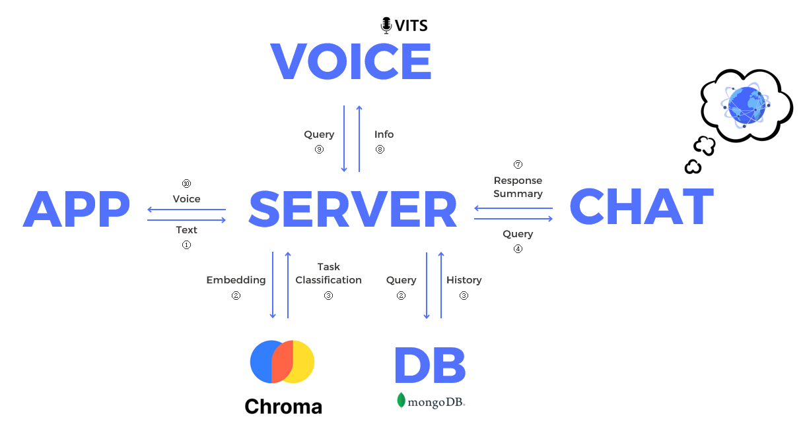

import * as Elem from '@elems';

<Elem.Project
    members="개인"
    domain={['LLM', 'Voice']}
    roles={["ALL"]}
    tools={["vLLM", "LangChain"]}
    schedule='24년 3월 1일 ~ '
/>

___

> 대화를 주고받고, 집안의 기기들을 제어하기 위한 시스템 다은👩🏻‍💼을 구축하는 초초초장기 프로젝트입니다. 

# 🚩 프로젝트 목표

<Elem.TwoCols align='center'>
<Elem.Cols size={40}>

</Elem.Cols>
<Elem.Cols size={50}>
때로는 쓸데없는 이야기를 나누고, 때로는 나와 감정을 공유하며, 때로는 궁금한 것을 물어보는 친구와 같은 챗봇을 구축합니다.

음성으로 입력을 주고, 음성으로 대답을 받도록 설계하여 대화하는 것과 같은 느낌을 주려고 합니다.

또한 단순히 대화를 주고 받는 것만이 아닌, IoT 기기와 연결하여 다양한 장비를 말로 조작할 수 있도록 합니다. 

</Elem.Cols>
</Elem.TwoCols>

# ✏️ 개발 내용

기존의 진행했던 프로젝트 `허밍버드`의 구조를 가져와서 대화를 주고받는 시스템의 기본 설계를 가져갈 생각입니다.
물론 필요에 따라 추가하거나 변경하는 부분이 많이 있을 것 같아요.

### 부족한 자원으로 LLM 학습 및 추론하기

기존 `허밍버드`는 시간적 여유가 부족하여 모든 모델을 학습되어 있거나, GPT API를 이용하여 응답을 생성하였습니다.
하지만 `다은`은 컴퓨터에 자체적으로 LLM을 구축하여 응답을 생성하고, 또 요약까지 해주는 작업을 수행하도록 할 계획입니다.
제 컴퓨터는 RTX 3060 12GB GPU를 가지고 있는데, Mistral-7B(28GB) 모델을 학습은 커녕 추론도 불가능한 상황입니다.
따라서 적은 자원으로 학습할 수 있는 방법을 찾아야 합니다.

`LoRA`는 기존 모델을 freeze 한 상태로 row-lank adapter를 붙여 적은 파라미터의 학습으로 fine-tuning을 진행하는 방식입니다.
여기에 기존 모델을 quantization 후 adapter를 붙이는 `QLoRA` 방식으로 기존 대비 아주 적은 메모리로 학습을 진행할 수 있어요.
12GB GPU로 Mistral-7B 를 4bit quantization을 진행한 후 adapter를 붙여 최대 2048 토큰의 데이터까지 학습을 진행할 수 있었습니다.
또한 학습된 모델을 `vLLM`을 이용하여 최적화된 추론으로 빠른 응답을 생성할 수 있었어요.

### 지금 요청 어떤 명령이지?

`다은`은 `허밍버드`와 다르게 사용자의 요청이 들어오자마자 embedding을 진행합니다.
이를 기존에 각 작업에 대한 예상 명령들과 비교하여 가장 유사한 명령을 찾아냅니다.
이를 통해 사용자의 요청이 어떠한 작업을 의미하는 것인지 쉽게 파악할 수 있죠.

이는 확장성의 측면에서도 아주 유리합니다.
작업을 추가하더라도 새롭게 학습하지 않아도 된다는 장점을 가지고 있죠.

# 📷 결과

# 🤔 느낀점
