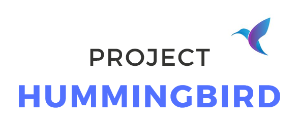
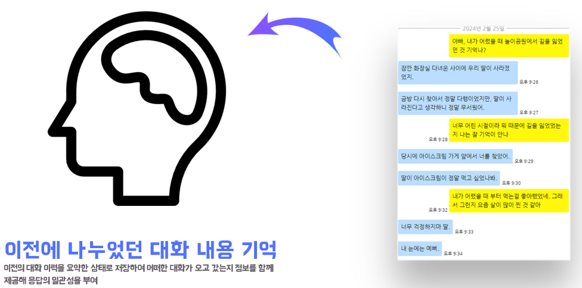
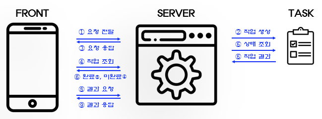
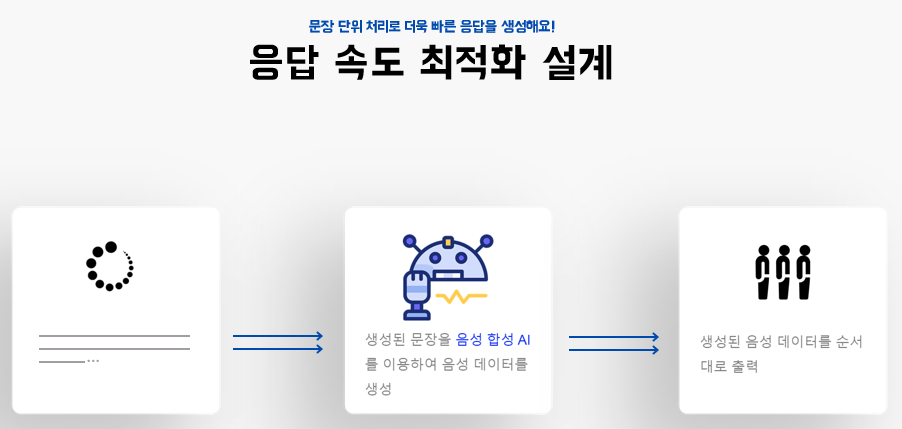
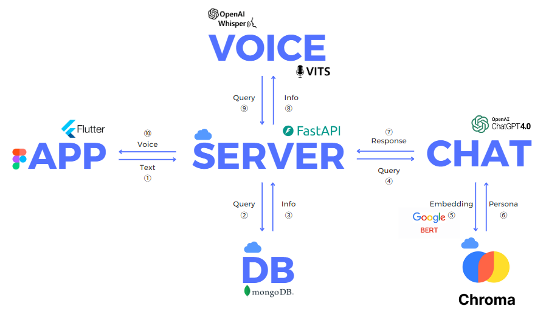
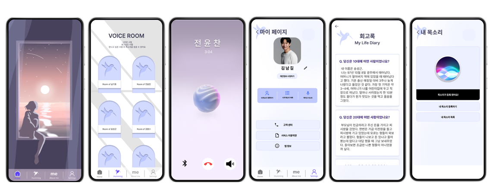

import * as Elem from '@elems';

<Elem.Project
    members="AI 2명 | 백엔드 1명 | 프론트 3명"
    domain={['LLM', 'Voice']}
    roles={["AI", "PM"]}
    tools={['Langchain', 'MongoDB']}
    schedule='24년 2월 1일 ~ 24년 2월 29일'
/>

___

> SK AI Challenger 프로그램을 이수하며 진행하는 팀 `🐣오리알`의 프로젝트입니다.

# 🚩 프로젝트 목표

<Elem.TwoCols align='center'>
<Elem.Cols size={40}>

</Elem.Cols>
<Elem.Cols size={50}>
죽음이 슬픈 이유는 다시는 그 사람과 소통할 수 없기 때문입니다.
나의 죽음이 두려운 이유도 죽음 자체보다 내가 떠난 후 남겨질 사람들이 느낄 슬픔 때문이죠.

이러한 마음을 조금이나마 해소하고자 죽음 이후에도 사람과 대화할 수 있는 서비스를 구현하려 합니다.
그 사람의 생각과 삶의 경혐을 바탕으로 답변을 생성하고 이에 목소리를 입히며 마치 대화하는 느낌을 주려고 합니다.
</Elem.Cols>
</Elem.TwoCols>

# ✏️ 개발 내용

적절한 응답을 생성하기 위한 페르소나를 적용하기 위해 사용자가 작성한 회고록을 이용하였습니다.
아무래도 사람의 일생을 적는 곳이다 보니 데이터의 양이 많을 것이라고 예상했죠.

<Elem.TwoCols align='center'>
<Elem.Cols size={50}>

</Elem.Cols>
<Elem.Cols size={50}>
> 모든 정보가 필요한 것은 아니다!

페르소나를 적용하기 위해 모든 데이터를 다 사용할 수 없습니다.
많은 토큰들이 낭비되고, 정확한 응답을 생성하기 어렵죠.
내용중 응답에 필요한 정보만을 제공해서 효율을 높이도록 하였습니다.

Sentence Transformer를 활용하여 사용자의 데이터를 일정한 크기로 나누어 임베딩해 저장합니다.
사용자의 입력이 들어오면 임베딩하여 벡터 검색을 통해 필요한 정보를 가져와서 응답을 생성하는데 사용하였습니다.
</Elem.Cols>
</Elem.TwoCols>

또한 대화하는 느낌을 주기 위해서는 이전에 어떠한 발언이 오고갔는지 기억할 필요가 있습니다.
최신의 대화를 함께 넣어주어 말투를 일관성있게 유지할 수 있지만 오래 전에 주고받은 내용에 대한 정보는 받을 수 없죠.

<Elem.TwoCols align='center'>
<Elem.Cols size={40}>
> 응답에 일관성을 부여!

최근의 대화 이력뿐 아니라 오래전에 나눈 발언들에 대한 장기 기억도 전달하여 전체적인 대화의 성능을 향상시키고자 합니다.
요약 모델을 활용하여 요약된 대화 내용을 응답을 생성할 때 함께 전달해주어 장기적인 정보 역시 활용될 수 있도록 설계하였습니다.
</Elem.Cols>
<Elem.Cols size={60}>

</Elem.Cols>
</Elem.TwoCols>

프로젝트의 목적은 대상과 대화하는 느낌을 주는 것입니다.
하지만 본 프로젝트에서 응답을 생성하기 위해 총 4 가지 모델을 사용하고 있습니다.
요청에 대한 응답이 길어질수록 대화하는 느낌을 받기 어려울 것입니다.
또한 서버에서 응답이 바로 오지 않으면 사용자는 자신의 요청이 서버에 잘 전송되었는지 인지할 수 없습니다.
따라서 응답의 지연성을 줄이는 설계를 구상할 필요가 있습니다.

<Elem.TwoCols align='center'>
<Elem.Cols size={60}>

</Elem.Cols>
<Elem.Cols size={40}>
> 비동기 처리로 인한 요청 확인

먼저 사용자가 요청이 서버에 잘 전달되었는지 확인할 수 있도록 서버에서는 요청이 들어오면 프로세스를 생성하여 작업을 할당합니다.
그리고 프론트에 작업의 ID에 해당하는 정보를 응답으로 전달합니다.

프론트는 이를 이용하여 서버에 작업의 상태를 반복해서 요청합니다.
작업이 완료되면 반복을 중단하고 생성된 음성을 받아옵니다.
</Elem.Cols>
</Elem.TwoCols>

> 문장 단위 처리로 끊김 없이 응답 전달!

또한 생성 모델의 스트리밍 기능을 활용하여, 문장 단위로 끊어 음성을 합성한 후 프론트로 전달합니다.
이후 생성이 완료될 때 까지 이를 반복해서 처리하죠.

프론트는 Queue를 이용해 전달받은 음성을 저장합니다.
또한 순차적으로 음성을 사용자에게 들려주죠.
음성이 재생되고 있는 사이에도 계속해서 작업을 확인하고 서버에서 음성을 받아와 Queue에 저장합니다.
이런 방식으로 문장 단위로 받아와 먼저 사용자에게 재생하고, 다음 문장을 계속해서 받아오며 응답 시간을 줄였습니다.

# 📷 결과

# 🤔 느낀점

이번 프로젝트를 통해 Speech-to-Speech 방식으로 AI와 대화를 하는 서버의 프로토타입을 설계해봤습니다.
기존에 회사에 다니며 익힌 웹 서비스에 대한 지식과 따로 공부한 AI의 지식을 합쳐 서빙하는 경험을 한 것이죠.
하지만 프로젝트를 진행하며 몇 가지 아쉬운 부분이 존재했습니다.
전체적으로 시간이 부족하여 진행하지 못한 것들이 많네요.

### Embedding

비용을 절감하기 위해 생성 모델 이외의 다른 모델들은 모두 오픈 소스로 공개된 모델을 사용하였습니다.
그 중 문자를 벡터라이징 하기 위한 모델로 한국어로 학습된 RoBERTa 모델을 이용했죠.
하지만 한국어로 학습된 대부분의 오픈 소스 모델들은 `NLI(Natural Language Inference)`, `STS(Semantic Textual Similarity)` 데이터셋을 기반으로 학습되었습니다.
두 데이터셋 모두 짧은 문장으로 구성되어 있죠.
때문에, 많은 문장이 존재하는 대상의 데이터에 대해 임베딩의 성능이 크게 좋지 않았습니다.

이를 해결하기 위해 프로젝트에서는 대상의 데이터를 짧은 단위로 나누어 임베딩을 진행하였습니다.
그리고 문맥에 대한 정보를 위해 검색된 짧은 문장 앞뒤의 문장을 추가로 가져와 함께 전달하는 방식으로 만들었죠.

위와 같은 방식도 좋지만, 시간이 있었다면 모델 자체를 튜닝하는 방법을 적용하려 하였습니다.
기존에 사용된 데이터셋 이외에도 긴 글에 대해 강건할 수 있도록 요약 데이터셋을 사용해서 말입니다.
요약 데이터셋은 기본적으로 긴 글과 짧은 문장으로 구성되어있습니다.
두 데이터를 이용해 요약문과 원문의 거리를 가깝도록 학습시켜 긴 문장에도 굳건하게 모델을 학습시킬 수 있지 않을까 생각해보았습니다.

### Generator

생성 모델의 퀄리티를 위해 OpenAI의 GPT API를 사용하였습니다.
하지만 이는 사용할수록 비용이 발생하죠.
장기적인 서비스를 생각하면 이를 오픈 소스 모델로 교체해야 합니다.
하지만 자원이 부족하여 큰 모델을 사용하긴 어려웠죠.

`PEFT`와 같은 라이브러리를 이용하여 10B 정도의 모델을 QLoRA로 직접 학습시켜보면 어땠을까 하는 아쉬움이 남습니다.
또한 이를 통해 추론 최적화를 위한 `vLLM`, `TRT LLM`과 같은 프레임워크를 적용해보는 경험 역시 할 수 있었겠죠.
물론 시간과 비용 때문에 충분히 학습하지 못할 가능성이 높겠지만요.

### Voice

시간이 촉박하여 학습한 데이터셋을 바탕으로 음성을 생성하는 TTS 모델을 사용하였습니다.
하지만 실제 서비스를 생각하면 모든 사용자 각각의 데이터에 대한 모델을 하나하나 학습시키는 것은 많은 양의 데이터와 시간을 필요로 하죠.

<Elem.TwoCols align='center'>
<Elem.Cols size={60}>

</Elem.Cols>
<Elem.Cols size={40}>
이를 해결하기 위해 학습에 사용되지 않은 데이터로도 해당 음성을 만들어내는 Zero-Shot Multi Speaker 모델을 사용할 수 있습니다.
짧은 양의 참조 음성만을 가지고 추가적인 학습 없이 해당 음성을 생성해낼 수 있습니다.
이를 해당 프로젝트에 적용한다면 더 효과적인 서비스를 제공할 수 있겠죠.
</Elem.Cols>
</Elem.TwoCols>

# 마무리

아쉬운 부분도 많았지만 이는 저의 인공지능 개인 비서 `프로젝트 다은`을 설계하기 위한 기반이 되었습니다.
프로젝트에서 사용한 Voice 모델을 이용하고, 또 Embedding 모델의 단점을 상쇄하여 오픈 도메인 챗봇 다은을 구축하기 위한 경험이 된 것 같습니다.