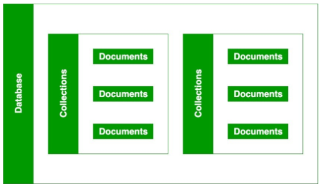
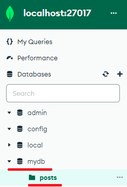
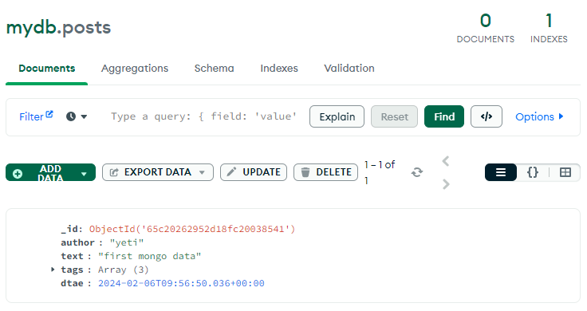
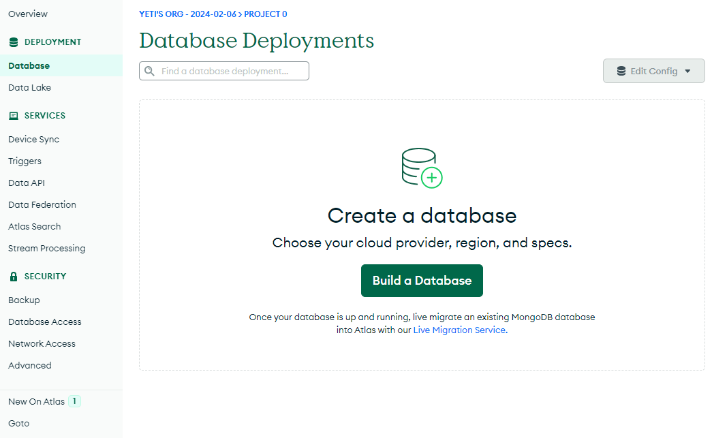
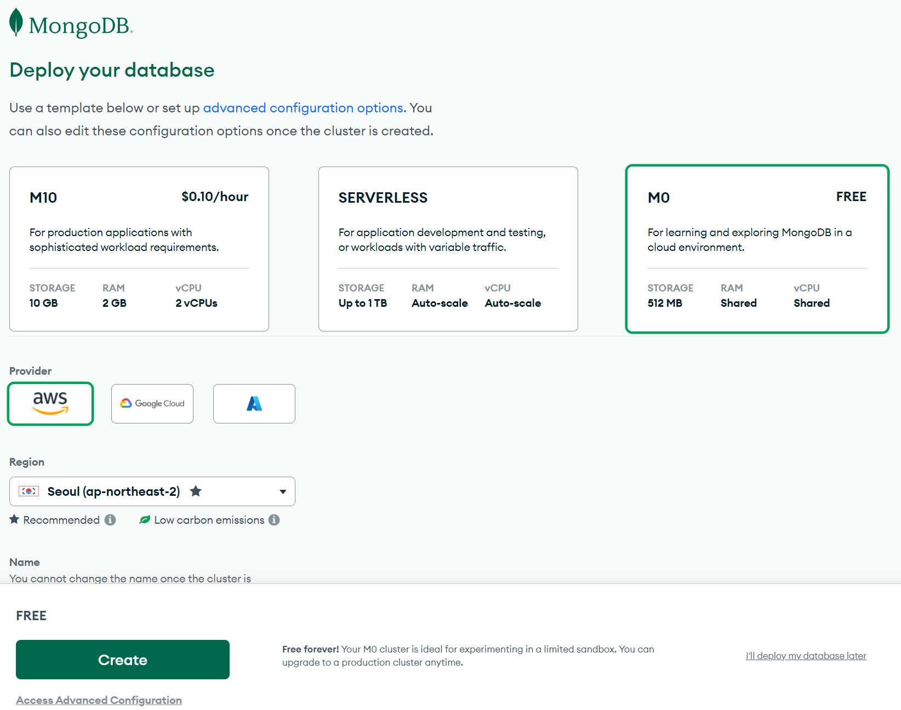
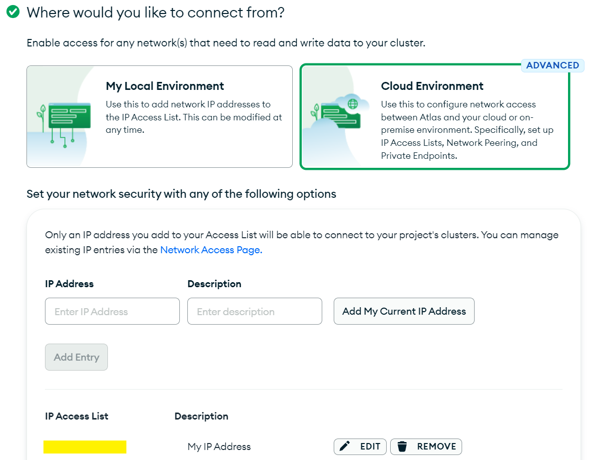
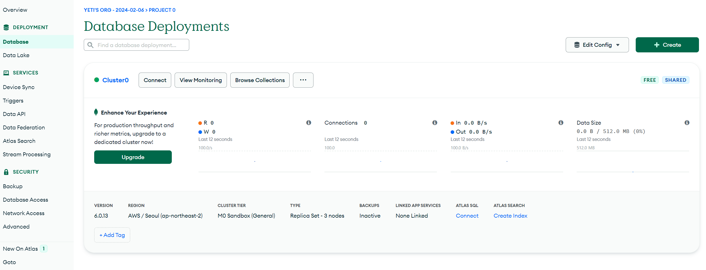
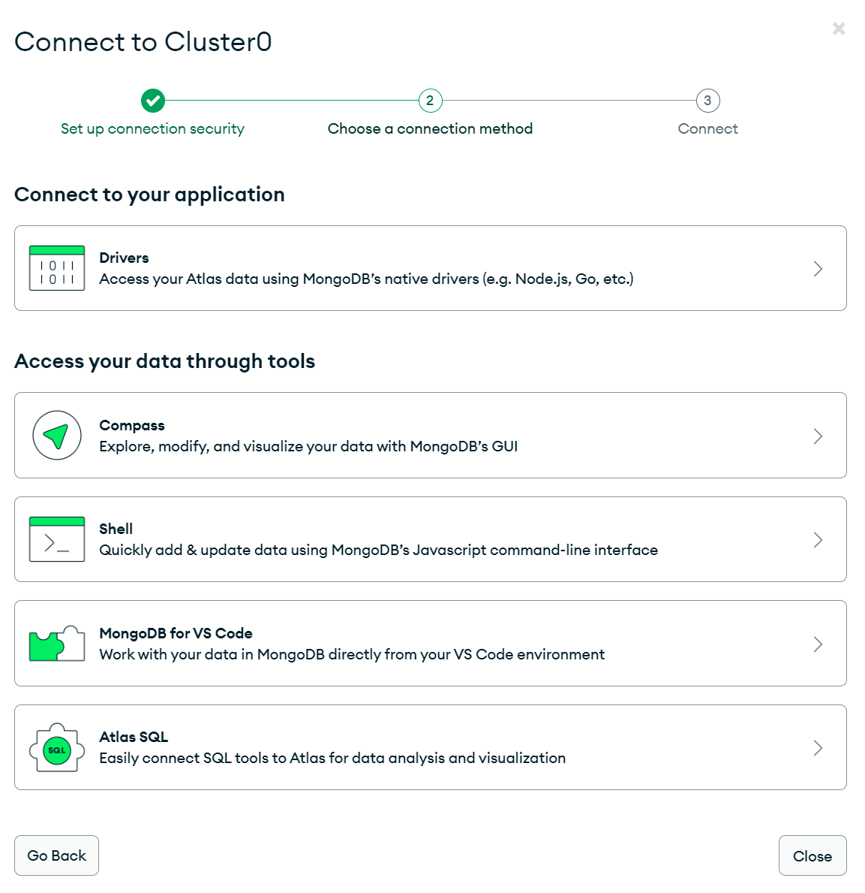

import * as Elem from '@elems';

프로젝트 내용에서 좋은 응답을 생성하기 위해 여러 정보를 검색해서 입력과 함께 넣어줄 필요가 있습니다.
이를 `Retriever`라고 하죠.
이번 프로젝트에서 `MongoDB`를 이용하기로 결정하였으니 이를 활용하여 Vector Search를 진행하는 방법을 공부해보려구요.

# Mongo DB

우선 `MongoDB`를 사용하기에 앞서 기존 사용하였던 `PostgreSQL`과 어떤 차이점이 있는지 알아볼 필요가 있겠습니다.

## RDBMS
기존의 `RDBMS(Relational Database Management System)`는 관계형 데이터베이스로 고정된 Row, Col로 구성된 테이블에 데이터를 저장합니다.
이는 데이터가 정해진 Schema에 따라 테이블에 저장이 된고 관계에 따라 여러 테이블에 분산되는 특징이 있죠.
즉, 테이블의 구조와 데이터 타입을 사전에 정의하고, 형태에 맞는 데이터만 기록할 수 있습니다.

<Elem.TwoCols>
<Elem.Cols size={50}>
<Elem.ColorText color='var(--info)'>
* Schema가 명확하게 정의되어 있다.
* 데이터 무결성을 보장한다.
* 각 데이터를 중복 없이 한 번만 저장한다.
</Elem.ColorText>
</Elem.Cols>

<Elem.Cols size={50}>
<Elem.ColorText color='var(--error)'>
* Schema를 사전에 정의해야 하여 유연성이 떨어진다. (대체로 수직적인 확장만 가능하다.)
* 관계를 맺고 있기 때문에 Join을 많이 해야하는 복잡한 Query가 만들어질 수 있다.
</Elem.ColorText>
</Elem.Cols>
</Elem.TwoCols>

## NoSQL

`NoSQL`은 비관계형 데이터베이스를 지징할때 사용됩니다.
기존의 테이블 형식이 아닌, 다양한 유형으로 데이터를 관리합니다.
주로 Document, Key-Value, Wide-Column, Graph등을 이용하죠.
유연한 Schema를 사용하여 높은 사용자 부하에서도 손쉽게 확장할 수 있다는 특징이 있죠.

<Elem.TwoCols>
<Elem.Cols size={50}>
<Elem.ColorText color='var(--info)'>
* 유연하게 저장된 데이터를 조정할 수 있다.
* 데이터를 필요한 형식으로 저장하기 때문에 데이터를 읽어오는 속도가 더 빠르다.
* 수직, 수평 확장이 가능해서 어플리케이션의 모든 읽기 쓰기 요청 처리가 가능하다.
</Elem.ColorText>
</Elem.Cols>

<Elem.Cols size={50}>
<Elem.ColorText color='var(--error)'>
* 높은 유연성으로 인해 데이터 구조 결정을 미루게 될 수 있다.
* 데이터가 중복되어 저장될 수 있다.
</Elem.ColorText>
</Elem.Cols>
</Elem.TwoCols>

### RDBMS를 사용해야 하는 경우!

* 데이터베이스의 ACID 성질을 준수해야 하는 소프트웨어를 개발하는 경우
* 관계를 맺고 있는 데이터가 자주 변경되는 경우
* Schema가 명확하여 잘 변경되지 않을 경우

<Elem.Comment>
ACID - Atomicity(원자성), Consistency(일관성), Isolation(격리성), Durability(지속성)
데이터베이스에서 실행되는 하나의 Transaction에 의한 상태 변화를 수행하는 과정에서 안전성을 보장하기 위해 필요한 성질
간단히 말하면 데이터가 안전하게 관리되어야 하는 듯! 데이터 이상하게 들어오려 하면 안돼! 돌아가!
</Elem.Comment>

### NoSQL을 사용해야 하는 경우!
* 정확한 데이터의 구조를 알 수 없거나 변경, 확장될 가능성이 있는 경우
* 읽기는 자주 해도 데이터 변경은 자주 없는 경우
* 막대한 양의 데이터를 다뤄야 해서 데이터베이스를 수평으로 확장해야 하는 경우

<Elem.Comment>
RDBMS의 경우 관계를 정의해야 하므로 한번 DB를 특정 리소스 위에 올려두면 추가적으로 확장하기 어려운데 반해
NoSQL은 RDBMS에 비해 유연하기 때문에 서로 다른 리소스에 분산 저장할 수 있어 막대한 데이터에 대해 확장이 좋다는 의미인가?
그래서 데이터가 적으면 적은 리소스에 올려두고 많아지면 리소스를 추가하여 분산으로 저장하고?
</Elem.Comment>

### 저장 방식

`MongoDB`는 아래와 같이 구성되어 있습니다.



DB에 Collection이 있고 그 아래에 Document들이 저장되는 방식이죠.
Document는 아래 예시와 같은 값을 가지고 있습니다.
```
{
    "_id": ObjectId("5099803df3f4948bd2f98391"),
    "username": "velopert",
    "name": { first: "M.J.", last: "Kim" }
}
```

`_id`는 12bytes로 각 Document의 고유한 값을 제공합니다.
username과 name은 해당 Document의 key, value 값이죠.
이렇게 동적으로 Schema를 생성하여 저장할 수 있는 구조입니다.

# DB Collection 생성, 삭제


먼저 [여기](https://www.mongodb.com/try/download/community)에서 DB를 설치합니다.
또 우리는 Python을 이용하여 접근하기 떄문에 관련한 패키지도 설치하자구요.
```
pip install pymongo
```

`MongoDB`는 기본적으로 아래와 같이 Collection, Document, Key, Value로 구성되어 있습니다.


먼저 Python을 이용하여 DB에 접속하도록 해볼게요.

```python
from pymongo import MongoClient

url = 'localhost'
port = 27017
client = MongoClient(host=url, port=port)

print(client.list_database_names())
```

```
['admin', 'config', 'local']
```

DB에 기본적으로 생성되어 있는 admin, config ,local 총 세 가지 DB명을 확인할 수 있습니다.

```python
db = client['mydb']
db.create_collection('posts')
```

```
Collection(Database(MongoClient(host=['localhost:27017'], document_class=dict, tz_aware=False, connect=True), 'mydb'), 'posts')
```



간단하게 mydb라는 DB에 posts라는 Collection을 생성해보았습니다.

```python
import datetime

post = {
    "author": "yeti",
    "text": "first mongo data",
    "tags": ["mongodb", "python", "pymongo"],
    "dtae": datetime.datetime.utcnow()
}

posts = db.posts
posts.insert_one(post).inserted_id
```

```
65c20262952d18fc20038541
```

posts라는 Collection에 간단하게 post라는 임의의 Document를 생성해서 넣었습니다.
이에 생성된 Documnent의 _id가 리턴값으로 반환되는 것을 볼 수 있었어요.



```python
db.drop_collection('posts')
```

임시로 생성한 posts Collection을 삭제하였습니다.
대충 이러한 방식으로 DB와 Collection을 생성할 수 있다는 것을 확인하였어요.

뭐 추가적으로 보안을 위한 비밀번호와 여러 가지 다룰 사항은 많지만
일단은 사용 방법을 익히고 보안은 나중에 따로 다루자구요!

# CRUD

DB를 어떠한 구조로 어떤 방식으로 생성하는지 알았으니, 기본적인 기능인 CRUD를 수행하기 위한 Python 코드로 수행하는 방법을 봐야겠습니다.

## Create

앞서 간단하게 테스트를 위해 사용해보았던 `insert_one` 함수를 이용해서 데이터를 저장할 수 있습니다.
이에 앞으로 사용할 간단한 테스트 데이터를 생성해보도록 할게요.

```python
posts = db.posts
post = {
    "author": "admin",
    "text": "test post",
    "tags": ["mongodb", "python", "pymongo"],
    "dtae": datetime.datetime.utcnow()
}
posts.insert_one(post)
```

앞서 했던 방식처럼 간단하게 Collection을 생성하고 데이터를 저장하는 것을 볼 수 있습니다.

```python
post1 = {
    "author": "yeti",
    "text": "first mongo data",
    "tags": ["mongodb", "python", "pymongo"],
    "dtae": datetime.datetime.utcnow()
}

post2 = {
    "author": "yun",
    "text": "second mongo data",
    "tags": ["mongodb", "python"],
    "dtae": datetime.datetime.utcnow()
}

post3 = {
    "author": "hwang",
    "text": "third mongo data",
    "age": 25,
    "tags": ["mongodb", "python", "pymongo"],
    "dtae": datetime.datetime.utcnow()
}

posts.insert_many([post1, post2, post3])
```

여러 개의 데이터를 한꺼번에 저장하는 방법도 있습니다.
또 실험을 위해 데이터의 구조를 약간 다르게 변경하였으나 모두 잘 저장되는 것을 볼 수 있었어요.
이것이 NoSQL에서 정의한 유연한 Schema를 의미하는 것 같습니다.
하지만 어느 정도 관리의 필요성을 위해 규칙된 형태를 가질 필요가 있겠어요.

## Read

생성한 데이터가 있으면 이를 조회하는 방법도 알아야겠죠?

```python
posts.find_one()
```

```
{'_id': ObjectId('65c2050c99067110ef273962'),
 'author': 'admin',
 'text': 'test post',
 'tags': ['mongodb', 'python', 'pymongo'],
 'dtae': datetime.datetime(2024, 2, 6, 10, 8, 12, 929000)}
```

`find_one` 함수를 사용해서 Collection의 데이터를 읽어올 수 있습니다.
아무런 조건도 주지 않았을 때 가장 첫 데이터를 읽어서 보여주었어요.

```python
posts.find_one({"author": "yeti"})
```

```
{'_id': ObjectId('65c2054f99067110ef273963'),
 'author': 'yeti',
 'text': 'first mongo data',
 'tags': ['mongodb', 'python', 'pymongo'],
 'dtae': datetime.datetime(2024, 2, 6, 10, 9, 19, 900000)}
```

이런 방식으로 원하는 데이터의 조건을 입력해서 찾아올 수 있구요.
그런데 만약 원하는 조건의 데이터가 여러개 존재한다면 어떡할까요?

```python
posts.find_one({"tags": ["mongodb", "python", "pymongo"]})
```

```
{'_id': ObjectId('65c2050c99067110ef273962'),
 'author': 'admin',
 'text': 'test post',
 'tags': ['mongodb', 'python', 'pymongo'],
 'dtae': datetime.datetime(2024, 2, 6, 10, 8, 12, 929000)}
```

동일한 조건을 가진 데이터 중 가장 상위의 데이터를 표시하는 것 같습니다.

```python
for doc in posts.find(({"tags": ["mongodb", "python", "pymongo"]})):
    print(doc)
```

```
{'_id': ObjectId('65c2050c99067110ef273962'), 'author': 'admin', 'text': 'test post', 'tags': ['mongodb', 'python', 'pymongo'], 'dtae': datetime.datetime(2024, 2, 6, 10, 8, 12, 929000)}
{'_id': ObjectId('65c2054f99067110ef273963'), 'author': 'yeti', 'text': 'first mongo data', 'tags': ['mongodb', 'python', 'pymongo'], 'dtae': datetime.datetime(2024, 2, 6, 10, 9, 19, 900000)}
{'_id': ObjectId('65c2054f99067110ef273965'), 'author': 'hwang', 'text': 'third mongo data', 'age': 25, 'tags': ['mongodb', 'python', 'pymongo'], 'dtae': datetime.datetime(2024, 2, 6, 10, 9, 19, 900000)}
```

여러 종류의 데이터를 한번에 가져오고 싶으면 `find` 함수를 이용할 수 있습니다.

## Update

데이터를 쓰고 찾았다면 저장된 데이터를 수정하는 작업도 진행할 수 있어야 하죠.

```python
doc = posts.find_one({"author": "yeti"})
posts.update_one(doc, {"$set": {"text": "im so hungry"}})
```

```
UpdateResult({'n': 1, 'nModified': 1, 'ok': 1.0, 'updatedExisting': True}, acknowledged=True)
```

간단하게 yeti라는 작가가 쓴 Document의 내용을 변경하는 작업을 진행했습니다.
왜 `$set`을 사용하는지 직접 찾아보았더니 필드의 값을 변경하는 연산자라고 하더라구요
이 내용은 [여기]("https://www.mongodb.com/docs/manual/reference/operator/update/set/")에서 찾아볼 수 있습니다.
`$set` 이외에도 여러 종류가 있는 것 같은데 상황에 알맞는 연산자를 사용하면 될 것 같네요.


여기서 중요한 부분은 `update_one` 함수를 사용하면 이전에 find로 찾아온 Document 객체는 다시 사용할 수 없습니다.
```python
posts.update_one(doc, {"$set": {"age": 10}})
```
```
UpdateResult({'n': 1, 'nModified': 0, 'ok': 1.0, 'updatedExisting': True}, acknowledged=True)
```

이전에 사용한 Document 객체에 age라는 새로운 Key-Value를 DB에 업데이트 하라는 함수를 호출하였습니다.
하지만 DB에는 아무런 변화가 없죠.
이를 해결하기 위해서는 다시 한번 해당 Document를 조회한 후 이를 업데이트 해야 한다는 것입니다.

```python
doc = posts.find_one({"author": "yeti"})
posts.update_one(doc, {"$set": {"age": 25}})
```

해당 객체에 age라는 Field가 생성되는 것을 볼 수 있습니다.
이미 업데이트된 객체는 다시 업데이트나 제거를 하기 위해 다시 조회를 해야한다는 것을 알 수 있죠.

```python
posts.update_many({'age': 25}, {"$set": {"age": 100}})
```
```
UpdateResult({'n': 2, 'nModified': 2, 'ok': 1.0, 'updatedExisting': True}, acknowledged=True)
```

위와 같이 `update_many` 함수에 조건과 변화할 값을 제공하면 조건에 해당하는 모든 데이터에 대해 값을 업데이트 하는 것을 볼 수 있습니다.

```python
posts.update_many({}, {"$set": {"maybe": 100}})
```

이처럼 모든 Document를 대상으로 적용할 수 있구요.

```python
doc = posts.find_one({"author": "yeti"})
posts.update_one(doc, {"$unset": {"age": None}})
```

`$unset` 연산자를 이용하면 기존에 존재하던 Field를 제거할 수 있습니다.
이러한 방식으로 기존 데이터에 Field를 추가, 제거하거나 값을 변경하는 등 기능을 사용할 수 있겠습니다.

## Delete

데이터를 삭제하는 방법은 추가하는 방법과 유사합니다.
`delete_one`, `delete` 함수를 사용하면 되죠.

```python
posts.delete_one({"author": "yeti"})
posts.delete_many({})
```

이를 활용하여 데이터를 쓰고 읽고 변경하고 지우는 작업을 수행할 수 있습니다.

# Atlas

사실 테스트 용도로 로컬에서 이것 저것 돌려보려고 로컬 환경에 `MongoDB`를 설치하였는데,
NoSQL은 빅데이터를 처리하는데 효율적이라 빅데이터 플랫폼이 필수로 사용된다고 합니다.
또 클라우드를 활용하면 수평 구조를 효과적으로 늘릴 수 있을 것 같으니 `MongoDB Atlas`라는 클라우드 데이터베이스를 사용해보죠.

[Atlas]("https://cloud.mongodb.com/")



해당 페이지에 가입을 하면 아래와 같은 화면이 뜹니다.
Build a Database를 클릭하여 테스트 용으로 사용할 DB를 생성해봅시다.



무료 버전을 활용할 생각이니 M0를 선택합시다.
Create 버튼을 눌러 생성을 진행하죠.


접근 가능한 사용자 비밀번호를 설정해줍니다.



클라우드로 설정해봅시다.



모두 설정하고 Database를 보면 무언가 생성된 것을 볼 수 있어요.



Connect 버튼을 클릭하면 각 방식에 따른 연결 방법이 나옵니다.
우리는 Python을 이용하여 DB에 접근할테니, Drivers를 눌러 Python을 선택하고 봅시다.


# Vector Search

사실 앞에서 `MongoDB`에 대한 기본적인 사용 방법을 공부한 것은 메세지를 Vector의 형태로 저장하고 Vector Search를 진행하기 위함이었어요.
프로젝트에서 주고 받은 메세지와 Embedding된 Vector를 함께 저장한 후 응답을 생성할 때 유사한 응답에 대해 `RAG`을 사용할 생각입니다.
