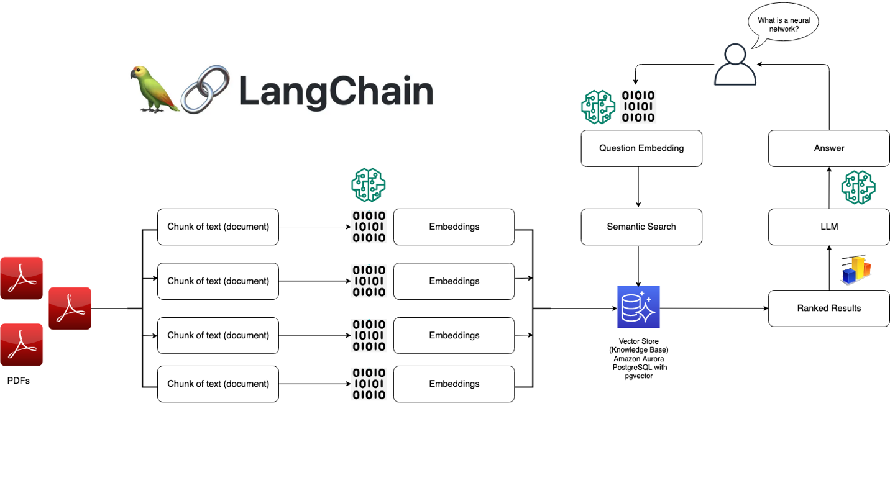

import * as Elem from '@elems';

이번에 SK AI Challenger 프로그램을 이수하며 팀 프로젝트를 진행하게 되었습니다.
시험으로 첫주에 출석하지 못한 인원끼리 모여 팀 `🐣오리알`을 구성했어요.

# 💡 아이디어 

각 인원들이 생각해낸 아이디어와 앞서 기술 스택을 바탕으로 개발 가능한 주제로 줄인 결과 3가지 후보가 만들어졌습니다.

## 이모티콘 생성기

이미지 생성형 모델을 활용하여 메신저에서 본인이 원하는 이모티콘을 직접 제작해서 사용하는 서비스입니다.
대화의 흐름에 적절한 본인만의 이모티콘을 편리한 접근성을 활용하여 생성, 전송하는 것이죠.

하지만 이는 <Elem.ColorText color='var(--error)'>기존의 이모티콘을 사용하여 학습을 진행한다는 부분에서 저작권에 관한 문제가 발생할 수 있다는 문제가 있었습니다.</Elem.ColorText>
또한 조사한 결과 ['카카오톡에서 생성형 AI로 만든 이모티콘 입점을 제한'](https://www.hani.co.kr/arti/economy/economy_general/1108067.html)한다는 기사를 찾을 수 있었죠.
아직은 <Elem.ColorText color='var(--error)'>생성형 AI으로 제작된 이모티콘을 비즈니스 모델로 사용하는 것은 시기상조</Elem.ColorText>인듯 하였습니다.

> 개인적으로 이런 서비스가 존재한다면 이용할 의사가 있었는데 정말 아쉽습니다.

## 지정 외 장소 흡연 감지기

흡연구역이 아닌 장소에서 흡연을 하는 인원을 감지하는 시스템입니다.
드론을 활용하여 흡연을 하는 사람을 촬영하고 얼굴을 인식하는 방식이죠.
흡연구역이 아닌 장소에서 흡연을 하여 주변 건물에 위치한 사람에게 피해를 주는 것을 방지하기 위해 기획되었어요.

이는 배터리와 기상에 영향을 받는 드론 대신 CCTV를 활용하여 24시간 감지 가능하도록 개선할 수 있을 것 같습니다.
또한 흡연 행위로 한정하는 것이 아닌 범법 행위 중 데이터 구축과 정밀한 정확도를 가지도록 학습하기 쉬운 특정한 행위로 타겟할 수 있을 것 같았어요.

## 온라인 추모관

죽음으로 인해 누군가를 잃었을때 그 사람을 그리워하며 이전에 촬영된 영상을 보고는 합니다.
그리운 마음을 조금이라도 해소하기 위해 그 사람과 대화를 할 수 있는 서비스입니다.

당사자의 성격과 유사한 응답을 생성하고 이에 당사자의 음성을 입혀 그 사람과 대화하는 느낌이 들도록 서비스를 제공합니다.
기존의 존재하는 음성 합성 AI와 페르소나를 적용한 ChatBot을 이용하여 구현할 수 있을 것 같았어요.
다만 우려되는 사항은 <Elem.ColorText color='var(--error)'>고인에 대한 AI 모델을 생성한다는 비판적인 시선</Elem.ColorText>이었습니다.

## 선정 ✔️

과거에 돌아가신 박윤배 배우를 AI 기술을 통해 현재 사람들과 대화를 할 수 있게 방송국에서 기획한 프로그램이 있었습니다.
해당 영상의 댓글을 보니 가까운 이의 죽음을 경험한 사람은 이러한 방식으로도 만나고 싶어 한다는 것을 확인할 수 있었죠.  

`youtube: https://www.youtube.com/watch?v=aqgC9DHieb8&ab_channel=tvNDENT`
`AI 기술로 다시 가족들을 만날 수 있다면..😢 너무 듣고 싶었던 응삼이 故 박윤배의 목소리로 전원일기 식구들과 대화를 나누다`

또한 카카오톡에서 고인에 대한 계정을 바로 삭제하는 것이 아닌, 프로필을 남겨 지인들이 그 사실을 알게 하고 추모하는 시간을 만들어 주는 서비스를 실행하였습니다.

또한 조금 더 도전적인 난이도로 더 큰 성장을 할 수 있는 `🕊️ 온라인 추모관`을 주제로 프로젝트를 진행하기로 하였습니다.

# 🔬 조사 

프로젝트의 핵심 기술을 구현하기 위해, LLM과 프롬프트 엔지니어링을 활용한 응답 생성과 음성을 합성하여 문장을 음성 데이터로 변환하는 기술이 필요합니다.
따라서 어떠한 자료를 참고해서 어느 모델을 활용할 수 있는지 조사를 진행하였습니다.

## 음성 합성

기존의 음성 합성에 대한 도메인이 하나도 존재하지 않았기에 관련 연구를 찾아보았습니다.

### Tacotron

`Tacotron`은 구글에서 개발한 텍스트를 음성으로 변환하는 End-to-End 음성 합성 시스템입니다.
강세, 억양, 리듬과 같은 자연스러운 음성을 재현하는 작업을 수행하여 대상의 목소리와 비슷한 음성을 생성합니다.

<Elem.Comment>
여러 논문을 찾아보았지만 Tacotron를 실제 서비스에 직접 활용하기 보다 기본적으로 Tacotron을 이용하여 발전시킨 모델들을 활용하는 듯!
약간 음성에 대한 기본 배경 지식이라 생각하고 공부만 간단하게 하고 다른 모델을 봐야 할 듯!
</Elem.Comment>

### 커스텀 음성 합성기

🤔 음성 합성기를 조사하다 보니 의문이 생기더라구요.  
위에서 언급했던 음성 합성 방법들은 특정한 목소리를 기반으로 TTS를 구현하는 것을 목표로 모델을 최적화합니다.
이를 프로젝트에 적용하게 된다면 사용자 개개인에 맞춰 모델을 학습시키고 보관하는 비용이 발생할 것이죠.
하나의 모델로 다양한 화자의 목소리를 만들어 낼 수 있는 기술이 필요할 것 같다고 느꼈습니다.

`youtube: https://www.youtube.com/watch?v=enBn77LIC24`
`카카오엔터프라이즈 커스텀 음성 합성 기술`

`다화자 합성기`는 선택된 화자의 목소리로 합성음을 출력하는 모델입니다.
이는 공통된 Encoder, Decoder와 화자 개개인의 고유 음성 정보로 구성되는데,
공통된 Encoder와 Decoder를 사용하기 때문에 한명당 화자 고유 음성 정보를 구성하는데 필요한 문장 수가 줄어드는 특징이 있습니다.

그런데 이는 <Elem.ColorText color='var(--error)'>화자를 추가하는 과정에서 기존에 존재하는 화자의 특성을 잃어버리는 문제가 발생할 수 있구요</Elem.ColorText>,
또 기존 모델을 구성하는 비용에 비해 신규 화자의 음성 데이터가 적을 뿐 <Elem.ColorText color='var(--error)'>많은 문장의 데이터가 필요한 것</Elem.ColorText>은 마찬가지 입니다.

`카카오 엔터프라이즈`에서는 이를 해결하기 위해 다 만들어진 합성기에 목소리만 추가할 수 있는 `커스텀 음성 합성기`를 만들었다고 합니다.
위 영상에서는 두 가지 방법을 통해 커스텀 음성 합성기에 목소리를 추가하고 있습니다.

### 적응 기반 커스텀 합성기

첫 번째는 [ADASPEECH](https://arxiv.org/pdf/2103.00993.pdf)를 적용하여 `적응 기반 커스텀 합성기`를 구축하는 방법입니다.
`적응 기반 합성기`는 훈련이 완료된 `다화자 합성기`에 추가적인 훈련(적응)을 통해 목소리를 추가하는 방법입니다.
일부 파라미터의 Backpropagation을 막아 Speaker Embedding의 파라미터만 조절하는 Parameter Tuning의 방식이죠.
이는 목소리가 추가될 때 마다 추가적인 학습이 필요하다는 사실은 동일합니다.

즉 1단계 - 다화자 TTS 훈련이 진행되고, 2단계 - 목적 화자로 정응 훈련을 진행하는 방식이죠.
이 방식은 추가적인 적응 훈련이 필요하고, 적응 과정에서 업데이트 된 파라미터 저장 용량이 필요합니다.
또 새로운 화자를 추가하기 위해 약 20문장으로 구성된 화자의 음성 데이터가 필요합니다. 

### Zero-Shot 커스텀 합성기

`Zero-Shot 커스텀 합성기는` Speaker Encoder를 두어 새로운 화자의 목소리를 Encoding하여 사용할 수 있도록 만들어진 모델입니다.
따라서 새로운 화자의 음성을 추가적인 학습 단계 없이 바로 사용할 수 있다는 장점이 있습니다.
적게는 1문장의 화자 음성 데이터 만으로도 구축할 수 있다는 장점이 있죠.

프로젝트에서 다양한 사용자에 대한 여러 음성 데이터를 처리하기 위해서는 `Zero-Shot 커스텀 합성기`를 채택하는 것이 더 좋아보입니다.
하지만 좋은 Speaker Encoder를 구성하는 방법을 잘 찾아봐야 할 것 같아요. 

## 언어 모델

프로젝트의 당사자의 말투와 화법을 고려한 응답을 생성하기 위해 LLM의 입력을 전달하기 전, 여러 프롬프트 엔지니어링 기술이 필요합니다.
Open AI는 서비스하고 있는 [ChatGPT의 Prompt Engineering](https://platform.openai.com/docs/guides/prompt-engineering) 정보를 제공하고 있죠.

## LangChain

[$card](https://aws.amazon.com/ko/what-is/langchain)

`LangChain`은 LLM을 기반으로 어플리케이션을 구축하기 위한 오픈 소스 프레임워크입니다.
모델이 생성하는 정보의 맞춤화, 정확성 및 관련성을 개선하기 위한 도구와 추상화 기능을 제공하죠.
이를 활용하여 새 프롬프트 체인을 구축하거나 기존 템플릿을 커스텀하여 언어 모델의 개발을 간소화합니다.

`LangChain`에서 아래와 같은 기능을 제공하고 있습니다.

* LLM 인터페이스 - 간단한 API를 통해 `GPT`, `Bard`, `PaLM` 모델을 간편하게 이용할 수 있습니다.
* 프롬프트 템플릿 - AI 모델에 일관된 요청을 보내도록 프롬프트 템플릿을 구성, 이용할 수 있습니다.
* 에이전트 - 언어 모델이 요청에 응답하는 최상의 시퀀스를 결정하도록 유도하는 체인입니다.
<Elem.Comment>
Decoding 방법을 의미하는 건가? 조금 더 찾아봐야 할 듯!
</Elem.Comment>
* 검색 모듈 - `RAG` 시스템을 설계할 수 있습니다. (여기서 쓸 일은 없을 듯 하지만 다른 업무에선 활용 가치 높을 듯!)
* 메모리 - 대화형 언어 모델에서 이전 대화를 기억하는 간단한 메모리 시스템과 과거 메세지를 분석하여 가장 연관성이 높은 결과를 반환하는 복잡한 메모리 구조를 제공합니다.
* 콜백 - 작업의 이벤트를 기록, 모니터링, 스트리밍 기능을 추가하여 오류를 추적할 수 있습니다.

> Langchain에 대한 수요도 늘고 커뮤니티도 점점 성장하는 중인듯!

## FasterTransformer

[$card](https://engineering.clova.ai/posts/2022/01/hyperclova-part-1)

대규모 언어 모델의 경우 학습을 시키는 것도 중요하지만, 학습한 모델을 사용하여 효과적으로 추론을 진행하는 것도 중요합니다.
Nvidia의 `FasterTransformer`는 Pytorch가 아닌 C++와 CUDA 네이티브 커널로 작성되어 CUDA 커널 레벨 최적화 기법이 적용되어 있습니다.
이러한 구현 방식 덕분에 GPU를 더 효율적으로 사용하면서 서빙 과정에서 지연 시간이 줄어들 것을 기대할 수 있죠.
