import * as Elem from '@elems';

Django를 이용하여 REST API 서버를 제작하기 위한 프레임워크 `DRF(Django REST Framework)`에 대해 공부합니다.
Django를 이용해서 `SSR(Server Side Rendering)` 웹 페이지를 만들 수 있지만 우리는 REST API 서버를 만드는 것이 목적이기 때문에 템플릿에 관한 부분은 생략하도록 하겠습니다.

# START

먼저 필요한 패키지들을 설치해줍시다.

```
$ pip install Django djangorestframework django-filter
```

패키지 설치를 완료하였다면 `django-admin`을 이용하여 간단한 프로젝트를 하나 생성해보죠.

```
$ django-admin startproject mysite
```

<Elem.Comment>
프로젝트를 생성할 때 충돌을 피하기 위해 django, test와 같은 Python 패키지의 이름을 사용하지 않는 것을 권장한다고 합니다.
또한 생성될 프로젝트를 root로 두지 말라고 합니다. 
Python 코드가 웹 서버의 최상단 문서에 존재하는 것은 사람들이 웹을 통해 코드를 볼 수 있어 보안에 좋지 않다고 하네요.
</Elem.Comment> 

아래와 같이 프로젝트 파일들이 생성된 것을 볼 수 있습니다.

```
mysite
|-- mysite
|   |-- __iniy__.py
|   |-- asgi.py
|   |-- settings.py
|   |-- urls.py
|   |-- wsgi.py
manage.py
```

settings.py 파일에서 여러 셋팅을 관리합니다.
DRF를 사용하기 위해 해당 파일에 아래와 같이 내용을 추가해줍시다.
```python
# mysite/mysite/settings.py
INSTALLED_APPS = [
    ...
    'rest_framework'
]
```

이제 Django가 프로젝트 시작 시 DRF를 로드하도록 지시합니다.
이제 서버를 실행시켜 봅시다.

```
$ python manage.py runserver
```

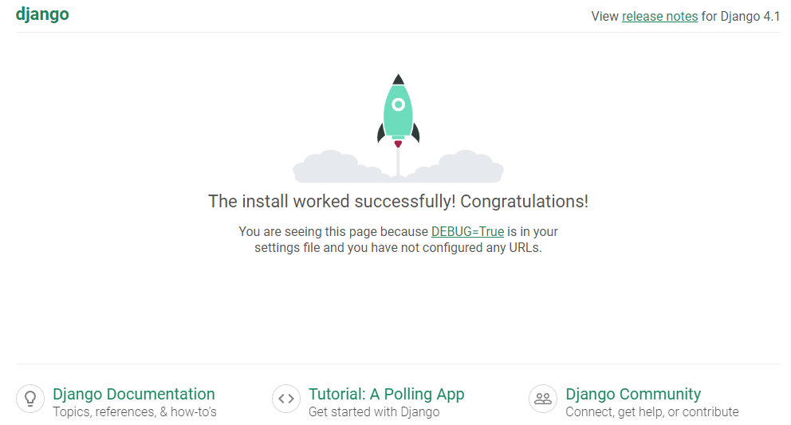

서버를 열고 해당 URL로 접속하면 위와 같은 화면이 뜨는 것을 볼 수 있습니다.
포트 번호를 변경하거나 외부 접속을 허용하기 위해 아래와 같이 설정할 수도 있죠.

```
$ pthon manage.py runserver 0.0.0.0:8080
```

아래와 같이 Database에 적용되지 않은 변경사항(migrations)들에 대한 경고들은 나중에 다루도록 하겠습니다.
<Elem.ColorText color='var(--error)'>
You have 18 unapplied migration(s). Your project may not work properly until you apply the migrations for app(s): admin, auth, contenttypes, sessions.
Run 'python manage.py migrate' to apply them.
</Elem.ColorText>

# DB 연결

이제 앞으로 데이터를 R/W 하기 위한 DB를 연결해주는 부분을 보도록 하겠습니다.
DB는 간단하게 `MySQL`을 `Docker`를 이용하여 구축하도록 할게요.

```
$ docker run --name mysql-container -e MYSQL_ROOT_PASSWORD=<password> -v mysql-volume:/var/lib/mysql -d -p 3306:3306 mysql:latest
```

MySQL을 Django에서 사용하기 위해서 mysqlclient 패키지를 설치해줍시다.

```
$ pip install mysqlclient
```

이전에 프로젝트를 생성하며 함께 생성된 파일중 settings.py를 보면 DB와 관련된 설정하는 부분이 있습니다.
이 부분을 변경하여 구축한 MySQL DB와 연결하도록 해볼게요.

```python
# mysite/mysite/settings.py
DATABASES = {
    "default": {
        "ENGINE": "django.db.backends.mysql",
        "NAME": "mysite",
        "USER": "root",
        "PASSWORD": PASSWORD,
        "HOST": "localhost",
        "PORT": "3306"
    }
}
```

<Elem.TwoCols>
<Elem.Cols size={70}>
이후 migrate를 실행하여 DB에 변경사항을 저장해주도록 하겠습니다.
```
$ python manage.py migrate
```

그렇다면 DB에 Django에서 기본적으로 가지고 있던 Table이 DB에 저장된 것을 확인할 수 있습니다.
MongoDB나 PostgreSQL역시 각각 알맞은 패키지를 설치하고 위와 같이 설정을 변경하는 방식으로 연결해줄 수 있겠습니다.
</Elem.Cols>
<Elem.Cols size={30}>
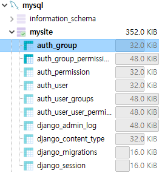
</Elem.Cols>
</Elem.TwoCols>

# TABLE 생성

이제 DB에 등록할 객체를 생성하는 방법을 해보도록 할게요.
먼저 계정에 대한 정보를 담는 Table을 생성하도록 하겠습니다.

```
$ python manage.py startapp account
```

위 명령어를 사용하면 아래와 같이 파일들이 생성되는 것을 볼 수 있습니다.

```
mysite
|-- account
|   |-- migrations
|       |-- __init__.py
|   |-- __init__.py
|   |-- admin.py
|   |-- apps.py
|   |-- models.py
|   |-- tests.py
|   |-- views.py
|-- mysite
|   |-- ...
manage.py
```

여기서 models.py 파일에 모델을 구축하도록 하겠습니다.

```python
# mysite/account/models.py
class Account(models.Model):
    account_number = models.CharField(max_length=16, unique=True)
    password = models.DecimalField(max_digits=4, decimal_places=0)
    created_at = models.DateTimeField(auto_now_add=True)
```

이제 해당 어플리케이션이 만들어졌다는 것을 알려주어야 합니다.
settings.py에 아래와 같이 알려주도록 합시다.

```python
# mysite/mysite/settings.py
INSTALLED_APPS = [
    ...
    'account'
]
```

또 변화가 발생했다는 것을 DB에 알려주어야 합니다.

```
$ python manage.py makemigrations
$ python manage.py migrate
```

이제 DB를 보면 새로운 테이블이 생긴것을 확인할 수 있습니다.

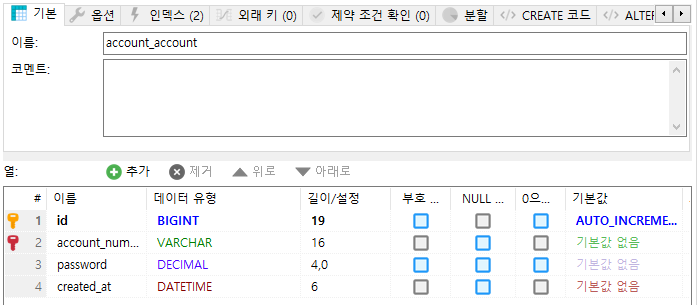

서버를 실행하고 /admin 페이지로 가보면 로그인이 필요합니다.
superuser 계정을 만들어서 로그인을 진행합시다.

```
$ python manage.py createsuperuser
```

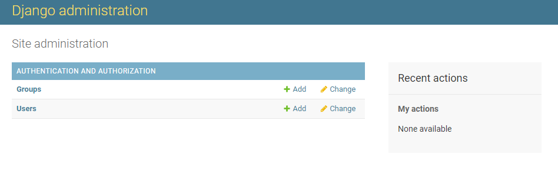

해당 페이지에서 추가한 Account 내용이 보이지 않죠.
이를 추가하기 위해서 admin.py 파일을 수정합니다.

```python
# mysite/account/admin.py
from .models import Account

admin.site.register(Account)
```

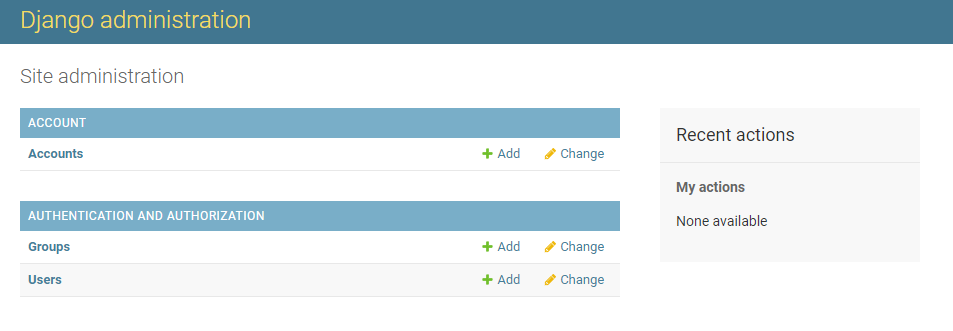

각 테이블의 Add 버튼을 눌러 매뉴얼하게 데이터를 추가할 수 있습니다.

# REST API

이제 만들어둔 테이블의 데이터를 CRUD 하는 방법을 보겠습니다.

## GET

웹과 데이터를 주고 받기 위해 `Serializer`라는 객체를 json 형식으로 바꿔주는 과정이 필요합니다.
생성된 account 폴더에 serializer.py 파일을 생성해 아래와 같이 내용을 적어줍시다.

```python
# mysite/account/serializer.py
from rest_framework import serializers
from .models import Account

class AccountSerializer(serializers.ModelSerializer):
    class Meta:
        model = Account
        fields = '__all__'
```

위에서는 모든 field에 대해 전달해주기 위해 __all__을 사용하였지만, 추후에는 비밀번호와 같은 민감한 정보에 대해서는 전달해 주지 않도록 변경하는 작업을 진행해야 합니다.

이제 API에 대한 내용을 views.py 에 작성하여 모든 account에 대한 정보를 전달하는 내용을 작성해봅시다.
```python
# mysite/account/views.py
from rest_framework.views import APIView
from rest_framework.response import Response
from .serializer import *

class AccountList(APIView):
    def get(self, request):
        model = Account.objects.all()
        serializers = AccountSerializer(model, many=True)
        return Response(serializers.data)
```
여기서 `Account.object.all`은 데이터베이스로부터 데이터를 읽고 전달받은 모델의 객체 목록입니다.
이를 `Serializer`를 통해 JSON 형식으로 변경하는 것이죠.
이러한 방식이 바로 `Django`의 `ORM(Object Relational Mapping)`입니다.
SQL 명령문이 아닌 비교적 간단한 Python 명령으로 데이터베이스를 다룰 수 있죠.

여러 데이터를 가져오도록 해야 하니까 many를 True로 주었습니다.
기본 값이 False라서 하나의 데이터만 가져오는 경우는 굳이 파라미터를 전달하지 않아도 되겠어요.

마지막으로 urls.py 에 해당 API의 주소를 입력해주고 브라우저를 통해 확인을 하도록 해봅시다.
```python
# mysite/mysite/urls.py
from account.api import AccountList

urlpatterns = [
    ...
    path('api/account_list', AccountList.as_view(), name='account_list')
]

```

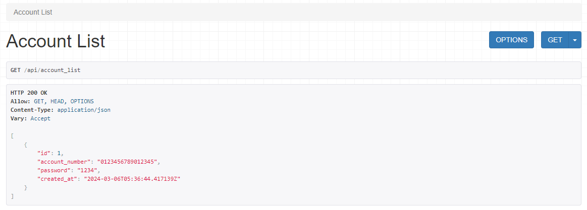

## POST

앞서 GET Method를 생성한 것과 비슷한 방법으로 POST를 생성하도록 하겠습니다.
views.py 파일을 수정해보죠.

```python
# mysite/account/views.py
from rest_framework import status

class AccountList(APIView):
    def get(self, request):
        ...

    def post(self, request):
        serializer = AccountSerializer(data=request.data)
        if serializer.is_valid():
            serializer.save()
            return Response(serializer.data, status=status.HTTP_201_CREATED)
        return Response(serializer.errors, status=status.HTTP_400_BAD_REQUEST)
```

Request로 부터 데이터를 받아와 Serializer를 통해 객체로 생성합니다.
이때 데이터의 유효성을 판단하여 상태를 반환하죠.
Account List 페이지에 가보면 아래와 같은 입력가능한 컴포넌트가 뜨는 것을 확인할 수 있습니다.
여기에 데이터의 형식에 맞게 입력하여 데이터를 생성해보도록 하죠.

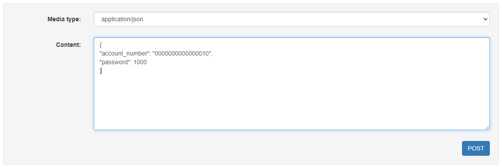
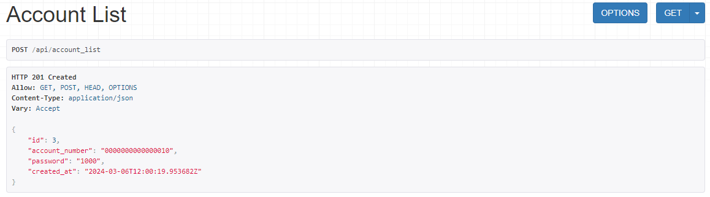

## PUT

데이터를 업데이트 하는 요청을 제작하기 위해서 먼저 특정한 데이터만 가져오는 코드를 구현하려 합니다.

```python
# mysite/account/views.py
class AccountDetail(APIView):
    def get(self, request, id):
        model = Account.objects.get(id=id)
        serializer = AccountSerializer(model)
        return Response(serializer.data)
```

AccountDetail이라는 새로운 클래스를 하나 생성하였습니다.
이제 URL을 통해 API에 접근할 수 있도록 urls.py에 또 추가를 해야겠죠?

```python
# mysite/mysite/urls.py
urlpatterns = [
    ...
    path('api/account_list/<int:id>', AccountDetail.as_view(), name='account_list')
]
```

Account의 ID는 Int 형태로 저장되고 있기 때문에 위와 같은 형태로 값을 받아서 API에 접근하려 합니다.
이를 테스트해보면 다음과 같은 결과가 나오죠.
/api/account/1 로 접속을 하도록 하겠습니다.

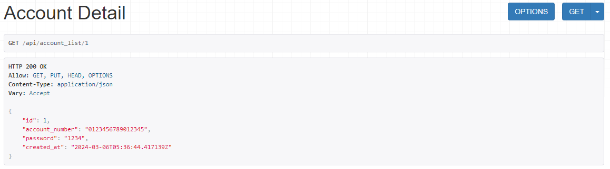

접속하는 ID 값으로 어떠한 데이터에 접근하려고 하는지 명시해줄 수 있습니다.
이를 조금 더 이용하여 데이터를 업데이트 하는 PUT API를 생성하도록 하죠.

```python
# mysite/account/views.py
class AccountDetail(APIView):
    def get(self, request, id):
        ...

    def put(self, request, id):
        model = Account.objects.get(id=id)
        serializer = AccountSerializer(model, data=request.data)
        if serializer.is_valid():
            serializer.save()
            return Response(serializer.data, status=status.HTTP_200_OK)
        return Response(serializer.errors, status=status.HTTP_400_BAD_REQUEST)
```

POST랑 굉장히 비슷한 형태를 가지고 있습니다.
이제 /api/account/1 에 PUT으로 password를 변경해보겠습니다.

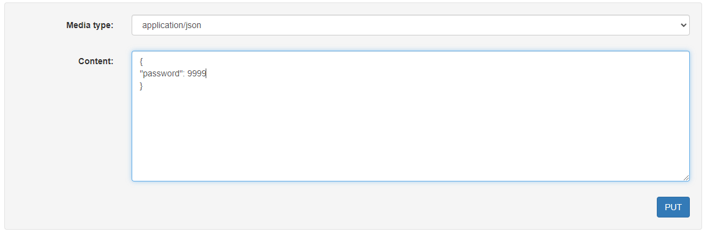
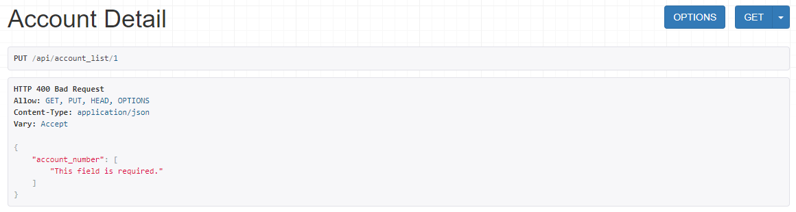

PUT 요청을 할 때, account_number라는 field를 주지 않아서 발생하는 오류입니다.
하지만 우리는 password에 대해서만 변경하고 싶으니 Account의 Serializer를 약간 수정하도록 하겠습니다.

```python
# mysite/account/serializer.py
class AccountSerializer(serializers.ModelSerializer):
    account_number = serializers.CharField(required=False)
    password = serializers.CharField(required=False)
    ...
```

그리고 아까와 동일한 요청을 보내면 아래와 같은 결과가 생성되는 것을 볼 수 있습니다.

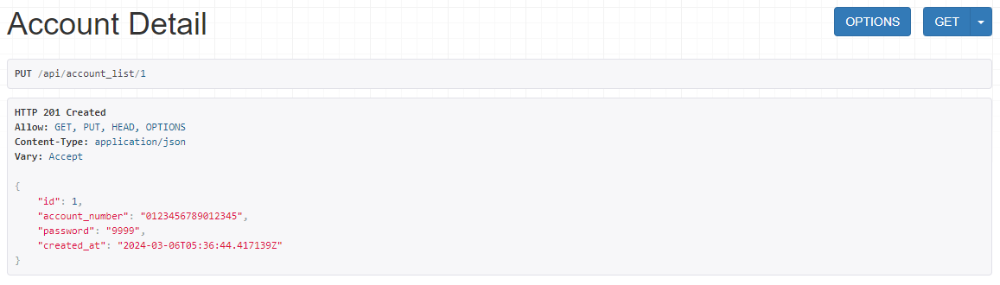

## DELETE

이제 데이터를 삭제하는 DELETE를 구현해보죠.

```python
# mysite/account/views.py
class AccountDetail(APIView):
    ...
    def delete(self, request, id):
        model = Account.objects.get(id=id)
        model.delete()
        return Response(status=status.HTTP_204_NO_CONTENT)
```

모델을 찾아 삭제해주기만 하면 완료됩니다.
이제 해당 페이지에 들어가면 DELETE 버튼이 생성됩니다.
이를 누르면 데이터가 삭제되는 것을 확인할 수 있습니다.
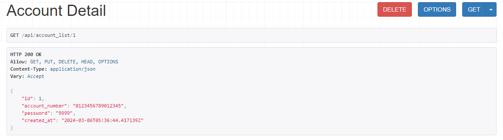

## @api_view

위에서 APIView를 이용한 클래스 기반 API를 작성하였습니다.
하지만 아래와 같이 함수 기반으로 API를 작성할 수도 있죠.

```python
# mysite/account/views.py
@api_view(["GET", "PUT", "DELETE"])
def account_func(request, id):
    if request.method == "GET":
        model = Account.objects.get(id=id)
        serializer = AccountSerializer(model)
        print(serializer.data)
        return Response(serializer.data, status=status.HTTP_200_OK)
            
    elif request.method == "PUT":
        model = Account.objects.get(id=id)
        serializer = AccountSerializer(model, data=request.data)
        if serializer.is_valid():
            serializer.save()
            return Response(serializer.data, status=status.HTTP_200_OK)
        return Response(serializer.errors, status=status.HTTP_400_BAD_REQUEST)
    
    elif request.method == "DELETE":
        model = Account.objects.get(id=id)
        model.delete()
        return Response(status=status.HTTP_204_NO_CONTENT)
```

```python
# mysite/mysite/urls.py
urlpatterns = [
    ...
    path('api/account_func/<int:id>', account_func, name='account_func'),
]
```

간단한 API는 굳이 클래스 기반으로 만들 필요 없이 함수 기반으로 만들어도 될 것 같습니다.


# User

대략적인 API를 구현하는 방법은 알게 되었으니, 처음부터 다시 프로젝트를 만들어서 사용자와 계좌 모델을 만들고 돈을 송금하는 Usecase를 만들어볼게요.

Django를 설치하고 DB를 설정한 후 migrate 명령을 실행했을 때 DB에 처음 보는 테이블이 생성되는 것을 볼 수 있었습니다.
특히 기본적으로 생성된 테이블에서 auth_user라는 테이블을 볼 수 있죠.
해당 테이블은 아래와 같은 Field들을 가지고 있습니다.

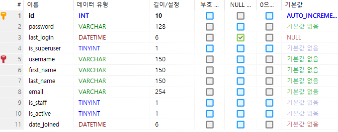

여기에 추가적으로 필요한 정보를 더해 accounts라는 앱을 생성하도록 하겠습니다.
`Django`에서는 기본적으로 제공하는 `AbstractBaseUser` 객체를 이용하면 쉽게 커스텀한 User를 생성할 수 있습니다.

```python
# toss/accounts/models.py
from django.db import models
from django.contrib.auth.models import AbstractBaseUser, BaseUserManager, PermissionsMixin

class UserManager(BaseUserManager):
    def __create_user__(self, email, password, **extra_fields):
        if not email:
            raise ValueError('[UserManager] email must be set.')
        if not password:
            raise ValueError('[UserManager] password must be set.')             
        email = self.normalize_email(email)
        user = self.model(email=email, **extra_fields)
        user.set_password(password)
        user.save(using=self._db)
        return user
    
    def create_user(self, email, password, **extra_fields):
        extra_fields.setdefault('is_staff', False)
        extra_fields.setdefault('is_superuser', False)
        return self.__create_user__(email, password, **extra_fields)
    
    def create_superuser(self, email, password, **extra_fields):
        extra_fields.setdefault('is_staff', True)
        extra_fields.setdefault('is_superuser', True)
        return self.__create_user__(email, password, **extra_fields)
    
class User(AbstractBaseUser, PermissionsMixin):
    email = models.CharField(max_length=30, unique=True)
    password = models.CharField(max_length=128)
    username = models.CharField(max_length=30)
    age = models.PositiveIntegerField({'max_value': 200}, null=True)
    sex = models.CharField(max_length=1, null=True)
    last_login = models.DateTimeField(auto_now_add=True)
    is_staff = models.BooleanField(default=False)
    is_superuser = models.BooleanField(default=False)
    is_active = models.BooleanField(default=True)
    date_joined = models.DateTimeField(auto_now_add=True)
    
    objects = UserManager()
    USERNAME_FIELD = 'email'
    
    def __str__(self):
        return self.email
```

기본 Field와는 다르게 User를 구성하였습니다.
여기서 `BaseUserManager`는 User를 생성하는 역할을 하는 `Django`에서 기본적으로 지원하는 클래스입니다.
User를 생성할 때 비밀번호만 set_password() 함수를 이용해서 저장하는데,
이는 기본적으로 `BaseUserManager`클래스의 set_password 함수를 이용해야 암호화를 통해 저장되기 때문입니다. 

`PermissionsMixin`는 권한과 관련된 부분인데 이는 뒤에서 다루도록 하겠습니다.

`Django`에게 APP을 등록하고 우리가 User 모델을 따로 정의했다는 사실을 알려주기 위해 settings.py에 아래 내용을 추가해야 합니다.
```python
# toss/toss/settings.py
INSTALLED_APPS = [
    ...
    "accounts"
]
...
AUTH_USER_MODEL = 'accounts.User'
```

이제 makemigrations, migrate 를 실행하고 생성된 테이블을 확인해보죠.

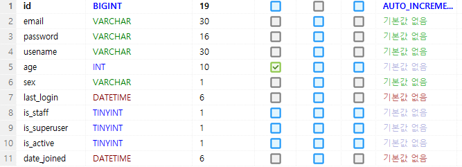

이제 변경한 Field에 민감한 데이터를 제외하고 `Serializer`를 통해 객체와 데이터를 변경하는 부분을 구현합시다.

```python
# toss/accounts/serializers.py
from .models import User
from rest_framework import serializers

class UserSerializer(serializers.ModelSerializer):
    username = serializers.CharField(required=False)
    age = serializers.IntegerField(required=False)
    sex = serializers.CharField(required=False)
    # secret
    password = serializers.CharField(write_only=True)
    is_staff = serializers.BooleanField(write_only=True)
    is_superuser = serializers.BooleanField(write_only=True)
    
    class Meta:
        model = User
        fields = '__all__'
```

`Serializer`에서 모든 Field에 대해 접근할 수 있어야 생성시 각 Field에 대해 데이터를 전달해줄 수 있습니다.
하지만 비밀번호와 같은 정보는 GET을 통해 공개되어서는 안되는 중요한 정보이죠.
그래서 write_only 값을 주어 객체에서 변환시에 해당 값들을 변환하지 않도록 하여 정보를 전달하지 않습니다.

이제 각 객체에 대해 API를 생성하도록 하겠습니다.

```python
# toss/accounts/views.py
from rest_framework import generics
from .serializers import UserSerializer
from .models import User

class UserList(generics.ListCreateAPIView):
    queryset = User.objects.all()
    serializer_class = UserSerializer
    
class UserDetail(generics.RetrieveUpdateDestroyAPIView):
    queryset = User.objects.all()
    serializer_class = UserSerializer
```

기존에 구현한 방식은 POST와 PUT이 거의 비슷한 형태를 가지는 것과 같이 중복되는 코드로 인해 가독성이 떨어집니다.
generics를 이용하면 조금 더 편리하게 API를 설계할 수 있습니다.
실제로 해당 코드의 구현부분을 가면 아래와 같이 정의되어 있습니다.

```python
# rest_framework/generics.py
class ListCreateAPIView(mixins.ListModelMixin,
                        mixins.CreateModelMixin,
                        GenericAPIView):
    """
    Concrete view for listing a queryset or creating a model instance.
    """
    def get(self, request, *args, **kwargs):
        return self.list(request, *args, **kwargs)

    def post(self, request, *args, **kwargs):
        return self.create(request, *args, **kwargs)
```

GET과 POST에 대해 정의를 하고 있죠.
이를 활용하여 가독성이 높은 코드를 간단하게 생성할 수 있겠습니다.

```python
# toss/accounts/urls.py
from django.contrib import admin
from django.urls import path
from .views import UserList, UserDetail

urlpatterns = [
    path("user_list/", UserList.as_view()),
    path("user/<int:pk>", UserDetail.as_view())
]
```

```python
# toss/toss/urls.py
urlpatterns = [
    ...
    path("api/user/", include("accounts.urls"))
]
```

generics로 생성한 클래스 기반 규칙에 맞춰 URL를 정의하였습니다.
이렇게 앱단위로 URL을 정의한 후 프로젝트의 urls.py 에서 아래와 같이 설정하면 `[프로젝트 URL]/[앱 URL]` 형식으로 접근할 수 있습니다.

사실 Custom User를 만드는 위 방법 이외에도 여러 가지가 존재합니다.

* 새로운 테이블과 일대일 연결을 통해 사용자 정보를 유지하면서 권한과 상관 없는 사용자 데이터를 저장하는 방법.
* `Proxy Model`을 사용하여 테이블의 변경 없이 정렬 순서나 메소드만을 추가하는 방법.
* `AbstractUser Model`을 사용하여 로그인 인증 처리 부분은 `Django`의 것을 이용하면서 사용자 정의 필드를 추가하는 방법.
* `AbstractBaseUser Model`을 사용하여 인증 절차를 직접 구현하는 방법.

아래의 두 방법은 프로젝트를 처음 시작할 때 User에 관한 정보를 탄탄하게 설계하고 시작하는 것이 좋습니다.

# Authentication

이제 생성된 User를 이용하여 사용자 인증을 하는 방법을 알아보도록 할게요.
`DRF`는 기본적으로 Session 방식을 채택하고 있습니다.
이를 JWT 방식으로 변경하여 개발해보죠.

먼저 `simple-jwt` 패키지를 설치합니다.
```
$ pip install djangorestframework-simplejwt
```

이제 settings.py 에 여러 우리가 `simple-jwt` 를 사용한다는 것을 알려야 합니다.

```python
# toss/toss/settings.py
INSTALLED_APPS = [
    ...
    "rest_framework_simplejwt"
]

REST_FRAMEWORK = {
    "DEFAULT_AUTHENTICATION_CLASSES": [
        "rest_framework_simplejwt.authentication.JWTAuthentication"
    ]
}

SIMPLE_JWT = {
    'ACCESS_TOKEN_LIFETIME': timedelta(minutes=30),
    'REFRESH_TOKEN_LIFETIME': timedelta(days=7),
    'ROTATE_REFRESH_TOKENS': True,
    'BLACKLIST_AFTER_ROTATION': True,
    'UPDATE_LAST_LOGIN': True,

    'ALGORITHM': 'HS256',
    'SIGNING_KEY': SECRET_KEY,
    'VERIFYING_KEY': None,
    'AUDIENCE': None,
    'ISSUER': None,
    'JWK_URL': None,
    'LEEWAY': 0,

    'AUTH_HEADER_TYPES': ('Bearer',),
    'AUTH_HEADER_NAME': 'HTTP_AUTHORIZATION',
    'USER_ID_FIELD': 'id',
    'USER_ID_CLAIM': 'email',
    'USER_AUTHENTICATION_RULE': 'rest_framework_simplejwt.authentication.default_user_authentication_rule',

    'AUTH_TOKEN_CLASSES': ('rest_framework_simplejwt.tokens.AccessToken',),
    'TOKEN_TYPE_CLAIM': 'token_type',
    'TOKEN_USER_CLASS': 'rest_framework_simplejwt.models.TokenUser',

    'JTI_CLAIM': 'jti',

    'SLIDING_TOKEN_REFRESH_EXP_CLAIM': 'refresh_exp',
    'SLIDING_TOKEN_LIFETIME': timedelta(minutes=5),
    'SLIDING_TOKEN_REFRESH_LIFETIME': timedelta(days=1),
}
```

INSTALLED_APPS 에서 `simple-jwt`를 사용한다는 것을 명시해주었습니다.
REST_FRAMEWORK 에서는 기본 authentication 으로 `simple-jwt`을 사용하도록 설정해주었죠.
마지막으로 토큰에 대한 설정값을 명시해주었습니다.
설정에 대한 설명은 아래 링크에서 조금 더 자세하게 확인할 수 있어요.

[Some of Simple JWT’s behavior can be customized through settings variables in settings.py](https://django-rest-framework-simplejwt.readthedocs.io/en/latest/settings.html)

이제 토큰을 획득하고, 토큰을 갱신하는 view를 추가해줍니다.

```python
# toss/toss/urls.py
from rest_framework_simplejwt.views import TokenObtainPairView, TokenRefreshView

urlpatterns = [
    ...
    path("api/token/", TokenObtainPairView.as_view()),
    path("api/token/refresh/", TokenRefreshView.as_view())
]
```

이제 해당 URL로 접속해서 이메일과 패스워드를 이용하여 아래와 같이 토큰을 받을 수 있습니다.

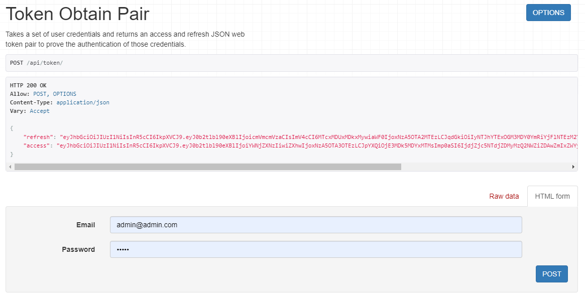

기존의 Refresh Token을 이용하여 새로운 Token을 받아올 수 있죠.

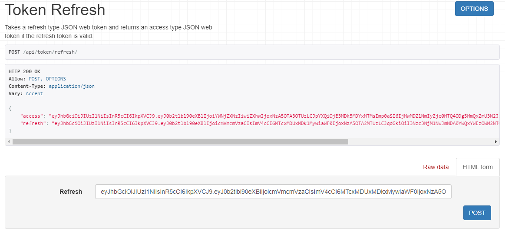

디버거를 이용하여 실행 순서를 살펴보니 Request가 들어오면 _authenticate 함수가 실행됩니다.
여기서 우리가 기본으로 설정한 Authentication 클래스가 호출되는 것이죠.

```python
# rest_framework/request.py
def _authenticate(self):
    """
    Attempt to authenticate the request using each authentication instance
    in turn.
    """
    for authenticator in self.authenticators:
        try:
            user_auth_tuple = authenticator.authenticate(self)
        except exceptions.APIException:
            self._not_authenticated()
            raise

        if user_auth_tuple is not None:
            self._authenticator = authenticator
            self.user, self.auth = user_auth_tuple
            return
```

앞서 `JWTAuthentication` 클래스를 기본으로 설정하였으니 토큰을 이용해 인증을 합니다.
그리고 인증을 통해 어떠한 유저의 요청인지 파악하고 이를 Request에 넣어줍니다.


# Authorization

이제 사용자에 대한 인증을 하였으니 각 권한별로 접근할 수 있는 API에 대해 설정을 하려고 합니다.
로그인을 하지 않은 사용자에 대해서 로그인, 회원가입 기능만을 접근하도록 하고 나머지를 차단해야겠죠.
유저에 대한 정보를 보는 것은 Staff 또는 본인 스스로만 가능해야 합니다.
모든 유저를 볼 수 있는 API는 Staff 이상만이 접근할 수 있어야 하죠.

기본적으로 `AllowAny`, `IsAuthenticated`, `IsAdminUser` 와 같은 기본적으로 제공하는 권한이 있습니다.
하지만 우리는 User 에 관한 정보를 조회할 때 자기 자신만 허용하려고 하죠.
그래서 추가적인 권한을 만들어야 합니다.

```python
# toss/core/permissions.py
from rest_framework import permissions

class IsOwnerOrStaff(permissions.IsAuthenticated):
    def has_object_permission(self, request, view, obj):
        return bool(
            request.user.is_staff or
            request.user.is_superuser or
            request.user == obj
        )
```

모든 권한은 `BasePermission` 클래스를 상속합니다.
해당 클래스는 `has_permission`과 `has_object_permission`이 있죠.
먼저 `has_permission`을 통해 권한을 확인하고 `has_object_permission`이 구현되어 있다면 이를 또 실행하죠.
따라서 기본적으로 인증된 사용자에 대해서 Staff 혹은 자기 자신인지 확인하도록 구현하였습니다.

```python
# toss/core/views.py
from rest_framework import generics, permissions
from rest_framework_simplejwt.serializers import TokenObtainPairSerializer, TokenRefreshSerializer
from rest_framework_simplejwt.views import TokenObtainPairView, TokenRefreshView   

from .serializers import UserSerializer
from .models import User
from .permissions import IsOwnerOrStaff

# ====================================== ANYONE ======================================

class UserSignupView(generics.CreateAPIView):
    permission_classes = [permissions.AllowAny]
    serializer_class = UserSerializer

class UserLoginView(TokenObtainPairView):
    permission_classes = [permissions.AllowAny]
    serializer_class = TokenObtainPairSerializer
    
class UserRefreshView(TokenRefreshView):
    permission_classes = [permissions.AllowAny]
    serializer_class = TokenRefreshSerializer

# ====================================== AUTH ======================================
    
class UserDetailView(generics.RetrieveUpdateDestroyAPIView):
    permission_classes = [IsOwnerOrStaff]
    queryset = User.objects.all()
    serializer_class = UserSerializer

# ====================================== ADMIN ======================================

class UserListView(generics.ListAPIView):
    permission_classes = [permissions.IsAdminUser]
    queryset = User.objects.all()
    serializer_class = UserSerializer
```

클래스 기반 View 들은 permission_classes 를 지정해서 권한을 설정할 수 있습니다.
각 View 에 해당하는 URL도 설정해줍니다.

```python
# toss/core/urls.py
urlpatterns = [
    path("signup/", UserSignupView.as_view()),
    path("login/", UserLoginView.as_view()),
    path("refresh/", UserRefreshView.as_view()),
    path("detail/<int:pk>", UserDetailView.as_view()),
    path("list/", UserListView.as_view())
]
```

이제 이를 테스트해보죠.

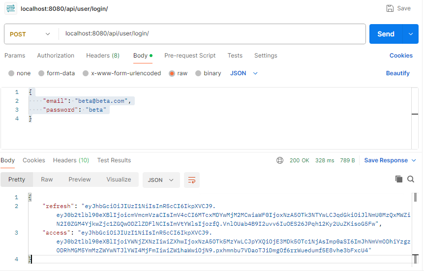

로그인을 하면 각 토큰을 반환합니다.

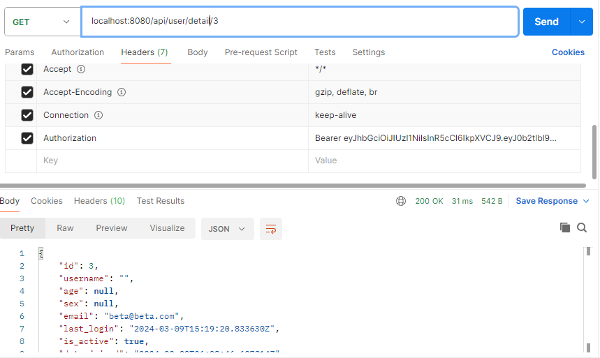

해당 토큰을 헤더에 settings.py 에서 설정한 AUTH_HEADER_TYPES 와 함께 넣어주고 API를 호출하면 결가가 제대로 나오는 것을 볼 수 있습니다.

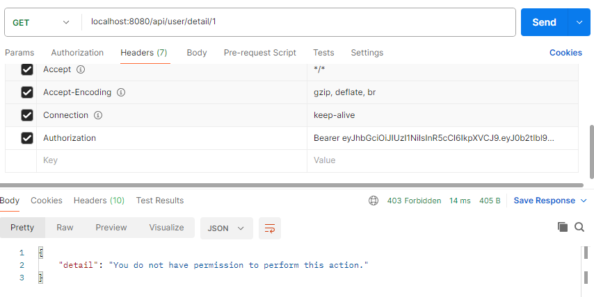

그러나 다른 유저의 정보를 보려고 할 때 오류가 나는 것을 볼 수 있죠.

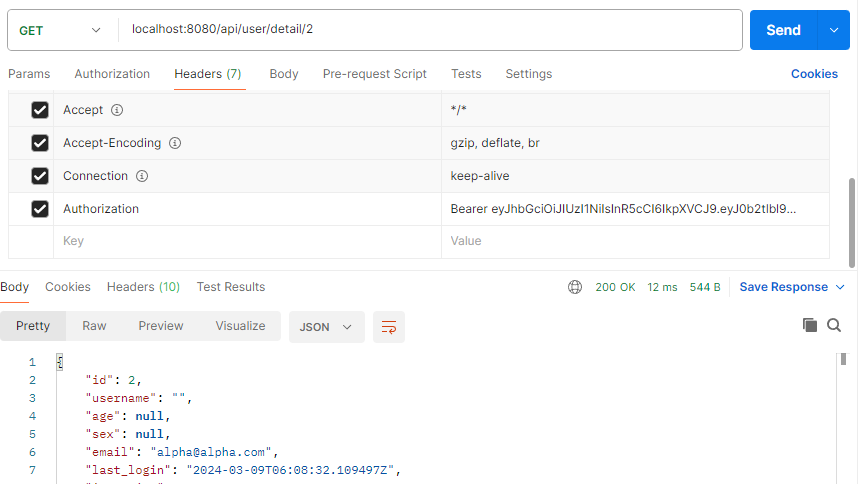

다시 Staff 계정으로 로그인한 후, 이 토큰을 이용해 다른 유저의 정보에 접근해보면 모두 볼 수 있는 것을 확인할 수 있습니다.